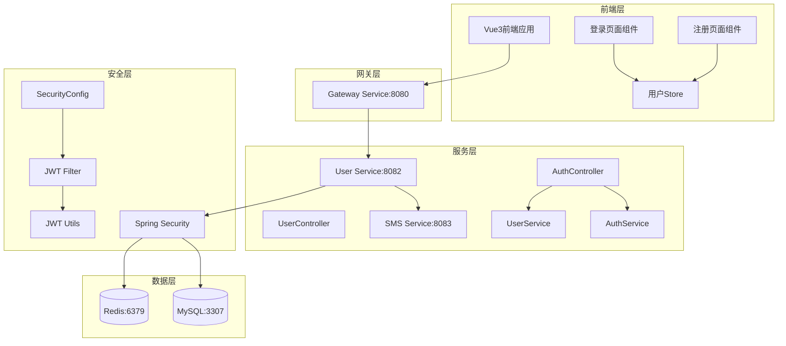
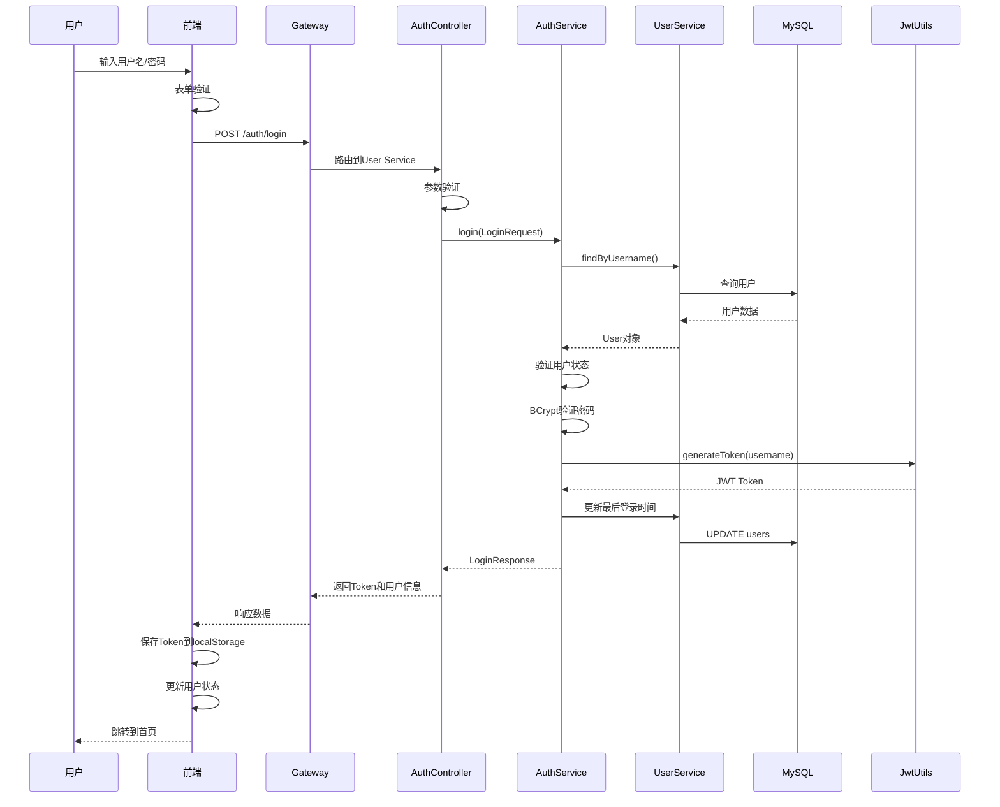
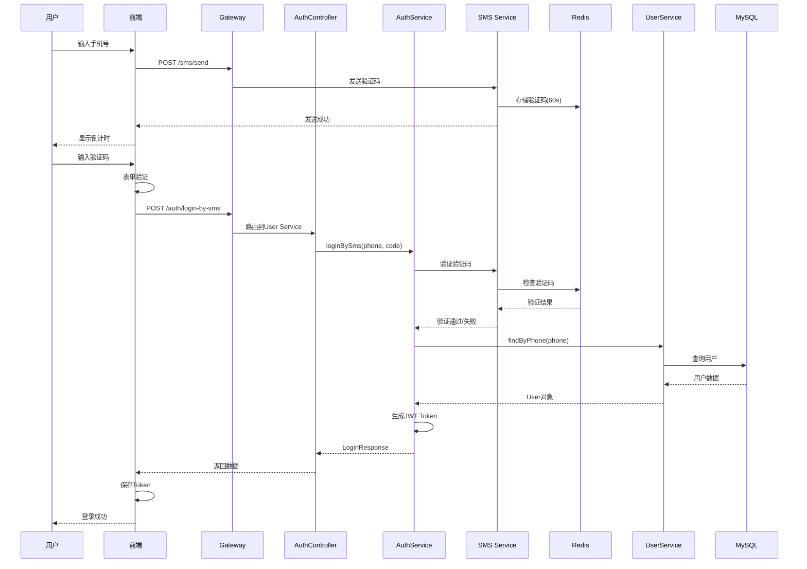
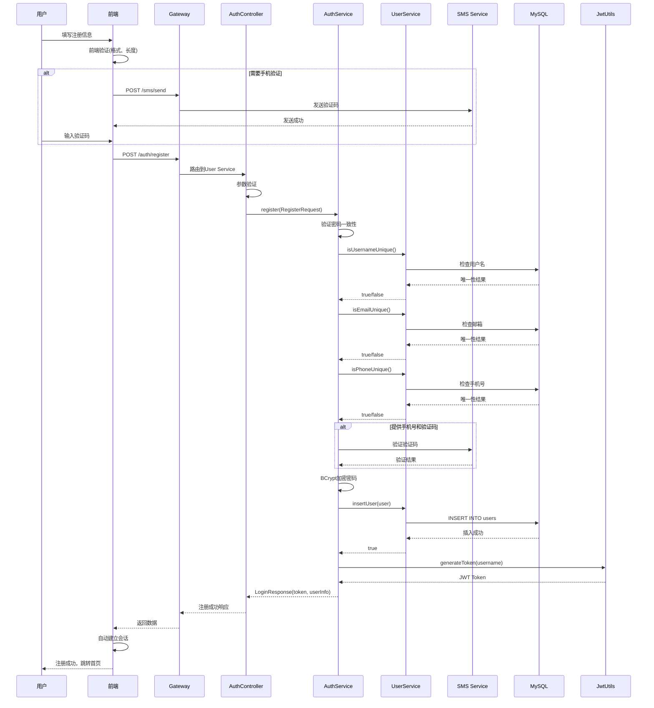

# 用户认证系统重构设计文档

## 一、设计背景与目标

### 1.1 问题现状

当前用户认证系统存在以下问题：

1. **登录功能异常**：存在 500 Internal Server Error，用户无法正常登录
2. **注册数据未持久化**：新注册用户信息未能正确保存到 MySQL 数据库
3. **安全配置问题**：Spring Security 配置存在误拦截或过度放行的情况
4. **数据库连接问题**：user-service 与 Docker 容器中的 MySQL 连接配置可能不正确
5. **登录方式单一**：缺少手机验证码登录的完整实现
6. **JWT 过滤器被禁用**：SecurityConfig 中 JWT 过滤器被注释，导致认证机制不完整

### 1.2 设计目标

重构用户认证系统，实现以下核心目标：

1. **双登录方式支持**：提供密码登录和手机验证码登录两种方式，用户可自由切换
2. **完整注册流程**：实现表单验证、唯一性校验、密码加密、数据持久化的完整注册功能
3. **安全性保障**：正确配置 Spring Security 和 JWT 过滤器，实现端点级权限控制
4. **数据一致性**：确保用户数据正确保存到数据库并可立即用于登录验证
5. **错误处理优化**：提供清晰的用户提示和完整的日志记录

## 二、系统架构设计

### 2.1 整体架构



### 2.2 认证流程设计

#### 2.2.1 密码登录流程



#### 2.2.2 手机验证码登录流程



#### 2.2.3 用户注册流程



## 三、核心功能设计

### 3.1 登录功能设计

#### 3.1.1 功能需求

| 功能点       | 描述                                | 优先级 |
| ------------ | ----------------------------------- | ------ |
| 密码登录     | 支持用户名/邮箱/手机号+密码登录     | P0     |
| 验证码登录   | 支持手机号+短信验证码登录           | P0     |
| 登录方式切换 | 前端 Tab 切换，动态调整表单验证规则 | P0     |
| 记住我       | 延长 Token 有效期(可选功能)         | P1     |
| Token 生成   | 登录成功后生成 JWT Token            | P0     |
| 最后登录时间 | 更新用户最后登录时间                | P1     |
| 错误提示     | 提供明确的错误信息                  | P0     |

#### 3.1.2 接口设计

**密码登录接口**

- **端点**：`POST /auth/login`
- **权限**：公开接口，无需认证
- **请求体**：

| 字段       | 类型    | 必填 | 说明                       |
| ---------- | ------- | ---- | -------------------------- |
| username   | String  | 是   | 用户名/邮箱/手机号         |
| password   | String  | 是   | 密码(明文传输，HTTPS 加密) |
| rememberMe | Boolean | 否   | 是否记住我                 |

- **响应体**：

| 字段                   | 类型    | 说明                     |
| ---------------------- | ------- | ------------------------ |
| code                   | Integer | 响应码：200-成功         |
| message                | String  | 响应消息                 |
| data.accessToken       | String  | JWT 访问令牌             |
| data.expiresIn         | Long    | 过期时间(秒)             |
| data.userInfo          | Object  | 用户信息对象             |
| data.userInfo.id       | Long    | 用户 ID                  |
| data.userInfo.username | String  | 用户名                   |
| data.userInfo.nickname | String  | 昵称                     |
| data.userInfo.email    | String  | 邮箱                     |
| data.userInfo.phone    | String  | 手机号                   |
| data.userInfo.avatar   | String  | 头像 URL                 |
| data.userInfo.gender   | Integer | 性别：0-未知，1-男，2-女 |

**手机验证码登录接口**

- **端点**：`POST /auth/login-by-sms`
- **权限**：公开接口，无需认证
- **请求体**：

| 字段       | 类型    | 必填 | 说明             |
| ---------- | ------- | ---- | ---------------- |
| phone      | String  | 是   | 手机号(11 位)    |
| code       | String  | 是   | 短信验证码(6 位) |
| rememberMe | Boolean | 否   | 是否记住我       |

- **响应体**：与密码登录相同

#### 3.1.3 业务逻辑设计

**密码登录逻辑**：

1. **参数验证**：检查 username 和 password 是否为空
2. **用户查询**：根据 username 查询用户(支持用户名/邮箱/手机号)
3. **用户存在性检查**：用户不存在返回"用户名或密码错误"(安全考虑)
4. **状态检查**：验证用户状态是否正常(status=1 表示正常)
5. **密码验证**：使用 BCryptPasswordEncoder.matches 验证密码
6. **Token 生成**：验证通过后生成 JWT Token
7. **登录时间更新**：更新 lastLoginTime 字段
8. **构建响应**：封装 Token 和用户信息返回

**验证码登录逻辑**：

1. **参数验证**：检查 phone 和 code 是否为空
2. **格式验证**：验证手机号格式(正则：^1[3-9]\d{9}$)
3. **验证码校验**：调用 SMS Service 验证验证码
4. **用户查询**：根据 phone 查询用户
5. **用户存在性检查**：用户不存在则提示"手机号未注册"
6. **状态检查**：验证用户状态
7. **Token 生成**：生成 JWT Token
8. **登录时间更新**：更新 lastLoginTime
9. **构建响应**：返回 Token 和用户信息

#### 3.1.4 表单验证规则

**密码登录表单验证**：

| 字段     | 验证规则            |
| -------- | ------------------- |
| username | 必填，非空          |
| password | 必填，最小长度 6 位 |

**验证码登录表单验证**：

| 字段  | 验证规则                      |
| ----- | ----------------------------- |
| phone | 必填，正则验证：^1[3-9]\d{9}$ |
| code  | 必填，固定 6 位数字           |

### 3.2 注册功能设计

#### 3.2.1 功能需求

| 功能点       | 描述                     | 优先级 |
| ------------ | ------------------------ | ------ |
| 基本信息注册 | 用户名、密码、确认密码   | P0     |
| 扩展信息     | 昵称、邮箱、手机号(可选) | P1     |
| 手机验证     | 手机号注册需验证码       | P0     |
| 唯一性校验   | 用户名、邮箱、手机号唯一 | P0     |
| 密码加密     | BCrypt 加密存储          | P0     |
| 数据持久化   | 保存到 MySQL 数据库      | P0     |
| 自动登录     | 注册成功后自动建立会话   | P0     |
| 表单验证     | 前后端双重验证           | P0     |

#### 3.2.2 接口设计

**用户注册接口**

- **端点**：`POST /auth/register`
- **权限**：公开接口，无需认证
- **请求体**：

| 字段            | 类型   | 必填 | 验证规则                      |
| --------------- | ------ | ---- | ----------------------------- |
| username        | String | 是   | 3-20 字符，仅字母数字下划线   |
| password        | String | 是   | 6-20 字符，必须包含字母和数字 |
| confirmPassword | String | 是   | 与 password 一致              |
| nickname        | String | 否   | 2-20 字符                     |
| email           | String | 否   | 标准邮箱格式                  |
| phone           | String | 否   | 11 位手机号                   |
| captcha         | String | 条件 | 提供 phone 时必填             |
| uuid            | String | 条件 | 预留字段                      |

- **响应体**：

| 字段             | 类型    | 说明                         |
| ---------------- | ------- | ---------------------------- |
| code             | Integer | 响应码：200-成功             |
| message          | String  | 响应消息                     |
| data.accessToken | String  | JWT 访问令牌(注册后自动生成) |
| data.expiresIn   | Long    | 过期时间(秒)                 |
| data.userInfo    | Object  | 新注册用户信息               |

#### 3.2.3 业务逻辑设计

**注册流程**：

1. **基础参数验证**

   - 检查必填字段：username、password、confirmPassword
   - 验证字段长度和格式
   - 验证密码一致性

2. **唯一性校验**

   - 调用 UserService.isUsernameUnique()检查用户名
   - 若提供 email，调用 isEmailUnique()检查邮箱
   - 若提供 phone，调用 isPhoneUnique()检查手机号

3. **验证码校验**(条件触发)

   - 若提供 phone 和 captcha，调用 SMS Service 验证
   - 验证失败抛出异常："验证码错误或已过期"
   - 若仅提供 phone 未提供 captcha，抛出异常："手机注册需要验证码"

4. **用户对象构建**

   - 设置 username、email、phone
   - 使用 BCryptPasswordEncoder 加密 password
   - 设置 nickname(未提供则使用 username)
   - 设置默认值：status=1(正常)、gender=0(未知)

5. **数据持久化**

   - 调用 UserService.insertUser()保存用户
   - 数据库执行 INSERT 操作
   - 失败抛出异常："用户注册失败"

6. **自动登录**
   - 注册成功后生成 JWT Token
   - 构建用户信息对象
   - 返回 LoginResponse(包含 token 和 userInfo)

#### 3.2.4 表单验证规则

**前端验证规则**：

| 字段            | 规则                                   | 错误提示                         |
| --------------- | -------------------------------------- | -------------------------------- |
| username        | 必填，3-20 字符，正则：^[a-zA-Z0-9_]+$ | 用户名只能包含字母、数字和下划线 |
| password        | 必填，6-20 字符，包含字母和数字        | 密码必须包含字母和数字           |
| confirmPassword | 必填，与 password 一致                 | 两次密码输入不一致               |
| nickname        | 可选，2-20 字符                        | 昵称长度为 2-20 个字符           |
| email           | 可选，邮箱格式                         | 邮箱格式不正确                   |
| phone           | 可选，正则：^1[3-9]\d{9}$              | 手机号格式不正确                 |
| captcha         | phone 非空时必填                       | 请输入验证码                     |

**后端验证规则**：使用 Jakarta Validation 注解

- `@NotBlank`：非空验证
- `@Size`：长度验证
- `@Pattern`：正则表达式验证
- `@Email`：邮箱格式验证

### 3.3 安全性设计

#### 3.3.1 Spring Security 配置

**安全策略**：

| 配置项     | 策略                        | 说明                                             |
| ---------- | --------------------------- | ------------------------------------------------ |
| CSRF 防护  | 禁用                        | 前后端分离架构，使用 Token 认证                  |
| CORS 配置  | 启用                        | 允许指定源的跨域请求                             |
| 会话管理   | STATELESS                   | 无状态会话，完全依赖 JWT                         |
| 异常处理   | JwtAuthenticationEntryPoint | 统一处理认证异常                                 |
| JWT 过滤器 | 启用                        | 在 UsernamePasswordAuthenticationFilter 之前执行 |

**端点权限配置**：

| 路径模式            | 权限要求      | 说明                 |
| ------------------- | ------------- | -------------------- |
| /auth/\*\*          | permitAll     | 认证相关接口全部放行 |
| /api/users/register | permitAll     | 用户注册接口         |
| /api/users/login    | permitAll     | 用户登录接口(备用)   |
| /api/users/check-\* | permitAll     | 唯一性检查接口       |
| /actuator/\*\*      | permitAll     | 健康检查接口         |
| /swagger-ui/\*\*    | permitAll     | API 文档接口         |
| /v3/api-docs/\*\*   | permitAll     | OpenAPI 文档         |
| 其他接口            | authenticated | 需要 JWT 认证        |

#### 3.3.2 JWT 过滤器设计

**过滤器执行流程**：

1. **路径匹配检查**

   - 使用 AntPathMatcher 检查请求路径
   - 匹配 PERMIT_ALL_PATHS 列表中的模式
   - 匹配成功则跳过 JWT 验证，直接放行

2. **Token 提取**

   - 从请求头 Authorization 中提取 Token
   - 格式："Bearer {token}"
   - 无 Token 则跳过认证(由 Security 配置决定是否放行)

3. **Token 验证**

   - 调用 JwtUtils.validateToken()验证 Token 有效性
   - 验证失败清除 SecurityContext

4. **认证信息设置**

   - 从 Token 提取 username
   - 构建 UsernamePasswordAuthenticationToken
   - 设置到 SecurityContextHolder

5. **异常处理**
   - 捕获所有异常并记录日志
   - 清除 SecurityContext
   - 继续过滤器链执行

**白名单路径**：

```
/auth/**
/api/auth/**
/api/users/register
/api/users/login
/api/users/refresh-token
/api/users/check-*
/actuator/**
/swagger-ui/**
/v3/api-docs/**
```

#### 3.3.3 密码加密策略

**加密方式**：BCrypt

- **算法特点**：

  - 自动加盐(Salt)
  - 可配置强度因子(默认 10 轮)
  - 每次加密结果不同，但验证正确
  - 单向加密，不可逆

- **应用场景**：

  - 用户注册时加密密码存储
  - 用户登录时验证密码
  - 密码修改时重新加密

- **实现方式**：
  - 使用 Spring Security 提供的 BCryptPasswordEncoder
  - Bean 配置：`@Bean public PasswordEncoder passwordEncoder()`
  - 加密：`passwordEncoder.encode(rawPassword)`
  - 验证：`passwordEncoder.matches(rawPassword, encodedPassword)`

#### 3.3.4 JWT Token 设计

**Token 结构**：

| 组成部分  | 内容               | 说明                                                   |
| --------- | ------------------ | ------------------------------------------------------ |
| Header    | 算法、类型         | {"alg":"HS256","typ":"JWT"}                            |
| Payload   | 用户信息、过期时间 | {"sub":"username","iat":...,"exp":...}                 |
| Signature | 签名               | HMACSHA256(base64(header)+"."+base64(payload), secret) |

**Token 生命周期**：

- **有效期**：2 小时(7200 秒)
- **刷新策略**：提供/auth/refresh 接口刷新 Token
- **黑名单机制**：登出时将 Token 加入 Redis 黑名单(可选，当前禁用 Redis)

**Token 传递方式**：

- **请求头**：`Authorization: Bearer {token}`
- **存储位置**：前端 localStorage
- **跨域处理**：CORS 配置允许 Authorization 头

### 3.4 数据一致性设计

#### 3.4.1 数据库连接配置

**连接参数**：

| 配置项            | 值                                    | 说明                 |
| ----------------- | ------------------------------------- | -------------------- |
| driver            | com.mysql.cj.jdbc.Driver              | MySQL 8.0+驱动       |
| url               | jdbc:mysql://localhost:3307/mall_user | Docker 映射端口 3307 |
| username          | root                                  | 数据库用户           |
| password          | 123456                                | 数据库密码           |
| characterEncoding | utf8                                  | 字符编码             |
| useSSL            | true                                  | SSL 连接             |
| serverTimezone    | GMT+8                                 | 时区设置             |

**注意事项**：

1. Docker 容器内服务使用服务名(如 mysql)
2. 本地开发使用 localhost:3307
3. 确保 Docker MySQL 容器已启动
4. 数据库 mall_user 已创建
5. users 表结构与 User 实体映射一致

#### 3.4.2 数据库表设计

**users 表结构**：

| 字段            | 类型         | 约束                        | 说明                     |
| --------------- | ------------ | --------------------------- | ------------------------ |
| id              | BIGINT       | PRIMARY KEY, AUTO_INCREMENT | 用户 ID                  |
| username        | VARCHAR(50)  | NOT NULL, UNIQUE            | 用户名                   |
| email           | VARCHAR(100) | NOT NULL, UNIQUE            | 邮箱                     |
| phone           | VARCHAR(20)  | NULL                        | 手机号                   |
| password        | VARCHAR(255) | NOT NULL                    | 加密密码                 |
| nickname        | VARCHAR(50)  | NULL                        | 昵称                     |
| avatar          | VARCHAR(255) | NULL                        | 头像 URL                 |
| gender          | TINYINT      | DEFAULT 0                   | 性别：0-未知，1-男，2-女 |
| birthday        | DATE         | NULL                        | 生日                     |
| status          | TINYINT      | DEFAULT 1                   | 状态：0-禁用，1-正常     |
| last_login_time | DATETIME     | NULL                        | 最后登录时间             |
| created_time    | DATETIME     | DEFAULT CURRENT_TIMESTAMP   | 创建时间                 |
| updated_time    | DATETIME     | ON UPDATE CURRENT_TIMESTAMP | 更新时间                 |

**索引设计**：

- idx_username：username 字段索引(登录查询优化)
- idx_email：email 字段索引(邮箱登录优化)
- idx_phone：phone 字段索引(手机登录优化)
- idx_status：status 字段索引(状态过滤优化)

#### 3.4.3 实体映射设计

**User 实体与数据库映射**：

| 实体字段      | 数据库字段      | 映射关系             |
| ------------- | --------------- | -------------------- |
| id            | id              | 主键，自增           |
| username      | username        | 驼峰转下划线自动映射 |
| password      | password        | 直接映射             |
| nickname      | nickname        | 直接映射             |
| email         | email           | 直接映射             |
| phone         | phone           | 直接映射             |
| avatar        | avatar          | 直接映射             |
| gender        | gender          | 直接映射             |
| birthday      | birthday        | String 类型存储      |
| status        | status          | 直接映射             |
| lastLoginTime | last_login_time | 驼峰转下划线         |
| createTime    | created_time    | 继承自 BaseEntity    |
| updateTime    | updated_time    | 继承自 BaseEntity    |

**MyBatis-Plus 配置**：

- **表名映射**：`@TableName("users")`
- **主键策略**：`@TableId(type = IdType.AUTO)`
- **驼峰转换**：`map-underscore-to-camel-case: true`
- **逻辑删除**：`logic-delete-field: deleted`(当前未使用)

#### 3.4.4 事务管理

**事务边界**：

| 操作         | 事务范围                 | 说明         |
| ------------ | ------------------------ | ------------ |
| 用户注册     | AuthService.register()   | 用户插入操作 |
| 用户登录     | 无事务                   | 仅查询和更新 |
| 更新登录时间 | UserService.updateById() | 单表更新     |

**事务特性**：

- **隔离级别**：READ_COMMITTED(MySQL 默认)
- **传播行为**：REQUIRED
- **只读优化**：查询操作设置 readOnly=true

### 3.5 错误处理设计

#### 3.5.1 异常分类

**业务异常**：

| 异常类型           | 错误码 | 说明           |
| ------------------ | ------ | -------------- |
| 用户名或密码错误   | 4001   | 登录验证失败   |
| 用户已被禁用       | 4002   | 用户状态异常   |
| 用户名已存在       | 4003   | 注册唯一性冲突 |
| 邮箱已被使用       | 4004   | 注册唯一性冲突 |
| 手机号已被使用     | 4005   | 注册唯一性冲突 |
| 验证码错误或已过期 | 4006   | 验证码验证失败 |
| 两次密码输入不一致 | 4007   | 参数验证失败   |
| Token 无效或已过期 | 4011   | JWT 验证失败   |

**系统异常**：

| 异常类型       | 错误码 | 说明         |
| -------------- | ------ | ------------ |
| 数据库连接失败 | 5001   | 基础设施异常 |
| 用户注册失败   | 5002   | 数据插入异常 |
| Token 生成失败 | 5003   | JWT 操作异常 |
| SMS 服务异常   | 5004   | 远程调用异常 |

#### 3.5.2 统一响应格式

**成功响应**：

```json
{
  "code": 200,
  "message": "操作成功",
  "data": {
    // 业务数据
  },
  "success": true
}
```

**失败响应**：

```json
{
  "code": 4001,
  "message": "用户名或密码错误",
  "data": null,
  "success": false
}
```

#### 3.5.3 日志记录策略

**日志级别**：

| 级别  | 使用场景                           |
| ----- | ---------------------------------- |
| DEBUG | 详细执行流程、参数值、中间结果     |
| INFO  | 关键操作节点：登录成功、注册成功   |
| WARN  | 业务异常：验证失败、重复注册       |
| ERROR | 系统异常：数据库错误、远程调用失败 |

**日志内容规范**：

1. **登录日志**：

   - INFO：用户登录: {username}
   - INFO：用户登录成功: {username}
   - WARN：用户登录失败: {username}, 原因: {reason}

2. **注册日志**：

   - INFO：用户注册: {username}
   - INFO：用户注册成功: {username}
   - WARN：用户注册失败: {username}, 原因: {reason}

3. **验证日志**：

   - DEBUG：开始验证手机验证码: phone={phone}
   - INFO：验证码验证成功: phone={phone}
   - WARN：验证码验证失败: phone={phone}

4. **异常日志**：
   - ERROR：用户注册失败: {username}, 异常信息
   - ERROR：Token 生成失败: {e.getMessage()}

**敏感信息保护**：

- 密码字段使用"[PROTECTED]"替代
- 完整 Token 不记录到日志
- 验证码明文不记录

## 四、前后端交互设计

### 4.1 API 端点汇总

| 端点                      | 方法 | 功能         | 权限   |
| ------------------------- | ---- | ------------ | ------ |
| /auth/login               | POST | 密码登录     | 公开   |
| /auth/login-by-sms        | POST | 验证码登录   | 公开   |
| /auth/register            | POST | 用户注册     | 公开   |
| /auth/logout              | POST | 用户登出     | 需认证 |
| /auth/refresh             | POST | 刷新 Token   | 需认证 |
| /auth/validate            | GET  | 验证 Token   | 需认证 |
| /auth/me                  | GET  | 获取当前用户 | 需认证 |
| /api/users/check-username | GET  | 检查用户名   | 公开   |
| /api/users/check-email    | GET  | 检查邮箱     | 公开   |
| /api/users/check-phone    | GET  | 检查手机号   | 公开   |
| /api/sms/send             | POST | 发送验证码   | 公开   |
| /api/sms/verify           | POST | 验证验证码   | 公开   |

### 4.2 前端状态管理

#### 4.2.1 用户 Store 设计

**状态字段**：

| 字段       | 类型    | 说明               |
| ---------- | ------- | ------------------ |
| token      | String  | JWT 访问令牌       |
| userInfo   | Object  | 用户信息对象       |
| isLoggedIn | Boolean | 登录状态(计算属性) |
| username   | String  | 用户名(计算属性)   |
| avatar     | String  | 头像 URL(计算属性) |

**核心方法**：

| 方法           | 参数         | 返回    | 说明         |
| -------------- | ------------ | ------- | ------------ |
| login          | loginData    | Promise | 执行登录操作 |
| userRegister   | registerData | Promise | 执行注册操作 |
| logout         | -            | void    | 清除用户会话 |
| updateUserInfo | newUserInfo  | void    | 更新用户信息 |
| initUserState  | -            | void    | 初始化状态   |

**持久化策略**：

- **存储位置**：localStorage
- **存储内容**：token、userInfo
- **自动恢复**：应用启动时从 localStorage 恢复状态
- **自动清除**：登出时清除 localStorage

#### 4.2.2 登录页面状态

**响应式数据**：

| 字段         | 类型    | 说明                         |
| ------------ | ------- | ---------------------------- |
| loginType    | String  | 登录方式：'password' / 'sms' |
| loading      | Boolean | 提交加载状态                 |
| smsCountdown | Number  | 验证码倒计时(秒)             |
| loginForm    | Object  | 登录表单数据                 |

**表单字段**：

```
loginForm: {
  username: String,
  password: String,
  phone: String,
  smsCode: String,
  rememberMe: Boolean
}
```

**动态验证规则**：

- 根据 loginType 动态切换验证规则
- loginType='password'时验证 username 和 password
- loginType='sms'时验证 phone 和 smsCode

#### 4.2.3 注册页面状态

**响应式数据**：

| 字段         | 类型    | 说明         |
| ------------ | ------- | ------------ |
| loading      | Boolean | 提交加载状态 |
| smsCountdown | Number  | 验证码倒计时 |
| registerForm | Object  | 注册表单数据 |
| agreeTerms   | Boolean | 是否同意协议 |

**表单字段**：

```
registerForm: {
  username: String,
  password: String,
  confirmPassword: String,
  nickname: String,
  email: String,
  phone: String,
  captcha: String
}
```

### 4.3 请求拦截器设计

#### 4.3.1 请求拦截

**拦截逻辑**：

1. 从 localStorage 获取 token
2. 若 token 存在，添加到请求头：`Authorization: Bearer {token}`
3. 设置 Content-Type 为 application/json
4. 记录请求日志(DEBUG 模式)

#### 4.3.2 响应拦截

**成功响应**：

1. 检查响应状态码
2. 返回 data 字段内容
3. 记录响应日志

**错误响应**：

1. **401 Unauthorized**：

   - 清除 token 和 userInfo
   - 跳转到登录页
   - 提示："登录已过期，请重新登录"

2. **403 Forbidden**：

   - 提示："没有权限访问"

3. **404 Not Found**：

   - 提示："请求的资源不存在"

4. **500 Internal Server Error**：

   - 提示："服务器错误，请稍后重试"
   - 记录错误详情到 console

5. **其他错误**：
   - 显示服务器返回的 message
   - 默认提示："操作失败，请重试"

### 4.4 路由守卫设计

**全局前置守卫**：

```
router.beforeEach((to, from, next) => {
  const userStore = useUserStore()
  const requiresAuth = to.meta.requiresAuth
  const isLoggedIn = userStore.isLoggedIn

  if (requiresAuth && !isLoggedIn) {
    // 需要认证但未登录
    next({
      path: '/login',
      query: { redirect: to.fullPath }
    })
  } else if (to.path === '/login' && isLoggedIn) {
    // 已登录访问登录页，重定向到首页
    next('/')
  } else {
    next()
  }
})
```

**路由元信息**：

| 路由      | requiresAuth | 说明     |
| --------- | ------------ | -------- |
| /login    | false        | 登录页   |
| /register | false        | 注册页   |
| /         | false        | 首页     |
| /user/\*  | true         | 用户中心 |
| /cart     | true         | 购物车   |
| /checkout | true         | 结算页   |
| /order/\* | true         | 订单页   |

## 五、问题修复方案

### 5.1 修复 500 错误

#### 5.1.1 问题排查步骤

1. **检查日志**：

   - 查看 user-service 控制台日志
   - 定位异常堆栈信息
   - 识别异常类型和根因

2. **常见原因**：
   - 数据库连接失败
   - SQL 语法错误
   - 空指针异常
   - Bean 注入失败
   - 配置错误

#### 5.1.2 修复措施

**数据库连接问题**：

- 确认 application.yml 中数据库配置正确
- 确认 Docker MySQL 容器运行正常
- 测试连接：使用 MySQL 客户端连接 localhost:3307
- 检查用户权限和数据库存在性

**实体映射问题**：

- 确认 User 实体@TableName 注解指向正确表名
- 检查字段类型与数据库列类型匹配
- 验证 MyBatis-Plus 配置的驼峰转换

**依赖注入问题**：

- 检查 pom.xml 中依赖是否完整
- 确认 MyBatis-Plus 和 MySQL 驱动已启用
- 验证 Service 和 Mapper 的@Component/@Service 注解

### 5.2 修复注册数据未持久化

#### 5.2.1 问题诊断

**检查点**：

1. **数据库连接**：

   - 确认 user-service 能连接到 MySQL
   - 检查连接池状态
   - 验证数据库 URL 配置

2. **SQL 执行**：

   - 开启 MyBatis-Plus SQL 日志
   - 查看 INSERT 语句是否执行
   - 检查是否有 SQL 异常

3. **事务提交**：

   - 确认事务是否正常提交
   - 检查是否有事务回滚

4. **表结构**：
   - 验证 users 表结构正确
   - 检查必填字段约束
   - 确认主键自增配置

#### 5.2.2 修复措施

**启用数据库依赖**：

- 在 pom.xml 中取消注释 MySQL 和 MyBatis-Plus 依赖
- 确保依赖版本兼容 Spring Boot 3.x

**配置数据源**：

- 在 application.yml 中正确配置数据源
- 设置连接池参数
- 启用 SQL 日志输出

**修复 Service 方法**：

- 确认 UserService.insertUser()方法实现正确
- 使用 MyBatis-Plus 的 insert()或 save()方法
- 添加事务注解@Transactional

**验证数据插入**：

- 注册测试用户
- 查询数据库确认记录存在
- 验证字段值正确性

### 5.3 修复 Security 配置问题

#### 5.3.1 JWT 过滤器启用

**问题**：SecurityConfig 中 JWT 过滤器被注释

**修复**：

- 取消注释 JWT 过滤器配置
- 确保 JwtAuthenticationFilter 正确注入
- 验证过滤器顺序：在 UsernamePasswordAuthenticationFilter 之前

**配置示例**：

```
http.addFilterBefore(
    jwtAuthenticationFilter,
    UsernamePasswordAuthenticationFilter.class
)
```

#### 5.3.2 端点权限配置

**问题**：认证端点配置不当导致误拦截或过度放行

**修复策略**：

1. **认证端点放行**：

   - /auth/\*\*：所有认证相关接口
   - /api/users/register：注册接口
   - /api/users/check-\*：唯一性检查

2. **受保护端点**：

   - /api/users/me：需要认证
   - /api/users/profile：需要认证
   - 其他用户相关接口：需要认证

3. **白名单配置**：
   - JWT 过滤器白名单与 Security 配置保持一致
   - 使用 AntPathMatcher 进行模式匹配

#### 5.3.3 CORS 配置修复

**确保 CORS 正确配置**：

- 允许的源：配置前端地址
- 允许的方法：GET、POST、PUT、DELETE、OPTIONS
- 允许的头：Authorization、Content-Type 等
- 允许凭证：setAllowCredentials(true)

### 5.4 修复前后端对接问题

#### 5.4.1 响应格式对齐

**后端响应格式**：

```json
{
  "code": 200,
  "message": "登录成功",
  "data": {
    "accessToken": "eyJhbGc...",
    "expiresIn": 7200,
    "userInfo": {
      "id": 1,
      "username": "testuser",
      "nickname": "测试用户",
      "email": "test@example.com",
      "phone": "13800138000",
      "avatar": null,
      "gender": 0
    }
  },
  "success": true
}
```

**前端解析逻辑**：

```javascript
const { accessToken, userInfo } = result.data;
token.value = accessToken;
userInfo.value = userInfo;
```

#### 5.4.2 验证码登录接口实现

**新增接口**：

- **端点**：`POST /auth/login-by-sms`
- **Controller**：AuthController.loginBySms()
- **Service**：AuthService.loginBySms()

**实现逻辑**：

1. 验证 phone 和 code 参数
2. 调用 SMS Service 验证验证码
3. 根据 phone 查询用户
4. 生成 JWT Token
5. 返回 LoginResponse

#### 5.4.3 唯一性检查接口

**新增接口**：

- **用户名检查**：`GET /api/users/check-username?username={value}`
- **邮箱检查**：`GET /api/users/check-email?email={value}`
- **手机号检查**：`GET /api/users/check-phone?phone={value}`

**响应格式**：

```json
{
  "code": 200,
  "message": "检查完成",
  "data": {
    "unique": true
  },
  "success": true
}
```

## 六、测试验证方案

### 6.1 单元测试

#### 6.1.1 Service 层测试

**测试覆盖**：

| 测试场景       | 测试方法                        | 预期结果                         |
| -------------- | ------------------------------- | -------------------------------- |
| 用户注册成功   | testRegisterSuccess()           | 返回 LoginResponse，数据库有记录 |
| 用户名已存在   | testRegisterDuplicateUsername() | 抛出异常                         |
| 密码不一致     | testRegisterPasswordMismatch()  | 抛出异常                         |
| 手机验证码错误 | testRegisterInvalidCaptcha()    | 抛出异常                         |
| 密码登录成功   | testLoginSuccess()              | 返回 Token 和用户信息            |
| 密码错误       | testLoginWrongPassword()        | 抛出异常                         |
| 用户不存在     | testLoginUserNotFound()         | 抛出异常                         |
| 用户被禁用     | testLoginUserDisabled()         | 抛出异常                         |

#### 6.1.2 JWT 工具测试

**测试覆盖**：

| 测试场景        | 测试方法                   | 预期结果       |
| --------------- | -------------------------- | -------------- |
| Token 生成      | testGenerateToken()        | 生成有效 Token |
| Token 验证      | testValidateToken()        | 返回 true      |
| 过期 Token 验证 | testExpiredToken()         | 返回 false     |
| 无效 Token 验证 | testInvalidToken()         | 返回 false     |
| 提取用户名      | testGetUsernameFromToken() | 返回正确用户名 |

### 6.2 集成测试

#### 6.2.1 API 接口测试

**使用工具**：Postman 或 REST Client

**测试用例**：

1. **注册测试**：

   - 正常注册(仅用户名密码)
   - 完整注册(包含邮箱、手机号)
   - 手机验证码注册
   - 重复用户名注册

2. **登录测试**：

   - 用户名密码登录
   - 邮箱密码登录
   - 手机号密码登录
   - 手机验证码登录
   - 错误密码登录

3. **Token 测试**：
   - 携带有效 Token 访问受保护接口
   - 携带无效 Token 访问
   - 不携带 Token 访问

#### 6.2.2 端到端测试

**测试流程**：

1. **完整注册流程**：

   - 访问注册页
   - 填写注册信息
   - 获取手机验证码
   - 提交注册
   - 自动登录并跳转首页
   - 验证用户状态已登录

2. **完整登录流程**：

   - 访问登录页
   - 输入用户名密码
   - 提交登录
   - 跳转到原访问页面
   - 验证 Token 存储和用户信息

3. **登出流程**：
   - 点击登出
   - Token 清除
   - 跳转登录页
   - 无法访问受保护页面

### 6.3 性能测试

#### 6.3.1 并发登录测试

**测试指标**：

- 并发用户数：100、500、1000
- 响应时间：P50、P95、P99
- 吞吐量：TPS
- 错误率：< 1%

**预期结果**：

- 100 并发：响应时间 < 200ms
- 500 并发：响应时间 < 500ms
- 1000 并发：响应时间 < 1000ms

#### 6.3.2 数据库压力测试

**测试场景**：

- 持续注册新用户
- 监控数据库连接池
- 观察插入性能

**监控指标**：

- 连接池使用率
- SQL 执行时间
- 数据库 CPU 和内存

### 6.4 安全测试

#### 6.4.1 SQL 注入测试

**测试方法**：

- 在用户名、密码字段输入 SQL 语句
- 验证 MyBatis-Plus 参数化查询防护
- 确认无 SQL 执行异常

#### 6.4.2 XSS 攻击测试

**测试方法**：

- 在输入字段注入脚本代码
- 验证前端自动转义
- 确认数据存储和展示安全

#### 6.4.3 密码安全测试

**验证点**：

- 数据库密码已加密
- 密码不以明文传输(HTTPS)
- 日志不包含明文密码
- BCrypt 加密强度足够

## 七、部署与上线

### 7.1 环境准备

#### 7.1.1 开发环境

**配置要求**：

- JDK 17+
- Node.js 16+
- Maven 3.6+
- Docker Desktop
- MySQL 8.0+
- Redis 6.0+

**启动步骤**：

1. 启动 Docker Desktop
2. 运行 docker-compose up -d 启动基础设施
3. 执行数据库初始化脚本
4. 启动 user-service
5. 启动 gateway-service
6. 启动前端开发服务器

#### 7.1.2 生产环境

**部署架构**：

- Kubernetes 集群部署
- MySQL 主从复制
- Redis Cluster 集群
- Nginx 负载均衡
- 日志收集(ELK)
- 监控告警(Prometheus + Grafana)

**配置调整**：

- 数据库连接池调优
- JWT 密钥加强
- Token 有效期调整
- 日志级别设置为 INFO
- 启用 HTTPS

### 7.2 监控告警

#### 7.2.1 业务指标监控

**监控指标**：

| 指标         | 说明                | 告警阈值 |
| ------------ | ------------------- | -------- |
| 注册成功率   | 成功注册/总注册请求 | < 95%    |
| 登录成功率   | 成功登录/总登录请求 | < 98%    |
| 平均响应时间 | API 响应时间        | > 500ms  |
| 错误率       | 500 错误/总请求     | > 1%     |
| Token 刷新率 | Token 刷新次数      | 异常增长 |

#### 7.2.2 系统指标监控

**监控指标**：

| 指标         | 说明           | 告警阈值 |
| ------------ | -------------- | -------- |
| CPU 使用率   | 服务器 CPU     | > 80%    |
| 内存使用率   | 服务器内存     | > 85%    |
| 数据库连接数 | 活跃连接数     | > 80%    |
| Redis 内存   | Redis 内存使用 | > 90%    |
| 磁盘空间     | 数据库磁盘     | > 85%    |

### 7.3 运维手册

#### 7.3.1 常见问题处理

**问题 1：用户无法登录**

- 检查 user-service 服务状态
- 验证数据库连接
- 查看日志定位原因
- 检查 JWT 配置

**问题 2：Token 失效频繁**

- 检查系统时间同步
- 验证 JWT 密钥一致性
- 检查 Token 有效期配置

**问题 3：注册失败**

- 检查数据库可用性
- 验证唯一性约束
- 检查 SMS 服务连通性

#### 7.3.2 数据备份恢复

**备份策略**：

- 全量备份：每天凌晨 3 点
- 增量备份：每小时
- 备份保留：30 天

**恢复步骤**：

1. 停止应用服务
2. 恢复数据库备份
3. 验证数据完整性
4. 重启应用服务
5. 验证功能正常

## 八、实施计划

### 8.1 开发阶段

**第一阶段：基础功能实现(2 天)**

- Day 1：
  - 修复数据库连接配置
  - 启用 MyBatis-Plus 依赖
  - 实现密码登录功能
  - 实现注册功能(无验证码)
- Day 2：
  - 修复 Spring Security 配置
  - 启用 JWT 过滤器
  - 实现唯一性检查接口
  - 前端登录注册页面调整

**第二阶段：验证码功能(1 天)**

- 集成 SMS Service
- 实现手机验证码登录
- 实现手机验证码注册
- 测试验证码流程

**第三阶段：测试优化(1 天)**

- 单元测试编写
- 集成测试执行
- Bug 修复
- 性能优化

### 8.2 测试阶段

**功能测试(1 天)**

- 注册功能测试
- 登录功能测试
- Token 验证测试
- 异常场景测试

**性能测试(0.5 天)**

- 并发登录测试
- 数据库压力测试
- 响应时间测试

**安全测试(0.5 天)**

- SQL 注入测试
- XSS 攻击测试
- 密码安全测试

### 8.3 上线阶段

**准备工作**：

- 代码审查
- 配置检查
- 数据库迁移脚本
- 回滚方案准备

**上线步骤**：

1. 数据库备份
2. 部署后端服务
3. 部署前端应用
4. 验证功能正常
5. 监控告警配置

**上线验证**：

- 注册新用户
- 登录测试
- Token 验证
- 性能监控

## 九、风险评估

### 9.1 技术风险

| 风险           | 影响 | 概率 | 缓解措施               |
| -------------- | ---- | ---- | ---------------------- |
| 数据库性能瓶颈 | 高   | 中   | 索引优化、连接池调优   |
| JWT 密钥泄露   | 高   | 低   | 定期轮换、加密存储     |
| Redis 宕机     | 中   | 低   | 主从复制、持久化       |
| SMS 服务不可用 | 中   | 中   | 降级策略、邮箱验证备选 |

### 9.2 业务风险

| 风险     | 影响 | 概率 | 缓解措施              |
| -------- | ---- | ---- | --------------------- |
| 恶意注册 | 中   | 高   | 验证码限流、IP 黑名单 |
| 暴力破解 | 高   | 中   | 登录失败锁定、验证码  |
| 数据泄露 | 高   | 低   | 加密传输、访问控制    |

### 9.3 运维风险

| 风险     | 影响 | 概率 | 缓解措施             |
| -------- | ---- | ---- | -------------------- |
| 服务宕机 | 高   | 低   | 高可用部署、健康检查 |
| 数据丢失 | 高   | 低   | 定期备份、异地容灾   |
| 配置错误 | 中   | 中   | 配置管理、变更审批   |

## 十、技术债务

### 10.1 当前已知问题

1. **Redis 功能未启用**：Token 黑名单、验证码存储依赖 Redis，当前被禁用
2. **邮箱验证缺失**：注册时邮箱未进行验证
3. **密码强度不足**：仅要求字母和数字组合
4. **账号安全策略缺失**：无登录失败锁定机制
5. **审计日志不完整**：缺少操作审计记录

### 10.2 后续优化方向

**短期优化(1-2 周)**：

- 启用 Redis 支持
- 实现邮箱验证功能
- 增强密码强度要求
- 实现登录失败锁定

**中期优化(1-2 月)**：

- 实现 OAuth2 第三方登录
- 添加图形验证码
- 完善审计日志
- 实现单点登录(SSO)

**长期优化(3-6 月)**：

- 引入生物识别认证
- 实现多因素认证(MFA)
- 零信任架构改造
- AI 风控系统

---

**设计文档版本**：v1.0  
**创建日期**：2025-01-27  
**设计者**：AI Assistant  
**审核状态**：待审核

---

**置信度评估**：

- **置信度等级**：中等
- **置信度依据**：
  1. 需求明确：用户提供了详细的功能需求和问题描述
  2. 技术可行性高：基于现有 Spring Boot + Vue3 技术栈实现
  3. 存在不确定性：部分问题需实际运行环境验证(如数据库连接、Docker 配置)
  4. 依赖外部服务：SMS Service 的集成需要验证接口兼容性
  5. 配置复杂度：Spring Security 和 JWT 的配置需要细致调试

**建议**：请审查设计文档后确认是否符合预期，特别是安全配置和数据库设计部分。建议先在开发环境验证核心功能，再进行全面实施。

```

```
