# API参考

<cite>
**本文档引用的文件**
- [application-simple.yml](file://backend/gateway-service/src/main/resources/application-simple.yml)
- [AuthController.java](file://backend/auth-service/src/main/java/com/mall/auth/controller/AuthController.java)
- [MerchantApplicationController.java](file://backend/merchant-service/src/main/java/com/mall/merchant/controller/MerchantApplicationController.java)
- [MerchantServiceClient.java](file://backend/admin-service/src/main/java/com/mall/admin/client/MerchantServiceClient.java)
- [LoginRequest.java](file://backend/auth-service/src/main/java/com/mall/auth/dto/LoginRequest.java)
- [LoginResponse.java](file://backend/auth-service/src/main/java/com/mall/auth/dto/LoginResponse.java)
- [CartClient.java](file://backend/order-service/src/main/java/com/mall/order/client/CartClient.java)
- [ProductClient.java](file://backend/order-service/src/main/java/com/mall/order/client/ProductClient.java)
- [PaymentClient.java](file://backend/order-service/src/main/java/com/mall/order/client/PaymentClient.java)
</cite>

## 目录
1. [API网关路由配置](#api网关路由配置)
2. [认证服务API](#认证服务api)
3. [商家服务API](#商家服务api)
4. [Feign客户端接口](#feign客户端接口)
5. [请求响应格式](#请求响应格式)
6. [常见错误码说明](#常见错误码说明)

## API网关路由配置

根据网关服务配置文件 `application-simple.yml`，系统通过Spring Cloud Gateway实现了统一的API路由和负载均衡。所有外部请求首先经过网关（端口8080），然后根据预定义的路由规则转发到相应的微服务。

```mermaid
graph TB
Client[客户端] --> Gateway[API网关:8080]
Gateway --> UserService[用户服务:8082]
Gateway --> MerchantService[商家服务:8087]
Gateway --> AdminService[管理服务:8083]
Gateway --> OrderService[订单服务:8084]
Gateway --> CartService[购物车服务:8085]
Gateway --> PaymentService[支付服务:8086]
Gateway --> ProductService[商品服务:8081]
Gateway --> SMSService[SMS服务:8088]
subgraph "网关路由规则"
UR1["/api/users/** -> user-service (StripPrefix=1)"]
UR2["/api/merchants/** -> merchant-service (StripPrefix=1)"]
UR3["/api/admin/** -> admin-service (StripPrefix=1)"]
UR4["/api/order/** -> order-service (StripPrefix=2)"]
UR5["/api/cart/** -> cart-service (StripPrefix=2)"]
UR6["/api/payment/** -> payment-service (StripPrefix=2)"]
UR7["/api/product/** -> product-service (StripPrefix=2)"]
UR8["/api/sms/** -> sms-service (StripPrefix=2)"]
end
Gateway --> UR1
Gateway --> UR2
Gateway --> UR3
Gateway --> UR4
Gateway --> UR5
Gateway --> UR6
Gateway --> UR7
Gateway --> UR8
```



**图例说明**：
- 所有API请求均以 `/api` 为前缀
- `StripPrefix` 过滤器用于去除路径前缀，确保正确路由到后端服务
- 例如，`/api/merchants/apply` 经过 `StripPrefix=1` 后变为 `/merchants/apply`，转发至商家服务

**Diagram sources**
- [application-simple.yml](file://backend/gateway-service/src/main/resources/application-simple.yml#L25-L138)

## 认证服务API

认证服务（auth-service）负责系统的用户身份验证、令牌管理和安全控制。所有需要认证的API请求都必须在 `Authorization` 头部携带有效的JWT访问令牌。

### 用户登录

提供用户凭据以获取访问令牌和刷新令牌。

**接口信息**
- **HTTP方法**: `POST`
- **URL路径**: `/auth/login`
- **认证要求**: 无需认证

**请求体结构**
```json
{
  "username": "string",
  "password": "string",
  "loginType": "password"
}
```

**字段说明**
- `username`: 用户名或手机号
- `password`: 密码
- `loginType`: 登录类型，默认为 "password"

**成功响应示例**
```json
{
  "success": true,
  "message": "登录成功",
  "data": {
    "accessToken": "eyJhbGciOiJIUzUxMiJ9...",
    "refreshToken": "eyJhbGciOiJIUzUxMiJ9...",
    "tokenType": "Bearer",
    "expiresIn": 900,
    "userId": 1,
    "username": "admin"
  }
}
```

**状态码**
- `200`: 登录成功
- `400`: 用户名或密码错误
- `500`: 服务器内部错误

**Section sources**
- [AuthController.java](file://backend/auth-service/src/main/java/com/mall/auth/controller/AuthController.java#L46-L69)
- [LoginRequest.java](file://backend/auth-service/src/main/java/com/mall/auth/dto/LoginRequest.java#L13-L36)
- [LoginResponse.java](file://backend/auth-service/src/main/java/com/mall/auth/dto/LoginResponse.java#L15-L57)

### 刷新令牌

使用刷新令牌获取新的访问令牌，延长会话有效期。

**接口信息**
- **HTTP方法**: `POST`
- **URL路径**: `/auth/refresh`
- **认证要求**: 无需认证

**请求体结构**
```json
{
  "refreshToken": "string"
}
```

**成功响应**
与登录接口相同，返回新的访问令牌。

**状态码**
- `200`: 刷新成功
- `400`: 无效的刷新令牌
- `500`: 服务器错误

### 验证令牌

供其他服务调用，验证访问令牌的有效性。

**接口信息**
- **HTTP方法**: `POST`
- **URL路径**: `/auth/validate`
- **认证要求**: 无需认证

**请求体结构**
```json
{
  "token": "string"
}
```

**成功响应**
```json
{
  "success": true,
  "data": {
    "valid": true
  }
}
```

### 用户登出

使当前访问令牌和刷新令牌失效。

**接口信息**
- **HTTP方法**: `POST`
- **URL路径**: `/auth/logout`
- **认证要求**: 需要Bearer令牌

**请求头**
- `Authorization: Bearer {access_token}`

**成功响应**
```json
{
  "success": true,
  "message": "登出成功"
}
```

## 商家服务API

商家服务（merchant-service）处理商家入驻申请、审核和管理相关业务。

### 提交商家入驻申请

新商家提交入驻申请。

**接口信息**
- **HTTP方法**: `POST`
- **URL路径**: `/merchants/apply`
- **认证要求**: 无需认证

**请求参数**
- 请求体为商家申请DTO对象，包含店铺名称、法人类型、联系人信息等。

**成功响应**
```json
{
  "code": 200,
  "success": true,
  "message": "申请提交成功，请等待审核",
  "data": {
    "applicationId": 1762898621700,
    "status": "pending",
    "shopName": "最终测试",
    "submittedAt": "2025-11-12T06:03:41.700"
  }
}
```

**状态码**
- `200`: 提交成功
- `500`: 提交失败

### 查询申请列表

分页查询商家入驻申请列表。

**接口信息**
- **HTTP方法**: `GET`
- **URL路径**: `/merchants/applications`
- **认证要求**: 无需认证

**查询参数**
- `page`: 页码，默认为1
- `size`: 每页大小，默认为10
- `status`: 审批状态
- `keyword`: 关键词搜索

**成功响应**
返回分页数据，包含记录列表、总数、当前页等信息。

### 审核申请

管理员审核商家入驻申请。

**接口信息**
- **HTTP方法**: `PUT`
- **URL路径**: `/merchants/applications/{id}/audit`
- **认证要求**: 需要管理员权限

**路径参数**
- `id`: 申请ID

**请求参数**
- `approved`: 是否通过审核
- `reason`: 审核原因
- `adminId`: 管理员ID
- `adminName`: 管理员姓名

**成功响应**
```json
{
  "code": 200,
  "success": true,
  "message": "审核通过"
}
```

**Section sources**
- [MerchantApplicationController.java](file://backend/merchant-service/src/main/java/com/mall/merchant/controller/MerchantApplicationController.java#L17-L203)

## Feign客户端接口

Feign客户端用于微服务间的HTTP通信，基于Spring Cloud OpenFeign实现声明式REST客户端。

### 商家服务客户端

管理员服务通过此客户端调用商家服务的API。

```java
@FeignClient(name = "merchant-service", path = "/merchants")
public interface MerchantServiceClient {
    
    @GetMapping("/applications")
    R<Map<String, Object>> getApplicationList(
            @RequestParam(value = "page", defaultValue = "1") Integer page,
            @RequestParam(value = "size", defaultValue = "20") Integer size,
            @RequestParam(value = "status", required = false) Integer status,
            @RequestParam(value = "keyword", required = false) String keyword
    );
    
    @PutMapping("/applications/{id}/audit")
    R<Void> auditApplication(
            @PathVariable("id") Long id,
            @RequestParam("approved") Boolean approved,
            @RequestParam(value = "reason", required = false) String reason,
            @RequestParam("adminId") Long adminId,
            @RequestParam("adminName") String adminName
    );
}
```

**功能说明**：
- 通过Nacos服务发现自动定位 `merchant-service`
- 使用 `@PathVariable` 和 `@RequestParam` 注解处理路径和查询参数
- 返回类型为统一的 `R<T>` 响应包装类

### 购物车服务客户端

订单服务通过此客户端获取购物车信息。

```java
@FeignClient(name = "cart-service", path = "/api/cart")
public interface CartClient {
    
    @GetMapping("/{userId}/items")
    List<Map<String, Object>> getCartItems(@PathVariable("userId") Long userId, 
                                          @RequestParam(value = "selected", defaultValue = "true") Boolean selected);
    
    @DeleteMapping("/{userId}/selected")
    Boolean clearSelectedItems(@PathVariable("userId") Long userId);
}
```

### 商品服务客户端

订单服务通过此客户端检查商品库存。

```java
@FeignClient(name = "product-service", path = "/api/products")
public interface ProductClient {
    
    @GetMapping("/{productId}/stock/check")
    Boolean checkStock(@PathVariable("productId") Long productId, Integer quantity);
    
    @PostMapping("/stock/deduct")
    Boolean deductStock(@RequestBody Map<String, Object> stockDeductionRequest);
}
```

### 支付服务客户端

订单服务通过此客户端创建支付订单。

```java
@FeignClient(name = "payment-service", path = "/api/payment")
public interface PaymentClient {
    
    @PostMapping("/create")
    Map<String, Object> createPayment(@RequestBody Map<String, Object> paymentRequest);
    
    @GetMapping("/{paymentId}/status")
    Map<String, Object> getPaymentStatus(@PathVariable("paymentId") String paymentId);
}
```

**Diagram sources**
- [MerchantServiceClient.java](file://backend/admin-service/src/main/java/com/mall/admin/client/MerchantServiceClient.java#L9-L119)
- [CartClient.java](file://backend/order-service/src/main/java/com/mall/order/client/CartClient.java#L11-L60)
- [ProductClient.java](file://backend/order-service/src/main/java/com/mall/order/client/ProductClient.java#L11-L67)
- [PaymentClient.java](file://backend/order-service/src/main/java/com/mall/order/client/PaymentClient.java#L10-L65)

## 请求响应格式

系统采用统一的响应格式，确保API返回数据的一致性。

### 成功响应格式

```json
{
  "success": true,
  "message": "操作成功",
  "data": {},
  "timestamp": 1736654400000
}
```

### 错误响应格式

```json
{
  "success": false,
  "message": "错误信息",
  "data": null,
  "timestamp": 1736654400000
}
```

### 响应字段说明

| 字段 | 类型 | 说明 |
|------|------|------|
| `success` | boolean | 操作是否成功 |
| `message` | string | 响应消息 |
| `data` | object | 返回的数据 |
| `timestamp` | number | 时间戳（毫秒） |

## 常见错误码说明

系统定义了标准化的HTTP状态码和业务错误码。

### HTTP状态码

| 状态码 | 说明 |
|--------|------|
| `200` | 请求成功 |
| `400` | 客户端请求错误 |
| `401` | 未授权访问 |
| `403` | 禁止访问 |
| `404` | 资源未找到 |
| `500` | 服务器内部错误 |

### 业务错误码

| 错误码 | 说明 |
|--------|------|
| `600` | 业务逻辑错误 |
| `700` | 支付相关错误 |
| `422` | 参数验证失败 |

**Section sources**
- [ApiResponse.java](file://backend/payment-service/src/main/java/com/mall/payment/dto/response/ApiResponse.java#L1-L346)