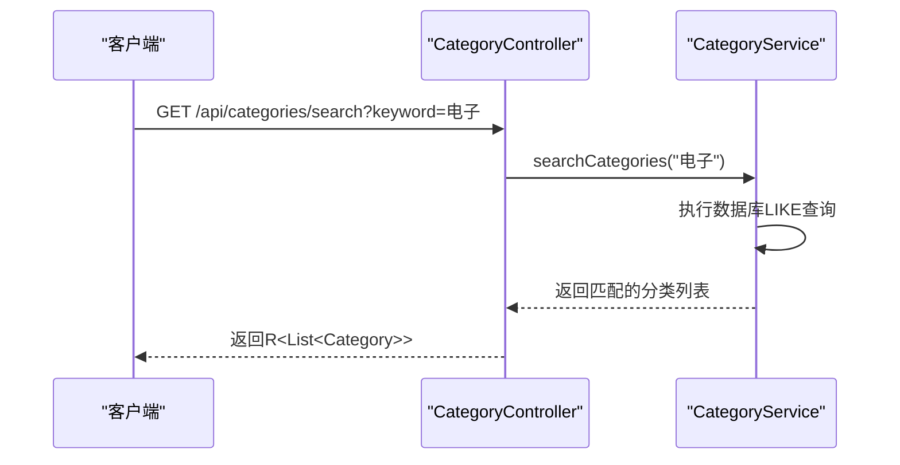
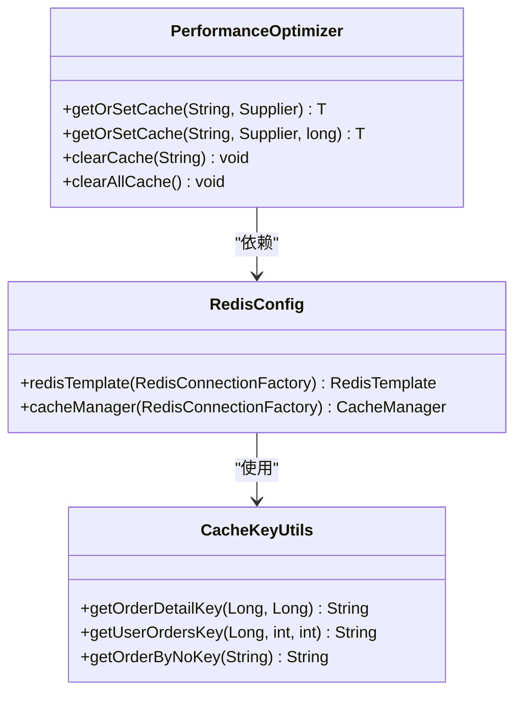
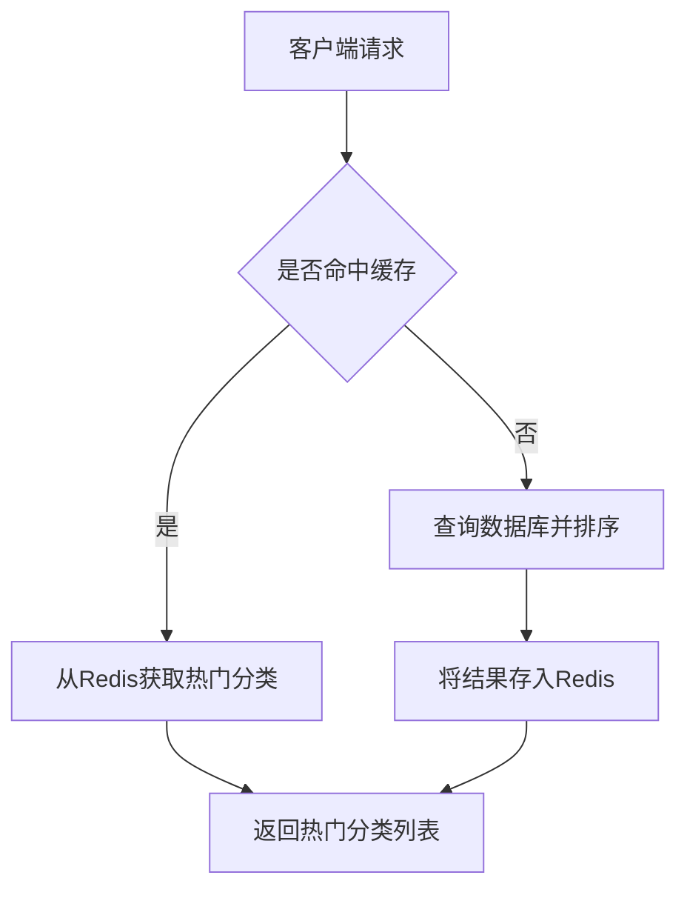
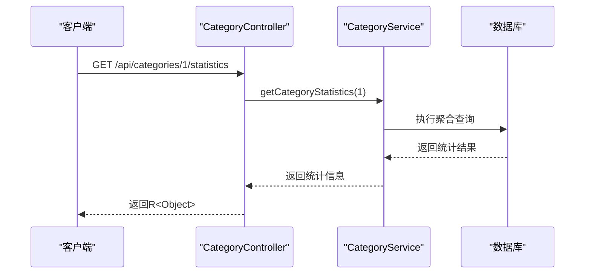
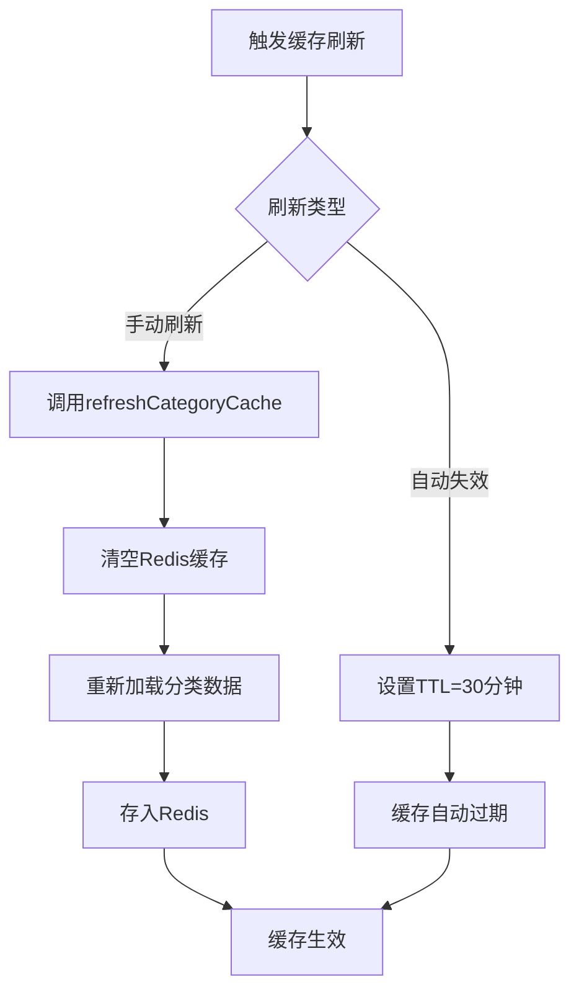
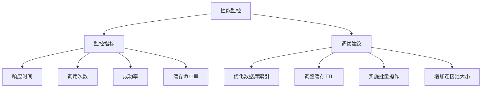

# 分类搜索与缓存API

<cite>
**本文档引用文件**   
- [CategoryController.java](file://backend/product-service/src/main/java/com/mall/product/controller/CategoryController.java)
- [CategoryService.java](file://backend/product-service/src/main/java/com/mall/product/service/CategoryService.java)
- [CategoryServiceImpl.java](file://backend/product-service/src/main/java/com/mall/product/service/impl/CategoryServiceImpl.java)
- [RedisConfig.java](file://backend/order-service/src/main/java/com/mall/order/config/RedisConfig.java)
- [PerformanceOptimizer.java](file://backend/product-service/src/main/java/com/mall/product/util/PerformanceOptimizer.java)
- [CacheKeyUtils.java](file://backend/order-service/src/main/java/com/mall/order/utils/CacheKeyUtils.java)
</cite>

## 目录
1. [简介](#简介)
2. [核心API接口](#核心api接口)
3. [搜索功能实现机制](#搜索功能实现机制)
4. [缓存管理策略](#缓存管理策略)
5. [热门分类获取](#热门分类获取)
6. [统计信息查询](#统计信息查询)
7. [缓存刷新与失效](#缓存刷新与失效)
8. [性能监控与调优建议](#性能监控与调优建议)

## 简介
本技术文档详细阐述了分类搜索与缓存API的设计与实现，重点围绕`CategoryController`中的`searchCategories`、`refreshCategoryCache`、`getHotCategories`和`getCategoryStatistics`等核心方法。文档系统性地说明了分类的全文搜索、热门分类获取、缓存刷新和统计分析等接口的实现细节，包括搜索功能的实现机制、Redis缓存的使用策略、缓存键的设计、缓存失效的最佳实践以及统计接口的数据来源和计算逻辑。

**Section sources**
- [CategoryController.java](file://backend/product-service/src/main/java/com/mall/product/controller/CategoryController.java#L1-L434)

## 核心API接口
分类搜索与缓存API提供了四个核心接口，分别用于分类搜索、缓存刷新、热门分类获取和统计信息查询。

```mermaid
flowchart TD
A[客户端请求] --> B{请求类型}
B --> |GET /api/categories/search| C[searchCategories]
B --> |POST /api/categories/cache/refresh| D[refreshCategoryCache]
B --> |GET /api/categories/hot| E[getHotCategories]
B --> |GET /api/categories/{id}/statistics| F[getCategoryStatistics]
C --> G[返回匹配的分类列表]
D --> H[返回缓存刷新结果]
E --> I[返回热门分类列表]
F --> J[返回分类统计信息]
```

**Diagram sources**
- [CategoryController.java](file://backend/product-service/src/main/java/com/mall/product/controller/CategoryController.java#L241-L253)
- [CategoryController.java](file://backend/product-service/src/main/java/com/mall/product/controller/CategoryController.java#L311-L328)
- [CategoryController.java](file://backend/product-service/src/main/java/com/mall/product/controller/CategoryController.java#L333-L345)
- [CategoryController.java](file://backend/product-service/src/main/java/com/mall/product/controller/CategoryController.java#L398-L415)

## 搜索功能实现机制
分类搜索功能通过`searchCategories`方法实现，该方法接收关键词参数并返回匹配的分类列表。搜索机制基于数据库的LIKE查询，对分类名称和描述字段进行模糊匹配。



**Diagram sources**
- [CategoryController.java](file://backend/product-service/src/main/java/com/mall/product/controller/CategoryController.java#L241-L253)
- [CategoryService.java](file://backend/product-service/src/main/java/com/mall/product/service/CategoryService.java#L110-L110)

## 缓存管理策略
系统采用Redis作为缓存存储，通过`RedisConfig`配置缓存管理器，设置默认30分钟的缓存过期时间。缓存键的设计遵循统一的命名规范，确保缓存的可管理性和可维护性。



**Diagram sources**
- [RedisConfig.java](file://backend/order-service/src/main/java/com/mall/order/config/RedisConfig.java#L30-L95)
- [CacheKeyUtils.java](file://backend/order-service/src/main/java/com/mall/order/utils/CacheKeyUtils.java#L1-L84)
- [PerformanceOptimizer.java](file://backend/product-service/src/main/java/com/mall/product/util/PerformanceOptimizer.java#L1-L278)

## 热门分类获取
`getHotCategories`接口用于获取热门分类列表，根据商品数量或访问量进行排序。该接口通过缓存优化，显著提升了响应速度。



**Diagram sources**
- [CategoryController.java](file://backend/product-service/src/main/java/com/mall/product/controller/CategoryController.java#L333-L345)
- [CategoryService.java](file://backend/product-service/src/main/java/com/mall/product/service/CategoryService.java#L155-L155)

## 统计信息查询
`getCategoryStatistics`接口提供分类的统计信息，包括商品数量、子分类数量等关键指标。统计信息来源于数据库聚合查询。



**Diagram sources**
- [CategoryController.java](file://backend/product-service/src/main/java/com/mall/product/controller/CategoryController.java#L398-L415)
- [CategoryService.java](file://backend/product-service/src/main/java/com/mall/product/service/CategoryService.java#L187-L187)

## 缓存刷新与失效
`refreshCategoryCache`接口用于手动刷新分类缓存，清空并重新加载所有分类数据。系统还实现了自动缓存失效机制，确保数据一致性。



**Diagram sources**
- [CategoryController.java](file://backend/product-service/src/main/java/com/mall/product/controller/CategoryController.java#L311-L328)
- [CategoryService.java](file://backend/product-service/src/main/java/com/mall/product/service/CategoryService.java#L146-L146)
- [RedisConfig.java](file://backend/order-service/src/main/java/com/mall/order/config/RedisConfig.java#L74-L95)

## 性能监控与调优建议
系统集成了性能监控机制，通过`PerformanceOptimizer`类对关键操作进行监控和优化。建议定期监控缓存命中率、响应时间和数据库查询性能。



**Diagram sources**
- [PerformanceOptimizer.java](file://backend/product-service/src/main/java/com/mall/product/util/PerformanceOptimizer.java#L1-L278)
- [性能优化建议报告.md](file://backend/product-service/性能优化建议报告.md#L256-L329)