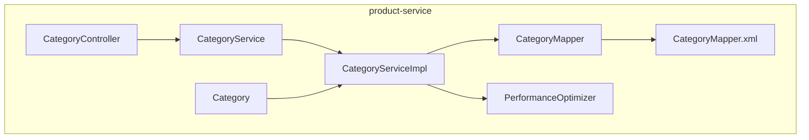
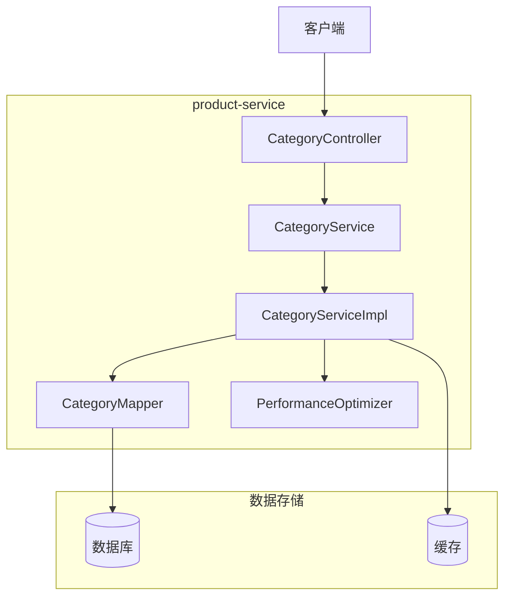
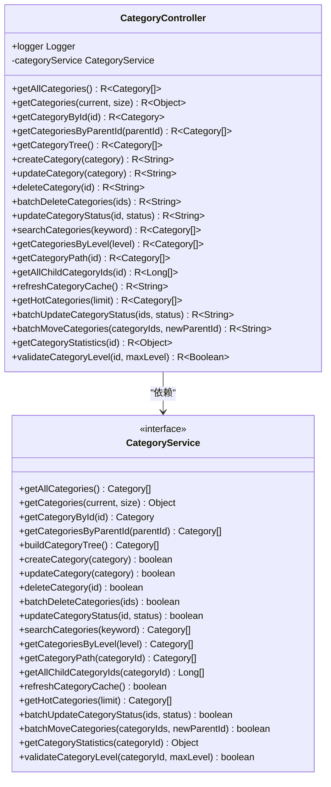
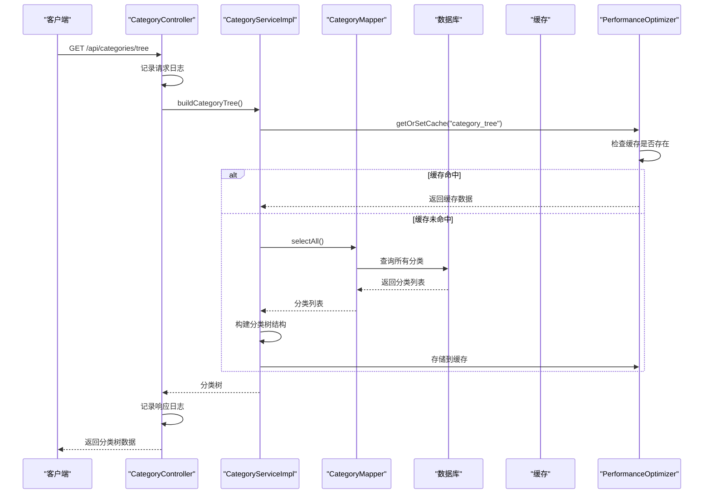
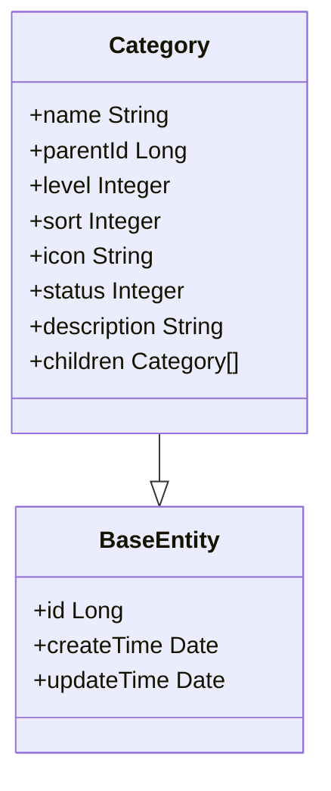
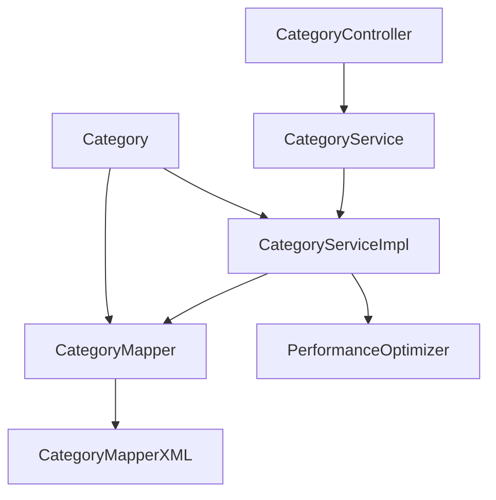

# 分类管理API

<cite>
**本文档引用文件**  
- [CategoryController.java](file://backend/product-service/src/main/java/com/mall/product/controller/CategoryController.java)
- [CategoryService.java](file://backend/product-service/src/main/java/com/mall/product/service/CategoryService.java)
- [CategoryServiceImpl.java](file://backend/product-service/src/main/java/com/mall/product/service/impl/CategoryServiceImpl.java)
- [Category.java](file://backend/product-service/src/main/java/com/mall/product/domain/entity/Category.java)
- [CategoryMapper.java](file://backend/product-service/src/main/java/com/mall/product/mapper/CategoryMapper.java)
- [CategoryMapper.xml](file://backend/product-service/src/main/resources/mapper/CategoryMapper.xml)
- [PerformanceOptimizer.java](file://backend/product-service/src/main/java/com/mall/product/util/PerformanceOptimizer.java)
</cite>

## 目录
1. [简介](#简介)
2. [项目结构](#项目结构)
3. [核心组件](#核心组件)
4. [架构概览](#架构概览)
5. [详细组件分析](#详细组件分析)
6. [依赖分析](#依赖分析)
7. [性能考虑](#性能考虑)
8. [故障排除指南](#故障排除指南)
9. [结论](#结论)

## 简介
分类管理API是商品管理系统中的核心模块，负责商品分类的增删改查、树形结构管理、搜索和缓存操作。该API基于`CategoryController`中的端点，全面支持分类的创建、更新、删除、状态变更、树形结构获取、路径查询等功能。分类体系采用层级结构设计，支持多级分类管理，通过父子关系实现树形结构。系统还提供了搜索、批量操作和缓存刷新等高级功能，确保分类管理的高效性和灵活性。本文档详细描述了各API的请求响应格式，说明了分类层级结构的设计和最佳实践，并提供了使用示例，帮助开发者理解分类体系的管理方式和性能优化策略。

## 项目结构
分类管理功能主要位于`product-service`模块中，采用典型的分层架构设计。控制器层（Controller）提供RESTful API接口，服务层（Service）处理业务逻辑，数据访问层（Mapper）负责数据库操作。分类实体类`Category`定义了分类的基本属性，包括名称、父级ID、层级、排序、图标、状态和描述等。系统通过`CategoryController`暴露API端点，`CategoryService`接口定义业务方法，`CategoryServiceImpl`实现具体逻辑，`CategoryMapper`进行数据库交互。缓存优化通过`PerformanceOptimizer`工具类实现，确保高频访问的分类数据具有良好的性能表现。

**图表来源**
- [CategoryController.java](file://backend/product-service/src/main/java/com/mall/product/controller/CategoryController.java#L22-L433)
- [CategoryService.java](file://backend/product-service/src/main/java/com/mall/product/service/CategoryService.java#L6-L198)
- [CategoryServiceImpl.java](file://backend/product-service/src/main/java/com/mall/product/service/impl/CategoryServiceImpl.java#L10-L139)
- [CategoryMapper.java](file://backend/product-service/src/main/java/com/mall/product/mapper/CategoryMapper.java#L19-L139)
- [CategoryMapper.xml](file://backend/product-service/src/main/resources/mapper/CategoryMapper.xml#L3-L57)
- [PerformanceOptimizer.java](file://backend/product-service/src/main/java/com/mall/product/util/PerformanceOptimizer.java#L19-L277)

**章节来源**
- [CategoryController.java](file://backend/product-service/src/main/java/com/mall/product/controller/CategoryController.java#L1-L434)
- [CategoryService.java](file://backend/product-service/src/main/java/com/mall/product/service/CategoryService.java#L1-L199)
- [CategoryMapper.java](file://backend/product-service/src/main/java/com/mall/product/mapper/CategoryMapper.java#L1-L140)

## 核心组件
分类管理API的核心组件包括`CategoryController`、`CategoryService`、`Category`实体类和`CategoryMapper`。`CategoryController`作为API的入口，提供了丰富的RESTful端点，涵盖分类的增删改查、树形结构管理、搜索和缓存操作。`CategoryService`接口定义了所有业务方法，`CategoryServiceImpl`实现了具体的业务逻辑，包括分类树的构建、路径查询、状态管理等。`Category`实体类定义了分类的基本属性和关系，支持树形结构的递归表示。`CategoryMapper`负责与数据库的交互，通过MyBatis实现CRUD操作和复杂查询。`PerformanceOptimizer`工具类提供了缓存管理和性能监控功能，确保系统的高效运行。

**章节来源**
- [CategoryController.java](file://backend/product-service/src/main/java/com/mall/product/controller/CategoryController.java#L22-L433)
- [CategoryService.java](file://backend/product-service/src/main/java/com/mall/product/service/CategoryService.java#L6-L198)
- [Category.java](file://backend/product-service/src/main/java/com/mall/product/domain/entity/Category.java#L18-L62)
- [CategoryMapper.java](file://backend/product-service/src/main/java/com/mall/product/mapper/CategoryMapper.java#L19-L139)

## 架构概览
分类管理API采用典型的三层架构：表现层、业务逻辑层和数据访问层。表现层由`CategoryController`组成，负责接收HTTP请求并返回响应。业务逻辑层由`CategoryService`和`CategoryServiceImpl`组成，处理分类管理的核心业务逻辑。数据访问层由`CategoryMapper`和`CategoryMapper.xml`组成，负责与数据库进行交互。系统通过`PerformanceOptimizer`实现缓存优化，提高查询性能。分类实体通过`children`属性支持树形结构的递归表示，便于前端展示和导航。API设计遵循RESTful原则，使用标准的HTTP方法和状态码，确保接口的规范性和易用性。

**图表来源**
- [CategoryController.java](file://backend/product-service/src/main/java/com/mall/product/controller/CategoryController.java#L22-L433)
- [CategoryService.java](file://backend/product-service/src/main/java/com/mall/product/service/CategoryService.java#L6-L198)
- [CategoryServiceImpl.java](file://backend/product-service/src/main/java/com/mall/product/service/impl/CategoryServiceImpl.java#L10-L139)
- [CategoryMapper.java](file://backend/product-service/src/main/java/com/mall/product/mapper/CategoryMapper.java#L19-L139)
- [PerformanceOptimizer.java](file://backend/product-service/src/main/java/com/mall/product/util/PerformanceOptimizer.java#L19-L277)

## 详细组件分析

### 分类控制器分析
`CategoryController`是分类管理API的核心，提供了全面的RESTful端点。控制器通过`@RestController`和`@RequestMapping("/api/categories")`注解定义，支持跨域访问。每个端点都有详细的日志记录，便于调试和监控。API设计遵循RESTful原则，使用标准的HTTP方法：GET用于查询，POST用于创建，PUT用于更新，DELETE用于删除。响应格式统一使用`R`类包装，包含状态码、消息和数据，确保前端处理的一致性。

#### 分类控制器类图

**图表来源**
- [CategoryController.java](file://backend/product-service/src/main/java/com/mall/product/controller/CategoryController.java#L22-L433)
- [CategoryService.java](file://backend/product-service/src/main/java/com/mall/product/service/CategoryService.java#L6-L198)

### 分类服务分析
`CategoryService`接口定义了分类管理的所有业务方法，`CategoryServiceImpl`实现了具体的业务逻辑。服务层负责处理分类的增删改查、树形结构构建、路径查询、状态管理等核心功能。通过`PerformanceOptimizer`工具类实现缓存管理，提高查询性能。服务方法都有详细的日志记录，便于调试和监控。业务逻辑中包含了必要的验证和错误处理，确保数据的一致性和完整性。

#### 分类服务序列图

**图表来源**
- [CategoryController.java](file://backend/product-service/src/main/java/com/mall/product/controller/CategoryController.java#L111-L123)
- [CategoryServiceImpl.java](file://backend/product-service/src/main/java/com/mall/product/service/impl/CategoryServiceImpl.java#L45-L49)
- [PerformanceOptimizer.java](file://backend/product-service/src/main/java/com/mall/product/util/PerformanceOptimizer.java#L93-L111)
- [CategoryMapper.java](file://backend/product-service/src/main/java/com/mall/product/mapper/CategoryMapper.java#L26-L27)

### 分类实体分析
`Category`实体类定义了分类的基本属性和关系。实体继承自`BaseEntity`，包含ID、创建时间和更新时间等基础字段。核心属性包括名称、父级ID、层级、排序、图标、状态和描述。`children`属性用于构建树形结构，不存储到数据库。实体使用Lombok注解简化代码，`@Data`生成getter/setter方法，`@EqualsAndHashCode`生成equals和hashCode方法。这种设计支持递归的树形结构表示，便于前端展示和导航。

#### 分类实体类图

**图表来源**
- [Category.java](file://backend/product-service/src/main/java/com/mall/product/domain/entity/Category.java#L18-L62)
- [BaseEntity.java](file://backend/common-core/src/main/java/com/mall/common/core/domain/BaseEntity.java)

## 依赖分析
分类管理模块的依赖关系清晰，遵循分层架构原则。`CategoryController`依赖`CategoryService`接口，实现控制反转。`CategoryServiceImpl`依赖`CategoryMapper`进行数据库操作，依赖`PerformanceOptimizer`进行缓存管理。`CategoryMapper`通过MyBatis与数据库交互，SQL语句定义在`CategoryMapper.xml`中。`Category`实体类被所有层使用，作为数据传输的载体。这种依赖关系确保了各层的职责分离，提高了代码的可维护性和可测试性。

**图表来源**
- [CategoryController.java](file://backend/product-service/src/main/java/com/mall/product/controller/CategoryController.java#L30-L30)
- [CategoryService.java](file://backend/product-service/src/main/java/com/mall/product/service/CategoryService.java)
- [CategoryServiceImpl.java](file://backend/product-service/src/main/java/com/mall/product/service/impl/CategoryServiceImpl.java#L19-L19)
- [CategoryMapper.java](file://backend/product-service/src/main/java/com/mall/product/mapper/CategoryMapper.java)
- [PerformanceOptimizer.java](file://backend/product-service/src/main/java/com/mall/product/util/PerformanceOptimizer.java)

**章节来源**
- [CategoryController.java](file://backend/product-service/src/main/java/com/mall/product/controller/CategoryController.java#L1-L434)
- [CategoryService.java](file://backend/product-service/src/main/java/com/mall/product/service/CategoryService.java#L1-L199)
- [CategoryMapper.java](file://backend/product-service/src/main/java/com/mall/product/mapper/CategoryMapper.java#L1-L140)

## 性能考虑
分类管理API通过多种方式优化性能。首先，使用`PerformanceOptimizer`工具类实现缓存管理，高频访问的分类树数据被缓存5分钟，减少数据库查询压力。其次，提供分页查询接口，避免一次性加载大量数据。第三，支持批量操作，减少网络往返次数。第四，使用MyBatis的批量操作功能，提高数据库操作效率。第五，通过索引优化数据库查询性能。最后，详细的性能监控日志帮助识别性能瓶颈，为优化提供依据。

**章节来源**
- [PerformanceOptimizer.java](file://backend/product-service/src/main/java/com/mall/product/util/PerformanceOptimizer.java#L19-L277)
- [CategoryController.java](file://backend/product-service/src/main/java/com/mall/product/controller/CategoryController.java#L312-L328)
- [CategoryServiceImpl.java](file://backend/product-service/src/main/java/com/mall/product/service/impl/CategoryServiceImpl.java#L106-L108)

## 故障排除指南
当分类管理API出现问题时，可以按照以下步骤进行排查。首先检查日志文件，`CategoryController`和`CategoryServiceImpl`中的日志记录了详细的请求和处理信息。其次，验证请求参数是否正确，特别是ID、状态值和分页参数。第三，检查数据库连接和数据完整性，确保分类数据正确存储。第四，验证缓存状态，必要时调用`/api/categories/cache/refresh`刷新缓存。第五，检查网络连接和跨域配置。最后，查看系统监控指标，识别性能瓶颈。

**章节来源**
- [CategoryController.java](file://backend/product-service/src/main/java/com/mall/product/controller/CategoryController.java)
- [CategoryServiceImpl.java](file://backend/product-service/src/main/java/com/mall/product/service/impl/CategoryServiceImpl.java)
- [PerformanceOptimizer.java](file://backend/product-service/src/main/java/com/mall/product/util/PerformanceOptimizer.java)

## 结论
分类管理API提供了全面的商品分类管理功能，支持增删改查、树形结构管理、搜索和缓存操作。API设计遵循RESTful原则，接口规范易用。系统采用分层架构，职责分离清晰，便于维护和扩展。通过缓存优化和批量操作，确保了高性能和高效率。详细的日志记录和错误处理机制提高了系统的可靠性和可维护性。开发者可以基于本文档快速理解和使用分类管理API，实现商品分类的高效管理。