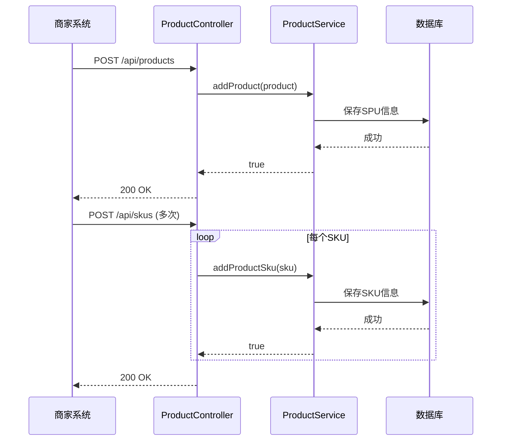
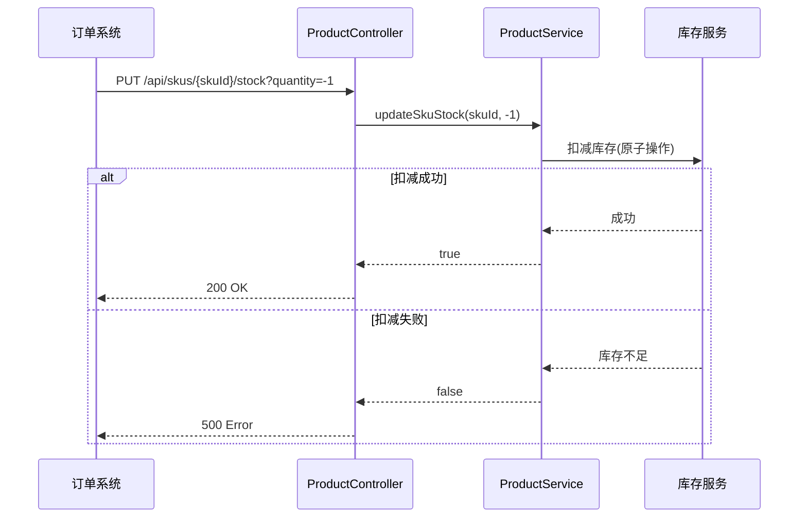

# SKU管理API

<cite>
**本文档引用文件**   
- [ProductController.java](file://backend/product-service/src/main/java/com/mall/product/controller/ProductController.java)
- [ProductSku.java](file://backend/product-service/src/main/java/com/mall/product/domain/entity/ProductSku.java)
- [ProductService.java](file://backend/product-service/src/main/java/com/mall/product/service/ProductService.java)
- [ProductServiceImpl.java](file://backend/product-service/src/main/java/com/mall/product/service/impl/ProductServiceImpl.java)
- [R.java](file://backend/common-core/src/main/java/com/mall/common/core/domain/R.java)
</cite>

## 目录
1. [简介](#简介)
2. [SPU与SKU关系说明](#spu与sku关系说明)
3. [ProductSku实体类说明](#productsku实体类说明)
4. [SKU管理API接口](#sku管理api接口)
5. [批量操作接口](#批量操作接口)
6. [库存管理接口](#库存管理接口)
7. [价格管理接口](#价格管理接口)
8. [高并发库存扣减优化建议](#高并发库存扣减优化建议)
9. [使用示例](#使用示例)

## 简介
本API文档详细描述了多规格商品（SKU）的增删改查、库存与价格管理功能。基于`ProductController`中的端点，全面说明SKU的创建、更新、删除、批量保存及查询操作的请求响应格式。文档涵盖`ProductSku`实体类的字段含义及约束条件，包括SKU编码、规格名称、独立价格、独立库存等特性。同时提供SKU批量操作、库存同步更新和价格独立调整的使用示例，并阐明SKU与SPU的关系，以及高并发场景下的库存扣减优化建议。

**Section sources**
- [ProductController.java](file://backend/product-service/src/main/java/com/mall/product/controller/ProductController.java#L1-L693)

## SPU与SKU关系说明
在商品管理系统中，SPU（Standard Product Unit，标准化产品单元）和SKU（Stock Keeping Unit，库存量单位）是两个核心概念：

- **SPU**：代表商品的标准化信息，如商品名称、描述、主图等基本信息。一个SPU对应一个商品的基本信息，不包含具体规格。
- **SKU**：代表商品的具体规格和库存单位。一个SPU可以有多个SKU，每个SKU对应不同的规格组合（如颜色、尺寸等），并拥有独立的价格和库存。

例如，一款T恤（SPU）可能有多个SKU，如"红色-L"、"红色-M"、"蓝色-L"等，每个SKU都有独立的库存和价格。

**Section sources**
- [ProductSku.java](file://backend/product-service/src/main/java/com/mall/product/domain/entity/ProductSku.java#L1-L107)
- [Product.java](file://backend/product-service/src/main/java/com/mall/product/domain/entity/Product.java#L1-L184)

## ProductSku实体类说明
`ProductSku`实体类定义了SKU的所有属性，是SKU管理的核心数据结构。

### 字段说明
| 字段名 | 类型 | 说明 | 约束条件 |
|--------|------|------|----------|
| productId | Long | 商品ID | 必填，关联SPU |
| skuCode | String | SKU编码 | 唯一标识，建议生成规则：SPU编码+规格组合 |
| skuName | String | SKU名称 | 必填，如"红色-L" |
| price | Double | SKU价格 | 必填，独立定价 |
| originalPrice | Double | SKU原价 | 可选，用于显示折扣 |
| costPrice | Double | SKU成本价 | 可选，用于成本核算 |
| priceVersion | Long | 价格版本号 | 用于乐观锁控制 |
| stock | Integer | SKU库存 | 必填，独立库存 |
| stockWarning | Integer | SKU库存预警值 | 可选，低于此值触发预警 |
| weight | Integer | SKU重量（克） | 可选 |
| barcode | String | SKU条形码 | 可选 |
| image | String | SKU图片URL | 可选，可覆盖SPU主图 |
| specValues | String | SKU规格属性（JSON格式） | 必填，如{"颜色":"红色","尺寸":"L"} |
| status | Integer | SKU状态 | 0-禁用，1-启用 |
| sales | Integer | SKU销量 | 只读，系统自动更新 |
| sort | Integer | 排序值 | 用于前端展示排序 |
| productName | String | 商品名称（冗余字段） | 用于显示，与SPU同步 |

**Section sources**
- [ProductSku.java](file://backend/product-service/src/main/java/com/mall/product/domain/entity/ProductSku.java#L1-L107)

## SKU管理API接口
SKU管理API提供了对SKU的完整生命周期管理，包括增删改查操作。

### 创建SKU
创建新的商品SKU。

**请求信息**
- **URL**: `/api/skus`
- **方法**: POST
- **请求头**: `Content-Type: application/json`
- **请求体**: `ProductSku`对象

**请求示例**
```json
{
  "productId": 1001,
  "skuName": "红色-L",
  "price": 99.9,
  "stock": 100,
  "specValues": "{\"颜色\":\"红色\",\"尺寸\":\"L\"}",
  "status": 1
}
```

**响应信息**
- **成功响应**: `200 OK`
```json
{
  "code": 200,
  "message": "SKU新增成功",
  "data": null,
  "timestamp": 1732000000000
}
```
- **失败响应**: `500 Internal Server Error`
```json
{
  "code": 500,
  "message": "SKU新增失败",
  "data": null,
  "timestamp": 1732000000000
}
```

**Section sources**
- [ProductController.java](file://backend/product-service/src/main/java/com/mall/product/controller/ProductController.java#L361-L378)
- [ProductServiceImpl.java](file://backend/product-service/src/main/java/com/mall/product/service/impl/ProductServiceImpl.java#L711-L732)

### 更新SKU
更新现有商品SKU信息。

**请求信息**
- **URL**: `/api/skus`
- **方法**: PUT
- **请求头**: `Content-Type: application/json`
- **请求体**: `ProductSku`对象（必须包含ID）

**请求示例**
```json
{
  "id": 2001,
  "productId": 1001,
  "skuName": "红色-L",
  "price": 89.9,
  "stock": 80,
  "specValues": "{\"颜色\":\"红色\",\"尺寸\":\"L\"}",
  "status": 1
}
```

**响应信息**
- **成功响应**: `200 OK`
```json
{
  "code": 200,
  "message": "SKU更新成功",
  "data": null,
  "timestamp": 1732000000000
}
```
- **失败响应**: `500 Internal Server Error`
```json
{
  "code": 500,
  "message": "SKU更新失败",
  "data": null,
  "timestamp": 1732000000000
}
```

**Section sources**
- [ProductController.java](file://backend/product-service/src/main/java/com/mall/product/controller/ProductController.java#L386-L403)
- [ProductServiceImpl.java](file://backend/product-service/src/main/java/com/mall/product/service/impl/ProductServiceImpl.java#L734-L772)

### 删除SKU
删除指定的商品SKU。

**请求信息**
- **URL**: `/api/skus/{skuId}`
- **方法**: DELETE
- **路径参数**: `skuId` - SKU的唯一标识

**响应信息**
- **成功响应**: `200 OK`
```json
{
  "code": 200,
  "message": "SKU删除成功",
  "data": null,
  "timestamp": 1732000000000
}
```
- **失败响应**: `500 Internal Server Error`
```json
{
  "code": 500,
  "message": "SKU删除失败",
  "data": null,
  "timestamp": 1732000000000
}
```

**Section sources**
- [ProductController.java](file://backend/product-service/src/main/java/com/mall/product/controller/ProductController.java#L411-L428)
- [ProductServiceImpl.java](file://backend/product-service/src/main/java/com/mall/product/service/impl/ProductServiceImpl.java#L780-L797)

### 查询SKU列表
获取指定商品的所有SKU。

**请求信息**
- **URL**: `/api/{productId}/skus`
- **方法**: GET
- **路径参数**: `productId` - 商品ID

**响应信息**
- **成功响应**: `200 OK`
```json
{
  "code": 200,
  "message": "操作成功",
  "data": [
    {
      "id": 2001,
      "productId": 1001,
      "skuCode": "P1001-R-L",
      "skuName": "红色-L",
      "price": 99.9,
      "originalPrice": 129.9,
      "costPrice": 60.0,
      "priceVersion": 1,
      "stock": 100,
      "stockWarning": 10,
      "weight": 200,
      "barcode": "1234567890123",
      "image": "https://example.com/images/red-l.jpg",
      "specValues": "{\"颜色\":\"红色\",\"尺寸\":\"L\"}",
      "status": 1,
      "sales": 50,
      "sort": 1,
      "productName": "时尚T恤"
    }
  ],
  "timestamp": 1732000000000
}
```
- **失败响应**: `500 Internal Server Error`
```json
{
  "code": 500,
  "message": "获取SKU列表失败",
  "data": null,
  "timestamp": 1732000000000
}
```

**Section sources**
- [ProductController.java](file://backend/product-service/src/main/java/com/mall/product/controller/ProductController.java#L341-L353)
- [ProductServiceImpl.java](file://backend/product-service/src/main/java/com/mall/product/service/impl/ProductServiceImpl.java#L693-L702)

## 批量操作接口
提供SKU的批量操作功能，提高管理效率。

### 批量保存SKU
一次性保存商品的所有SKU，用于商品规格的完整更新。

**请求信息**
- **URL**: `/api/{productId}/skus/batch`
- **方法**: POST
- **路径参数**: `productId` - 商品ID
- **请求体**: SKU对象列表

**请求示例**
```json
[
  {
    "skuName": "红色-L",
    "price": 99.9,
    "stock": 100,
    "specValues": "{\"颜色\":\"红色\",\"尺寸\":\"L\"}",
    "status": 1
  },
  {
    "skuName": "红色-M",
    "price": 99.9,
    "stock": 80,
    "specValues": "{\"颜色\":\"红色\",\"尺寸\":\"M\"}",
    "status": 1
  },
  {
    "skuName": "蓝色-L",
    "price": 99.9,
    "stock": 120,
    "specValues": "{\"颜色\":\"蓝色\",\"尺寸\":\"L\"}",
    "status": 1
  }
]
```

**响应信息**
- **成功响应**: `200 OK`
```json
{
  "code": 200,
  "message": "批量保存SKU成功",
  "data": null,
  "timestamp": 1732000000000
}
```
- **失败响应**: `500 Internal Server Error`
```json
{
  "code": 500,
  "message": "批量保存SKU失败",
  "data": null,
  "timestamp": 1732000000000
}
```

**Section sources**
- [ProductController.java](file://backend/product-service/src/main/java/com/mall/product/controller/ProductController.java#L437-L454)
- [ProductServiceImpl.java](file://backend/product-service/src/main/java/com/mall/product/service/impl/ProductServiceImpl.java#L807-L840)

## 库存管理接口
提供SKU级别的库存管理功能。

### 更新SKU库存
更新指定SKU的库存数量。

**请求信息**
- **URL**: `/api/skus/{skuId}/stock`
- **方法**: PUT
- **路径参数**: `skuId` - SKU ID
- **查询参数**: `quantity` - 库存变化数量（正数为增加，负数为减少）

**请求示例**
```
PUT /api/skus/2001/stock?quantity=-1
```

**响应信息**
- **成功响应**: `200 OK`
```json
{
  "code": 200,
  "message": "SKU库存更新成功",
  "data": null,
  "timestamp": 1732000000000
}
```
- **失败响应**: `500 Internal Server Error`
```json
{
  "code": 500,
  "message": "SKU库存更新失败",
  "data": null,
  "timestamp": 1732000000000
}
```

**Section sources**
- [ProductController.java](file://backend/product-service/src/main/java/com/mall/product/controller/ProductController.java#L492-L509)
- [ProductServiceImpl.java](file://backend/product-service/src/main/java/com/mall/product/service/impl/ProductServiceImpl.java#L845-L852)

### 批量更新库存
批量更新多个商品或SKU的库存。

**请求信息**
- **URL**: `/api/stock/batch`
- **方法**: PUT
- **请求体**: `StockUpdate`对象列表

```java
class StockUpdate {
    private Long productId;
    private Long skuId;
    private Integer quantity;
    private String reason;
    private Long operatorId;
}
```

**请求示例**
```json
[
  {
    "productId": 1001,
    "skuId": 2001,
    "quantity": -1,
    "reason": "订单支付成功",
    "operatorId": 100
  },
  {
    "productId": 1002,
    "skuId": 2002,
    "quantity": 10,
    "reason": "采购入库",
    "operatorId": 100
  }
]
```

**响应信息**
- **成功响应**: `200 OK`
```json
{
  "code": 200,
  "message": "批量库存更新成功",
  "data": null,
  "timestamp": 1732000000000
}
```
- **失败响应**: `500 Internal Server Error`
```json
{
  "code": 500,
  "message": "批量库存更新失败",
  "data": null,
  "timestamp": 1732000000000
}
```

**Section sources**
- [ProductController.java](file://backend/product-service/src/main/java/com/mall/product/controller/ProductController.java#L518-L535)
- [ProductService.java](file://backend/product-service/src/main/java/com/mall/product/service/ProductService.java#L197-L197)

## 价格管理接口
提供SKU级别的价格管理功能。

### 更新SKU价格
更新指定SKU的价格。

**请求信息**
- **URL**: `/api/skus/{skuId}/price`
- **方法**: PUT
- **路径参数**: `skuId` - SKU ID
- **查询参数**: 
  - `newPrice` - 新价格（必填）
  - `reason` - 变更原因（可选）
  - `operatorId` - 操作人ID（可选）

**请求示例**
```
PUT /api/skus/2001/price?newPrice=89.9&reason=促销活动&operatorId=100
```

**响应信息**
- **成功响应**: `200 OK`
```json
{
  "code": 200,
  "message": "SKU价格更新成功",
  "data": null,
  "timestamp": 1732000000000
}
```
- **失败响应**: `500 Internal Server Error`
```json
{
  "code": 500,
  "message": "SKU价格更新失败",
  "data": null,
  "timestamp": 1732000000000
}
```

**Section sources**
- [ProductController.java](file://backend/product-service/src/main/java/com/mall/product/controller/ProductController.java#L622-L642)
- [ProductServiceImpl.java](file://backend/product-service/src/main/java/com/mall/product/service/impl/ProductServiceImpl.java#L845-L852)

### 批量调价
批量更新多个商品或SKU的价格。

**请求信息**
- **URL**: `/api/price/batch`
- **方法**: PUT
- **请求体**: `PriceUpdate`对象列表

```java
class PriceUpdate {
    private Long productId;
    private Long skuId;
    private Double newPrice;
    private String reason;
    private Long operatorId;
}
```

**请求示例**
```json
[
  {
    "productId": 1001,
    "skuId": 2001,
    "newPrice": 89.9,
    "reason": "双11促销",
    "operatorId": 100
  },
  {
    "productId": 1001,
    "skuId": 2002,
    "newPrice": 89.9,
    "reason": "双11促销",
    "operatorId": 100
  }
]
```

**响应信息**
- **成功响应**: `200 OK`
```json
{
  "code": 200,
  "message": "批量调价成功",
  "data": null,
  "timestamp": 1732000000000
}
```
- **失败响应**: `500 Internal Server Error`
```json
{
  "code": 500,
  "message": "批量调价失败",
  "data": null,
  "timestamp": 1732000000000
}
```

**Section sources**
- [ProductController.java](file://backend/product-service/src/main/java/com/mall/product/controller/ProductController.java#L650-L667)
- [ProductService.java](file://backend/product-service/src/main/java/com/mall/product/service/ProductService.java#L246-L246)

## 高并发库存扣减优化建议
在高并发场景下，库存扣减需要特别注意数据一致性和性能问题。

### 问题分析
在高并发环境下，多个用户同时购买同一SKU商品时，可能出现超卖问题。传统的"查询库存-判断库存-扣减库存"流程存在竞态条件，可能导致库存被扣减为负数。

### 解决方案
1. **数据库乐观锁**
   - 在`ProductSku`表中增加`priceVersion`字段作为版本号
   - 每次更新库存时，检查版本号是否匹配
   - SQL示例：
   ```sql
   UPDATE product_sku 
   SET stock = stock - 1, 
       priceVersion = priceVersion + 1 
   WHERE id = ? 
     AND stock >= 1 
     AND priceVersion = ?
   ```

2. **Redis原子操作**
   - 使用Redis的`DECR`命令进行原子性库存扣减
   - 设置库存过期时间，避免长时间占用
   - 伪代码示例：
   ```java
   Boolean success = redisTemplate.opsForValue()
       .increment("sku:stock:" + skuId, -1) >= 0;
   if (!success) {
       throw new InsufficientStockException();
   }
   ```

3. **消息队列削峰**
   - 将库存扣减请求放入消息队列
   - 消费者按顺序处理库存扣减
   - 避免数据库瞬间高并发压力

4. **本地缓存+异步更新**
   - 使用本地缓存（如Caffeine）存储热点商品库存
   - 先在本地缓存扣减，再异步更新数据库
   - 定期同步本地缓存与数据库状态

5. **分布式锁**
   - 使用Redis或Zookeeper实现分布式锁
   - 对同一SKU的库存操作进行串行化
   - 伪代码示例：
   ```java
   RLock lock = redissonClient.getLock("sku_lock:" + skuId);
   try {
       if (lock.tryLock(1, 10, TimeUnit.SECONDS)) {
           // 执行库存扣减逻辑
       }
   } finally {
       lock.unlock();
   }
   ```

**Section sources**
- [ProductServiceImpl.java](file://backend/product-service/src/main/java/com/mall/product/service/impl/ProductServiceImpl.java#L845-L852)
- [ProductSku.java](file://backend/product-service/src/main/java/com/mall/product/domain/entity/ProductSku.java#L56-L56)

## 使用示例
以下为SKU管理的典型使用场景示例。

### 创建商品及SKU流程


**Diagram sources**
- [ProductController.java](file://backend/product-service/src/main/java/com/mall/product/controller/ProductController.java#L213-L230)
- [ProductController.java](file://backend/product-service/src/main/java/com/mall/product/controller/ProductController.java#L361-L378)

### 订单支付库存扣减流程


**Diagram sources**
- [ProductController.java](file://backend/product-service/src/main/java/com/mall/product/controller/ProductController.java#L492-L509)
- [ProductServiceImpl.java](file://backend/product-service/src/main/java/com/mall/product/service/impl/ProductServiceImpl.java#L845-L852)

### 批量更新商品价格示例
```java
// 批量调价请求
List<ProductService.PriceUpdate> priceUpdates = Arrays.asList(
    new ProductService.PriceUpdate(1001L, 2001L, 89.9, "促销活动", 100L),
    new ProductService.PriceUpdate(1001L, 2002L, 89.9, "促销活动", 100L)
);

// 发送请求
ResponseEntity<R<String>> response = restTemplate.exchange(
    "http://product-service/api/price/batch",
    HttpMethod.PUT,
    new HttpEntity<>(priceUpdates, headers),
    new ParameterizedTypeReference<R<String>>() {}
);
```

**Section sources**
- [ProductController.java](file://backend/product-service/src/main/java/com/mall/product/controller/ProductController.java#L650-L667)
- [ProductService.java](file://backend/product-service/src/main/java/com/mall/product/service/ProductService.java#L301-L336)