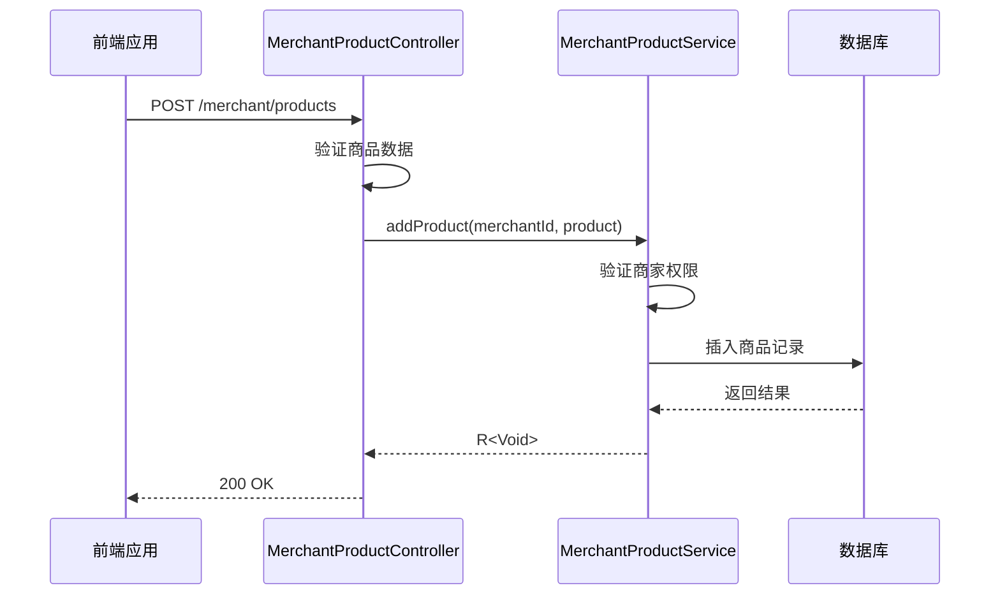
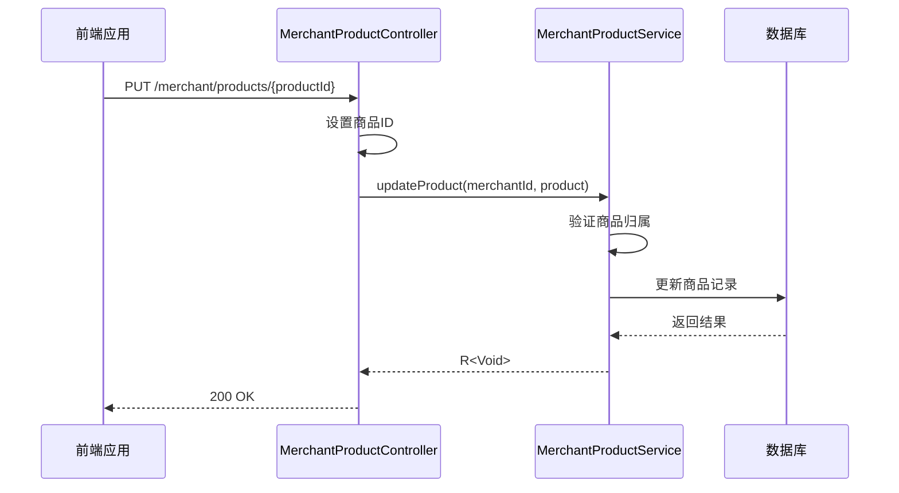
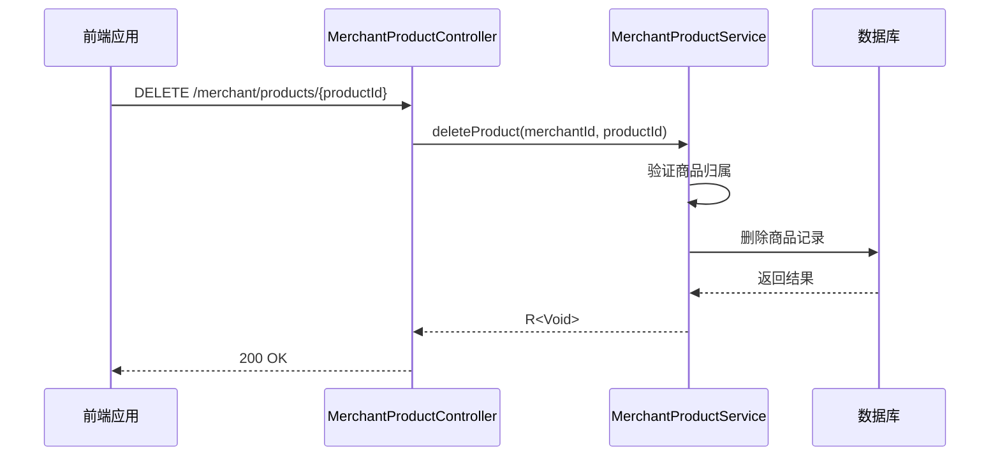
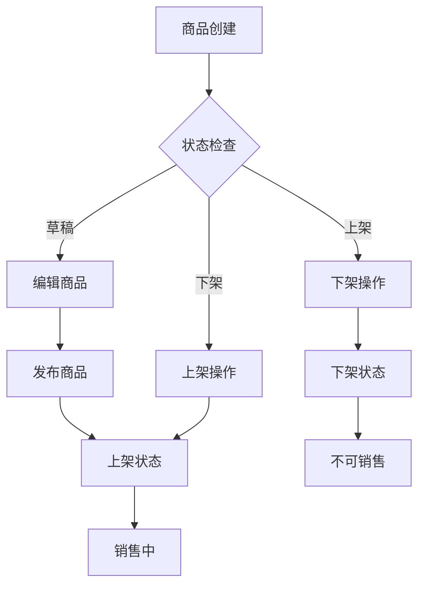
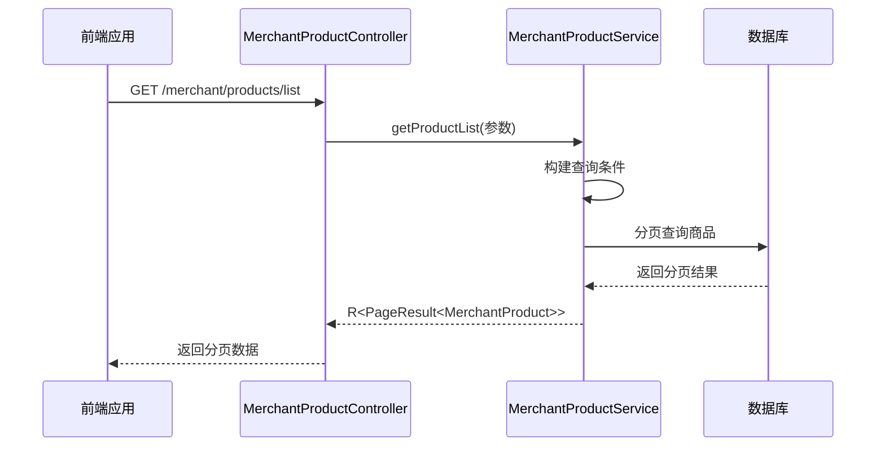

# 商品管理API

<cite>
**本文档引用文件**   
- [MerchantProductController.java](file://backend/merchant-service/src/main/java/com/mall/merchant/controller/MerchantProductController.java)
- [MerchantProduct.java](file://backend/merchant-service/src/main/java/com/mall/merchant/domain/entity/MerchantProduct.java)
- [ProductService.java](file://backend/product-service/src/main/java/com/mall/product/service/ProductService.java)
- [Product.java](file://backend/product-service/src/main/java/com/mall/product/domain/entity/Product.java)
- [ProductSku.java](file://backend/product-service/src/main/java/com/mall/product/domain/entity/ProductSku.java)
- [product.js](file://frontend/src/api/merchant/product.js)
</cite>

## 目录
1. [简介](#简介)
2. [商品实体模型](#商品实体模型)
3. [核心管理接口](#核心管理接口)
4. [商品状态管理](#商品状态管理)
5. [多规格商品（SKU）管理](#多规格商品sku管理)
6. [分页与批量操作](#分页与批量操作)
7. [性能优化建议](#性能优化建议)
8. [使用示例](#使用示例)

## 简介
本API文档详细描述了在线商城系统中商品全生命周期的管理功能。通过`MerchantProductController`提供的RESTful端点，商家可以实现商品的创建、更新、删除、上下架、库存调整等操作。系统支持单规格和多规格（SKU）商品管理，提供分页查询、批量操作和状态变更功能，满足电商场景下的多样化需求。

**Section sources**
- [MerchantProductController.java](file://backend/merchant-service/src/main/java/com/mall/merchant/controller/MerchantProductController.java#L27-L618)

## 商品实体模型
`MerchantProduct`实体类定义了商品的核心属性和业务字段，包含基本信息、价格库存、状态标签和SEO设置。

### 核心字段说明
| 字段名 | 类型 | 约束 | 说明 |
|-------|------|------|------|
| merchantId | Long | 非空 | 商家ID |
| productName | String | 非空, 200字符 | 商品名称 |
| price | BigDecimal | 非空, 精度(10,2) | 销售价格 |
| marketPrice | BigDecimal | 精度(10,2) | 市场价格（原价） |
| costPrice | BigDecimal | 精度(10,2) | 成本价格 |
| stockQuantity | Integer | 非空, 默认0 | 库存数量 |
| warningStock | Integer | 非空, 默认10 | 预警库存 |
| status | Integer | 非空, 默认2 | 状态: 0-下架, 1-上架, 2-草稿 |
| isRecommended | Integer | 非空, 默认0 | 是否推荐: 0-否, 1-是 |
| isNew | Integer | 非空, 默认0 | 是否新品: 0-否, 1-是 |
| isHot | Integer | 非空, 默认0 | 是否热销: 0-否, 1-是 |
| salesCount | Integer | 非空, 默认0 | 销售数量 |
| viewCount | Integer | 非空, 默认0 | 浏览次数 |
| favoriteCount | Integer | 非空, 默认0 | 收藏次数 |

### 业务方法
实体类提供了便捷的业务判断方法：
- `getStatusText()`: 获取状态文本描述
- `isOnSale()`: 判断是否上架
- `hasStock()`: 判断是否有库存
- `isLowStock()`: 判断是否库存不足
- `increaseSales()`: 增加销售数量
- `decreaseStock()`: 减少库存
- `increaseStock()`: 增加库存

**Section sources**
- [MerchantProduct.java](file://backend/merchant-service/src/main/java/com/mall/merchant/domain/entity/MerchantProduct.java#L18-L784)

## 核心管理接口
商品管理API提供了完整的CRUD操作，所有接口均通过`/merchant/products`路径访问。

### 商品创建


**Diagram sources**
- [MerchantProductController.java](file://backend/merchant-service/src/main/java/com/mall/merchant/controller/MerchantProductController.java#L82-L87)
- [MerchantProductService.java](file://backend/merchant-service/src/main/java/com/mall/merchant/service/MerchantProductService.java#L28-L28)

### 商品更新


**Diagram sources**
- [MerchantProductController.java](file://backend/merchant-service/src/main/java/com/mall/merchant/controller/MerchantProductController.java#L97-L105)
- [MerchantProductService.java](file://backend/merchant-service/src/main/java/com/mall/merchant/service/MerchantProductService.java#L37-L37)

### 商品删除


**Diagram sources**
- [MerchantProductController.java](file://backend/merchant-service/src/main/java/com/mall/merchant/controller/MerchantProductController.java#L115-L122)
- [MerchantProductService.java](file://backend/merchant-service/src/main/java/com/mall/merchant/service/MerchantProductService.java#L46-L46)

## 商品状态管理
系统提供灵活的商品状态管理功能，支持上下架操作和特殊状态设置。

### 上下架操作
| 操作 | 端点 | 请求方法 | 参数 | 说明 |
|------|------|----------|------|------|
| 上架 | /{productId}/on-shelf | POST | merchantId | 将商品状态设置为1（上架） |
| 下架 | /{productId}/off-shelf | POST | merchantId | 将商品状态设置为0（下架） |

### 特殊状态设置
| 操作 | 端点 | 请求方法 | 参数 | 说明 |
|------|------|----------|------|------|
| 设置推荐 | /{productId}/recommend | PUT | isRecommended | 设置是否推荐 |
| 设置新品 | /{productId}/new | PUT | isNew | 设置是否新品 |
| 设置热销 | /{productId}/hot | PUT | isHot | 设置是否热销 |

### 状态变更流程


**Section sources**
- [MerchantProductController.java](file://backend/merchant-service/src/main/java/com/mall/merchant/controller/MerchantProductController.java#L174-L352)
- [MerchantProductService.java](file://backend/merchant-service/src/main/java/com/mall/merchant/service/MerchantProductService.java#L64-L91)

## 多规格商品（SKU）管理
系统支持多规格商品管理，通过SKU机制实现商品的精细化管理。

### SKU实体模型
`ProductSku`实体类定义了SKU的核心属性：

| 字段名 | 类型 | 说明 |
|-------|------|------|
| productId | Long | 关联商品ID |
| skuCode | String | SKU编码 |
| skuName | String | SKU名称 |
| price | Double | SKU价格 |
| originalPrice | Double | SKU原价 |
| costPrice | Double | SKU成本价 |
| stock | Integer | SKU库存 |
| stockWarning | Integer | SKU库存预警值 |
| weight | Integer | SKU重量（克） |
| barcode | String | SKU条形码 |
| image | String | SKU图片URL |
| specValues | String | SKU规格属性（JSON格式） |
| status | Integer | SKU状态: 0-禁用, 1-启用 |
| sales | Integer | SKU销量 |

### SKU管理接口
| 操作 | 端点 | 请求方法 | 说明 |
|------|------|----------|------|
| 获取SKU列表 | /{productId}/skus | GET | 获取商品的所有SKU |
| 新增SKU | /{productId}/skus | POST | 为商品添加新SKU |
| 更新SKU | /{productId}/skus/{skuId} | PUT | 更新指定SKU信息 |
| 删除SKU | /{productId}/skus/{skuId} | DELETE | 删除指定SKU |

**Section sources**
- [ProductSku.java](file://backend/product-service/src/main/java/com/mall/product/domain/entity/ProductSku.java#L18-L107)
- [ProductService.java](file://backend/product-service/src/main/java/com/mall/product/service/ProductService.java#L136-L160)

## 分页与批量操作
系统提供高效的分页查询和批量操作功能，提升管理效率。

### 分页查询


**Diagram sources**
- [MerchantProductController.java](file://backend/merchant-service/src/main/java/com/mall/merchant/controller/MerchantProductController.java#L156-L172)
- [MerchantProductService.java](file://backend/merchant-service/src/main/java/com/mall/merchant/service/MerchantProductService.java#L131-L133)

### 批量操作
| 操作 | 端点 | 请求方法 | 参数 | 说明 |
|------|------|----------|------|------|
| 批量上架 | /batch-on-shelf | POST | productIds | 批量将商品上架 |
| 批量下架 | /batch-off-shelf | POST | productIds | 批量将商品下架 |
| 批量删除 | /batch | DELETE | productIds | 批量删除商品 |
| 批量更新库存 | /inventory/batch | PUT | 批量更新信息 | 批量更新商品库存 |

**Section sources**
- [MerchantProductController.java](file://backend/merchant-service/src/main/java/com/mall/merchant/controller/MerchantProductController.java#L216-L257)
- [MerchantProductService.java](file://backend/merchant-service/src/main/java/com/mall/merchant/service/MerchantProductService.java#L82-L91)

## 性能优化建议
为确保商品管理系统的高性能运行，建议采取以下优化措施：

### 数据库优化
1. **索引优化**：为常用查询字段建立索引
   - `merchant_id`：商家商品查询
   - `status`：商品状态筛选
   - `category_id`：分类查询
   - `sales_count`：热销商品排序
   - `view_count`：热门商品排序

2. **分页优化**：使用游标分页替代偏移量分页，避免深度分页性能问题。

### 缓存策略
1. **Redis缓存**：缓存热门商品和分类数据
   - 商品详情缓存：TTL 5分钟
   - 分类树缓存：TTL 30分钟
   - 热销商品缓存：TTL 10分钟

2. **本地缓存**：使用Caffeine缓存高频访问数据
   - 商品状态缓存
   - SKU信息缓存

### 接口优化
1. **异步处理**：对于耗时操作（如库存更新、价格变更）采用异步处理
2. **批量接口**：优先使用批量接口减少网络开销
3. **数据压缩**：对大文本字段（如商品描述）进行压缩存储

### 监控与告警
1. **性能监控**：监控关键接口的响应时间
2. **错误告警**：设置异常请求告警
3. **容量规划**：定期评估数据库容量需求

**Section sources**
- [ProductService.java](file://backend/product-service/src/main/java/com/mall/product/service/ProductService.java#L173-L197)
- [MerchantProductService.java](file://backend/merchant-service/src/main/java/com/mall/merchant/service/MerchantProductService.java#L204-L213)

## 使用示例
### 前端调用示例
```javascript
// 创建商品
export function createProduct(data) {
  return request({
    url: '/merchant/products',
    method: 'post',
    data
  })
}

// 更新商品
export function updateProduct(id, data) {
  return request({
    url: `/merchant/products/${id}`,
    method: 'put',
    data
  })
}

// 删除商品
export function deleteProduct(id, merchantId) {
  return request({
    url: `/merchant/products/${id}`,
    method: 'delete',
    params: { merchantId }
  })
}

// 获取商品列表
export function getProductList(params) {
  return request({
    url: '/merchant/products/list',
    method: 'get',
    params
  })
}
```

### 商品创建请求示例
```json
POST /merchant/products
{
  "merchantId": 1001,
  "productName": "iPhone 15 Pro",
  "price": 8999.00,
  "marketPrice": 9999.00,
  "costPrice": 7000.00,
  "stockQuantity": 100,
  "warningStock": 10,
  "categoryId": 1,
  "brand": "Apple",
  "mainImage": "https://example.com/iphone15.jpg",
  "images": "https://example.com/iphone15_1.jpg,https://example.com/iphone15_2.jpg",
  "description": "最新款iPhone手机",
  "specifications": "{\"屏幕\":\"6.1英寸\",\"处理器\":\"A17\"}",
  "attributes": "{\"颜色\":\"深空黑\",\"存储\":\"256GB\"}",
  "weight": 187,
  "dimensions": "147.5x71.5x8.25",
  "status": 1,
  "isRecommended": 1,
  "isNew": 1,
  "isHot": 1
}
```

### 批量上架请求示例
```json
POST /merchant/products/batch-on-shelf
{
  "merchantId": 1001,
  "productIds": [1001, 1002, 1003, 1004]
}
```

**Section sources**
- [product.js](file://frontend/src/api/merchant/product.js#L13-L70)
- [MerchantProductController.java](file://backend/merchant-service/src/main/java/com/mall/merchant/controller/MerchantProductController.java#L216-L223)