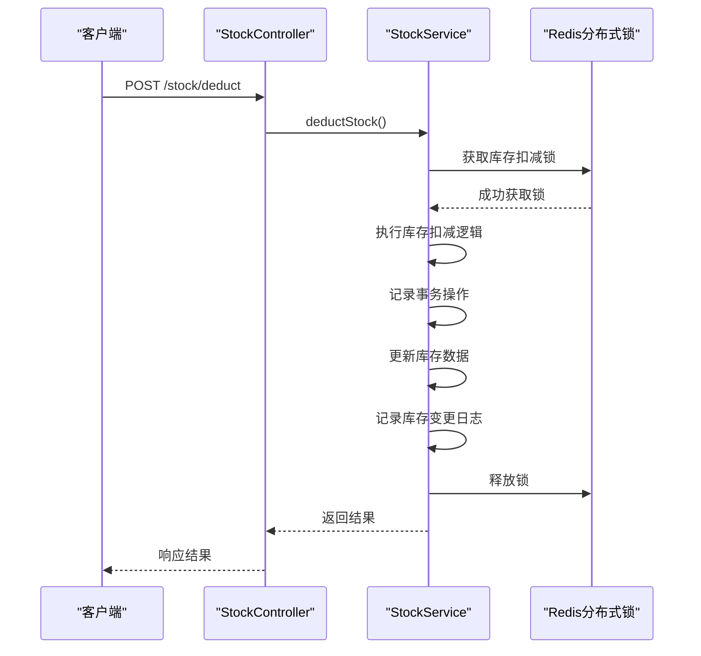
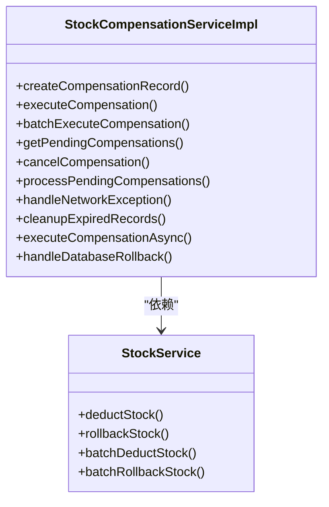
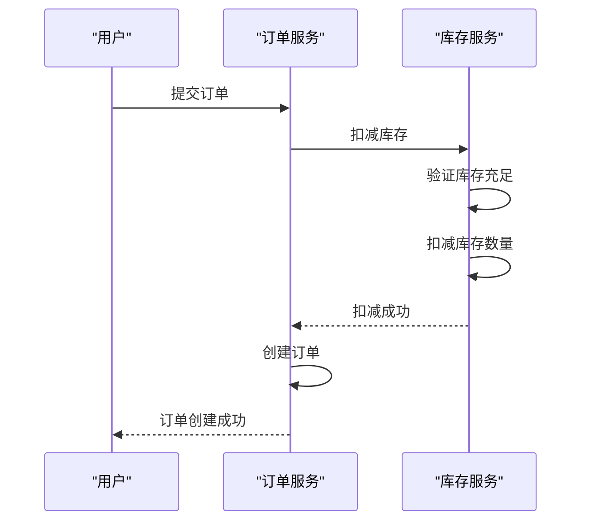
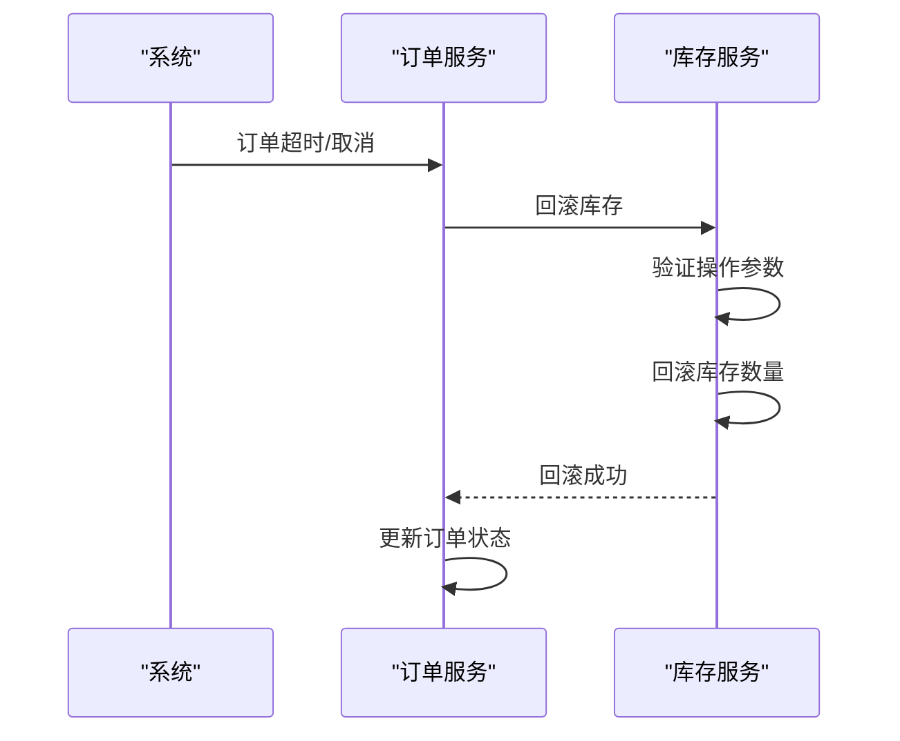

# 库存操作API

<cite>
**Referenced Files in This Document**   
- [StockController.java](file://backend/product-service/src/main/java/com/mall/product/controller/StockController.java)
- [StockServiceImpl.java](file://backend/product-service/src/main/java/com/mall/product/service/impl/StockServiceImpl.java)
- [StockService.java](file://backend/product-service/src/main/java/com/mall/product/service/StockService.java)
- [StockCompensationServiceImpl.java](file://backend/product-service/src/main/java/com/mall/product/service/impl/StockCompensationServiceImpl.java)
</cite>

## 目录
1. [简介](#简介)
2. [核心接口](#核心接口)
3. [事务性保障机制](#事务性保障机制)
4. [幂等性设计](#幂等性设计)
5. [使用场景示例](#使用场景示例)
6. [高并发最佳实践](#高并发最佳实践)
7. [异常处理](#异常处理)

## 简介
本API文档详细描述了库存管理系统中的核心操作接口，包括库存扣减、回滚、批量操作等。这些接口是电商系统中订单处理、库存管理的关键组成部分，确保了库存数据的准确性和一致性。

库存操作API通过`StockController`提供HTTP端点，实现了`StockService`接口定义的功能。系统采用分布式锁、乐观锁和事务管理等技术，确保在高并发场景下的数据安全和操作可靠性。

**Section sources**
- [StockController.java](file://backend/product-service/src/main/java/com/mall/product/controller/StockController.java#L1-L272)
- [StockService.java](file://backend/product-service/src/main/java/com/mall/product/service/StockService.java#L1-L229)

## 核心接口

### 库存扣减接口
#### HTTP方法
`POST /stock/deduct`

#### 请求参数
| 参数名 | 类型 | 必填 | 说明 |
|--------|------|------|------|
| productId | Long | 是 | 商品ID |
| skuId | Long | 否 | SKU ID（可为空，表示操作商品库存）|
| quantity | Integer | 是 | 扣减数量 |
| orderNo | String | 是 | 订单号 |
| operatorId | Long | 否 | 操作员ID（默认为1）|

#### 请求体
无（使用查询参数）

#### 响应格式
```json
{
  "code": 200,
  "message": "库存扣减成功",
  "data": {
    "success": true,
    "message": "扣减成功",
    "beforeStock": 100,
    "afterStock": 99,
    "logId": 123456789
  },
  "success": true
}
```

#### 错误码
- `500`: 库存扣减失败，系统繁忙，请稍后重试
- `500`: 商品ID不能为空
- `500`: 扣减数量必须大于0
- `500`: 订单号不能为空
- `500`: 库存不足，当前库存: X

**Section sources**
- [StockController.java](file://backend/product-service/src/main/java/com/mall/product/controller/StockController.java#L80-L100)
- [StockServiceImpl.java](file://backend/product-service/src/main/java/com/mall/product/service/impl/StockServiceImpl.java#L167-L242)

### 库存回滚接口
#### HTTP方法
`POST /stock/rollback`

#### 请求参数
| 参数名 | 类型 | 必填 | 说明 |
|--------|------|------|------|
| productId | Long | 是 | 商品ID |
| skuId | Long | 否 | SKU ID（可为空，表示操作商品库存）|
| quantity | Integer | 是 | 回滚数量 |
| orderNo | String | 是 | 订单号 |
| operatorId | Long | 否 | 操作员ID（默认为1）|

#### 请求体
无（使用查询参数）

#### 响应格式
```json
{
  "code": 200,
  "message": "库存回滚成功",
  "data": {
    "success": true,
    "message": "回滚成功",
    "beforeStock": 99,
    "afterStock": 100,
    "logId": 123456790
  },
  "success": true
}
```

#### 错误码
- `500`: 库存回滚失败，系统繁忙，请稍后重试
- `500`: 商品ID不能为空
- `500`: 回滚数量必须大于0
- `500`: 订单号不能为空

**Section sources**
- [StockController.java](file://backend/product-service/src/main/java/com/mall/product/controller/StockController.java#L112-L132)
- [StockServiceImpl.java](file://backend/product-service/src/main/java/com/mall/product/service/impl/StockServiceImpl.java#L257-L332)

### 批量库存扣减接口
#### HTTP方法
`POST /stock/batch/deduct`

#### 请求参数
无

#### 请求体
```json
[
  {
    "productId": 1,
    "skuId": 11,
    "quantity": 1,
    "orderNo": "ORDER20250121001",
    "operatorId": 1
  },
  {
    "productId": 2,
    "skuId": 21,
    "quantity": 2,
    "orderNo": "ORDER20250121001",
    "operatorId": 1
  }
]
```

#### 响应格式
```json
{
  "code": 200,
  "message": "批量库存扣减成功",
  "data": {
    "success": true,
    "message": "批量扣减完成，成功: 2, 失败: 0",
    "totalCount": 2,
    "successCount": 2,
    "failCount": 0,
    "results": [
      {
        "success": true,
        "message": "扣减成功",
        "beforeStock": 100,
        "afterStock": 99,
        "logId": 123456789
      },
      {
        "success": true,
        "message": "扣减成功",
        "beforeStock": 80,
        "afterStock": 78,
        "logId": 123456790
      }
    ]
  },
  "success": true
}
```

#### 错误码
- `500`: 批量库存扣减失败，系统繁忙，请稍后重试
- `500`: 操作列表不能为空
- `500`: 第X个操作对象为空
- `500`: 第X个操作的商品ID为空
- `500`: 第X个操作的数量无效
- `500`: 第X个操作的订单号为空

**Section sources**
- [StockController.java](file://backend/product-service/src/main/java/com/mall/product/controller/StockController.java#L140-L156)
- [StockServiceImpl.java](file://backend/product-service/src/main/java/com/mall/product/service/impl/StockServiceImpl.java#L343-L466)

### 批量库存回滚接口
#### HTTP方法
`POST /stock/batch/rollback`

#### 请求参数
无

#### 请求体
```json
[
  {
    "productId": 1,
    "skuId": 11,
    "quantity": 1,
    "orderNo": "ORDER20250121001",
    "operatorId": 1
  },
  {
    "productId": 2,
    "skuId": 21,
    "quantity": 2,
    "orderNo": "ORDER20250121001",
    "operatorId": 1
  }
]
```

#### 响应格式
```json
{
  "code": 200,
  "message": "批量库存回滚成功",
  "data": {
    "success": true,
    "message": "批量回滚完成，成功: 2, 失败: 0",
    "totalCount": 2,
    "successCount": 2,
    "failCount": 0,
    "results": [
      {
        "success": true,
        "message": "回滚成功",
        "beforeStock": 99,
        "afterStock": 100,
        "logId": 123456791
      },
      {
        "success": true,
        "message": "回滚成功",
        "beforeStock": 78,
        "afterStock": 80,
        "logId": 123456792
      }
    ]
  },
  "success": true
}
```

#### 错误码
- `500`: 批量库存回滚失败，系统繁忙，请稍后重试

**Section sources**
- [StockController.java](file://backend/product-service/src/main/java/com/mall/product/controller/StockController.java#L164-L180)
- [StockServiceImpl.java](file://backend/product-service/src/main/java/com/mall/product/service/impl/StockServiceImpl.java#L471-L511)

## 事务性保障机制
库存操作API通过多层次的事务管理机制确保操作的原子性和一致性：

1. **数据库事务**：使用Spring的`@Transactional`注解，确保每个库存操作都在数据库事务中执行，支持回滚。

2. **分布式锁**：在库存扣减和回滚操作中，使用Redis分布式锁防止并发操作导致的数据不一致问题。

3. **事务回滚记录**：在事务执行过程中，记录操作信息，用于异常情况下的补偿和回滚。

4. **批量操作原子性**：批量库存扣减操作采用"全部成功或全部失败"的策略，当任何一个操作失败时，会自动回滚之前成功的操作。



**Diagram sources**
- [StockController.java](file://backend/product-service/src/main/java/com/mall/product/controller/StockController.java#L80-L100)
- [StockServiceImpl.java](file://backend/product-service/src/main/java/com/mall/product/service/impl/StockServiceImpl.java#L167-L242)

**Section sources**
- [StockServiceImpl.java](file://backend/product-service/src/main/java/com/mall/product/service/impl/StockServiceImpl.java#L167-L242)

## 幂等性设计
库存操作API通过以下机制确保操作的幂等性：

1. **订单号绑定**：每个库存操作都与订单号绑定，确保同一订单的重复操作不会导致库存重复扣减。

2. **事务ID记录**：利用Spring事务管理器的事务ID，记录每个事务的操作，防止重复执行。

3. **分布式锁**：使用Redis分布式锁，确保同一商品的并发操作按顺序执行。

4. **补偿机制**：通过`StockCompensationService`实现分布式事务补偿，确保在服务间调用失败时能够进行补偿操作。



**Diagram sources**
- [StockCompensationServiceImpl.java](file://backend/product-service/src/main/java/com/mall/product/service/impl/StockCompensationServiceImpl.java#L35-L518)
- [StockService.java](file://backend/product-service/src/main/java/com/mall/product/service/StockService.java#L17-L229)

**Section sources**
- [StockCompensationServiceImpl.java](file://backend/product-service/src/main/java/com/mall/product/service/impl/StockCompensationServiceImpl.java#L35-L518)

## 使用场景示例

### 订单创建时的库存锁定
当用户创建订单时，系统需要锁定相应商品的库存，防止超卖。



**Diagram sources**
- [StockServiceImpl.java](file://backend/product-service/src/main/java/com/mall/product/service/impl/StockServiceImpl.java#L167-L242)

### 订单取消后的库存释放
当订单被取消或支付超时时，系统需要释放之前锁定的库存。



**Diagram sources**
- [StockServiceImpl.java](file://backend/product-service/src/main/java/com/mall/product/service/impl/StockServiceImpl.java#L257-L332)

**Section sources**
- [StockServiceImpl.java](file://backend/product-service/src/main/java/com/mall/product/service/impl/StockServiceImpl.java#L167-L332)

## 高并发最佳实践
在高并发场景下，库存操作需要特别注意以下几点：

1. **合理使用锁机制**：优先使用Redis分布式锁，避免数据库行锁导致的性能瓶颈。

2. **乐观锁更新**：对于库存更新操作，使用版本号或时间戳实现乐观锁，减少锁竞争。

3. **批量操作优化**：将多个小操作合并为批量操作，减少网络开销和数据库交互次数。

4. **缓存策略**：合理使用缓存，减少对数据库的直接访问。

5. **限流降级**：在系统压力过大时，实施限流和降级策略，保护核心服务。

**Section sources**
- [StockServiceImpl.java](file://backend/product-service/src/main/java/com/mall/product/service/impl/StockServiceImpl.java#L167-L511)

## 异常处理
库存操作API对各种异常情况进行了完善的处理：

### 库存不足处理
当库存不足时，系统会返回明确的错误信息，前端可以根据此信息提示用户。

```json
{
  "code": 500,
  "message": "库存不足，当前库存: 5",
  "data": null,
  "success": false
}
```

### 超时处理
系统设置了合理的超时时间，当操作超时时会自动释放锁，避免死锁。

### 网络异常处理
通过`StockCompensationService`的网络异常处理机制，对网络异常情况进行重试和补偿。

### 分布式事务失败处理
当分布式事务失败时，系统会创建补偿记录，通过定时任务进行补偿操作。

**Section sources**
- [StockServiceImpl.java](file://backend/product-service/src/main/java/com/mall/product/service/impl/StockServiceImpl.java#L167-L332)
- [StockCompensationServiceImpl.java](file://backend/product-service/src/main/java/com/mall/product/service/impl/StockCompensationServiceImpl.java#L35-L518)