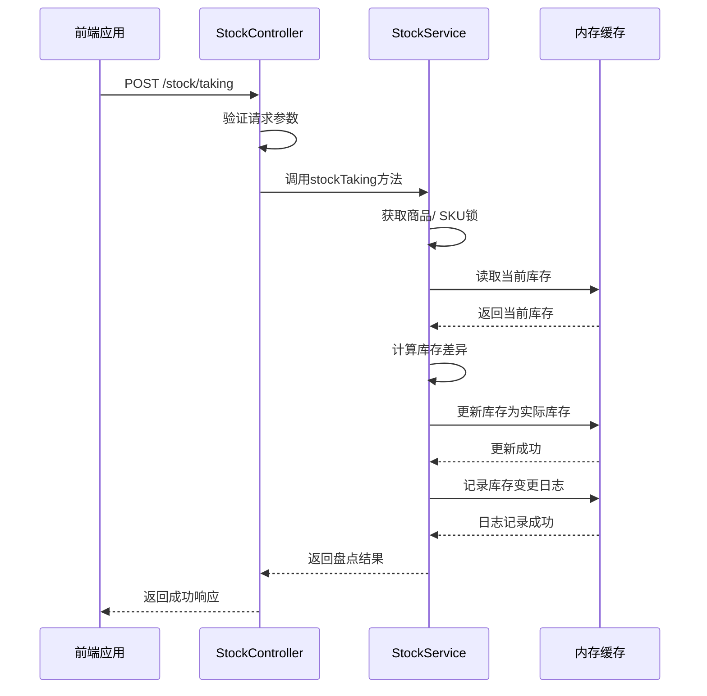

# 库存日志API

<cite>
**Referenced Files in This Document**   
- [StockController.java](file://backend/product-service/src/main/java/com/mall/product/controller/StockController.java)
- [StockService.java](file://backend/product-service/src/main/java/com/mall/product/service/StockService.java)
- [StockLog.java](file://backend/product-service/src/main/java/com/mall/product/domain/entity/StockLog.java)
- [StockServiceImpl.java](file://backend/product-service/src/main/java/com/mall/product/service/impl/StockServiceImpl.java)
- [Product.java](file://backend/product-service/src/main/java/com/mall/product/domain/entity/Product.java)
</cite>

## 目录
1. [简介](#简介)
2. [库存变更日志查询](#库存变更日志查询)
3. [库存盘点功能](#库存盘点功能)
4. [使用示例](#使用示例)
5. [审计要求](#审计要求)

## 简介

库存日志API为系统提供了完整的库存变更追踪和实物盘点功能，是实现库存审计、差异分析和对账的核心组件。该API通过`StockController`中的`getStockLogs`和`stockTaking`端点，实现了对库存变更历史的全面记录和实物盘点操作。

API设计遵循RESTful原则，提供了分页查询、多维度过滤和详细的审计日志功能。系统支持商品级别和SKU级别的库存管理，能够精确追踪每个库存变动的详细信息，包括变更前后的库存数量、变更原因、操作人员和关联单据等。

库存变更日志采用内存缓存机制存储，确保了查询性能，同时通过事务性操作保证了数据一致性。库存盘点功能实现了严格的并发控制，防止多用户同时操作同一商品导致的数据冲突。

**Section sources**
- [StockController.java](file://backend/product-service/src/main/java/com/mall/product/controller/StockController.java#L1-L272)
- [StockService.java](file://backend/product-service/src/main/java/com/mall/product/service/StockService.java#L1-L229)

## 库存变更日志查询

### 分页参数

库存变更日志查询接口提供标准的分页功能，支持以下参数：

| 参数 | 类型 | 必填 | 默认值 | 说明 |
|------|------|------|--------|------|
| `current` | Long | 否 | 1 | 当前页码，从1开始 |
| `size` | Long | 否 | 10 | 每页大小，最大支持100 |

分页参数遵循常见的分页模式，`current`表示当前请求的页码，`size`表示每页返回的记录数量。系统会根据这些参数对日志数据进行分页处理，返回指定范围内的记录。

### 过滤条件

日志查询支持多维度过滤，帮助用户快速定位特定的库存变更记录：

| 参数 | 类型 | 必填 | 说明 |
|------|------|------|------|
| `productId` | Long | 否 | 商品ID，用于查询特定商品的库存变更日志 |
| `skuId` | Long | 否 | SKU ID，用于查询特定SKU的库存变更日志 |

过滤条件采用可选参数设计，用户可以根据需要组合使用。当同时提供`productId`和`skuId`时，系统会精确匹配该商品的特定SKU变更记录；仅提供`productId`时，会返回该商品所有SKU的变更日志。

### 返回字段含义

库存变更日志的返回数据包含详细的变更信息，主要字段如下：

| 字段 | 类型 | 说明 |
|------|------|------|
| `records` | List | 分页数据列表，包含具体的库存变更记录 |
| `total` | Long | 总记录数，用于分页计算 |
| `current` | Long | 当前页码 |
| `size` | Long | 每页大小 |
| `pages` | Long | 总页数 |

每个库存变更记录（`StockLog`实体）包含以下详细信息：

| 字段 | 类型 | 说明 |
|------|------|------|
| `productId` | Long | 商品ID |
| `skuId` | Long | SKU ID（如果是SKU库存变更） |
| `oldStock` | Integer | 变更前库存 |
| `newStock` | Integer | 变更后库存 |
| `changeQuantity` | Integer | 变更数量（正数为入库，负数为出库） |
| `changeType` | String | 变更类型：1-入库，2-出库，3-调整，4-盘点 |
| `reason` | String | 变更原因 |
| `relatedOrderNo` | String | 关联单据号（订单号、入库单号等） |
| `operatorId` | Long | 操作人ID |
| `operatorName` | String | 操作人姓名 |
| `productName` | String | 商品名称（冗余字段） |
| `skuName` | String | SKU名称（冗余字段） |
| `createTime` | LocalDateTime | 创建时间 |

**Section sources**
- [StockController.java](file://backend/product-service/src/main/java/com/mall/product/controller/StockController.java#L183-L205)
- [StockServiceImpl.java](file://backend/product-service/src/main/java/com/mall/product/service/impl/StockServiceImpl.java#L516-L547)
- [StockLog.java](file://backend/product-service/src/main/java/com/mall/product/domain/entity/StockLog.java#L7-L79)

## 库存盘点功能

### 使用场景

库存盘点功能主要用于以下场景：

1. **定期盘点**：按照固定周期（如每月、每季度）对仓库库存进行实物清点，确保账实相符。
2. **临时盘点**：在发现库存异常、系统故障或重大操作后，进行临时盘点以验证库存准确性。
3. **交接盘点**：仓库管理人员交接时，进行盘点以明确责任。
4. **专项盘点**：对特定商品或SKU进行重点盘点，通常用于高价值商品或易损耗商品。

库存盘点是确保库存数据准确性的关键环节，通过将系统记录的库存数量与实际库存数量进行比对，可以及时发现并纠正差异。

### 操作流程

库存盘点操作遵循严格的流程，确保数据的准确性和一致性：



1. **发起请求**：前端应用通过POST请求调用`/stock/taking`接口，提供商品ID、实际库存数量等必要信息。
2. **参数验证**：控制器对请求参数进行基本验证，确保必填字段存在且格式正确。
3. **获取锁**：服务层使用`ReentrantLock`获取商品级别的锁，防止并发操作导致的数据冲突。
4. **执行盘点**：根据提供的实际库存数量更新系统库存，并记录详细的变更日志。
5. **返回结果**：将盘点结果返回给前端，包括操作是否成功、变更前后的库存数量等信息。

### 审计要求

库存盘点操作具有严格的审计要求，确保所有操作都有据可查：

1. **完整日志记录**：每次盘点操作都必须记录详细的变更日志，包括变更前后的库存数量、操作人员、操作时间和盘点原因。
2. **操作追溯**：所有盘点记录都与操作人员ID关联，确保操作可追溯到具体责任人。
3. **变更类型标识**：盘点操作的变更类型固定为"4"，便于与其他类型的库存变更（如销售出库、采购入库）区分。
4. **数据冗余**：在日志中存储商品名称和SKU名称等冗余信息，确保即使商品信息后续变更，历史记录仍能正确显示。
5. **事务一致性**：盘点操作在事务中执行，确保库存更新和日志记录的原子性，避免出现数据不一致的情况。

**Section sources**
- [StockController.java](file://backend/product-service/src/main/java/com/mall/product/controller/StockController.java#L208-L237)
- [StockServiceImpl.java](file://backend/product-service/src/main/java/com/mall/product/service/impl/StockServiceImpl.java#L549-L570)
- [StockService.java](file://backend/product-service/src/main/java/com/mall/product/service/StockService.java#L86-L95)

## 使用示例

### 库存变更历史查询

#### 查询特定商品的所有库存变更

```http
GET /stock/logs?productId=1001&current=1&size=20 HTTP/1.1
Host: api.example.com
```

此请求将返回商品ID为1001的所有库存变更记录，每页20条，返回第一页数据。可用于追踪该商品的完整库存变动轨迹。

#### 查询特定SKU的近期变更

```http
GET /stock/logs?productId=1001&skuId=2001&current=1&size=10 HTTP/1.1
Host: api.example.com
```

此请求精确查询商品1001的SKU 2001的库存变更记录，适用于对特定规格商品进行差异分析。

#### 查询所有库存变更（分页）

```http
GET /stock/logs?current=2&size=50 HTTP/1.1
Host: api.example.com
```

此请求返回系统中所有库存变更记录的第二页数据，每页50条，适用于全局库存审计。

### 实物盘点操作

#### 商品级别盘点

```http
POST /stock/taking HTTP/1.1
Host: api.example.com
Content-Type: application/x-www-form-urlencoded

productId=1001&actualStock=50&operatorId=1001&reason=月度盘点
```

此请求对商品ID为1001的商品进行盘点，将系统库存更新为实际清点的50件。操作由操作员1001执行，盘点原因为"月度盘点"。

#### SKU级别盘点

```http
POST /stock/taking HTTP/1.1
Host: api.example.com
Content-Type: application/x-www-form-urlencoded

productId=1001&skuId=2001&actualStock=25&operatorId=1001&reason=季度盘点
```

此请求对商品1001的特定SKU 2001进行盘点，精确更新该规格商品的库存数量，适用于多规格商品的精细化管理。

**Section sources**
- [StockController.java](file://backend/product-service/src/main/java/com/mall/product/controller/StockController.java#L191-L237)
- [StockServiceImpl.java](file://backend/product-service/src/main/java/com/mall/product/service/impl/StockServiceImpl.java#L920-L959)

## 审计要求

库存日志系统的审计要求贯穿于所有操作中，确保系统的透明性和可追溯性：

1. **全面记录**：所有库存变更，无论是正常业务操作（如销售出库）还是管理操作（如盘点调整），都必须记录在库存变更日志中。
2. **关键字段**：每条日志必须包含变更前后的库存数量、变更数量、变更类型、变更原因、操作人员和时间戳等关键信息。
3. **关联追溯**：通过`relatedOrderNo`字段关联到具体的业务单据（如订单号），实现库存变动与业务活动的关联追溯。
4. **权限控制**：只有具备相应权限的用户才能执行库存盘点等敏感操作，操作日志中记录操作人员ID，确保责任明确。
5. **数据完整性**：系统采用事务性操作，确保库存更新和日志记录的原子性，避免出现"只更新库存不记录日志"或"只记录日志不更新库存"的数据不一致情况。
6. **防并发控制**：通过商品级别的锁机制，防止多用户同时对同一商品进行盘点操作，确保数据一致性。

这些审计要求共同构成了一个完整的库存审计体系，为库存差异分析、对账和责任追溯提供了坚实的基础。

**Section sources**
- [StockLog.java](file://backend/product-service/src/main/java/com/mall/product/domain/entity/StockLog.java#L7-L79)
- [StockServiceImpl.java](file://backend/product-service/src/main/java/com/mall/product/service/impl/StockServiceImpl.java#L962-L978)