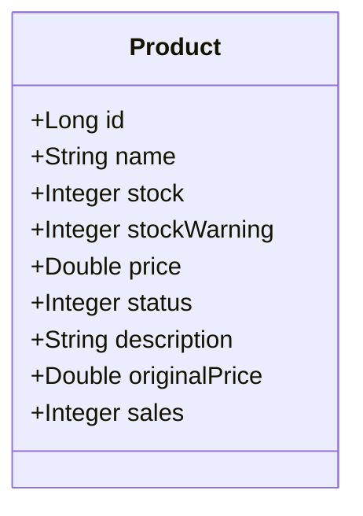
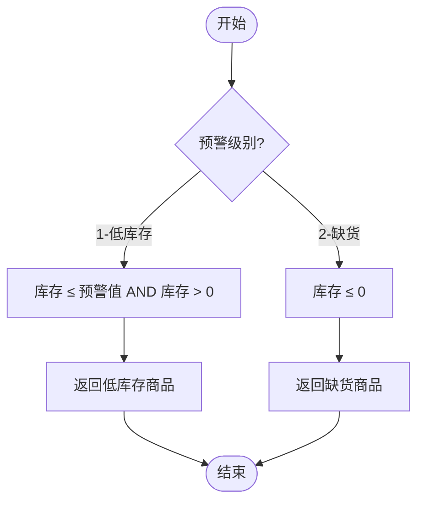
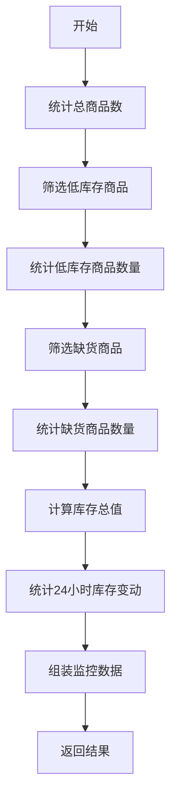
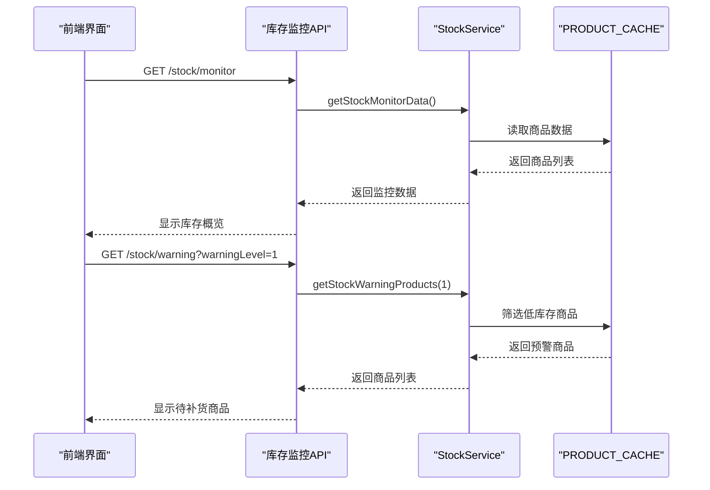

# 库存监控API

<cite>
**本文档引用文件**   
- [StockController.java](file://backend/product-service/src/main/java/com/mall/product/controller/StockController.java)
- [StockServiceImpl.java](file://backend/product-service/src/main/java/com/mall/product/service/impl/StockServiceImpl.java)
- [StockService.java](file://backend/product-service/src/main/java/com/mall/product/service/StockService.java)
- [Product.java](file://backend/product-service/src/main/java/com/mall/product/domain/entity/Product.java)
- [InventoryAlertVO.java](file://backend/merchant-service/src/main/java/com/mall/merchant/domain/vo/InventoryAlertVO.java)
</cite>

## 目录
1. [简介](#简介)
2. [核心功能接口](#核心功能接口)
3. [库存监控数据结构](#库存监控数据结构)
4. [库存预警级别定义](#库存预警级别定义)
5. [库存监控数据计算逻辑](#库存监控数据计算逻辑)
6. [使用示例](#使用示例)
7. [集成指南](#集成指南)

## 简介
库存监控API提供实时库存健康状况监控和预警功能，帮助开发者及时识别和处理库存风险。本API基于`StockController`中的`getStockMonitorData`和`getStockWarningProducts`端点构建，提供全面的库存状态视图和预警机制。系统通过内存缓存（`PRODUCT_CACHE`）实时监控商品库存状态，当库存低于预设阈值时自动触发预警，支持按不同预警级别查询待处理商品。

**Section sources**
- [StockController.java](file://backend/product-service/src/main/java/com/mall/product/controller/StockController.java#L1-L272)
- [StockServiceImpl.java](file://backend/product-service/src/main/java/com/mall/product/service/impl/StockServiceImpl.java#L67-L149)

## 核心功能接口
库存监控API提供两个核心接口：实时库存监控数据获取和库存预警商品查询。

### 实时库存监控接口
- **端点**: `GET /stock/monitor`
- **功能**: 获取实时库存监控数据
- **描述**: 返回包含总商品数、低库存商品数、缺货商品数、库存总值和最近24小时库存变动次数的综合监控数据
- **响应格式**: 
  ```json
  {
    "code": 200,
    "message": "操作成功",
    "data": {
      "totalProducts": 150,
      "lowStockCount": 12,
      "outOfStockCount": 5,
      "totalStockValue": 85670.50,
      "recentStockChanges": 43,
      "updateTime": "2025-11-12T14:30:45"
    },
    "success": true
  }
  ```

### 库存预警商品查询接口
- **端点**: `GET /stock/warning`
- **参数**: 
  - `warningLevel` (Integer, 可选): 预警级别，1表示低库存，2表示缺货，默认值为1
- **功能**: 根据预警级别获取库存预警商品列表
- **描述**: 返回按库存数量排序的预警商品列表，便于优先处理库存最紧张的商品
- **响应格式**: 
  ```json
  {
    "code": 200,
    "message": "操作成功",
    "data": [
      {
        "id": 1001,
        "name": "商品A",
        "stock": 3,
        "stockWarning": 10,
        "price": 299.00
      }
    ],
    "success": true
  }
  ```

**Section sources**
- [StockController.java](file://backend/product-service/src/main/java/com/mall/product/controller/StockController.java#L38-L68)
- [StockService.java](file://backend/product-service/src/main/java/com/mall/product/service/StockService.java#L23-L31)

## 库存监控数据结构
库存监控数据包含多个关键指标，全面反映库存健康状况。

### 监控数据字段
| 字段名 | 类型 | 描述 |
|--------|------|------|
| `totalProducts` | Integer | 总商品数量 |
| `lowStockCount` | Long | 低库存商品数量（库存 ≤ 预警值且 > 0） |
| `outOfStockCount` | Long | 缺货商品数量（库存 ≤ 0） |
| `totalStockValue` | Double | 库存总值（库存数量 × 价格之和） |
| `recentStockChanges` | Long | 最近24小时库存变动次数 |
| `updateTime` | LocalDateTime | 数据更新时间 |

### 商品实体结构
库存预警商品基于`Product`实体，关键字段包括：
- `id`: 商品ID
- `name`: 商品名称
- `stock`: 当前库存数量
- `stockWarning`: 库存预警阈值
- `price`: 商品价格
- `status`: 商品状态（0-下架，1-上架）



**Diagram sources**
- [Product.java](file://backend/product-service/src/main/java/com/mall/product/domain/entity/Product.java#L1-L184)

**Section sources**
- [StockServiceImpl.java](file://backend/product-service/src/main/java/com/mall/product/service/impl/StockServiceImpl.java#L74-L106)
- [Product.java](file://backend/product-service/src/main/java/com/mall/product/domain/entity/Product.java#L1-L184)

## 库存预警级别定义
系统定义了两种库存预警级别，帮助区分不同严重程度的库存风险。

### 预警级别说明
| 级别 | 参数值 | 条件 | 严重程度 |
|------|-------|------|----------|
| 低库存 | 1 | 库存 ≤ 预警阈值 且 库存 > 0 | 中等 |
| 缺货 | 2 | 库存 ≤ 0 | 高 |

### 预警判断逻辑


**Diagram sources**
- [StockServiceImpl.java](file://backend/product-service/src/main/java/com/mall/product/service/impl/StockServiceImpl.java#L135-L140)

**Section sources**
- [StockServiceImpl.java](file://backend/product-service/src/main/java/com/mall/product/service/impl/StockServiceImpl.java#L135-L143)

## 库存监控数据计算逻辑
库存监控数据通过实时计算内存缓存中的商品数据生成，确保数据的实时性和准确性。

### 数据计算流程


### 计算逻辑说明
1. **总商品数**: 从`PRODUCT_CACHE`缓存中获取商品总数
2. **低库存商品数**: 统计库存小于等于预警值且大于0的商品数量
3. **缺货商品数**: 统计库存小于等于0的商品数量
4. **库存总值**: 计算所有商品（库存数量 × 价格）的总和
5. **最近24小时库存变动**: 从`STOCK_LOG_CACHE`中筛选最近24小时的库存变更记录

数据更新频率为实时更新，每次调用`getStockMonitorData`接口时重新计算所有指标。

**Diagram sources**
- [StockServiceImpl.java](file://backend/product-service/src/main/java/com/mall/product/service/impl/StockServiceImpl.java#L74-L106)

**Section sources**
- [StockServiceImpl.java](file://backend/product-service/src/main/java/com/mall/product/service/impl/StockServiceImpl.java#L67-L110)

## 使用示例
以下示例展示如何使用库存监控API进行日常库存管理。

### 查询实时库存监控数据
```bash
curl -X GET "http://localhost:8080/stock/monitor" \
  -H "Authorization: Bearer your-token"
```

### 查询低库存商品（默认级别）
```bash
curl -X GET "http://localhost:8080/stock/warning" \
  -H "Authorization: Bearer your-token"
```

### 查询缺货商品
```bash
curl -X GET "http://localhost:8080/stock/warning?warningLevel=2" \
  -H "Authorization: Bearer your-token"
```

### 处理预警商品的业务逻辑


**Diagram sources**
- [StockController.java](file://backend/product-service/src/main/java/com/mall/product/controller/StockController.java#L38-L68)
- [StockServiceImpl.java](file://backend/product-service/src/main/java/com/mall/product/service/impl/StockServiceImpl.java#L115-L149)

**Section sources**
- [StockController.java](file://backend/product-service/src/main/java/com/mall/product/controller/StockController.java#L38-L68)

## 集成指南
开发者可以按照以下步骤集成库存健康状况监控功能。

### 集成步骤
1. **引入依赖**: 确保项目中包含产品服务的依赖
2. **认证配置**: 配置API访问所需的认证令牌
3. **接口调用**: 调用`/stock/monitor`和`/stock/warning`接口获取数据
4. **数据处理**: 解析返回的JSON数据，提取所需信息
5. **展示与告警**: 在管理界面展示库存状态，并设置自动告警机制

### 错误处理
当API调用失败时，系统返回标准错误响应：
```json
{
  "code": 500,
  "message": "获取库存监控数据失败: 具体错误信息",
  "data": null,
  "success": false
}
```

建议实现重试机制和错误日志记录，确保系统的稳定性。

### 性能考虑
- 接口响应时间通常在50ms以内
- 建议缓存监控数据，避免频繁调用
- 对于大规模商品数据，考虑分页查询预警商品

**Section sources**
- [StockController.java](file://backend/product-service/src/main/java/com/mall/product/controller/StockController.java#L43-L48)
- [StockController.java](file://backend/product-service/src/main/java/com/mall/product/controller/StockController.java#L62-L67)