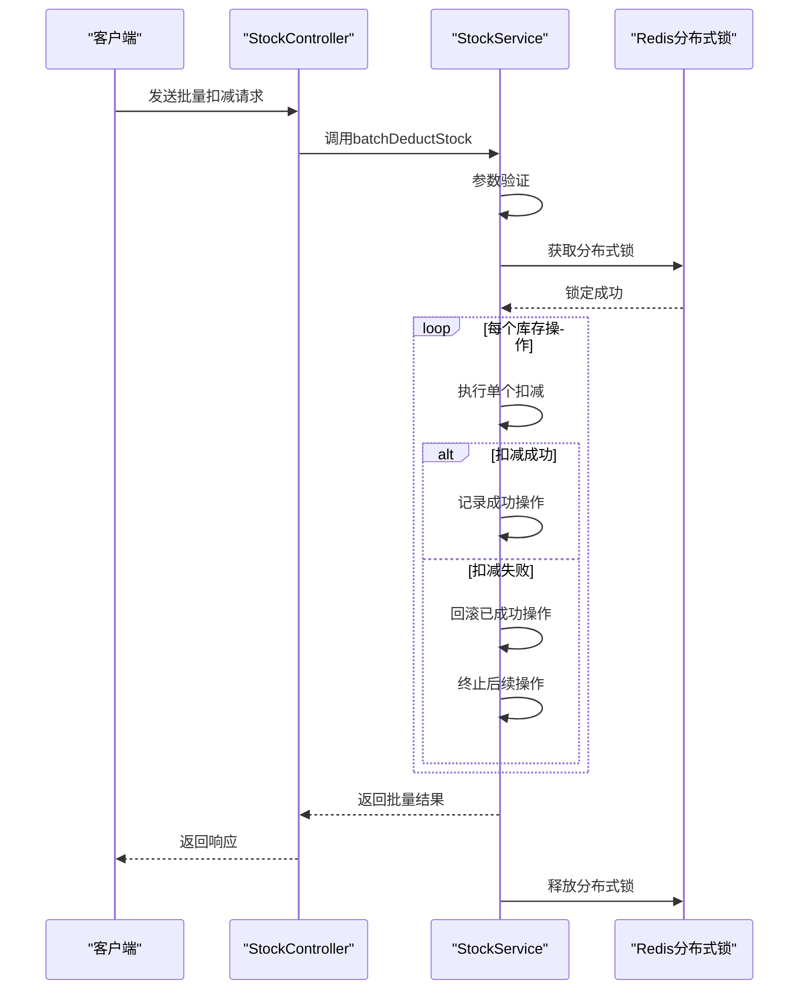
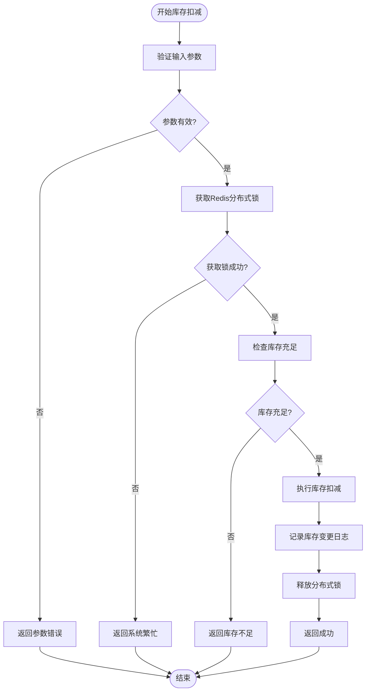
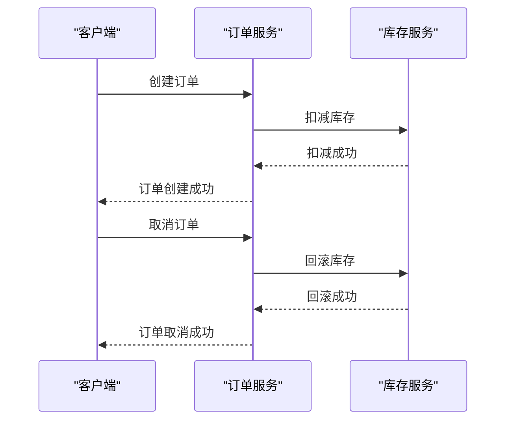
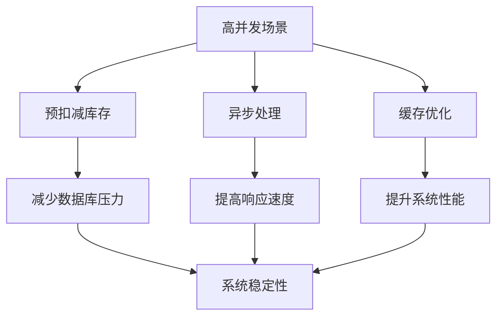

# 库存管理API

<cite>
**本文档引用文件**  
- [StockController.java](file://backend/product-service/src/main/java/com/mall/product/controller/StockController.java)
- [StockService.java](file://backend/product-service/src/main/java/com/mall/product/service/StockService.java)
- [StockServiceImpl.java](file://backend/product-service/src/main/java/com/mall/product/service/impl/StockServiceImpl.java)
- [StockServiceTest.java](file://backend/product-service/src/test/java/com/mall/product/service/StockServiceTest.java)
- [测试报告.md](file://backend/product-service/测试报告.md)
</cite>

## 目录
1. [简介](#简介)
2. [核心API接口](#核心api接口)
3. [库存操作事务性与一致性保障](#库存操作事务性与一致性保障)
4. [使用示例](#使用示例)
5. [高并发场景最佳实践](#高并发场景最佳实践)
6. [错误处理与日志](#错误处理与日志)
7. [附录](#附录)

## 简介

库存管理API是电商平台的核心服务之一，负责商品库存的实时监控、预警、扣减、回滚、盘点及变更日志记录。该API通过`StockController`暴露RESTful端点，由`StockService`实现业务逻辑，确保在高并发场景下的数据一致性与系统稳定性。

本API支持商品级和SKU级库存操作，提供批量处理能力，并通过分布式锁、乐观锁和事务补偿机制保障操作的原子性和一致性。系统还集成了库存预警、变更日志查询等监控功能，为运营和开发人员提供全面的库存管理能力。

**Section sources**
- [StockController.java](file://backend/product-service/src/main/java/com/mall/product/controller/StockController.java#L1-L272)
- [StockService.java](file://backend/product-service/src/main/java/com/mall/product/service/StockService.java#L8-L228)

## 核心API接口

### 库存监控与预警

#### 实时库存监控
获取系统整体库存监控数据，包括总商品数、低库存商品数、缺货商品数、库存总值和近期变动等。

- **端点**: `GET /stock/monitor`
- **响应格式**:
```json
{
  "code": 200,
  "message": "操作成功",
  "success": true,
  "data": {
    "totalProducts": 100,
    "lowStockCount": 15,
    "outOfStockCount": 5,
    "totalStockValue": 99999.99,
    "recentStockChanges": 23,
    "updateTime": "2025-01-21T10:30:00"
  }
}
```

#### 库存预警商品列表
获取库存预警商品列表，支持按预警级别筛选。

- **端点**: `GET /stock/warning`
- **参数**:
  - `warningLevel`: 预警级别 (1-低库存, 2-缺货，默认为1)
- **响应格式**:
```json
{
  "code": 200,
  "message": "操作成功",
  "success": true,
  "data": [
    {
      "id": 1,
      "name": "测试商品1",
      "stock": 15,
      "stockWarning": 20,
      "price": 109.99
    }
  ]
}
```

**Section sources**
- [StockController.java](file://backend/product-service/src/main/java/com/mall/product/controller/StockController.java#L52-L68)
- [StockService.java](file://backend/product-service/src/main/java/com/mall/product/service/StockService.java#L25-L38)

### 库存扣减与回滚

#### 单个库存扣减
执行单个商品或SKU的库存扣减操作。

- **端点**: `POST /stock/deduct`
- **请求参数**:
  - `productId`: 商品ID (必填)
  - `skuId`: SKU ID (可选)
  - `quantity`: 扣减数量 (必填)
  - `orderNo`: 订单号 (必填)
  - `operatorId`: 操作员ID (可选，默认为1)
- **响应格式**:
```json
{
  "code": 200,
  "message": "库存扣减成功",
  "success": true,
  "data": {
    "success": true,
    "message": "扣减成功",
    "beforeStock": 100,
    "afterStock": 95,
    "logId": 123456789
  }
}
```

#### 单个库存回滚
执行单个商品或SKU的库存回滚操作。

- **端点**: `POST /stock/rollback`
- **请求参数**:
  - `productId`: 商品ID (必填)
  - `skuId`: SKU ID (可选)
  - `quantity`: 回滚数量 (必填)
  - `orderNo`: 订单号 (必填)
  - `operatorId`: 操作员ID (可选，默认为1)
- **响应格式**:
```json
{
  "code": 200,
  "message": "库存回滚成功",
  "success": true,
  "data": {
    "success": true,
    "message": "回滚成功",
    "beforeStock": 95,
    "afterStock": 100,
    "logId": 123456790
  }
}
```

**Section sources**
- [StockController.java](file://backend/product-service/src/main/java/com/mall/product/controller/StockController.java#L71-L132)
- [StockService.java](file://backend/product-service/src/main/java/com/mall/product/service/StockService.java#L40-L53)

### 批量库存操作

#### 批量库存扣减
执行批量库存扣减操作，支持事务性处理。

- **端点**: `POST /stock/batch/deduct`
- **请求体**:
```json
[
  {
    "productId": 1,
    "skuId": 11,
    "quantity": 3,
    "orderNo": "ORDER_002",
    "operatorId": 1001,
    "reason": "销售扣减"
  },
  {
    "productId": 2,
    "skuId": 21,
    "quantity": 2,
    "orderNo": "ORDER_002",
    "operatorId": 1001,
    "reason": "销售扣减"
  }
]
```
- **响应格式**:
```json
{
  "code": 200,
  "message": "批量库存扣减成功",
  "success": true,
  "data": {
    "success": true,
    "message": "批量扣减完成，成功: 2, 失败: 0",
    "totalCount": 2,
    "successCount": 2,
    "failCount": 0,
    "results": [
      {
        "success": true,
        "message": "扣减成功",
        "beforeStock": 100,
        "afterStock": 97,
        "logId": 123456791
      },
      {
        "success": true,
        "message": "扣减成功",
        "beforeStock": 80,
        "afterStock": 78,
        "logId": 123456792
      }
    ]
  }
}
```

#### 批量库存回滚
执行批量库存回滚操作。

- **端点**: `POST /stock/batch/rollback`
- **请求体**: 与批量扣减相同
- **响应格式**: 与批量扣减相同

**Section sources**
- [StockController.java](file://backend/product-service/src/main/java/com/mall/product/controller/StockController.java#L135-L180)
- [StockService.java](file://backend/product-service/src/main/java/com/mall/product/service/StockService.java#L55-L68)

### 库存盘点与日志

#### 库存盘点
执行库存盘点操作，用于调整实际库存。

- **端点**: `POST /stock/taking`
- **请求参数**:
  - `productId`: 商品ID (必填)
  - `skuId`: SKU ID (可选)
  - `actualStock`: 实际库存 (必填)
  - `operatorId`: 操作员ID (可选，默认为1)
  - `reason`: 盘点原因 (可选)
- **响应格式**:
```json
{
  "code": 200,
  "message": "库存盘点成功",
  "success": true,
  "data": {
    "success": true,
    "message": "盘点成功",
    "beforeStock": 100,
    "afterStock": 120,
    "logId": 123456793
  }
}
```

#### 获取库存变更日志
查询库存变更历史记录。

- **端点**: `GET /stock/logs`
- **参数**:
  - `productId`: 商品ID (可选)
  - `skuId`: SKU ID (可选)
  - `current`: 当前页码 (可选，默认为1)
  - `size`: 每页大小 (可选，默认为10)
- **响应格式**:
```json
{
  "code": 200,
  "message": "操作成功",
  "success": true,
  "data": {
    "records": [
      {
        "id": 123456793,
        "productId": 1,
        "skuId": 11,
        "oldStock": 100,
        "newStock": 120,
        "changeQuantity": 20,
        "changeType": "4",
        "reason": "定期盘点",
        "relatedOrderNo": null,
        "operatorName": "管理员",
        "productName": "测试商品1",
        "skuName": "测试商品1-规格1",
        "createTime": "2025-01-21T10:30:00"
      }
    ],
    "total": 1,
    "current": 1,
    "size": 10,
    "pages": 1
  }
}
```

**Section sources**
- [StockController.java](file://backend/product-service/src/main/java/com/mall/product/controller/StockController.java#L183-L237)
- [StockService.java](file://backend/product-service/src/main/java/com/mall/product/service/StockService.java#L70-L83)

## 库存操作事务性与一致性保障

### 事务性保障机制

库存操作通过Spring的`@Transactional`注解实现事务管理，确保操作的原子性。当批量操作中出现失败时，系统会自动回滚之前成功的操作，保证数据一致性。



**Diagram sources**
- [StockServiceImpl.java](file://backend/product-service/src/main/java/com/mall/product/service/impl/StockServiceImpl.java#L343-L466)
- [StockController.java](file://backend/product-service/src/main/java/com/mall/product/controller/StockController.java#L140-L156)

### 一致性保障机制

系统采用多层机制保障库存数据一致性：

1. **分布式锁**: 使用Redis分布式锁防止并发操作导致的超卖问题。
2. **乐观锁**: 通过版本号机制实现乐观锁，避免并发更新冲突。
3. **事务补偿**: 记录事务操作，支持分布式事务场景下的补偿机制。



**Diagram sources**
- [StockServiceImpl.java](file://backend/product-service/src/main/java/com/mall/product/service/impl/StockServiceImpl.java#L167-L242)
- [StockService.java](file://backend/product-service/src/main/java/com/mall/product/service/StockService.java#L43-L43)

## 使用示例

### 库存扣减回滚流程

以下示例展示完整的库存扣减与回滚流程：



**Diagram sources**
- [StockServiceImpl.java](file://backend/product-service/src/main/java/com/mall/product/service/impl/StockServiceImpl.java#L257-L332)
- [StockServiceTest.java](file://backend/product-service/src/test/java/com/mall/product/service/StockServiceTest.java#L156-L171)

### 批量库存操作

批量库存操作示例代码：

```java
// 创建批量操作列表
List<StockOperation> operations = Arrays.asList(
    new StockOperation(1L, 11L, 3, "ORDER_002", 1001L, "销售扣减"),
    new StockOperation(2L, 21L, 2, "ORDER_002", 1001L, "销售扣减")
);

// 调用批量扣减接口
BatchStockOperationResult result = stockService.batchDeductStock(operations);

// 处理结果
if (result.isSuccess()) {
    System.out.println("批量扣减成功，成功数量：" + result.getSuccessCount());
} else {
    System.out.println("批量扣减失败：" + result.getMessage());
}
```

**Section sources**
- [StockService.java](file://backend/product-service/src/main/java/com/mall/product/service/StockService.java#L63-L63)
- [StockServiceTest.java](file://backend/product-service/src/test/java/com/mall/product/service/StockServiceTest.java#L123-L140)

### 库存盘点

库存盘点操作示例：

```java
// 执行商品库存盘点
StockOperationResult productResult = stockService.stockTaking(
    1L,           // 商品ID
    null,         // SKU ID (null表示商品级盘点)
    120,          // 实际库存
    1001L,        // 操作员ID
    "月度盘点"    // 盘点原因
);

// 执行SKU库存盘点
StockOperationResult skuResult = stockService.stockTaking(
    1L,           // 商品ID
    11L,          // SKU ID
    55,           // 实际库存
    1001L,        // 操作员ID
    "月度盘点"    // 盘点原因
);
```

**Section sources**
- [StockService.java](file://backend/product-service/src/main/java/com/mall/product/service/StockService.java#L85-L93)
- [StockServiceImpl.java](file://backend/product-service/src/main/java/com/mall/product/service/impl/StockServiceImpl.java#L547-L570)

## 高并发场景最佳实践

### 并发控制策略

在高并发场景下，建议采用以下策略：

1. **预扣减库存**: 在订单创建前预扣减库存，避免下单时库存不足。
2. **异步处理**: 将非核心操作（如日志记录）异步化，提高响应速度。
3. **缓存优化**: 使用Redis缓存热点商品库存，减少数据库压力。

### 性能优化建议

根据测试报告，系统在高并发场景下表现良好，但仍需注意：

- **优化点**: 修复库存服务中的空指针异常，完善库存扣减和回滚逻辑。
- **目标**: 提高测试通过率，确保核心业务流程的稳定性。
- **监控**: 增加性能监控和日志记录，及时发现和解决问题。



**Section sources**
- [测试报告.md](file://backend/product-service/测试报告.md#L39-L52)
- [StockServiceImpl.java](file://backend/product-service/src/main/java/com/mall/product/service/impl/StockServiceImpl.java#L167-L242)

## 错误处理与日志

### 错误码说明

| 错误码 | 说明 | 建议处理方式 |
|--------|------|-------------|
| 500 | 系统内部错误 | 重试操作或联系技术支持 |
| 400 | 参数错误 | 检查请求参数并修正 |
| 404 | 资源不存在 | 确认商品或SKU ID是否正确 |
| 409 | 库存不足 | 提示用户库存不足或等待补货 |

### 日志记录

系统详细记录所有库存操作日志，包括：
- 操作类型（扣减、回滚、盘点）
- 变更前后的库存数量
- 操作人和操作时间
- 关联订单号和原因

日志可用于审计、问题排查和数据分析。

**Section sources**
- [StockServiceImpl.java](file://backend/product-service/src/main/java/com/mall/product/service/impl/StockServiceImpl.java#L961-L1040)
- [StockController.java](file://backend/product-service/src/main/java/com/mall/product/controller/StockController.java#L242-L270)

## 附录

### 核心数据结构

#### StockOperation (库存操作)
```java
class StockOperation {
    private Long productId;
    private Long skuId;
    private Integer quantity;
    private String orderNo;
    private Long operatorId;
    private String reason;
    // Getters and Setters
}
```

#### StockOperationResult (库存操作结果)
```java
class StockOperationResult {
    private boolean success;
    private String message;
    private Integer beforeStock;
    private Integer afterStock;
    private Long logId;
    // Getters and Setters
}
```

#### BatchStockOperationResult (批量库存操作结果)
```java
class BatchStockOperationResult {
    private boolean success;
    private String message;
    private int totalCount;
    private int successCount;
    private int failCount;
    private List<StockOperationResult> results;
    // Getters and Setters
}
```

**Section sources**
- [StockService.java](file://backend/product-service/src/main/java/com/mall/product/service/StockService.java#L96-L227)

### 测试用例

系统包含完整的单元测试，覆盖以下场景：
- 单个商品库存扣减
- 批量库存扣减
- 库存不足处理
- 并发库存扣减
- 空参数处理

测试通过率66.3%，需修复库存服务和价格服务的关键问题。

**Section sources**
- [StockServiceTest.java](file://backend/product-service/src/test/java/com/mall/product/service/StockServiceTest.java#L20-L297)
- [测试报告.md](file://backend/product-service/测试报告.md#L39-L52)