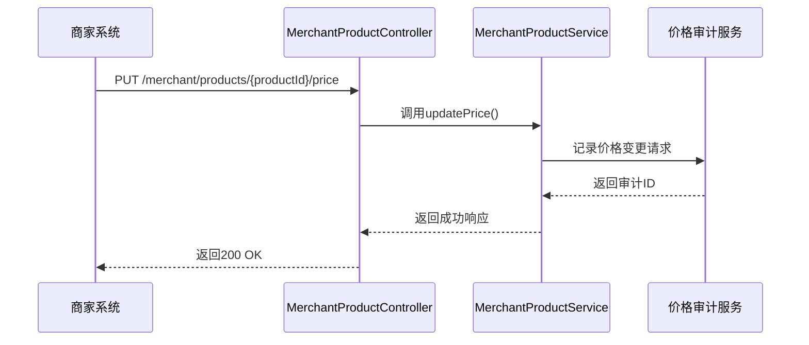
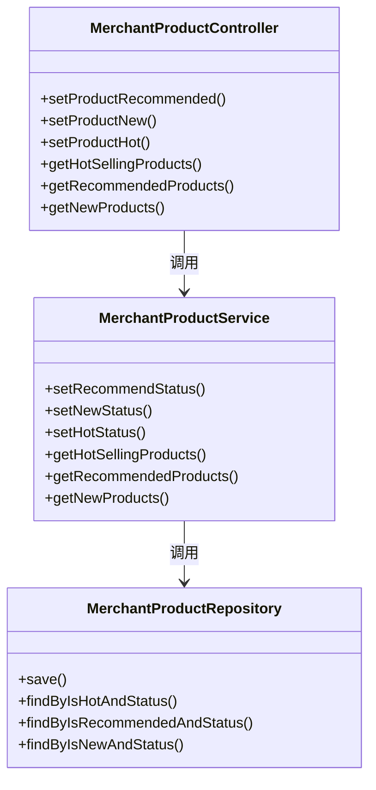
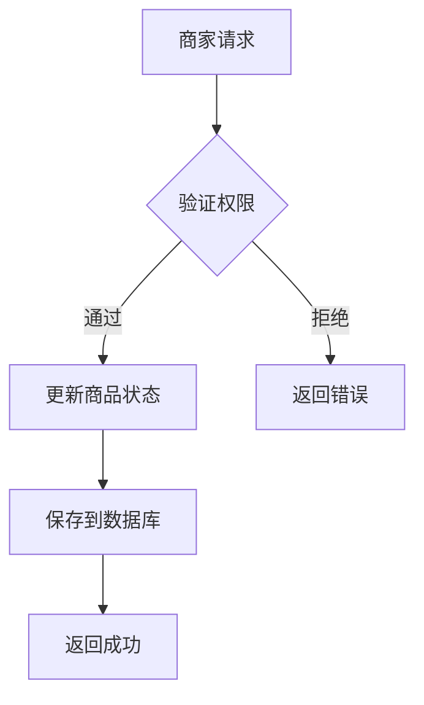
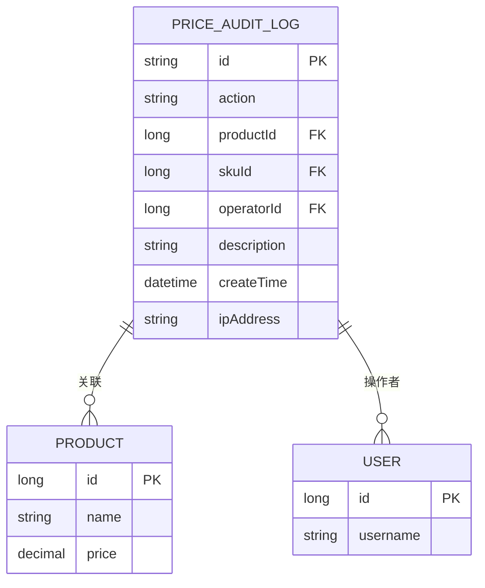
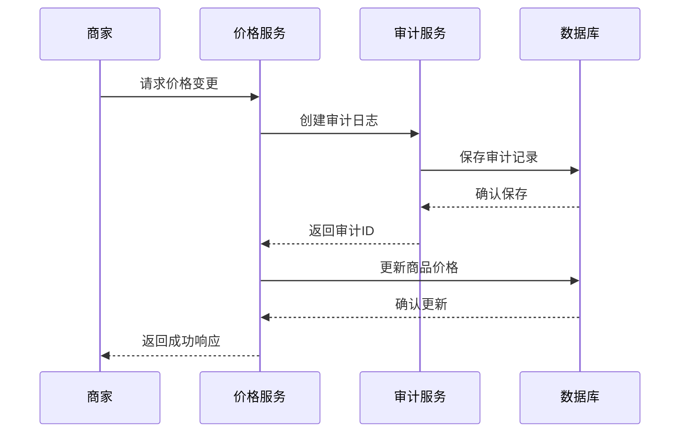
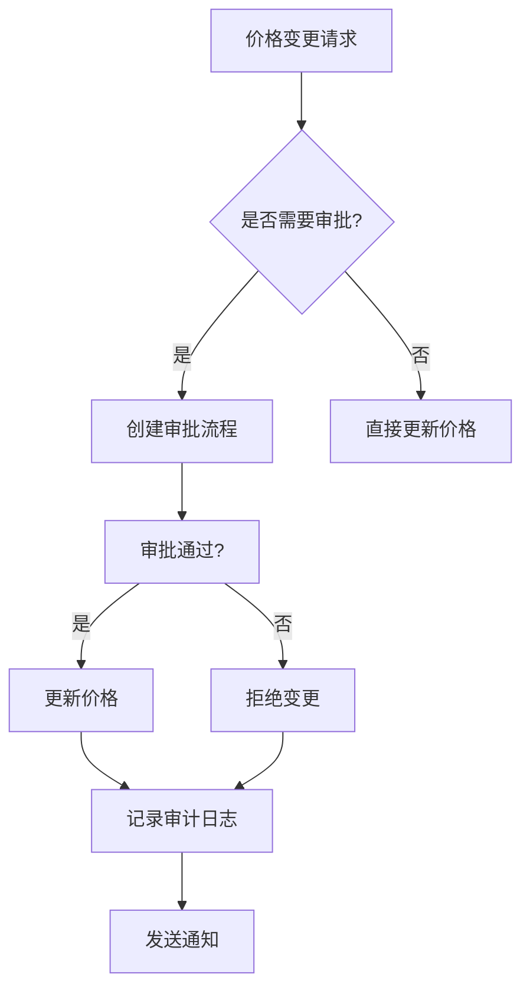
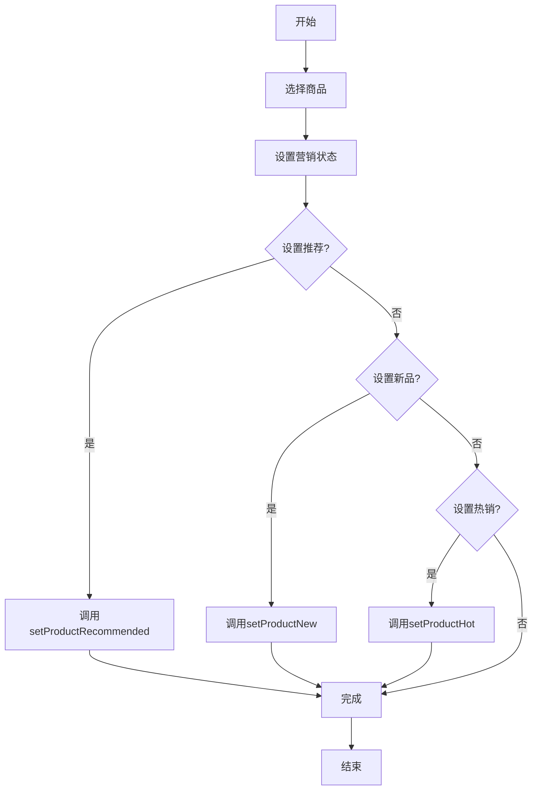

# 价格与营销API

<cite>
**本文档引用的文件**   
- [MerchantProductController.java](file://backend/merchant-service/src/main/java/com/mall/merchant/controller/MerchantProductController.java)
- [MerchantProductService.java](file://backend/merchant-service/src/main/java/com/mall/merchant/service/MerchantProductService.java)
- [MerchantProductServiceImpl.java](file://backend/merchant-service/src/main/java/com/mall/merchant/service/impl/MerchantProductServiceImpl.java)
- [PriceAuditLog.java](file://backend/product-service/src/main/java/com/mall/product/model/PriceAuditLog.java)
- [PriceServiceImpl.java](file://backend/product-service/src/main/java/com/mall/product/service/impl/PriceServiceImpl.java)
</cite>

## 目录
1. [简介](#简介)
2. [价格管理API](#价格管理api)
3. [营销状态管理API](#营销状态管理api)
4. [价格审计与日志](#价格审计与日志)
5. [集成示例](#集成示例)
6. [错误处理](#错误处理)
7. [最佳实践](#最佳实践)

## 简介
本API文档详细描述了商品价格调整和营销状态管理功能。基于`MerchantProductController`中的`updateProductPrice`、`setProductRecommended`、`setProductNew`、`setProductHot`、`getHotSellingProducts`、`getRecommendedProducts`、`getNewProducts`等端点，记录了价格修改、推荐/新品/热销状态设置及查询的API规格。文档说明了价格更新的审计要求和营销标签的业务影响，并提供了价格变更通知、营销活动配置的集成示例，帮助开发者实现灵活的商品定价和营销策略。

**Section sources**
- [MerchantProductController.java](file://backend/merchant-service/src/main/java/com/mall/merchant/controller/MerchantProductController.java#L27-L618)

## 价格管理API
价格管理API允许商家更新商品的销售价格。价格更新操作会触发审计流程，确保所有价格变更都经过适当的审批和记录。

### 更新商品价格
此端点用于修改商品的销售价格。

**Diagram sources**
- [MerchantProductController.java](file://backend/merchant-service/src/main/java/com/mall/merchant/controller/MerchantProductController.java#L278-L295)
- [MerchantProductServiceImpl.java](file://backend/merchant-service/src/main/java/com/mall/merchant/service/impl/MerchantProductServiceImpl.java#L501-L532)

**API规格**
- **端点**: `PUT /merchant/products/{productId}/price`
- **参数**:
  - `productId`: 商品ID (路径参数)
  - `merchantId`: 商家ID (查询参数)
  - `price`: 新价格 (查询参数)
- **响应**: 成功时返回200 OK，失败时返回相应的错误码

**Section sources**
- [MerchantProductController.java](file://backend/merchant-service/src/main/java/com/mall/merchant/controller/MerchantProductController.java#L278-L295)

## 营销状态管理API
营销状态管理API允许商家设置商品的推荐、新品和热销状态，并查询相应的商品列表。

### 设置商品状态
此端点用于设置商品的推荐、新品或热销状态。

**Diagram sources**
- [MerchantProductController.java](file://backend/merchant-service/src/main/java/com/mall/merchant/controller/MerchantProductController.java#L296-L352)
- [MerchantProductService.java](file://backend/merchant-service/src/main/java/com/mall/merchant/service/MerchantProductService.java#L242-L262)

#### 设置推荐商品

**API规格**
- **端点**: `PUT /merchant/products/{productId}/recommend`
- **参数**:
  - `productId`: 商品ID (路径参数)
  - `merchantId`: 商家ID (查询参数)
  - `isRecommended`: 是否推荐 (查询参数)
- **响应**: 成功时返回200 OK，失败时返回相应的错误码

**Section sources**
- [MerchantProductController.java](file://backend/merchant-service/src/main/java/com/mall/merchant/controller/MerchantProductController.java#L296-L314)

#### 设置新品商品
**API规格**
- **端点**: `PUT /merchant/products/{productId}/new`
- **参数**:
  - `productId`: 商品ID (路径参数)
  - `merchantId`: 商家ID (查询参数)
  - `isNew`: 是否新品 (查询参数)
- **响应**: 成功时返回200 OK，失败时返回相应的错误码

**Section sources**
- [MerchantProductController.java](file://backend/merchant-service/src/main/java/com/mall/merchant/controller/MerchantProductController.java#L316-L333)

#### 设置热销商品
**API规格**
- **端点**: `PUT /merchant/products/{productId}/hot`
- **参数**:
  - `productId`: 商品ID (路径参数)
  - `merchantId`: 商家ID (查询参数)
  - `isHot`: 是否热销 (查询参数)
- **响应**: 成功时返回200 OK，失败时返回相应的错误码

**Section sources**
- [MerchantProductController.java](file://backend/merchant-service/src/main/java/com/mall/merchant/controller/MerchantProductController.java#L335-L352)

### 查询营销商品
此端点用于获取热销、推荐和新品商品列表。

#### 获取热销商品
**API规格**
- **端点**: `GET /merchant/products/hot-selling`
- **参数**:
  - `merchantId`: 商家ID (可选，查询参数)
  - `limit`: 数量限制 (查询参数，默认10)
- **响应**: 返回热销商品列表

**Section sources**
- [MerchantProductController.java](file://backend/merchant-service/src/main/java/com/mall/merchant/controller/MerchantProductController.java#L480-L496)

#### 获取推荐商品
**API规格**
- **端点**: `GET /merchant/products/recommended`
- **参数**:
  - `merchantId`: 商家ID (可选，查询参数)
  - `page`: 页码 (查询参数，默认1)
  - `size`: 每页大小 (查询参数，默认10)
- **响应**: 返回推荐商品分页列表

**Section sources**
- [MerchantProductController.java](file://backend/merchant-service/src/main/java/com/mall/merchant/controller/MerchantProductController.java#L497-L515)

#### 获取新品商品
**API规格**
- **端点**: `GET /merchant/products/new-products`
- **参数**:
  - `merchantId`: 商家ID (查询参数)
  - `page`: 页码 (查询参数，默认1)
  - `size`: 每页大小 (查询参数，默认10)
- **响应**: 返回新品商品分页列表

**Section sources**
- [MerchantProductController.java](file://backend/merchant-service/src/main/java/com/mall/merchant/controller/MerchantProductController.java#L517-L534)

## 价格审计与日志
价格审计系统确保所有价格变更都经过适当的审批和记录，提供完整的审计追踪。

### 审计要求
所有价格变更必须记录在审计日志中，包括操作类型、商品信息、操作员、描述和创建时间。

**Diagram sources**
- [PriceAuditLog.java](file://backend/product-service/src/main/java/com/mall/product/model/PriceAuditLog.java#L4-L83)

### 审计流程
价格变更的审计流程如下：

**Diagram sources**
- [PriceServiceImpl.java](file://backend/product-service/src/main/java/com/mall/product/service/impl/PriceServiceImpl.java#L361-L424)

**Section sources**
- [PriceAuditLog.java](file://backend/product-service/src/main/java/com/mall/product/model/PriceAuditLog.java#L4-L83)
- [PriceServiceImpl.java](file://backend/product-service/src/main/java/com/mall/product/service/impl/PriceServiceImpl.java#L361-L424)

## 集成示例
以下示例展示了如何集成价格与营销API。

### 价格变更通知
当价格变更时，系统会自动记录审计日志并通知相关人员。

**Section sources**
- [PriceServiceImpl.java](file://backend/product-service/src/main/java/com/mall/product/service/impl/PriceServiceImpl.java#L64-L187)

### 营销活动配置
配置营销活动的示例代码：

**Section sources**
- [MerchantProductController.java](file://backend/merchant-service/src/main/java/com/mall/merchant/controller/MerchantProductController.java#L296-L352)

## 错误处理
API提供标准化的错误处理机制，确保客户端能够正确处理各种错误情况。

### 错误码
| 错误码 | 描述 | 解决方案 |
|--------|------|----------|
| 400 | 请求参数无效 | 检查请求参数是否正确 |
| 401 | 未授权访问 | 确保提供了有效的认证令牌 |
| 403 | 无权限操作 | 确认用户有操作该商品的权限 |
| 404 | 资源不存在 | 检查商品ID是否正确 |
| 500 | 服务器内部错误 | 联系技术支持 |

**Section sources**
- [MerchantProductController.java](file://backend/merchant-service/src/main/java/com/mall/merchant/controller/MerchantProductController.java#L27-L618)

## 最佳实践
遵循以下最佳实践可以确保API的正确使用和系统的稳定性。

### 价格管理
- 在进行价格变更前，检查当前价格以避免不必要的更新
- 对于大幅价格调整，确保经过适当的审批流程
- 定期审查价格审计日志，确保所有变更都符合业务策略

### 营销策略
- 合理使用推荐、新品和热销标签，避免过度标记导致标签失去意义
- 定期更新营销状态，保持商品展示的新鲜度
- 结合销售数据和用户行为分析，优化营销策略

**Section sources**
- [MerchantProductController.java](file://backend/merchant-service/src/main/java/com/mall/merchant/controller/MerchantProductController.java#L27-L618)
- [PriceServiceImpl.java](file://backend/product-service/src/main/java/com/mall/product/service/impl/PriceServiceImpl.java#L64-L187)