# 商品管理API

<cite>
**本文档引用的文件**   
- [MerchantProductController.java](file://backend/merchant-service/src/main/java/com/mall/merchant/controller/MerchantProductController.java)
- [MerchantProductService.java](file://backend/merchant-service/src/main/java/com/mall/merchant/service/MerchantProductService.java)
- [MerchantProductServiceImpl.java](file://backend/merchant-service/src/main/java/com/mall/merchant/service/impl/MerchantProductServiceImpl.java)
- [MerchantProduct.java](file://backend/merchant-service/src/main/java/com/mall/merchant/domain/entity/MerchantProduct.java)
- [R.java](file://backend/common-core/src/main/java/com/mall/common/core/domain/R.java)
- [PageResult.java](file://backend/common-core/src/main/java/com/mall/common/core/domain/PageResult.java)
</cite>

## 目录
1. [简介](#简介)
2. [核心功能](#核心功能)
3. [商品全生命周期管理](#商品全生命周期管理)
4. [商品上下架状态转换](#商品上下架状态转换)
5. [权限验证机制](#权限验证机制)
6. [API调用序列示例](#api调用序列示例)
7. [错误处理示例](#错误处理示例)
8. [批量操作API](#批量操作api)
9. [商品统计与查询](#商品统计与查询)
10. [附录](#附录)

## 简介
商品管理API为商家提供了一套完整的商品运营解决方案，涵盖了商品的增删改查、上下架、批量操作等核心管理功能。本API通过`MerchantProductController`中的多个端点，实现了商品从创建到下架的全生命周期管理。系统采用RESTful架构设计，确保了接口的规范性和易用性。

**Section sources**
- [MerchantProductController.java](file://backend/merchant-service/src/main/java/com/mall/merchant/controller/MerchantProductController.java#L27-L618)

## 核心功能
商品管理API提供了以下核心功能：
- 商品的增删改查
- 商品上下架操作
- 批量商品管理
- 商品状态管理
- 权限验证与归属检查

这些功能通过一系列REST API端点实现，确保商家能够高效地管理其商品信息。

**Section sources**
- [MerchantProductController.java](file://backend/merchant-service/src/main/java/com/mall/merchant/controller/MerchantProductController.java#L27-L618)

## 商品全生命周期管理
商品全生命周期管理包括商品的创建、编辑、上下架和删除等操作。以下是主要API端点：

### 新增商品
通过`POST /merchant/products`端点创建新商品。

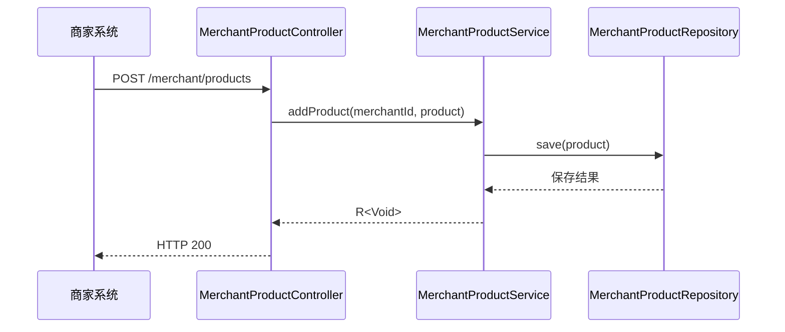

**Diagram sources**
- [MerchantProductController.java](file://backend/merchant-service/src/main/java/com/mall/merchant/controller/MerchantProductController.java#L82-L87)
- [MerchantProductServiceImpl.java](file://backend/merchant-service/src/main/java/com/mall/merchant/service/impl/MerchantProductServiceImpl.java#L52-L88)
- [MerchantProduct.java](file://backend/merchant-service/src/main/java/com/mall/merchant/domain/entity/MerchantProduct.java#L22-L198)

### 更新商品
通过`PUT /merchant/products/{productId}`端点更新商品信息。

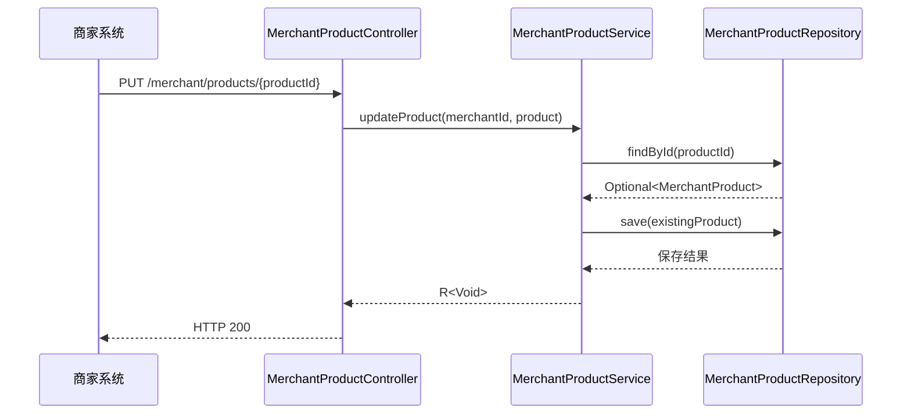

**Diagram sources**
- [MerchantProductController.java](file://backend/merchant-service/src/main/java/com/mall/merchant/controller/MerchantProductController.java#L97-L105)
- [MerchantProductServiceImpl.java](file://backend/merchant-service/src/main/java/com/mall/merchant/service/impl/MerchantProductServiceImpl.java#L96-L172)
- [MerchantProduct.java](file://backend/merchant-service/src/main/java/com/mall/merchant/domain/entity/MerchantProduct.java#L22-L198)

### 删除商品
通过`DELETE /merchant/products/{productId}`端点删除商品。

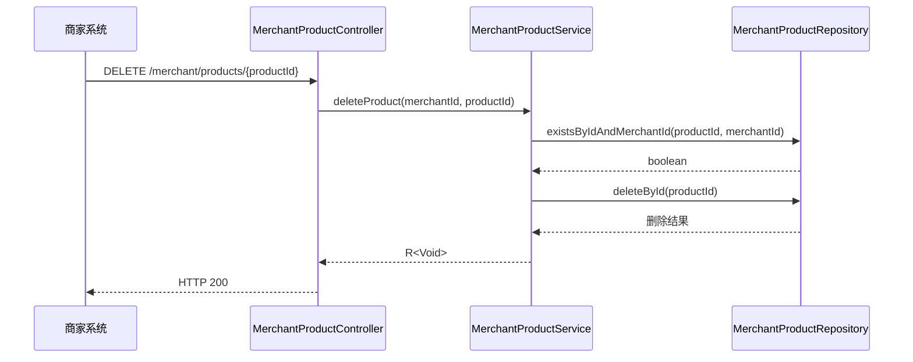

**Diagram sources**
- [MerchantProductController.java](file://backend/merchant-service/src/main/java/com/mall/merchant/controller/MerchantProductController.java#L115-L122)
- [MerchantProductServiceImpl.java](file://backend/merchant-service/src/main/java/com/mall/merchant/service/impl/MerchantProductServiceImpl.java#L181-L202)
- [MerchantProduct.java](file://backend/merchant-service/src/main/java/com/mall/merchant/domain/entity/MerchantProduct.java#L22-L198)

## 商品上下架状态转换
商品上下架状态转换是商品管理的核心功能之一，涉及商品状态的变更和相关业务规则的执行。

### 商品上架
通过`POST /merchant/products/{productId}/on-shelf`端点将商品上架。

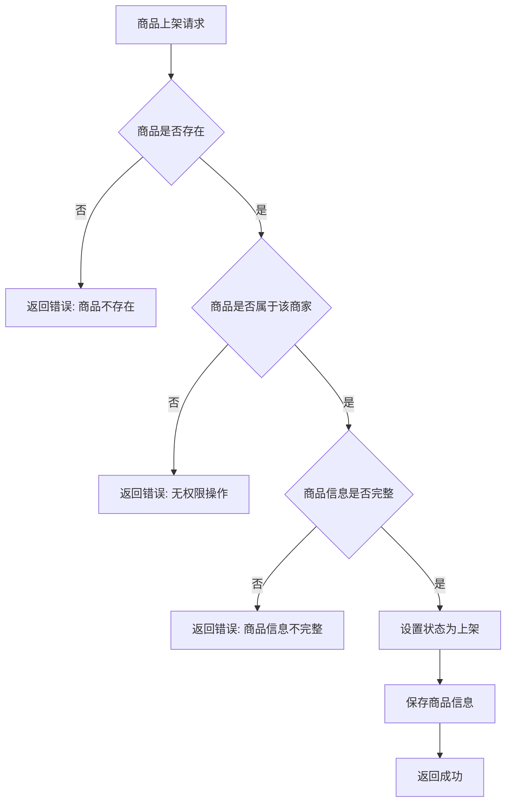

**Diagram sources**
- [MerchantProductController.java](file://backend/merchant-service/src/main/java/com/mall/merchant/controller/MerchantProductController.java#L182-L188)
- [MerchantProductServiceImpl.java](file://backend/merchant-service/src/main/java/com/mall/merchant/service/impl/MerchantProductServiceImpl.java#L278-L314)
- [MerchantProduct.java](file://backend/merchant-service/src/main/java/com/mall/merchant/domain/entity/MerchantProduct.java#L127-L130)

### 商品下架
通过`POST /merchant/products/{productId}/off-shelf`端点将商品下架。

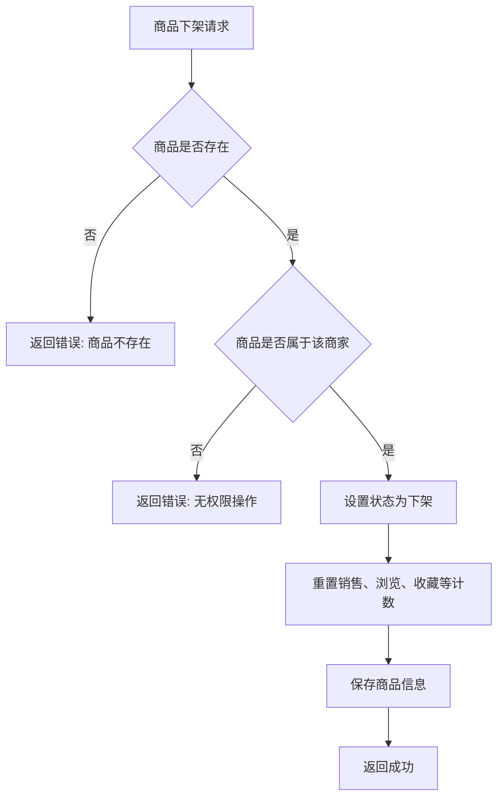

**Diagram sources**
- [MerchantProductController.java](file://backend/merchant-service/src/main/java/com/mall/merchant/controller/MerchantProductController.java#L199-L205)
- [MerchantProductServiceImpl.java](file://backend/merchant-service/src/main/java/com/mall/merchant/service/impl/MerchantProductServiceImpl.java#L324-L364)
- [MerchantProduct.java](file://backend/merchant-service/src/main/java/com/mall/merchant/domain/entity/MerchantProduct.java#L127-L130)

## 权限验证机制
系统通过严格的权限验证机制确保商品操作的安全性。每个商品操作都需要验证商品是否属于指定商家。

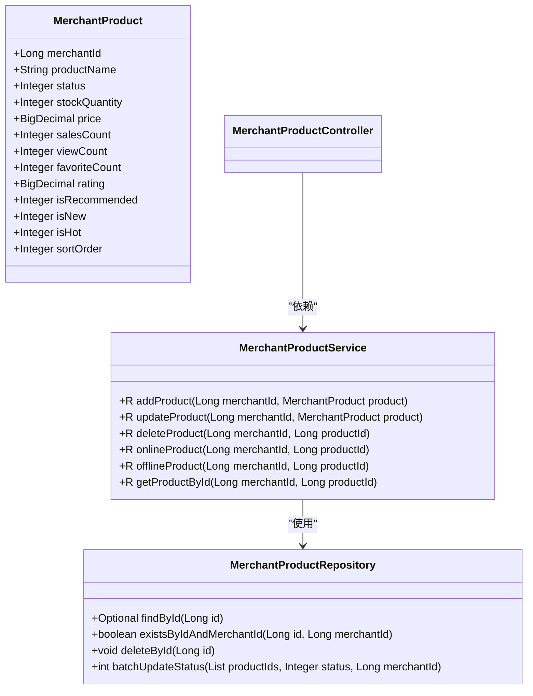

**Diagram sources**
- [MerchantProductController.java](file://backend/merchant-service/src/main/java/com/mall/merchant/controller/MerchantProductController.java#L27-L618)
- [MerchantProductService.java](file://backend/merchant-service/src/main/java/com/mall/merchant/service/MerchantProductService.java#L10-L357)
- [MerchantProductRepository.java](file://backend/merchant-service/src/main/java/com/mall/merchant/repository/MerchantProductRepository.java#L16-L386)
- [MerchantProduct.java](file://backend/merchant-service/src/main/java/com/mall/merchant/domain/entity/MerchantProduct.java#L22-L198)

## API调用序列示例
以下是商品发布、编辑和上下架的完整API调用序列：

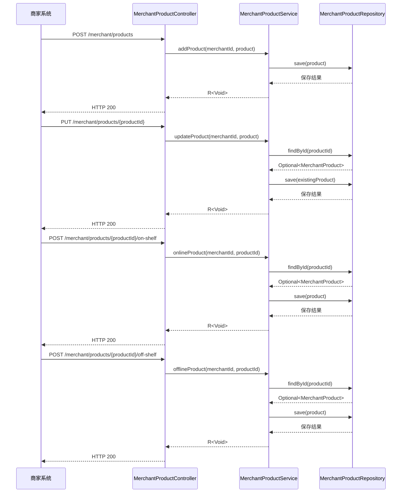

**Diagram sources**
- [MerchantProductController.java](file://backend/merchant-service/src/main/java/com/mall/merchant/controller/MerchantProductController.java#L27-L618)
- [MerchantProductServiceImpl.java](file://backend/merchant-service/src/main/java/com/mall/merchant/service/impl/MerchantProductServiceImpl.java#L27-L1237)
- [MerchantProductRepository.java](file://backend/merchant-service/src/main/java/com/mall/merchant/repository/MerchantProductRepository.java#L16-L386)

## 错误处理示例
系统提供了完善的错误处理机制，确保API调用的健壮性。

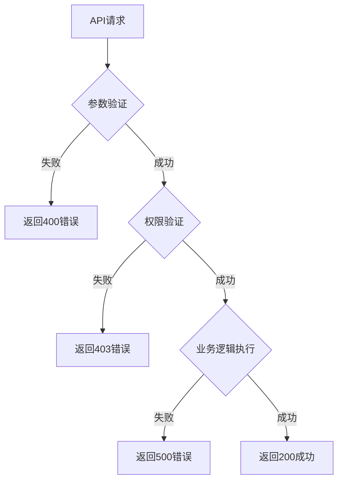

**Diagram sources**
- [MerchantProductController.java](file://backend/merchant-service/src/main/java/com/mall/merchant/controller/MerchantProductController.java#L27-L618)
- [MerchantProductServiceImpl.java](file://backend/merchant-service/src/main/java/com/mall/merchant/service/impl/MerchantProductServiceImpl.java#L27-L1237)
- [R.java](file://backend/common-core/src/main/java/com/mall/common/core/domain/R.java#L1-L137)

## 批量操作API
系统支持批量商品管理操作，提高商家运营效率。

### 批量上架商品
通过`POST /merchant/products/batch-on-shelf`端点批量上架商品。

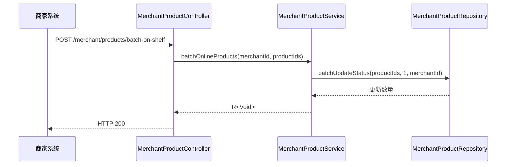

**Diagram sources**
- [MerchantProductController.java](file://backend/merchant-service/src/main/java/com/mall/merchant/controller/MerchantProductController.java#L216-L223)
- [MerchantProductServiceImpl.java](file://backend/merchant-service/src/main/java/com/mall/merchant/service/impl/MerchantProductServiceImpl.java#L373-L388)
- [MerchantProductRepository.java](file://backend/merchant-service/src/main/java/com/mall/merchant/repository/MerchantProductRepository.java#L16-L386)

### 批量下架商品
通过`POST /merchant/products/batch-off-shelf`端点批量下架商品。

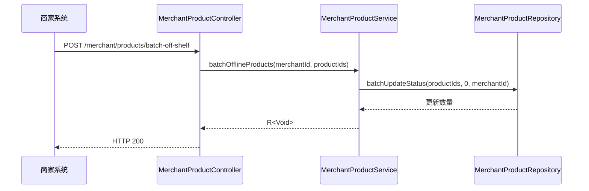

**Diagram sources**
- [MerchantProductController.java](file://backend/merchant-service/src/main/java/com/mall/merchant/controller/MerchantProductController.java#L233-L240)
- [MerchantProductServiceImpl.java](file://backend/merchant-service/src/main/java/com/mall/merchant/service/impl/MerchantProductServiceImpl.java#L402-L417)
- [MerchantProductRepository.java](file://backend/merchant-service/src/main/java/com/mall/merchant/repository/MerchantProductRepository.java#L16-L386)

### 批量删除商品
通过`DELETE /merchant/products/batch`端点批量删除商品。

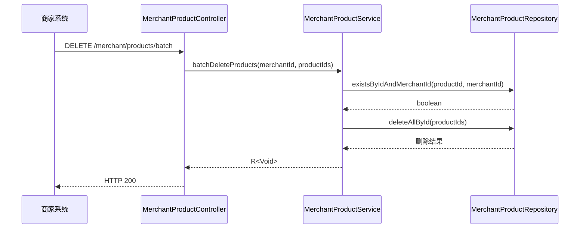

**Diagram sources**
- [MerchantProductController.java](file://backend/merchant-service/src/main/java/com/mall/merchant/controller/MerchantProductController.java#L249-L257)
- [MerchantProductServiceImpl.java](file://backend/merchant-service/src/main/java/com/mall/merchant/service/impl/MerchantProductServiceImpl.java#L426-L449)
- [MerchantProductRepository.java](file://backend/merchant-service/src/main/java/com/mall/merchant/repository/MerchantProductRepository.java#L16-L386)

## 商品统计与查询
系统提供了丰富的商品统计和查询功能，帮助商家更好地管理商品。

### 分页查询商品列表
通过`GET /merchant/products/list`端点分页查询商品列表。

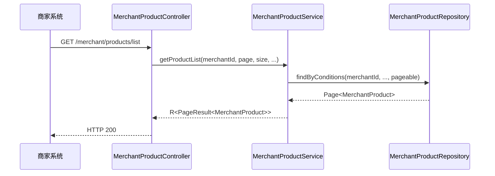

**Diagram sources**
- [MerchantProductController.java](file://backend/merchant-service/src/main/java/com/mall/merchant/controller/MerchantProductController.java#L156-L172)
- [MerchantProductServiceImpl.java](file://backend/merchant-service/src/main/java/com/mall/merchant/service/impl/MerchantProductServiceImpl.java#L249-L269)
- [MerchantProductRepository.java](file://backend/merchant-service/src/main/java/com/mall/merchant/repository/MerchantProductRepository.java#L16-L386)
- [PageResult.java](file://backend/common-core/src/main/java/com/mall/common/core/domain/PageResult.java#L1-L58)

### 获取商品详情
通过`GET /merchant/products/{productId}`端点获取商品详情。

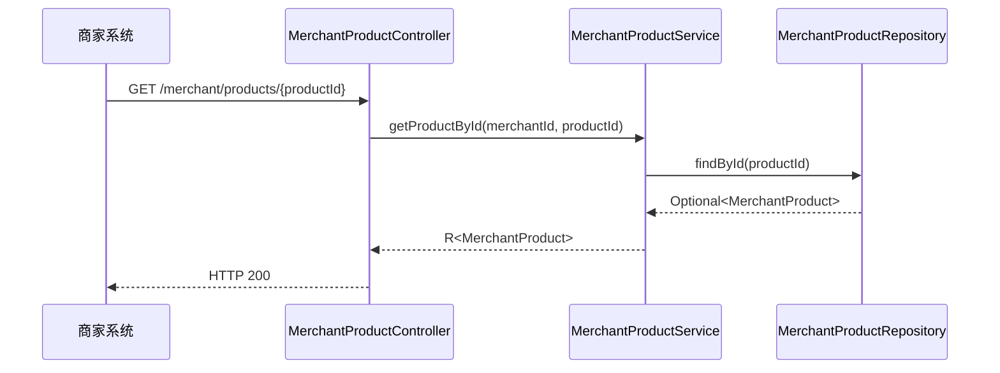

**Diagram sources**
- [MerchantProductController.java](file://backend/merchant-service/src/main/java/com/mall/merchant/controller/MerchantProductController.java#L132-L139)
- [MerchantProductServiceImpl.java](file://backend/merchant-service/src/main/java/com/mall/merchant/service/impl/MerchantProductServiceImpl.java#L211-L236)
- [MerchantProductRepository.java](file://backend/merchant-service/src/main/java/com/mall/merchant/repository/MerchantProductRepository.java#L16-L386)

## 附录
### 商品状态定义
| 状态值 | 状态名称 | 说明 |
|--------|----------|------|
| 0 | 下架 | 商品不可见，无法购买 |
| 1 | 上架 | 商品可见，可正常购买 |
| 2 | 草稿 | 商品未发布，仅商家可见 |

### 返回结果格式
所有API调用返回统一的`R<T>`格式结果：

```json
{
  "code": 200,
  "message": "操作成功",
  "data": {},
  "timestamp": 1715000000000
}
```

**Section sources**
- [R.java](file://backend/common-core/src/main/java/com/mall/common/core/domain/R.java#L1-L137)
- [MerchantProduct.java](file://backend/merchant-service/src/main/java/com/mall/merchant/domain/entity/MerchantProduct.java#L127-L130)