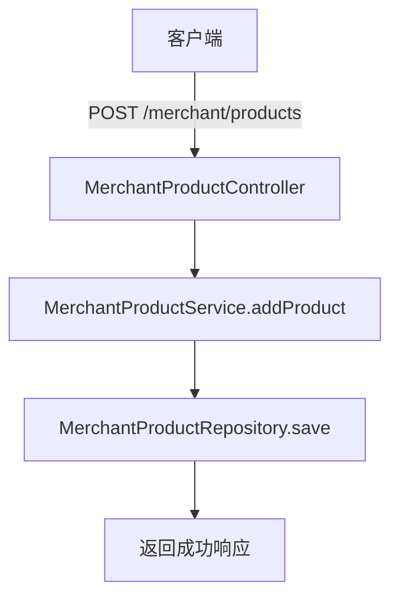
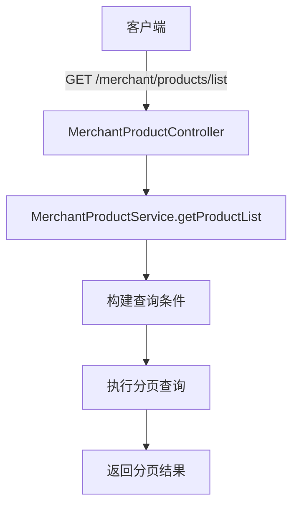
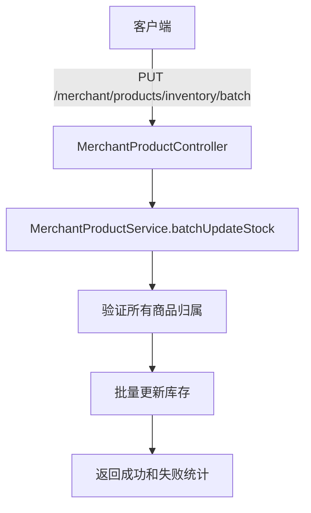
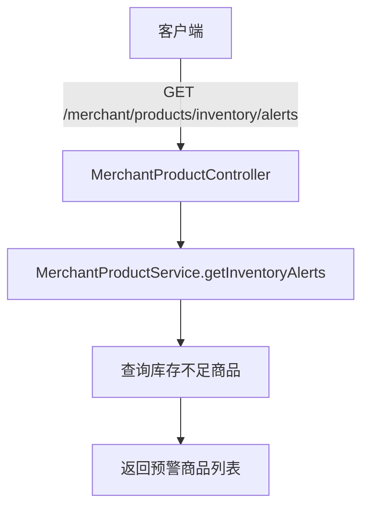
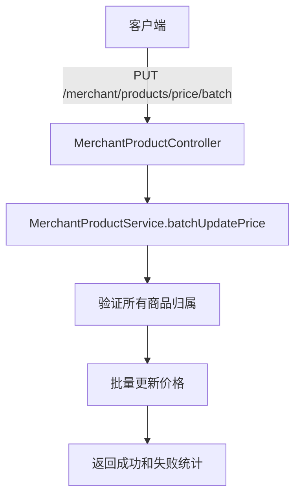
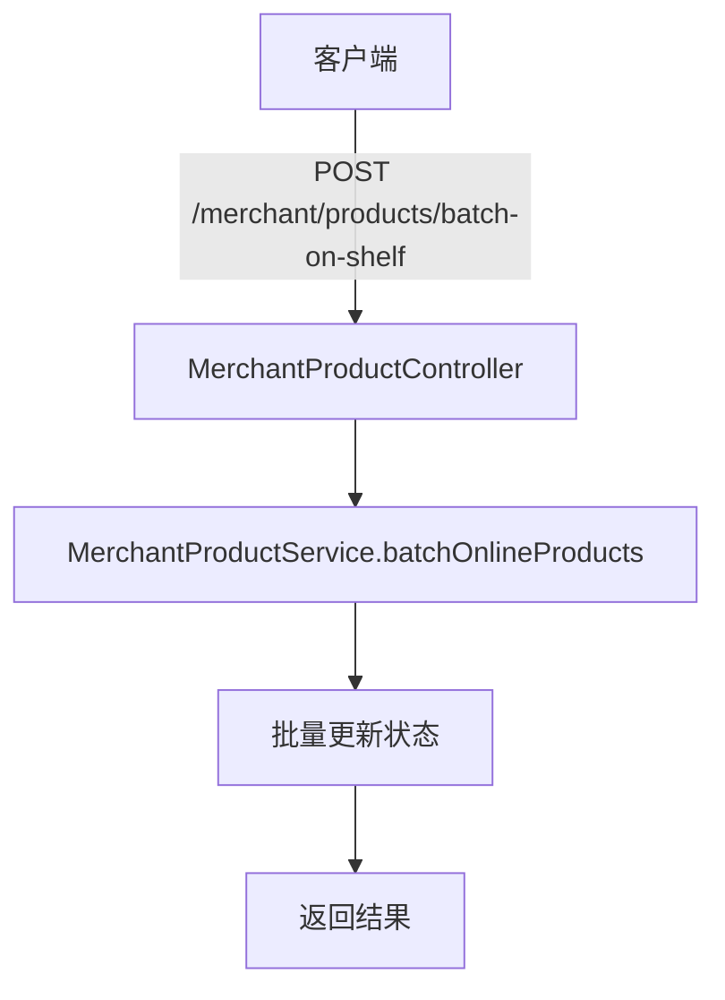
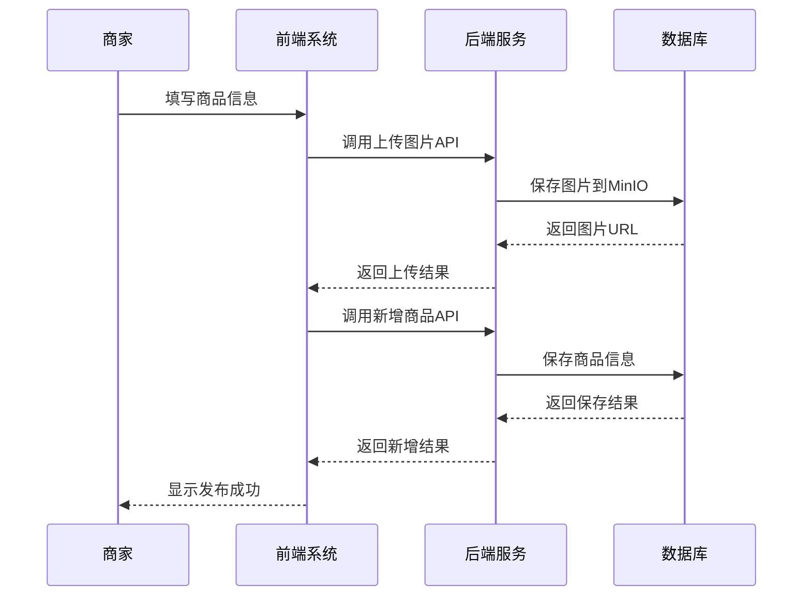
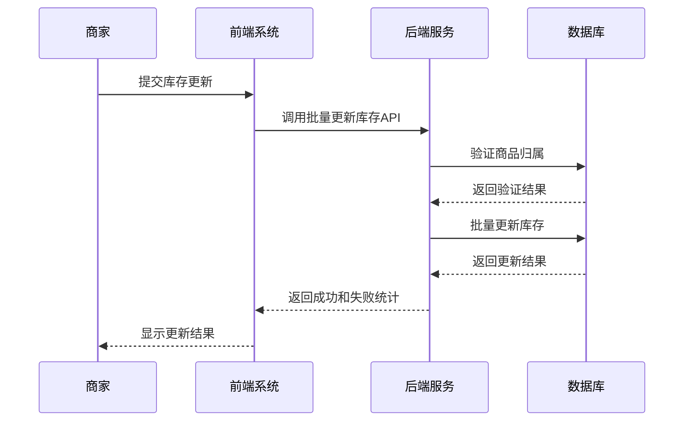
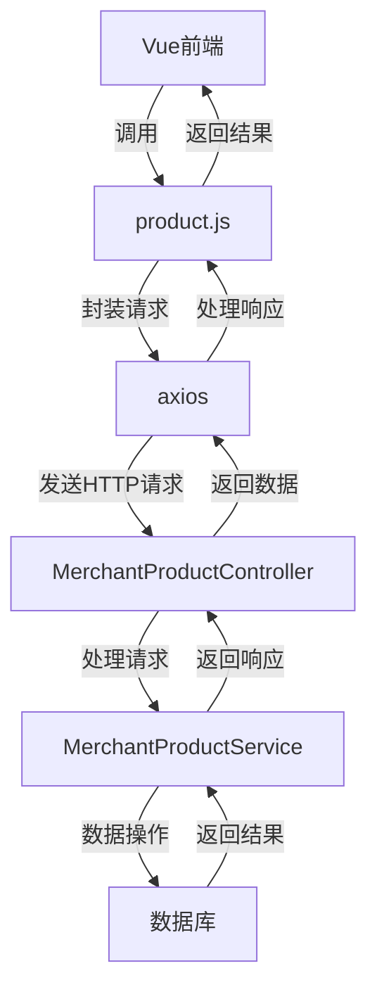

# 商家商品API

<cite>
**Referenced Files in This Document**   
- [MerchantProductController.java](file://backend/merchant-service/src/main/java/com/mall/merchant/controller/MerchantProductController.java)
- [MerchantProductService.java](file://backend/merchant-service/src/main/java/com/mall/merchant/service/MerchantProductService.java)
- [MerchantProduct.java](file://backend/merchant-service/src/main/java/com/mall/merchant/domain/entity/MerchantProduct.java)
- [BatchInventoryUpdateDTO.java](file://backend/merchant-service/src/main/java/com/mall/merchant/domain/dto/BatchInventoryUpdateDTO.java)
- [ProductInventoryUpdateDTO.java](file://backend/merchant-service/src/main/java/com/mall/merchant/domain/dto/ProductInventoryUpdateDTO.java)
- [InventoryAlertVO.java](file://backend/merchant-service/src/main/java/com/mall/merchant/domain/vo/InventoryAlertVO.java)
- [product.js](file://frontend/src/api/merchant/product.js)
</cite>

## 目录
1. [简介](#简介)
2. [商品管理API](#商品管理api)
3. [库存管理API](#库存管理api)
4. [价格管理API](#价格管理api)
5. [商品状态管理API](#商品状态管理api)
6. [数据传输对象](#数据传输对象)
7. [API调用序列与业务规则](#api调用序列与业务规则)
8. [前端集成示例](#前端集成示例)

## 简介
商家商品API为商家提供完整的商品运营能力，涵盖商品的增删改查、上下架、库存管理、价格调整等核心功能。该API通过`MerchantProductController`暴露RESTful端点，支持商家对商品进行全生命周期管理。系统采用Spring Boot框架构建，结合MyBatis Plus实现数据持久化，并通过MinIO存储商品图片。

**Section sources**
- [MerchantProductController.java](file://backend/merchant-service/src/main/java/com/mall/merchant/controller/MerchantProductController.java#L27-L618)

## 商品管理API
商品管理API提供商品的基本操作接口，包括新增、更新、删除和查询功能。

### 新增商品
创建新商品，商家发布商品时调用。



**Diagram sources**
- [MerchantProductController.java](file://backend/merchant-service/src/main/java/com/mall/merchant/controller/MerchantProductController.java#L82-L87)
- [MerchantProductService.java](file://backend/merchant-service/src/main/java/com/mall/merchant/service/MerchantProductService.java#L15-L22)

### 更新商品信息
修改商品的基本信息。

```mermaid
flowchart TD
A[客户端] --> |PUT /merchant/products/{productId}| B[MerchantProductController]
B --> C[MerchantProductService.updateProduct]
C --> D[验证商品归属]
D --> E[更新允许修改的字段]
E --> F[保存到数据库]
F --> G[返回成功响应]
```

**Diagram sources**
- [MerchantProductController.java](file://backend/merchant-service/src/main/java/com/mall/merchant/controller/MerchantProductController.java#L97-L105)
- [MerchantProductService.java](file://backend/merchant-service/src/main/java/com/mall/merchant/service/MerchantProductService.java#L24-L31)

### 删除商品
删除指定商品。

```mermaid
flowchart TD
A[客户端] --> |DELETE /merchant/products/{productId}| B[MerchantProductController]
B --> C[MerchantProductService.deleteProduct]
C --> D[验证商品归属]
D --> E[执行删除操作]
E --> F[返回成功响应]
```

**Diagram sources**
- [MerchantProductController.java](file://backend/merchant-service/src/main/java/com/mall/merchant/controller/MerchantProductController.java#L115-L122)
- [MerchantProductService.java](file://backend/merchant-service/src/main/java/com/mall/merchant/service/MerchantProductService.java#L33-L40)

### 获取商品详情
根据商品ID获取详细信息。

```mermaid
flowchart TD
A[客户端] --> |GET /merchant/products/{productId}| B[MerchantProductController]
B --> C[MerchantProductService.getProductById]
C --> D[验证商品存在性]
D --> E[验证商品归属]
E --> F[返回商品详情]
```

**Diagram sources**
- [MerchantProductController.java](file://backend/merchant-service/src/main/java/com/mall/merchant/controller/MerchantProductController.java#L132-L139)
- [MerchantProductService.java](file://backend/merchant-service/src/main/java/com/mall/merchant/service/MerchantProductService.java#L92-L99)

### 分页查询商品列表
根据条件分页查询商家的商品列表。



**Diagram sources**
- [MerchantProductController.java](file://backend/merchant-service/src/main/java/com/mall/merchant/controller/MerchantProductController.java#L156-L172)
- [MerchantProductService.java](file://backend/merchant-service/src/main/java/com/mall/merchant/service/MerchantProductService.java#L110-L126)

## 库存管理API
库存管理API提供商品库存的更新和查询功能。

### 更新商品库存
修改商品的库存数量。

```mermaid
flowchart TD
A[客户端] --> |PUT /merchant/products/{productId}/stock| B[MerchantProductController]
B --> C[MerchantProductService.updateStock]
C --> D[验证商品归属]
D --> E[更新库存数量]
E --> F[保存到数据库]
F --> G[返回成功响应]
```

**Diagram sources**
- [MerchantProductController.java](file://backend/merchant-service/src/main/java/com/mall/merchant/controller/MerchantProductController.java#L268-L276)
- [MerchantProductService.java](file://backend/merchant-service/src/main/java/com/mall/merchant/service/MerchantProductService.java#L197-L204)

### 批量更新库存
批量更新多个商品的库存信息。



**Diagram sources**
- [MerchantProductController.java](file://backend/merchant-service/src/main/java/com/mall/merchant/controller/MerchantProductController.java#L571-L587)
- [MerchantProductService.java](file://backend/merchant-service/src/main/java/com/mall/merchant/service/MerchantProductService.java#L206-L213)

### 库存预警查询
获取库存低于预警阈值的商品列表。



**Diagram sources**
- [MerchantProductController.java](file://backend/merchant-service/src/main/java/com/mall/merchant/controller/MerchantProductController.java#L598-L618)
- [MerchantProductService.java](file://backend/merchant-service/src/main/java/com/mall/merchant/service/MerchantProductService.java#L215-L222)

## 价格管理API
价格管理API提供商品价格的更新功能。

### 更新商品价格
修改商品的销售价格。

```mermaid
flowchart TD
A[客户端] --> |PUT /merchant/products/{productId}/price| B[MerchantProductController]
B --> C[MerchantProductService.updatePrice]
C --> D[验证商品归属]
D --> E[更新商品价格]
E --> F[保存到数据库]
F --> G[返回成功响应]
```

**Diagram sources**
- [MerchantProductController.java](file://backend/merchant-service/src/main/java/com/mall/merchant/controller/MerchantProductController.java#L287-L295)
- [MerchantProductService.java](file://backend/merchant-service/src/main/java/com/mall/merchant/service/MerchantProductService.java#L215-L222)

### 批量更新商品价格
批量更新多个商品的价格。



**Diagram sources**
- [MerchantProductService.java](file://backend/merchant-service/src/main/java/com/mall/merchant/service/MerchantProductService.java#L224-L231)

## 商品状态管理API
商品状态管理API提供商品上下架和特殊状态设置功能。

### 商品上架
将商品状态设置为上架。

```mermaid
flowchart TD
A[客户端] --> |POST /merchant/products/{productId}/on-shelf| B[MerchantProductController]
B --> C[MerchantProductService.onlineProduct]
C --> D[验证商品存在性]
D --> E[验证商品归属]
E --> F[检查商品信息完整性]
F --> G[设置上架状态]
G --> H[保存到数据库]
```

**Diagram sources**
- [MerchantProductController.java](file://backend/merchant-service/src/main/java/com/mall/merchant/controller/MerchantProductController.java#L182-L189)
- [MerchantProductService.java](file://backend/merchant-service/src/main/java/com/mall/merchant/service/MerchantProductService.java#L67-L74)

### 商品下架
将商品状态设置为下架。

```mermaid
flowchart TD
A[客户端] --> |POST /merchant/products/{productId}/off-shelf| B[MerchantProductController]
B --> C[MerchantProductService.offlineProduct]
C --> D[验证商品存在性]
D --> E[验证商品归属]
E --> F[设置下架状态]
F --> G[保存到数据库]
```

**Diagram sources**
- [MerchantProductController.java](file://backend/merchant-service/src/main/java/com/mall/merchant/controller/MerchantProductController.java#L199-L206)
- [MerchantProductService.java](file://backend/merchant-service/src/main/java/com/mall/merchant/service/MerchantProductService.java#L76-L83)

### 批量上下架商品
批量操作多个商品的上下架状态。



**Diagram sources**
- [MerchantProductController.java](file://backend/merchant-service/src/main/java/com/mall/merchant/controller/MerchantProductController.java#L216-L223)
- [MerchantProductService.java](file://backend/merchant-service/src/main/java/com/mall/merchant/service/MerchantProductService.java#L85-L92)

### 设置商品特殊状态
设置商品的推荐、新品、热销状态。

```mermaid
flowchart TD
A[客户端] --> |PUT /merchant/products/{productId}/recommend| B[MerchantProductController]
B --> C[MerchantProductService.setRecommendStatus]
C --> D[验证商品归属]
D --> E[更新推荐状态]
E --> F[保存到数据库]
```

**Diagram sources**
- [MerchantProductController.java](file://backend/merchant-service/src/main/java/com/mall/merchant/controller/MerchantProductController.java#L306-L314)
- [MerchantProductService.java](file://backend/merchant-service/src/main/java/com/mall/merchant/service/MerchantProductService.java#L233-L240)

## 数据传输对象
本节说明API中使用的关键数据传输对象（DTO）的结构。

### BatchInventoryUpdateDTO
批量更新库存的数据传输对象。

| 字段 | 类型 | 必填 | 描述 |
|------|------|------|------|
| merchantId | Long | 是 | 商家ID |
| items | List<ProductInventoryUpdateDTO> | 是 | 商品库存列表 |

**Section sources**
- [BatchInventoryUpdateDTO.java](file://backend/merchant-service/src/main/java/com/mall/merchant/domain/dto/BatchInventoryUpdateDTO.java#L18-L30)

### ProductInventoryUpdateDTO
商品库存更新的数据传输对象。

| 字段 | 类型 | 必填 | 描述 | 示例 |
|------|------|------|------|------|
| productId | Long | 是 | 商品ID | 123 |
| stock | Integer | 是 | 库存数量 | 100 |
| lowStockThreshold | Integer | 否 | 库存预警阈值 | 10 |
| reason | String | 否 | 更新原因 | 采购入库 |

**Section sources**
- [ProductInventoryUpdateDTO.java](file://backend/merchant-service/src/main/java/com/mall/merchant/domain/dto/ProductInventoryUpdateDTO.java#L18-L35)

### InventoryAlertVO
库存预警的返回对象。

| 字段 | 类型 | 描述 | 示例 |
|------|------|------|------|
| productId | Long | 商品ID | 123 |
| productName | String | 商品名称 | iPhone 15 |
| sku | String | 商品SKU | iPhone15-256G |
| currentStock | Integer | 当前库存 | 5 |
| threshold | Integer | 预警阈值 | 10 |
| shortageQty | Integer | 缺货数量 | 5 |
| price | BigDecimal | 商品价格 | 5999.00 |
| status | Integer | 商品状态 | 1:在售, 2:下架, 3:售罄 |
| updateTime | LocalDateTime | 最后更新时间 | 2025-11-12T10:00:00 |

**Section sources**
- [InventoryAlertVO.java](file://backend/merchant-service/src/main/java/com/mall/merchant/domain/vo/InventoryAlertVO.java#L19-L52)

## API调用序列与业务规则
本节描述商家商品运营的完整API调用序列和业务规则。

### 商品发布流程


**Diagram sources**
- [MerchantProductController.java](file://backend/merchant-service/src/main/java/com/mall/merchant/controller/MerchantProductController.java#L55-L87)
- [MerchantProductController.java](file://backend/merchant-service/src/main/java/com/mall/merchant/controller/MerchantProductController.java#L82-L87)

### 库存更新流程


**Diagram sources**
- [MerchantProductController.java](file://backend/merchant-service/src/main/java/com/mall/merchant/controller/MerchantProductController.java#L571-L587)
- [MerchantProductService.java](file://backend/merchant-service/src/main/java/com/mall/merchant/service/MerchantProductService.java#L206-L213)

### 业务规则
1. **商品归属验证**：所有操作必须验证商品是否属于请求的商家
2. **上架条件**：商品上架前必须检查商品信息完整性（名称、价格、库存）
3. **库存管理**：库存数量不能为负数，预警阈值不能为负数
4. **价格管理**：商品价格必须大于0
5. **批量操作**：批量操作中部分失败时返回失败统计信息

**Section sources**
- [MerchantProductServiceImpl.java](file://backend/merchant-service/src/main/java/com/mall/merchant/service/impl/MerchantProductServiceImpl.java#L27-L1237)

## 前端集成示例
前端通过API调用与商家商品API集成。



**Diagram sources**
- [product.js](file://frontend/src/api/merchant/product.js#L1-L71)
- [MerchantProductController.java](file://backend/merchant-service/src/main/java/com/mall/merchant/controller/MerchantProductController.java#L27-L618)