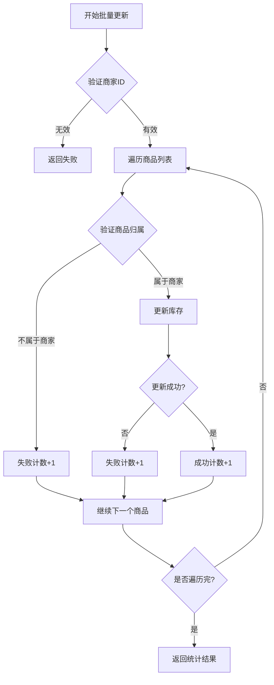

# 库存管理API

<cite>
**本文档引用文件**  
- [MerchantProductController.java](file://backend\merchant-service\src\main\java\com\mall\merchant\controller\MerchantProductController.java)
- [ProductInventoryUpdateDTO.java](file://backend\merchant-service\src\main\java\com\mall\merchant\domain\dto\ProductInventoryUpdateDTO.java)
- [BatchInventoryUpdateDTO.java](file://backend\merchant-service\src\main\java\com\mall\merchant\domain\dto\BatchInventoryUpdateDTO.java)
- [InventoryAlertVO.java](file://backend\merchant-service\src\main\java\com\mall\merchant\domain\vo\InventoryAlertVO.java)
- [MerchantProductServiceImpl.java](file://backend\merchant-service\src\main\java\com\mall\merchant\service\impl\MerchantProductServiceImpl.java)
- [MerchantProductService.java](file://backend\merchant-service\src\main\java\com\mall\merchant\service\MerchantProductService.java)
- [product.js](file://frontend\src\api\merchant\product.js)
</cite>

## 目录
1. [简介](#简介)
2. [核心API端点](#核心api端点)
3. [数据传输对象](#数据传输对象)
4. [库存预警机制](#库存预警机制)
5. [库存同步与批量更新实践](#库存同步与批量更新实践)
6. [前端调用示例](#前端调用示例)

## 简介
本API文档详细描述了基于`MerchantProductController`的库存管理功能，涵盖商品库存的增减、批量更新、库存预警查询等核心操作。文档重点说明了`updateProductStock`、`updateProductInventory`、`batchUpdateInventory`、`getInventoryAlerts`、`getLowStockProducts`等端点的使用方法，以及`ProductInventoryUpdateDTO`和`BatchInventoryUpdateDTO`数据传输对象的结构与校验规则。通过本文档，开发者可实现精准的库存控制，确保商品库存数据的实时性与准确性。

**本文档引用文件**
- [MerchantProductController.java](file://backend\merchant-service\src\main\java\com\mall\merchant\controller\MerchantProductController.java#L27-L618)

## 核心API端点
库存管理API提供了多个REST端点，用于实现商品库存的精细化管理。所有端点均通过`/merchant/products`路径前缀访问，并需提供商家ID进行权限验证。

### 更新商品库存（updateProductStock）
该端点用于修改单个商品的库存数量，通过正负值实现库存的增减。

- **HTTP方法**: PUT
- **路径**: `/merchant/products/{productId}/stock`
- **参数**:
  - `productId`: 路径参数，商品ID
  - `merchantId`: 查询参数，商家ID
  - `quantity`: 查询参数，库存变化量（正数增加，负数减少）
- **返回**: `R<Void>`，操作成功或失败的状态

**本文档引用文件**
- [MerchantProductController.java](file://backend\merchant-service\src\main\java\com\mall\merchant\controller\MerchantProductController.java#L268-L276)

### 更新商品库存（updateProductInventory）
该端点用于更新单个商品的库存信息，包括库存数量和预警阈值。

- **HTTP方法**: PUT
- **路径**: `/merchant/products/{productId}/inventory`
- **参数**:
  - `productId`: 路径参数，商品ID
  - `merchantId`: 查询参数，商家ID
  - `inventoryDTO`: 请求体，`ProductInventoryUpdateDTO`对象
- **返回**: `R<Void>`，操作成功或失败的状态

**本文档引用文件**
- [MerchantProductController.java](file://backend\merchant-service\src\main\java\com\mall\merchant\controller\MerchantProductController.java#L547-L561)

### 批量更新库存（batchUpdateInventory）
该端点用于批量更新多个商品的库存信息。

- **HTTP方法**: PUT
- **路径**: `/merchant/products/inventory/batch`
- **参数**: `batchDTO`: 请求体，`BatchInventoryUpdateDTO`对象
- **返回**: `R<Map<String, Object>>`，包含成功、失败和总数的统计信息

**本文档引用文件**
- [MerchantProductController.java](file://backend\merchant-service\src\main\java\com\mall\merchant\controller\MerchantProductController.java#L571-L586)

### 获取库存预警（getInventoryAlerts）
该端点用于获取库存低于预警阈值的商品列表。

- **HTTP方法**: GET
- **路径**: `/merchant/products/inventory/alerts`
- **参数**:
  - `merchantId`: 查询参数，商家ID
  - `page`: 查询参数，页码，默认为1
  - `size`: 查询参数，每页大小，默认为20
- **返回**: `R<PageResult<InventoryAlertVO>>`，分页的库存预警商品列表

**本文档引用文件**
- [MerchantProductController.java](file://backend\merchant-service\src\main\java\com\mall\merchant\controller\MerchantProductController.java#L598-L617)

### 获取低库存商品（getLowStockProducts）
该端点用于获取库存低于指定阈值的商品列表。

- **HTTP方法**: GET
- **路径**: `/merchant/products/low-stock`
- **参数**:
  - `merchantId`: 查询参数，商家ID
  - `threshold`: 查询参数，库存阈值，默认为10
  - `page`: 查询参数，页码，默认为1
  - `size`: 查询参数，每页大小，默认为10
- **返回**: `R<PageResult<MerchantProduct>>`，分页的低库存商品列表

**本文档引用文件**
- [MerchantProductController.java](file://backend\merchant-service\src\main\java\com\mall\merchant\controller\MerchantProductController.java#L470-L478)

## 数据传输对象
数据传输对象（DTO）用于在API请求和响应中传递数据，确保数据结构的清晰与一致性。

### ProductInventoryUpdateDTO
该DTO用于更新单个商品的库存信息。

```java
@Data
@Schema(description = "商品库存更新DTO")
public class ProductInventoryUpdateDTO {
  @Schema(description = "商品ID", required = true)
  @NotNull(message = "商品ID不能为空")
  private Long productId;

  @Schema(description = "库存数量", required = true, example = "100")
  @NotNull(message = "库存数量不能为空")
  @Min(value = 0, message = "库存数量不能为负数")
  private Integer stock;

  @Schema(description = "库存预警阈值", example = "10")
  @Min(value = 0, message = "预警阈值不能为负数")
  private Integer lowStockThreshold;

  @Schema(description = "更新原因", example = "采购入库")
  private String reason;
}
```

**校验规则**:
- `productId`: 必填，不能为空
- `stock`: 必填，不能为空且不能为负数
- `lowStockThreshold`: 可选，若提供则不能为负数

**本文档引用文件**
- [ProductInventoryUpdateDTO.java](file://backend\merchant-service\src\main\java\com\mall\merchant\domain\dto\ProductInventoryUpdateDTO.java#L16-L34)

### BatchInventoryUpdateDTO
该DTO用于批量更新多个商品的库存信息。

```java
@Data
@Schema(description = "批量更新库存DTO")
public class BatchInventoryUpdateDTO {
  @Schema(description = "商家ID", required = true)
  @NotNull(message = "商家ID不能为空")
  private Long merchantId;

  @Schema(description = "商品库存列表", required = true)
  @NotEmpty(message = "商品库存列表不能为空")
  @Valid
  private List<ProductInventoryUpdateDTO> items;
}
```

**校验规则**:
- `merchantId`: 必填，不能为空
- `items`: 必填，不能为空，且每个元素都必须通过`ProductInventoryUpdateDTO`的校验

**本文档引用文件**
- [BatchInventoryUpdateDTO.java](file://backend\merchant-service\src\main\java\com\mall\merchant\domain\dto\BatchInventoryUpdateDTO.java#L18-L29)

## 库存预警机制
库存预警机制通过比较当前库存与预警阈值来识别库存不足的商品，帮助商家及时补货。

### 预警阈值设置
预警阈值在`ProductInventoryUpdateDTO`中定义，通过`lowStockThreshold`字段设置。当商品库存低于此阈值时，系统将该商品标记为预警状态。

### 预警查询逻辑
`getInventoryAlerts`端点查询库存低于预警阈值的商品。其逻辑如下：
1. 根据商家ID获取所有商品
2. 过滤出库存数量小于预警阈值的商品
3. 返回包含商品ID、名称、当前库存、预警阈值等信息的`InventoryAlertVO`列表

```java
@Data
@Builder
@NoArgsConstructor
@AllArgsConstructor
@Schema(description = "库存预警VO")
public class InventoryAlertVO {
  @Schema(description = "商品ID")
  private Long productId;

  @Schema(description = "商品名称")
  private String productName;

  @Schema(description = "商品SKU")
  private String sku;

  @Schema(description = "当前库存")
  private Integer currentStock;

  @Schema(description = "预警阈值")
  private Integer threshold;

  @Schema(description = "缺货数量", example = "5")
  private Integer shortageQty;

  @Schema(description = "商品价格")
  private BigDecimal price;

  @Schema(description = "商品状态", example = "1:在售, 2:下架, 3:售罄")
  private Integer status;

  @Schema(description = "最后更新时间")
  private LocalDateTime updateTime;
}
```

**本文档引用文件**
- [InventoryAlertVO.java](file://backend\merchant-service\src\main\java\com\mall\merchant\domain\vo\InventoryAlertVO.java#L19-L51)

## 库存同步与批量更新实践
### 库存同步流程
1. 商家通过`updateProductInventory`端点更新商品库存
2. 系统验证商品归属和库存数据
3. 更新数据库中的库存数量和预警阈值
4. 记录库存变动历史

### 批量更新失败处理
`batchUpdateInventory`端点在处理批量更新时，会返回成功和失败的统计信息。开发者应：
1. 检查返回结果中的`success`和`failed`字段
2. 对失败的商品重新发起更新请求
3. 记录失败原因以便后续分析



**本文档引用文件**
- [MerchantProductController.java](file://backend\merchant-service\src\main\java\com\mall\merchant\controller\MerchantProductController.java#L571-L586)
- [MerchantProductServiceImpl.java](file://backend\merchant-service\src\main\java\com\mall\merchant\service\impl\MerchantProductServiceImpl.java#L27-L1237)

## 前端调用示例
前端通过`product.js`中的函数调用库存管理API。

### 批量更新库存
```javascript
export function batchUpdateInventory(data) {
  return request({
    url: '/merchant/products/inventory/batch',
    method: 'put',
    data
  })
}
```

### 获取库存预警
```javascript
export function getInventoryAlerts(params) {
  return request({
    url: '/merchant/products/inventory/alerts',
    method: 'get',
    params
  })
}
```

### 获取低库存商品
```javascript
export function getLowStockProducts(params) {
  return request({
    url: '/merchant/products/low-stock',
    method: 'get',
    params
  })
}
```

**本文档引用文件**
- [product.js](file://frontend\src\api\merchant\product.js#L162-L192)