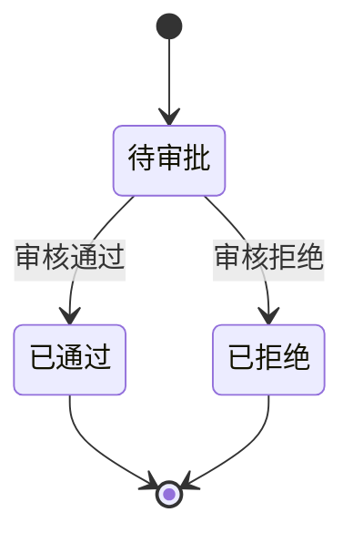
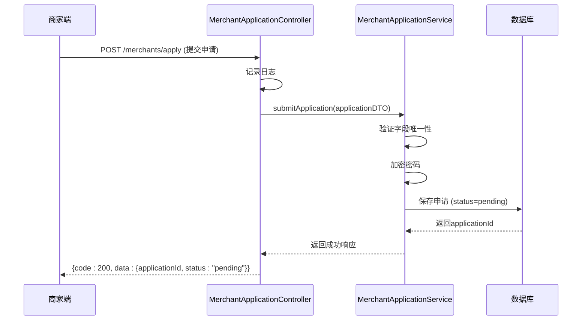

# 商家服务API

<cite>
**本文档引用文件**  
- [MerchantApplicationController.java](file://backend/merchant-service/src/main/java/com/mall/merchant/controller/MerchantApplicationController.java)
- [MerchantProductController.java](file://backend/merchant-service/src/main/java/com/mall/merchant/controller/MerchantProductController.java)
- [MerchantApplicationDTO.java](file://backend/merchant-service/src/main/java/com/mall/merchant/domain/dto/MerchantApplicationDTO.java)
- [ProductInventoryUpdateDTO.java](file://backend/merchant-service/src/main/java/com/mall/merchant/domain/dto/ProductInventoryUpdateDTO.java)
</cite>

## 目录
1. [简介](#简介)
2. [商家入驻申请API](#商家入驻申请api)
3. [商家信息管理API](#商家信息管理api)
4. [商品管理API](#商品管理api)
5. [数据传输对象结构](#数据传输对象结构)
6. [商家入驻流程与状态转换](#商家入驻流程与状态转换)
7. [API调用序列示例](#api调用序列示例)

## 简介

本API文档详细描述了商家服务的核心功能接口，涵盖商家入驻申请、商家信息查询、商品发布与库存管理等关键操作。文档基于`MerchantApplicationController`和`MerchantProductController`中的端点实现，旨在为开发者提供清晰的API集成指南，帮助其快速接入商家端功能。

**本文档引用文件**  
- [MerchantApplicationController.java](file://backend/merchant-service/src/main/java/com/mall/merchant/controller/MerchantApplicationController.java)
- [MerchantProductController.java](file://backend/merchant-service/src/main/java/com/mall/merchant/controller/MerchantProductController.java)

## 商家入驻申请API

### 提交商家入驻申请

- **端点**: `POST /merchants/apply`
- **功能**: 商家提交入驻申请，包含主体信息、联系人、资质文件及登录凭证。
- **请求体**: `MerchantApplicationDTO`
- **响应**:
  - 成功：返回`200`，包含申请ID、状态（待审批）、提交时间等。
  - 失败：返回`500`，包含错误信息。

### 查询申请详情

- **端点**: `GET /merchants/applications/{id}`
- **功能**: 根据申请ID查询详细的入驻申请信息。
- **参数**: `id` (Long) - 申请记录的唯一标识。
- **响应**: 返回完整的申请数据对象。

### 查询申请列表（分页）

- **端点**: `GET /merchants/applications`
- **功能**: 分页查询商家入驻申请列表，支持按状态和关键词筛选。
- **参数**:
  - `page`: 页码（默认1）
  - `size`: 每页数量（默认10）
  - `status`: 审批状态（可选）
  - `keyword`: 搜索关键词（可选）
- **响应**: 返回分页数据，包含记录列表、总数、当前页码等。

### 获取申请统计

- **端点**: `GET /merchants/applications/stats`
- **功能**: 获取商家入驻申请的统计信息，如待审批、已通过、已拒绝的数量。
- **响应**: 返回一个包含各类状态计数的JSON对象。

### 审核申请

- **端点**: `PUT /merchants/applications/{id}/audit`
- **功能**: 管理员对商家入驻申请进行审核，决定通过或拒绝。
- **参数**:
  - `id`: 申请ID
  - `approved`: 布尔值，表示是否通过
  - `reason`: 审核意见（可选）
  - `adminId`: 审核管理员ID
  - `adminName`: 审核管理员姓名
- **响应**: 审核成功返回`200`，失败返回`500`。

**本文档引用文件**  
- [MerchantApplicationController.java](file://backend/merchant-service/src/main/java/com/mall/merchant/controller/MerchantApplicationController.java)

## 商家信息管理API

### 获取商家信息

- **端点**: `GET /merchant/info`
- **功能**: 查询当前登录商家的基本信息。
- **响应**: 返回商家实体信息。

### 更新商家信息

- **端点**: `PUT /merchant/info`
- **功能**: 更新商家的基本信息，如联系方式、店铺简介等。
- **请求体**: 包含需更新的字段。
- **响应**: 更新成功返回`200`，失败返回`400`或`500`。

**本文档引用文件**  
- [MerchantApplicationController.java](file://backend/merchant-service/src/main/java/com/mall/merchant/controller/MerchantApplicationController.java)

## 商品管理API

### 新增商品

- **端点**: `POST /merchant/products`
- **功能**: 商家发布新商品。
- **请求体**: `MerchantProduct` 对象。
- **响应**: 创建成功返回`200`。

### 更新商品信息

- **端点**: `PUT /merchant/products/{productId}`
- **功能**: 修改商品的基本信息。
- **参数**: `productId` - 商品ID。
- **响应**: 更新成功返回`200`。

### 删除商品

- **端点**: `DELETE /merchant/products/{productId}`
- **功能**: 删除指定商品。
- **参数**: `productId` - 商品ID, `merchantId` - 商家ID。
- **响应**: 删除成功返回`200`。

### 商品上下架

- **上架**: `POST /merchant/products/{productId}/on-shelf`
- **下架**: `POST /merchant/products/{productId}/off-shelf`
- **功能**: 控制商品在商城中的可见状态。
- **参数**: `productId`, `merchantId`。
- **响应**: 操作成功返回`200`。

### 批量操作

- **批量上架/下架**: `POST /merchant/products/batch-on-shelf` 或 `batch-off-shelf`
- **批量删除**: `DELETE /merchant/products/batch`
- **功能**: 对多个商品进行批量操作。
- **请求体**: `List<Long>` 商品ID列表。
- **响应**: 操作成功返回`200`。

### 库存管理

- **更新库存**: `PUT /merchant/products/{productId}/stock`
- **功能**: 修改商品的库存数量。
- **参数**: `productId`, `merchantId`, `quantity` (库存变化量)。
- **响应**: 更新成功返回`200`。

### 价格管理

- **更新价格**: `PUT /merchant/products/{productId}/price`
- **功能**: 修改商品的销售价格。
- **参数**: `productId`, `merchantId`, `price` (新价格)。
- **响应**: 更新成功返回`200`。

**本文档引用文件**  
- [MerchantProductController.java](file://backend/merchant-service/src/main/java/com/mall/merchant/controller/MerchantProductController.java)

## 数据传输对象结构

### MerchantApplicationDTO

该DTO用于提交商家入驻申请，包含以下字段：

| 字段 | 类型 | 必填 | 说明 | 验证规则 |
|------|------|------|------|----------|
| entityType | String | 是 | 主体类型 | enterprise/individual/personal |
| shopType | String | 否 | 店铺类型 | flagship/specialty/franchise/ordinary/small |
| shopName | String | 是 | 店铺名称 | 2-50字符，唯一 |
| contactName | String | 是 | 联系人姓名 | - |
| contactPhone | String | 是 | 联系电话 | 11位手机号，唯一 |
| email | String | 是 | 邮箱地址 | 有效的邮箱格式 |
| companyName | String | 条件 | 公司名称 | 企业/个体必填 |
| creditCode | String | 条件 | 统一社会信用代码 | 企业/个体必填，18位 |
| legalPerson | String | 条件 | 法人代表 | 企业/个体必填 |
| businessLicense | String | 条件 | 营业执照URL | 企业/个体必填 |
| idCard | String | 条件 | 身份证号 | 个人必填，18位 |
| idCardFront | String | 条件 | 身份证正面URL | 个人必填 |
| idCardBack | String | 条件 | 身份证反面URL | 个人必填 |
| username | String | 是 | 登录账号 | 唯一，字母数字 |
| password | String | 是 | 登录密码 | 6-20字符 |

### ProductInventoryUpdateDTO

该DTO用于更新商品库存信息。

| 字段 | 类型 | 必填 | 说明 | 示例 |
|------|------|------|------|------|
| productId | Long | 是 | 商品ID | 1001 |
| stock | Integer | 是 | 库存数量 | 100 |
| lowStockThreshold | Integer | 否 | 库存预警阈值 | 10 |
| reason | String | 否 | 更新原因 | 采购入库 |

**本文档引用文件**  
- [MerchantApplicationDTO.java](file://backend/merchant-service/src/main/java/com/mall/merchant/domain/dto/MerchantApplicationDTO.java)
- [ProductInventoryUpdateDTO.java](file://backend/merchant-service/src/main/java/com/mall/merchant/domain/dto/ProductInventoryUpdateDTO.java)

## 商家入驻流程与状态转换

### 入驻流程

1.  **提交申请**: 商家通过`POST /merchants/apply`提交`MerchantApplicationDTO`。
2.  **数据验证**: 系统验证用户名、手机号、店铺名称的唯一性，并对密码进行加密。
3.  **保存申请**: 申请数据被持久化到`merchant_applications`表中，状态为“待审批”(0)。
4.  **等待审核**: 管理员在后台查看待审批列表。
5.  **执行审核**: 管理员通过`PUT /merchants/applications/{id}/audit`进行审核。
6.  **结果处理**:
    -   **通过**: 状态更新为“已通过”(1)，系统自动创建对应的商家账号。
    -   **拒绝**: 状态更新为“已拒绝”(2)，并记录拒绝原因。

### 状态转换规则

**本文档引用文件**  
- [MerchantApplicationController.java](file://backend/merchant-service/src/main/java/com/mall/merchant/controller/MerchantApplicationController.java)

## API调用序列示例

以下是一个完整的商家入驻API调用序列：

**本文档引用文件**  
- [MerchantApplicationController.java](file://backend/merchant-service/src/main/java/com/mall/merchant/controller/MerchantApplicationController.java)
- [MerchantApplicationDTO.java](file://backend/merchant-service/src/main/java/com/mall/merchant/domain/dto/MerchantApplicationDTO.java)