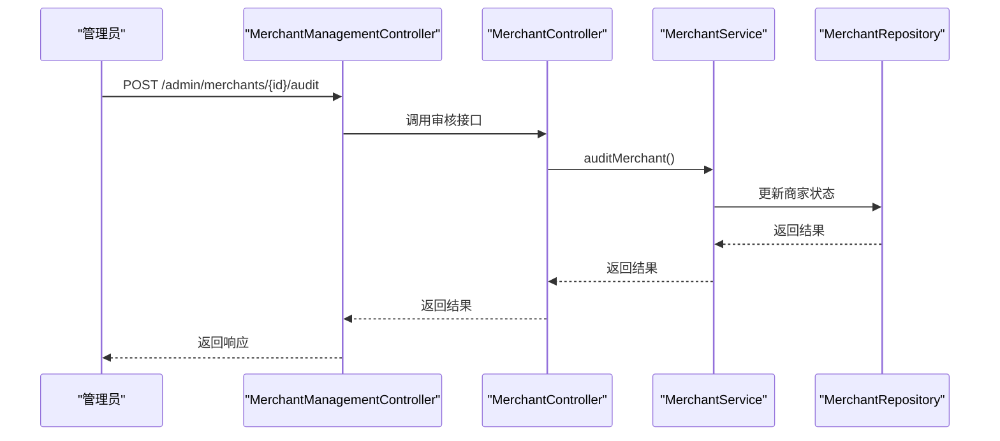
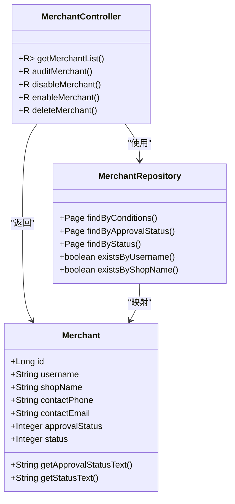
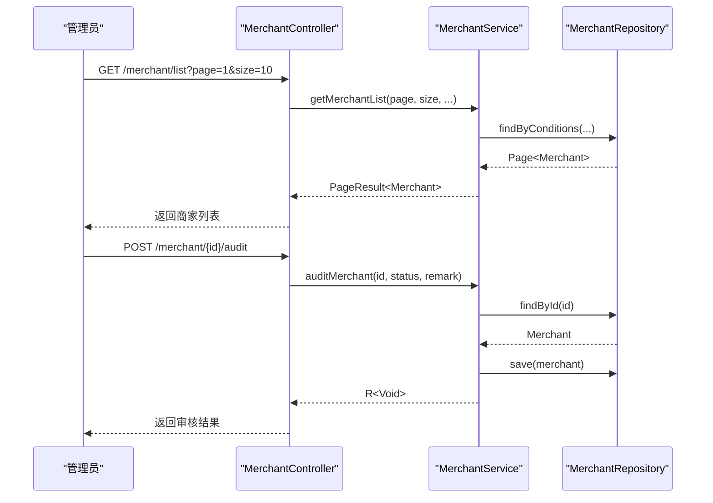
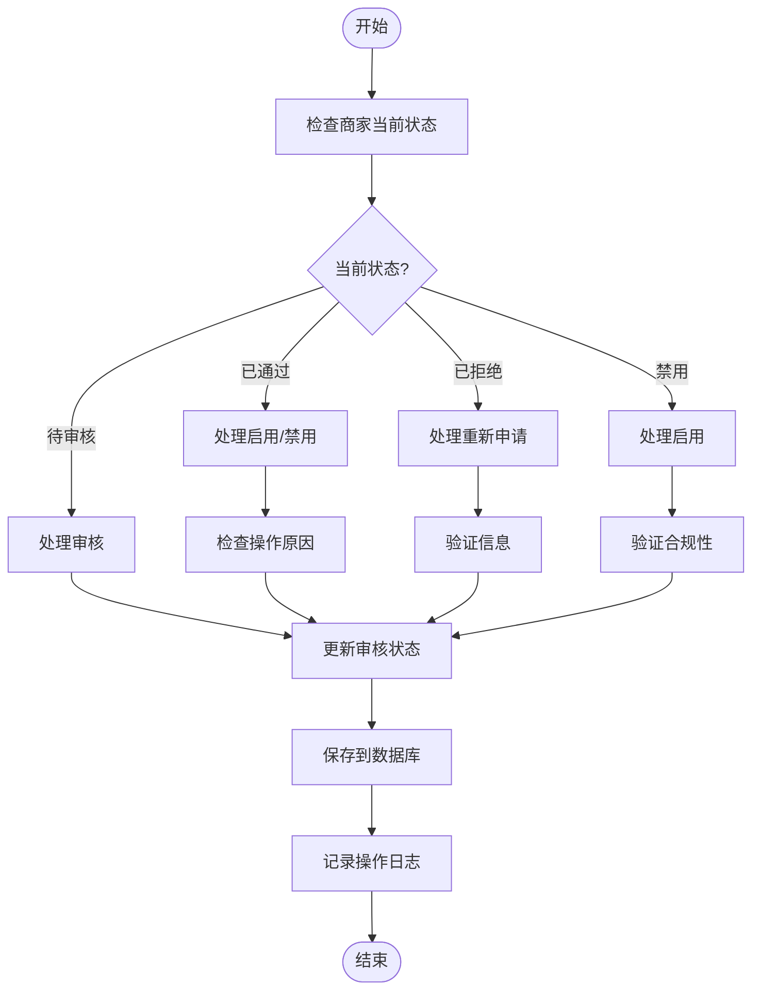
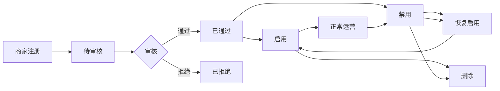
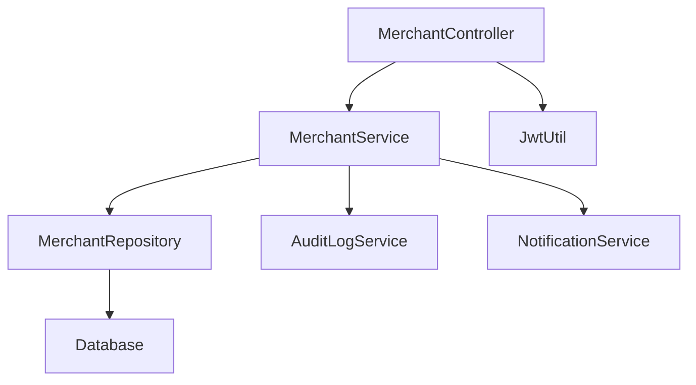

# 商家状态管理API

<cite>
**本文档引用文件**   
- [MerchantController.java](file://backend/merchant-service/src/main/java/com/mall/merchant/controller/MerchantController.java)
- [MerchantRepository.java](file://backend/merchant-service/src/main/java/com/mall/merchant/repository/MerchantRepository.java)
- [MerchantManagementController.java](file://backend/admin-service/src/main/java/com/mall/admin/controller/MerchantManagementController.java)
- [MerchantApprovalController.java](file://backend/admin-service/src/main/java/com/mall/admin/controller/MerchantApprovalController.java)
- [Merchant.java](file://backend/merchant-service/src/main/java/com/mall/merchant/domain/entity/Merchant.java)
</cite>

## 目录
1. [简介](#简介)
2. [项目结构](#项目结构)
3. [核心组件](#核心组件)
4. [架构概述](#架构概述)
5. [详细组件分析](#详细组件分析)
6. [依赖分析](#依赖分析)
7. [性能考虑](#性能考虑)
8. [故障排除指南](#故障排除指南)
9. [结论](#结论)
10. [附录](#附录)（如有必要）

## 简介
本文档详细描述了商家状态管理API的功能，涵盖商家账号状态的查询、变更和管理操作。基于`MerchantController`中的`/list`、`/audit`、`/disable`、`/enable`、`/delete`等端点，记录管理员对商家账号进行审核、启用、禁用、删除等状态管理操作的API规格。文档说明了商家状态机的设计，包括待审核、已通过、已拒绝、启用、禁用等多种状态的转换规则和触发条件，并提供商家状态管理的典型使用场景示例，如批量查询商家状态、处理违规商家、恢复被禁用账号等。

## 项目结构
商家状态管理功能主要分布在`merchant-service`和`admin-service`两个微服务中。`merchant-service`负责商家实体的定义和基础状态管理，而`admin-service`提供管理员专用的商家管理接口。核心文件包括`MerchantController.java`（商家管理控制器）、`MerchantRepository.java`（商家数据访问层）和`MerchantManagementController.java`（管理员商家管理控制器）。

```mermaid
graph TD
subgraph "merchant-service"
MerchantController[商家管理控制器]
MerchantRepository[商家数据访问层]
MerchantEntity[商家实体]
end
subgraph "admin-service"
MerchantManagementController[商家管理控制器]
MerchantApprovalController[商家审批控制器]
end
MerchantManagementController --> MerchantController : "调用"
MerchantController --> MerchantRepository : "使用"
MerchantRepository --> MerchantEntity : "映射"
```

**图示来源**
- [MerchantController.java](file://backend/merchant-service/src/main/java/com/mall/merchant/controller/MerchantController.java#L30-L418)
- [MerchantRepository.java](file://backend/merchant-service/src/main/java/com/mall/merchant/repository/MerchantRepository.java#L23-L292)
- [MerchantManagementController.java](file://backend/admin-service/src/main/java/com/mall/admin/controller/MerchantManagementController.java#L20-L63)

**章节来源**
- [MerchantController.java](file://backend/merchant-service/src/main/java/com/mall/merchant/controller/MerchantController.java#L1-L418)
- [MerchantManagementController.java](file://backend/admin-service/src/main/java/com/mall/admin/controller/MerchantManagementController.java#L1-L63)

## 核心组件
商家状态管理的核心组件包括`MerchantController`中的状态管理端点和`Merchant`实体中的状态字段。`MerchantController`提供了`/list`、`/audit`、`/disable`、`/enable`、`//delete`等REST API端点，用于查询和修改商家状态。`Merchant`实体定义了`approvalStatus`（审核状态）和`status`（商家状态）两个关键字段，分别表示商家的审核流程状态和运营状态。

**章节来源**
- [MerchantController.java](file://backend/merchant-service/src/main/java/com/mall/merchant/controller/MerchantController.java#L200-L274)
- [Merchant.java](file://backend/merchant-service/src/main/java/com/mall/merchant/domain/entity/Merchant.java#L239-L294)

## 架构概述
商家状态管理采用分层架构，由控制器层、服务层和数据访问层组成。管理员通过`MerchantManagementController`发起状态管理请求，该请求被转发到`merchant-service`的`MerchantController`。`MerchantController`调用`MerchantService`处理业务逻辑，最终通过`MerchantRepository`持久化状态变更。状态变更操作会记录操作日志并触发相关事件。



**图示来源**
- [MerchantManagementController.java](file://backend/admin-service/src/main/java/com/mall/admin/controller/MerchantManagementController.java#L53-L63)
- [MerchantController.java](file://backend/merchant-service/src/main/java/com/mall/merchant/controller/MerchantController.java#L222-L230)

## 详细组件分析

### 商家状态管理组件分析
商家状态管理组件实现了完整的商家生命周期管理，从注册到注销的各个状态转换。核心功能包括商家列表查询、审核、启用、禁用和删除操作。状态管理遵循严格的业务规则，确保商家状态的合法性和一致性。

#### 对象导向组件


**图示来源**
- [Merchant.java](file://backend/merchant-service/src/main/java/com/mall/merchant/domain/entity/Merchant.java#L10-L606)
- [MerchantController.java](file://backend/merchant-service/src/main/java/com/mall/merchant/controller/MerchantController.java#L30-L418)
- [MerchantRepository.java](file://backend/merchant-service/src/main/java/com/mall/merchant/repository/MerchantRepository.java#L23-L292)

#### API/服务组件


**图示来源**
- [MerchantController.java](file://backend/merchant-service/src/main/java/com/mall/merchant/controller/MerchantController.java#L200-L230)
- [MerchantService.java](file://backend/merchant-service/src/main/java/com/mall/merchant/service/MerchantService.java#L1-L100)

#### 复杂逻辑组件


**图示来源**
- [MerchantController.java](file://backend/merchant-service/src/main/java/com/mall/merchant/controller/MerchantController.java#L222-L274)
- [MerchantService.java](file://backend/merchant-service/src/main/java/com/mall/merchant/service/MerchantService.java#L1-L100)

**章节来源**
- [MerchantController.java](file://backend/merchant-service/src/main/java/com/mall/merchant/controller/MerchantController.java#L200-L274)
- [MerchantService.java](file://backend/merchant-service/src/main/java/com/mall/merchant/service/MerchantService.java#L1-L100)

### 概念概述
商家状态管理是电商平台的核心功能之一，确保商家账号的合规性和安全性。通过严格的状态机设计，系统能够有效管理商家的整个生命周期，从入驻申请到正常运营，再到违规处理和账号注销。



## 依赖分析
商家状态管理功能依赖于多个组件和服务。`MerchantController`依赖于`MerchantService`实现业务逻辑，`MerchantService`依赖于`MerchantRepository`进行数据持久化。此外，状态管理操作需要与认证服务和日志服务集成，确保操作的安全性和可追溯性。



**图示来源**
- [MerchantController.java](file://backend/merchant-service/src/main/java/com/mall/merchant/controller/MerchantController.java#L39-L40)
- [MerchantService.java](file://backend/merchant-service/src/main/java/com/mall/merchant/service/MerchantService.java#L1-L100)

**章节来源**
- [MerchantController.java](file://backend/merchant-service/src/main/java/com/mall/merchant/controller/MerchantController.java#L1-L418)
- [MerchantService.java](file://backend/merchant-service/src/main/java/com/mall/merchant/service/MerchantService.java#L1-L100)

## 性能考虑
商家状态管理API在设计时考虑了性能优化。列表查询接口支持分页和多条件筛选，避免全表扫描。状态变更操作采用事务管理，确保数据一致性。对于高频查询，建议使用缓存机制减少数据库压力。批量操作应采用异步处理，避免长时间阻塞。

## 故障排除指南
常见问题包括状态变更失败、列表查询超时和权限不足。状态变更失败通常由于业务规则校验不通过，需检查商家当前状态是否允许目标状态转换。列表查询超时可能是由于查询条件过于宽泛，建议添加更多筛选条件。权限不足问题需检查管理员角色权限配置。

**章节来源**
- [MerchantController.java](file://backend/merchant-service/src/main/java/com/mall/merchant/controller/MerchantController.java#L200-L274)
- [GlobalExceptionHandler.java](file://backend/merchant-service/src/main/java/com/mall/merchant/handler/GlobalExceptionHandler.java#L1-L50)

## 结论
商家状态管理API提供了完整的商家账号生命周期管理功能，通过清晰的状态机设计和严格的业务规则，确保了商家管理的安全性和合规性。API设计遵循RESTful规范，易于集成和使用。未来可考虑增加状态变更的审批流程和更细粒度的权限控制。