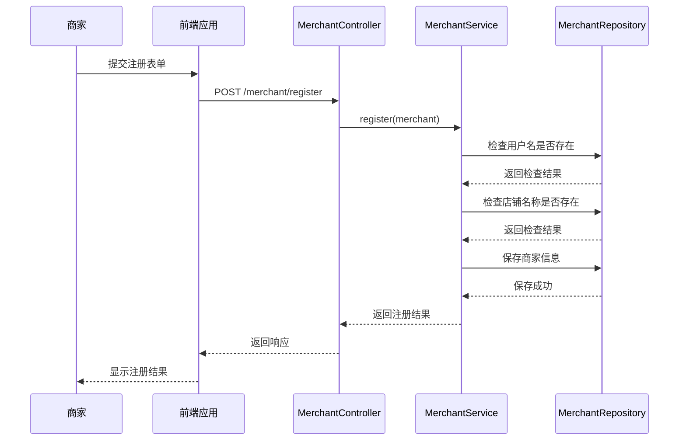
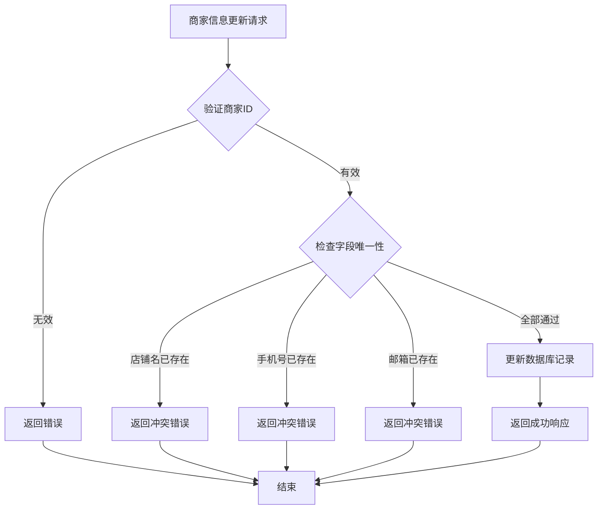
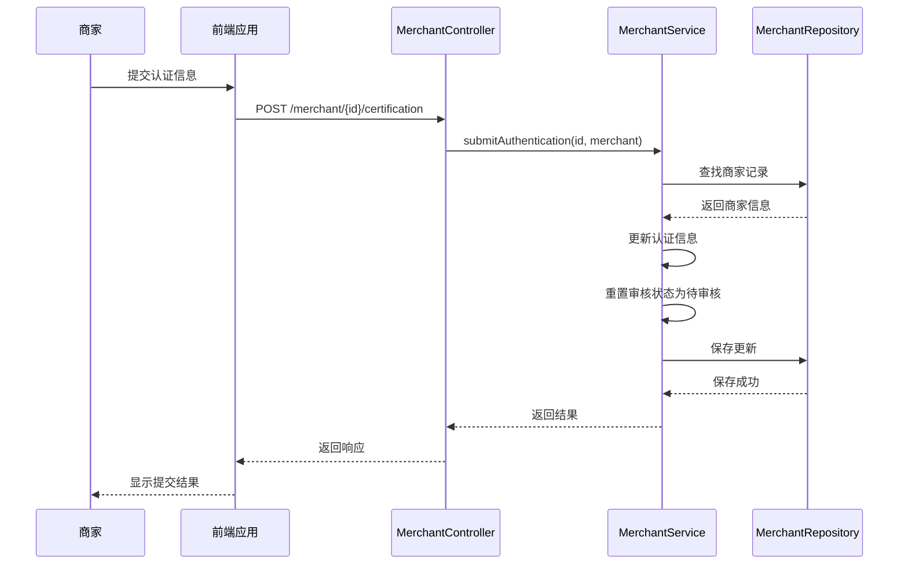
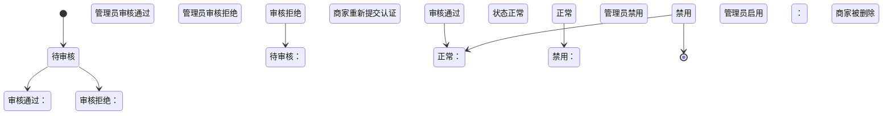
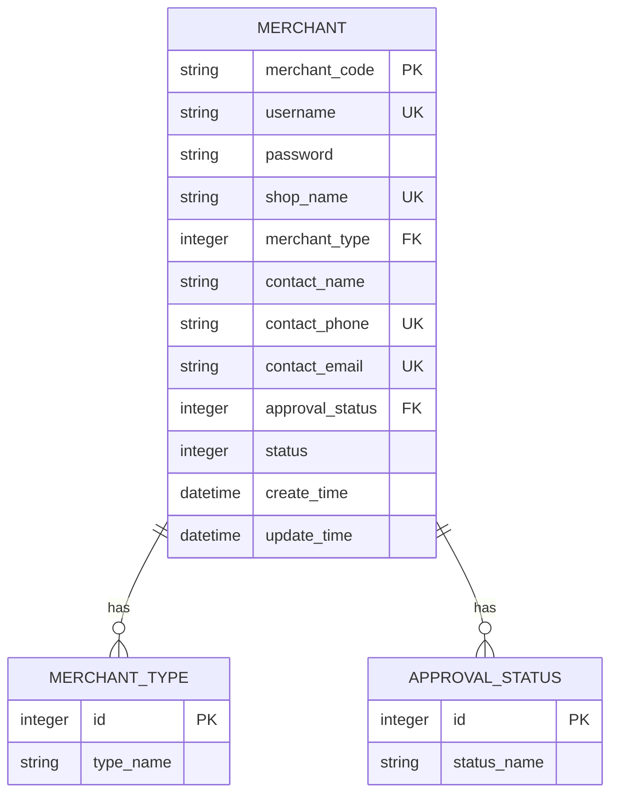

# 商家管理API

<cite>
**本文档引用文件**  
- [MerchantController.java](file://backend/merchant-service/src/main/java/com/mall/merchant/controller/MerchantController.java)
- [MerchantServiceImpl.java](file://backend/merchant-service/src/main/java/com/mall/merchant/service/impl/MerchantServiceImpl.java)
- [Merchant.java](file://backend/merchant-service/src/main/java/com/mall/merchant/domain/entity/Merchant.java)
- [MerchantApplicationDTO.java](file://backend/merchant-service/src/main/java/com/mall/merchant/domain/dto/MerchantApplicationDTO.java)
</cite>

## 目录
1. [简介](#简介)
2. [商家注册与登录](#商家注册与登录)
3. [商家信息管理](#商家信息管理)
4. [认证审核机制](#认证审核机制)
5. [商家状态转换流程](#商家状态转换流程)
6. [API接口规格](#api接口规格)
7. [审核状态与商家类型](#审核状态与商家类型)
8. [数据验证规则](#数据验证规则)

## 简介

本API文档详细描述了商家管理系统的完整生命周期管理功能，涵盖商家注册、登录、信息更新、认证提交、审核流程及状态管理等核心功能。系统通过`MerchantController`提供RESTful接口，实现商家账号从创建到运营的全流程管理。

商家管理服务（merchant-service）作为独立微服务，负责处理所有商家相关的业务逻辑，包括身份认证、信息维护和状态变更。该系统与前端商家门户、管理后台紧密集成，支持多角色权限控制和完整的审核机制。

**Section sources**
- [MerchantController.java](file://backend/merchant-service/src/main/java/com/mall/merchant/controller/MerchantController.java#L1-L419)

## 商家注册与登录

### 注册流程

商家注册采用分步式表单提交，通过`/merchant/register`接口接收商家基本信息。系统在注册过程中执行多项验证：

- 用户名唯一性检查
- 店铺名称唯一性检查
- 手机号唯一性检查
- 邮箱唯一性检查

注册成功后，商家账户默认处于"待审核"状态，无法进行商品上架等核心操作，必须通过管理员审核后方可正常使用。

### 登录机制

商家登录通过`/merchant/login`接口实现，采用JWT（JSON Web Token）认证机制。登录成功后返回包含以下信息的响应：
- 商家ID
- 用户名
- 店铺名称
- 头像URL
- 角色标识
- JWT令牌

系统在登录验证时会检查商家的审核状态和账户状态，确保只有通过审核且未被禁用的商家才能成功登录。

**Diagram sources**
- [MerchantController.java](file://backend/merchant-service/src/main/java/com/mall/merchant/controller/MerchantController.java#L48-L53)
- [MerchantServiceImpl.java](file://backend/merchant-service/src/main/java/com/mall/merchant/service/impl/MerchantServiceImpl.java#L53-L125)

## 商家信息管理

### 基本信息更新

商家可以随时更新其基本信息，包括店铺名称、联系方式、地址等。通过`/merchant/{merchantId}`接口的PUT方法实现信息更新。系统在更新时会进行数据一致性检查，确保更新后的信息不会与其他商家冲突。

### 密码管理

系统提供完整的密码管理功能：
- `PUT /merchant/{merchantId}/password`：修改密码，需要提供原密码验证
- `POST /merchant/reset-password`：通过手机验证码重置密码
- `POST /merchant/send-verification-code`：发送手机验证码

密码在数据库中采用BCrypt加密存储，确保安全性。

### 头像更新

商家可以通过`POST /merchant/{merchantId}/avatar`接口上传和更新头像。该接口接收MultipartFile类型的文件参数，上传成功后更新商家头像URL。

**Diagram sources**
- [MerchantController.java](file://backend/merchant-service/src/main/java/com/mall/merchant/controller/MerchantController.java#L108-L116)
- [MerchantServiceImpl.java](file://backend/merchant-service/src/main/java/com/mall/merchant/service/impl/MerchantServiceImpl.java#L304-L363)

## 认证审核机制

### 认证提交

商家通过`POST /merchant/{merchantId}/certification`接口提交认证信息。提交的信息包括：
- 商家类型（个人/企业）
- 身份证信息（个人商家）
- 营业执照信息（企业商家）
- 银行账户信息

提交认证后，商家的审核状态自动重置为"待审核"，等待管理员处理。

### 审核流程

管理员通过`POST /merchant/{merchantId}/audit`接口对商家认证进行审核。审核时需要提供：
- 审核状态（通过/拒绝）
- 审核备注（可选）

审核通过后，商家获得完整权限；审核拒绝时，商家可查看拒绝原因并重新提交认证。

**Diagram sources**
- [MerchantController.java](file://backend/merchant-service/src/main/java/com/mall/merchant/controller/MerchantController.java#L164-L171)
- [MerchantServiceImpl.java](file://backend/merchant-service/src/main/java/com/mall/merchant/service/impl/MerchantServiceImpl.java#L446-L485)

## 商家状态转换流程

商家账户在其生命周期中会经历多种状态转换，系统通过状态机模式管理这些转换。

### 状态定义

商家主要有两种状态维度：
1. **审核状态**：表示商家认证的审核进度
2. **账户状态**：表示商家账户的可用性

### 状态转换规则

- 新注册商家：审核状态为"待审核"，账户状态为"正常"
- 审核通过：审核状态变为"审核通过"，账户状态保持"正常"
- 审核拒绝：审核状态变为"审核拒绝"，账户状态保持"正常"
- 管理员禁用：账户状态变为"禁用"，商家无法登录
- 管理员启用：账户状态恢复为"正常"

**Diagram sources**
- [Merchant.java](file://backend/merchant-service/src/main/java/com/mall/merchant/domain/entity/Merchant.java#L158-L185)
- [MerchantServiceImpl.java](file://backend/merchant-service/src/main/java/com/mall/merchant/service/impl/MerchantServiceImpl.java#L593-L657)

## API接口规格

### 商家注册
- **端点**: `POST /merchant/register`
- **请求体**: Merchant对象
- **验证**: 用户名、店铺名、手机号、邮箱唯一性
- **响应**: 成功返回200，失败返回400或500

### 商家登录
- **端点**: `POST /merchant/login`
- **参数**: username, password
- **响应**: 包含JWT令牌的商家信息

### 信息更新
- **端点**: `PUT /merchant/{merchantId}`
- **请求体**: Merchant对象（仅更新允许修改的字段）
- **安全**: 需要商家身份验证

### 认证提交
- **端点**: `POST /merchant/{merchantId}/certification`
- **请求体**: 包含认证信息的Merchant对象
- **状态变更**: 审核状态重置为待审核

### 审核操作
- **端点**: `POST /merchant/{merchantId}/audit`
- **参数**: auditStatus(1-通过,2-拒绝), auditRemark
- **权限**: 仅管理员可用

### 状态管理
- **禁用**: `POST /merchant/{merchantId}/disable`
- **启用**: `POST /merchant/{merchantId}/enable`
- **删除**: `DELETE /merchant/{merchantId}`（软删除）

**Section sources**
- [MerchantController.java](file://backend/merchant-service/src/main/java/com/mall/merchant/controller/MerchantController.java#L48-L418)

## 审核状态与商家类型

### 审核状态

| 状态值 | 状态文本 | 说明 |
|-------|---------|------|
| 0 | 待审核 | 新注册或重新提交认证 |
| 1 | 审核通过 | 认证已完成，可正常经营 |
| 2 | 审核拒绝 | 认证材料不合格 |

### 商家类型

| 类型值 | 类型文本 | 说明 |
|-------|---------|------|
| 1 | 个人商家 | 个体经营者 |
| 2 | 企业商家 | 公司实体 |

商家类型决定了所需的认证材料：
- 个人商家：身份证正反面照片
- 企业商家：营业执照、法人身份证、公司信息

**Diagram sources**
- [Merchant.java](file://backend/merchant-service/src/main/java/com/mall/merchant/domain/entity/Merchant.java#L58-L185)
- [MerchantController.java](file://backend/merchant-service/src/main/java/com/mall/merchant/controller/MerchantController.java#L174-L186)

## 数据验证规则

### 字段验证

系统对关键字段实施严格的验证规则：

- **用户名**: 6-20字符，仅允许字母、数字和下划线
- **密码**: 6-20字符
- **店铺名称**: 2-50字符
- **手机号**: 符合中国大陆手机号格式
- **邮箱**: 符合标准邮箱格式

### 唯一性约束

以下字段具有唯一性约束：
- 用户名
- 店铺名称
- 手机号
- 邮箱

### 空值处理

系统在实体持久化前会进行缺省值填充：
- 联系人姓名：默认使用用户名
- 商家类型：默认为个人商家
- 审核状态：默认为待审核
- 账户状态：默认为正常

这些规则确保了数据的完整性和一致性，即使在测试环境中也能正常运行。

**Section sources**
- [MerchantApplicationDTO.java](file://backend/merchant-service/src/main/java/com/mall/merchant/domain/dto/MerchantApplicationDTO.java#L1-L106)
- [Merchant.java](file://backend/merchant-service/src/main/java/com/mall/merchant/domain/entity/Merchant.java#L226-L248)
- [MerchantServiceImpl.java](file://backend/merchant-service/src/main/java/com/mall/merchant/service/impl/MerchantServiceImpl.java#L55-L91)