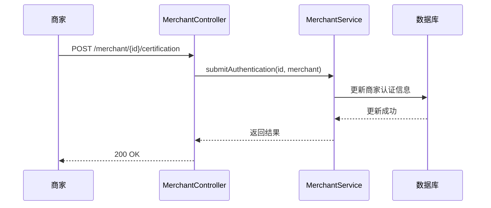
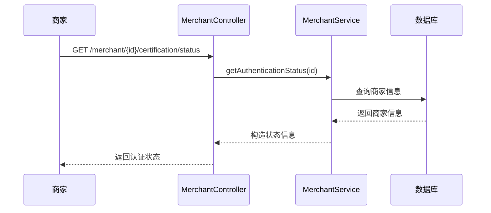
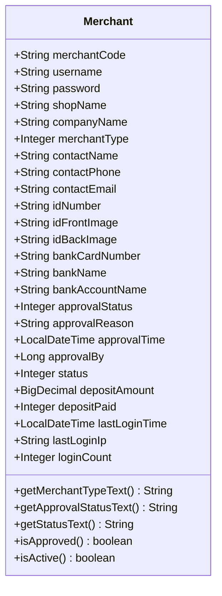
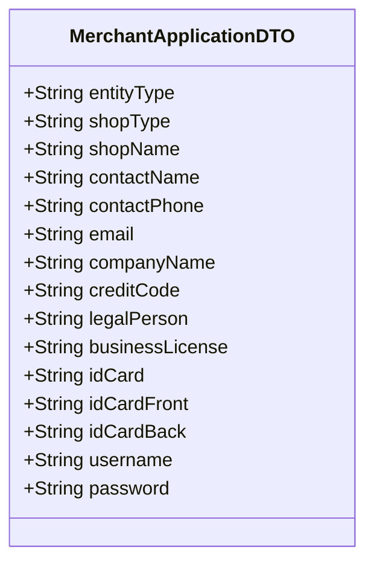
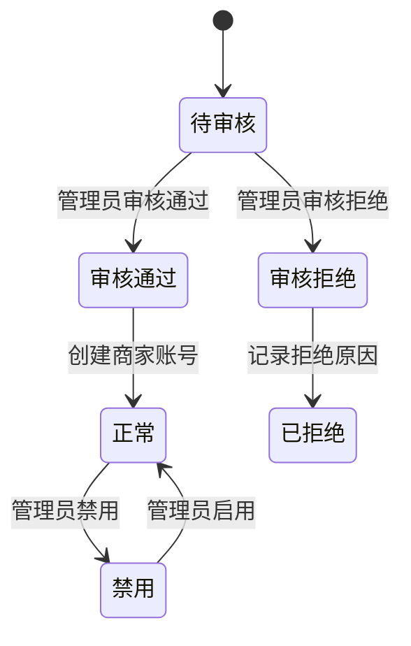
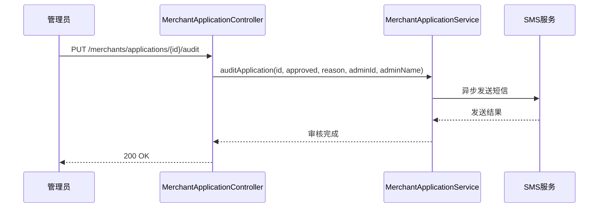

# 商家认证审核API

<cite>
**本文档引用文件**  
- [MerchantController.java](file://backend/merchant-service/src/main/java/com/mall/merchant/controller/MerchantController.java)
- [MerchantApplicationController.java](file://backend/merchant-service/src/main/java/com/mall/merchant/controller/MerchantApplicationController.java)
- [MerchantApplicationController.java](file://backend/admin-service/src/main/java/com/mall/admin/controller/MerchantApplicationController.java)
- [Merchant.java](file://backend/merchant-service/src/main/java/com/mall/merchant/domain/entity/Merchant.java)
- [MerchantApplicationDTO.java](file://backend/merchant-service/src/main/java/com/mall/merchant/domain/dto/MerchantApplicationDTO.java)
- [MerchantApplicationVO.java](file://backend/merchant-service/src/main/java/com/mall/merchant/domain/vo/MerchantApplicationVO.java)
- [MerchantServiceImpl.java](file://backend/merchant-service/src/main/java/com/mall/merchant/service/impl/MerchantServiceImpl.java)
- [MerchantApplicationServiceImpl.java](file://backend/merchant-service/src/main/java/com/mall/merchant/service/impl/MerchantApplicationServiceImpl.java)
- [MerchantServiceClient.java](file://backend/admin-service/src/main/java/com/mall/admin/client/MerchantServiceClient.java)
</cite>

## 目录
1. [简介](#简介)
2. [商家认证信息提交](#商家认证信息提交)
3. [商家入驻申请流程](#商家入驻申请流程)
4. [认证状态查询](#认证状态查询)
5. [管理员审核流程](#管理员审核流程)
6. [数据结构说明](#数据结构说明)
7. [状态转换机制](#状态转换机制)
8. [审核结果通知](#审核结果通知)
9. [交互示例](#交互示例)

## 简介
本文档详细描述了在线商城系统中商家认证审核的完整API流程。系统提供了两种商家入驻方式：直接提交认证信息和提交入驻申请。商家可通过`/merchant/{merchantId}/certification`端点提交认证材料，或通过`/merchants/apply`端点提交完整的入驻申请。管理员可通过`/merchants/applications/{id}/audit`端点对商家申请进行审核，审核结果会通过短信方式通知商家。

**Section sources**
- [MerchantController.java](file://backend/merchant-service/src/main/java/com/mall/merchant/controller/MerchantController.java#L1-L418)
- [MerchantApplicationController.java](file://backend/merchant-service/src/main/java/com/mall/merchant/controller/MerchantApplicationController.java#L1-L205)

## 商家认证信息提交
商家可通过`/merchant/{merchantId}/certification`端点提交认证信息。该接口接收商家ID和认证信息，将商家的认证材料（如身份证、营业执照等）保存到数据库，并将审核状态重置为"待审核"。



**Diagram sources**
- [MerchantController.java](file://backend/merchant-service/src/main/java/com/mall/merchant/controller/MerchantController.java#L164-L171)
- [MerchantServiceImpl.java](file://backend/merchant-service/src/main/java/com/mall/merchant/service/impl/MerchantServiceImpl.java#L446-L486)

**Section sources**
- [MerchantController.java](file://backend/merchant-service/src/main/java/com/mall/merchant/controller/MerchantController.java#L156-L186)
- [MerchantServiceImpl.java](file://backend/merchant-service/src/main/java/com/mall/merchant/service/impl/MerchantServiceImpl.java#L446-L486)

## 商家入驻申请流程
商家可通过`/merchants/apply`端点提交入驻申请。该流程包括填写入驻表单、上传证件照片、设置登录账号密码并提交申请。系统验证数据后保存到数据库，并返回申请ID。

```mermaid
flowchart TD
A[商家填写入驻表单] --> B[上传证件照片]
B --> C[设置登录账号密码]
C --> D[提交申请]
D --> E[系统验证数据]
E --> F[保存到数据库]
F --> G[返回申请ID]
G --> H[提示"申请提交成功，请等待审核"]
```

**Diagram sources**
- [MerchantApplicationController.java](file://backend/merchant-service/src/main/java/com/mall/merchant/controller/MerchantApplicationController.java#L37-L66)
- [MerchantApplicationServiceImpl.java](file://backend/merchant-service/src/main/java/com/mall/merchant/service/impl/MerchantApplicationServiceImpl.java#L45-L115)

**Section sources**
- [MerchantApplicationController.java](file://backend/merchant-service/src/main/java/com/mall/merchant/controller/MerchantApplicationController.java#L37-L66)
- [MerchantApplicationServiceImpl.java](file://backend/merchant-service/src/main/java/com/mall/merchant/service/impl/MerchantApplicationServiceImpl.java#L45-L115)

## 认证状态查询
商家可通过`/merchant/{merchantId}/certification/status`端点查询自己的认证审核状态。该接口返回审核状态、审核时间、审核备注、商家类型等信息。



**Diagram sources**
- [MerchantController.java](file://backend/merchant-service/src/main/java/com/mall/merchant/controller/MerchantController.java#L180-L185)
- [MerchantServiceImpl.java](file://backend/merchant-service/src/main/java/com/mall/merchant/service/impl/MerchantServiceImpl.java#L494-L521)

**Section sources**
- [MerchantController.java](file://backend/merchant-service/src/main/java/com/mall/merchant/controller/MerchantController.java#L173-L186)
- [MerchantServiceImpl.java](file://backend/merchant-service/src/main/java/com/mall/merchant/service/impl/MerchantServiceImpl.java#L494-L521)

## 管理员审核流程
管理员可通过`/merchants/applications/{id}/audit`端点审核商家申请。审核流程包括查看申请详情、查看证件照片、做出审批决定（通过或拒绝），并通过短信通知商家审核结果。

```mermaid
flowchart TD
A[管理员登录后台] --> B[进入"商家入驻申请"页面]
B --> C[查看待审核列表]
C --> D[点击"审批"按钮]
D --> E[查看申请详情]
E --> F[查看证件照片]
F --> G[做出审批决定]
G --> H{通过?}
H --> |是| I[填写意见选填]
H --> |否| J[填写原因必填]
I --> K[确认通过]
J --> L[确认拒绝]
K --> M[创建商家账号]
L --> N[记录拒绝原因]
M --> O[更新统计数据]
N --> O
O --> P[发送短信通知商家]
P --> Q[审批完成]
```

**Diagram sources**
- [MerchantApplicationController.java](file://backend/merchant-service/src/main/java/com/mall/merchant/controller/MerchantApplicationController.java#L176-L193)
- [MerchantApplicationServiceImpl.java](file://backend/merchant-service/src/main/java/com/mall/merchant/service/impl/MerchantApplicationServiceImpl.java#L139-L166)

**Section sources**
- [MerchantApplicationController.java](file://backend/merchant-service/src/main/java/com/mall/merchant/controller/MerchantApplicationController.java#L176-L193)
- [MerchantApplicationServiceImpl.java](file://backend/merchant-service/src/main/java/com/mall/merchant/service/impl/MerchantApplicationServiceImpl.java#L139-L166)

## 数据结构说明
### 商家认证信息数据结构
商家认证信息包含商家类型、联系人信息、证件信息、银行账户信息等。



**Diagram sources**
- [Merchant.java](file://backend/merchant-service/src/main/java/com/mall/merchant/domain/entity/Merchant.java#L1-L607)

### 商家入驻申请数据结构
商家入驻申请包含主体类型、店铺类型、店铺名称、联系人信息、公司信息、证件信息、登录账号等。



**Diagram sources**
- [MerchantApplicationDTO.java](file://backend/merchant-service/src/main/java/com/mall/merchant/domain/dto/MerchantApplicationDTO.java#L1-L106)

**Section sources**
- [Merchant.java](file://backend/merchant-service/src/main/java/com/mall/merchant/domain/entity/Merchant.java#L1-L607)
- [MerchantApplicationDTO.java](file://backend/merchant-service/src/main/java/com/mall/merchant/domain/dto/MerchantApplicationDTO.java#L1-L106)

## 状态转换机制
商家认证审核流程涉及多个状态的转换，包括商家申请状态和商家账户状态。



**Diagram sources**
- [Merchant.java](file://backend/merchant-service/src/main/java/com/mall/merchant/domain/entity/Merchant.java#L273-L284)
- [MerchantApplicationVO.java](file://backend/merchant-service/src/main/java/com/mall/merchant/domain/vo/MerchantApplicationVO.java#L87-L94)

**Section sources**
- [Merchant.java](file://backend/merchant-service/src/main/java/com/mall/merchant/domain/entity/Merchant.java#L273-L284)
- [MerchantApplicationVO.java](file://backend/merchant-service/src/main/java/com/mall/merchant/domain/vo/MerchantApplicationVO.java#L87-L94)

## 审核结果通知
当管理员完成审核后，系统会通过短信服务通知商家审核结果。无论审核通过还是拒绝，都会发送相应的短信通知。



**Diagram sources**
- [MerchantApplicationServiceImpl.java](file://backend/merchant-service/src/main/java/com/mall/merchant/service/impl/MerchantApplicationServiceImpl.java#L269-L339)
- [MerchantServiceClient.java](file://backend/admin-service/src/main/java/com/mall/admin/client/MerchantServiceClient.java#L104-L111)

**Section sources**
- [MerchantApplicationServiceImpl.java](file://backend/merchant-service/src/main/java/com/mall/merchant/service/impl/MerchantApplicationServiceImpl.java#L269-L339)

## 交互示例
### 提交认证信息
```http
POST /merchant/123/certification
Content-Type: application/json

{
  "merchantType": 1,
  "realName": "张三",
  "idCard": "123456789012345678",
  "idCardFront": "https://example.com/id_front.jpg",
  "idCardBack": "https://example.com/id_back.jpg",
  "businessLicense": "https://example.com/license.jpg",
  "bankCard": "6222021234567890123",
  "bankName": "中国工商银行",
  "accountName": "张三"
}
```

### 查询认证状态
```http
GET /merchant/123/certification/status
```

### 管理员审核申请
```http
PUT /merchants/applications/456/audit
Content-Type: application/json

{
  "approved": true,
  "reason": "资料齐全，符合入驻要求",
  "adminId": 1,
  "adminName": "管理员"
}
```

**Section sources**
- [MerchantController.java](file://backend/merchant-service/src/main/java/com/mall/merchant/controller/MerchantController.java#L164-L185)
- [MerchantApplicationController.java](file://backend/merchant-service/src/main/java/com/mall/merchant/controller/MerchantApplicationController.java#L176-L193)