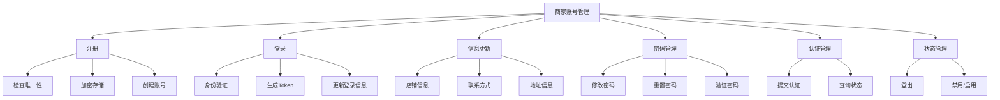
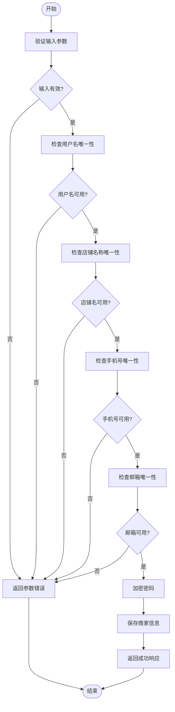
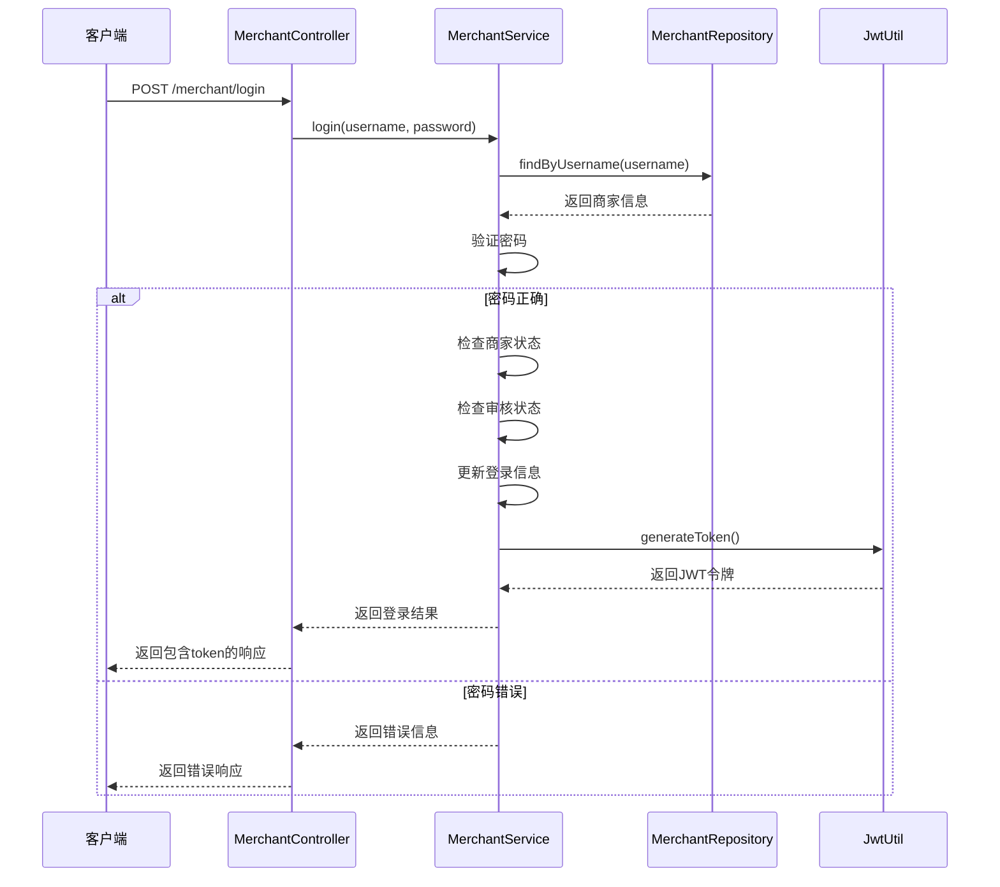
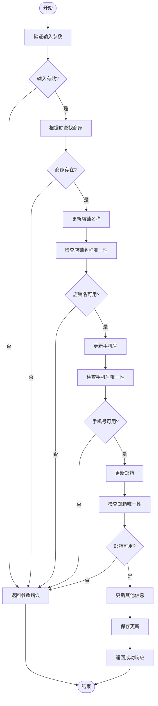
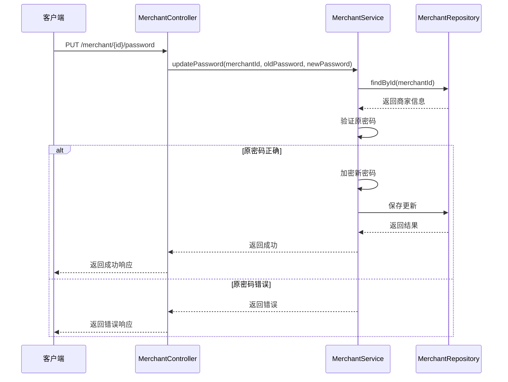
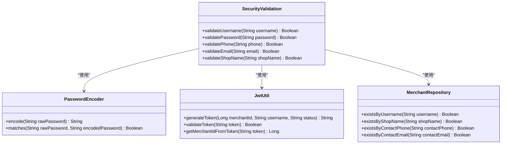

# 商家账号管理API

<cite>
**本文档引用文件**   
- [MerchantController.java](file://backend\merchant-service\src\main\java\com\mall\merchant\controller\MerchantController.java)
- [MerchantService.java](file://backend\merchant-service\src\main\java\com\mall\merchant\service\MerchantService.java)
- [Merchant.java](file://backend\merchant-service\src\main\java\com\mall\merchant\domain\entity\Merchant.java)
- [MerchantServiceImpl.java](file://backend\merchant-service\src\main\java\com\mall\merchant\service\impl\MerchantServiceImpl.java)
- [MerchantServiceTest.java](file://backend\merchant-service\src\test\java\com\mall\merchant\service\MerchantServiceTest.java)
</cite>

## 目录
1. [简介](#简介)
2. [核心功能](#核心功能)
3. [商家注册](#商家注册)
4. [商家登录](#商家登录)
5. [信息更新](#信息更新)
6. [密码管理](#密码管理)
7. [安全验证机制](#安全验证机制)
8. [最佳实践](#最佳实践)
9. [错误码说明](#错误码说明)

## 简介
商家账号管理API为在线商城平台提供完整的商家账号生命周期管理功能。该API集成了商家注册、登录、信息维护、密码管理等核心功能，确保商家能够安全、便捷地管理其账号。系统通过RESTful接口设计，实现了高可用性和可扩展性，支持商家账号的创建、认证、信息维护等完整流程。

本API由`MerchantController`类提供核心端点，通过`MerchantService`服务层处理业务逻辑，并与数据库中的`merchant`表进行数据交互。整个系统设计遵循微服务架构，确保了高内聚、低耦合的特性。

**Section sources**
- [MerchantController.java](file://backend\merchant-service\src\main\java\com\mall\merchant\controller\MerchantController.java#L21-L418)

## 核心功能
商家账号管理API提供以下核心功能：

- **商家注册**：新商家通过提供基本信息完成账号注册
- **商家登录**：使用用户名和密码进行身份验证
- **信息更新**：商家可更新其基本信息，如店铺名称、联系方式等
- **密码管理**：支持密码修改、重置和验证功能
- **账号状态管理**：包括登出、禁用、启用等操作
- **认证管理**：提交和查询商家认证信息及状态

这些功能共同构成了商家账号的完整生命周期管理体系，从注册到日常维护，再到安全控制，为商家提供了全面的账号管理解决方案。



**Diagram sources**
- [MerchantController.java](file://backend\merchant-service\src\main\java\com\mall\merchant\controller\MerchantController.java#L48-L52)
- [MerchantController.java](file://backend\merchant-service\src\main\java\com\mall\merchant\controller\MerchantController.java#L63-L69)

**Section sources**
- [MerchantController.java](file://backend\merchant-service\src\main\java\com\mall\merchant\controller\MerchantController.java#L21-L418)

## 商家注册
商家注册功能允许新商家创建账号，需要提供必要的基本信息。系统在注册过程中会进行多项验证，确保数据的完整性和唯一性。

### 请求参数
| 参数名 | 类型 | 必填 | 描述 | 验证规则 |
|-------|------|------|------|---------|
| username | String | 是 | 用户名 | 唯一，4-20字符，字母数字 |
| password | String | 是 | 密码 | 6-20字符，包含字母和数字 |
| shopName | String | 是 | 店铺名称 | 唯一，2-50字符 |
| contactPhone | String | 是 | 联系电话 | 11位手机号，唯一 |
| email | String | 是 | 邮箱地址 | 有效的邮箱格式，唯一 |
| merchantType | Integer | 是 | 商家类型 | 1-个人商家，2-企业商家 |

### 请求示例
```json
{
  "username": "newmerchant",
  "password": "Password123",
  "shopName": "新店铺",
  "contactPhone": "13800138000",
  "email": "merchant@example.com",
  "merchantType": 1
}
```

### 响应格式
成功响应：
```json
{
  "success": true,
  "message": "注册成功",
  "data": null
}
```

失败响应：
```json
{
  "success": false,
  "message": "用户名已存在",
  "data": null
}
```

### 处理流程


**Diagram sources**
- [MerchantServiceImpl.java](file://backend\merchant-service\src\main\java\com\mall\merchant\service\impl\MerchantServiceImpl.java#L52-L125)

**Section sources**
- [MerchantController.java](file://backend\merchant-service\src\main\java\com\mall\merchant\controller\MerchantController.java#L47-L52)
- [MerchantService.java](file://backend\merchant-service\src\main\java\com\mall\merchant\service\MerchantService.java#L24-L24)
- [MerchantServiceImpl.java](file://backend\merchant-service\src\main\java\com\mall\merchant\service\impl\MerchantServiceImpl.java#L52-L125)

## 商家登录
商家登录功能使用用户名和密码进行身份验证，成功登录后返回包含商家信息和JWT令牌的响应，用于后续的授权访问。

### 请求参数
| 参数名 | 类型 | 必填 | 描述 |
|-------|------|------|------|
| username | String | 是 | 用户名 |
| password | String | 是 | 密码 |

### 请求示例
```json
{
  "username": "merchant123",
  "password": "Password123"
}
```

### 响应格式
成功响应：
```json
{
  "success": true,
  "message": "登录成功",
  "data": {
    "merchantId": 1001,
    "username": "merchant123",
    "shopName": "测试店铺",
    "avatar": "https://example.com/avatar.jpg",
    "auditStatus": 1,
    "status": 1,
    "role": "merchant",
    "isMerchant": true,
    "merchantType": 1,
    "token": "eyJhbGciOiJIUzI1NiIsInR5cCI6IkpXVCJ9..."
  }
}
```

失败响应：
```json
{
  "success": false,
  "message": "用户名或密码错误",
  "data": null
}
```

### 登录流程


**Diagram sources**
- [MerchantController.java](file://backend\merchant-service\src\main\java\com\mall\merchant\controller\MerchantController.java#L62-L69)
- [MerchantService.java](file://backend\merchant-service\src\main\java\com\mall\merchant\service\MerchantService.java#L33-L33)
- [MerchantServiceImpl.java](file://backend\merchant-service\src\main\java\com\mall\merchant\service\impl\MerchantServiceImpl.java#L135-L214)

**Section sources**
- [MerchantController.java](file://backend\merchant-service\src\main\java\com\mall\merchant\controller\MerchantController.java#L62-L69)
- [MerchantService.java](file://backend\merchant-service\src\main\java\com\mall\merchant\service\MerchantService.java#L33-L33)
- [MerchantServiceImpl.java](file://backend\merchant-service\src\main\java\com\mall\merchant\service\impl\MerchantServiceImpl.java#L135-L214)

## 信息更新
信息更新功能允许商家修改其基本信息，包括店铺名称、联系方式、地址等。系统在更新过程中会进行相应的唯一性检查，确保数据的完整性。

### 请求参数
| 参数名 | 类型 | 必填 | 描述 |
|-------|------|------|------|
| merchantId | Long | 是 | 商家ID（路径参数） |
| shopName | String | 否 | 店铺名称 |
| contactPhone | String | 否 | 联系电话 |
| email | String | 否 | 邮箱地址 |
| shopDescription | String | 否 | 店铺描述 |
| address | String | 否 | 详细地址 |

### 请求示例
```json
{
  "shopName": "更新后的店铺名称",
  "contactPhone": "13700137000",
  "email": "newemail@example.com",
  "shopDescription": "这是一家优秀的店铺",
  "address": "北京市朝阳区某街道"
}
```

### 响应格式
成功响应：
```json
{
  "success": true,
  "message": "更新成功",
  "data": null
}
```

失败响应：
```json
{
  "success": false,
  "message": "手机号已被使用",
  "data": null
}
```

### 更新流程


**Diagram sources**
- [MerchantServiceImpl.java](file://backend\merchant-service\src\main\java\com\mall\merchant\service\impl\MerchantServiceImpl.java#L303-L363)

**Section sources**
- [MerchantController.java](file://backend\merchant-service\src\main\java\com\mall\merchant\controller\MerchantController.java#L107-L115)
- [MerchantService.java](file://backend\merchant-service\src\main\java\com\mall\merchant\service\MerchantService.java#L65-L65)
- [MerchantServiceImpl.java](file://backend\merchant-service\src\main\java\com\mall\merchant\service\impl\MerchantServiceImpl.java#L303-L363)

## 密码管理
密码管理功能提供完整的密码生命周期管理，包括密码修改、重置和验证等操作，确保商家账号的安全性。

### 更新密码
#### 请求参数
| 参数名 | 类型 | 必填 | 描述 |
|-------|------|------|------|
| merchantId | Long | 是 | 商家ID（路径参数） |
| oldPassword | String | 是 | 原密码 |
| newPassword | String | 是 | 新密码 |

#### 请求示例
```json
{
  "oldPassword": "OldPassword123",
  "newPassword": "NewPassword456"
}
```

#### 响应格式
成功响应：
```json
{
  "success": true,
  "message": "密码更新成功",
  "data": null
}
```

失败响应：
```json
{
  "success": false,
  "message": "原密码错误",
  "data": null
}
```

### 重置密码
#### 请求参数
| 参数名 | 类型 | 必填 | 描述 |
|-------|------|------|------|
| phone | String | 是 | 手机号 |
| verificationCode | String | 是 | 验证码 |
| newPassword | String | 是 | 新密码 |

#### 请求示例
```json
{
  "phone": "13800138000",
  "verificationCode": "123456",
  "newPassword": "NewPassword123"
}
```

### 验证密码
#### 请求参数
| 参数名 | 类型 | 必填 | 描述 |
|-------|------|------|------|
| merchantId | Long | 是 | 商家ID（路径参数） |
| password | String | 是 | 待验证密码 |

#### 响应格式
```json
{
  "success": true,
  "message": "验证成功",
  "data": true
}
```

### 密码更新流程


**Diagram sources**
- [MerchantController.java](file://backend\merchant-service\src\main\java\com\mall\merchant\controller\MerchantController.java#L126-L134)
- [MerchantService.java](file://backend\merchant-service\src\main\java\com\mall\merchant\service\MerchantService.java#L75-L75)
- [MerchantServiceImpl.java](file://backend\merchant-service\src\main\java\com\mall\merchant\service\impl\MerchantServiceImpl.java#L373-L404)

**Section sources**
- [MerchantController.java](file://backend\merchant-service\src\main\java\com\mall\merchant\controller\MerchantController.java#L126-L134)
- [MerchantService.java](file://backend\merchant-service\src\main\java\com\mall\merchant\service\MerchantService.java#L75-L75)
- [MerchantServiceImpl.java](file://backend\merchant-service\src\main\java\com\mall\merchant\service\impl\MerchantServiceImpl.java#L373-L404)

## 安全验证机制
商家账号管理API采用多层次的安全验证机制，确保系统的安全性和数据的完整性。

### 唯一性验证
系统在注册和更新过程中对关键字段进行唯一性验证：

- **用户名**：确保每个商家的登录账号唯一
- **店铺名称**：避免店铺名称重复，提升品牌识别度
- **手机号**：作为重要联系方式，确保唯一性
- **邮箱**：用于通知和找回密码，确保唯一性

### 密码安全
系统采用BCrypt加密算法对密码进行加密存储，具有以下特点：

- **不可逆加密**：即使数据库泄露，也无法直接获取明文密码
- **盐值机制**：每个密码都有唯一的盐值，防止彩虹表攻击
- **自适应哈希**：计算复杂度可调，抵御暴力破解

### 身份验证
采用JWT（JSON Web Token）进行身份验证：

- **无状态**：服务器无需存储会话信息
- **自包含**：Token包含用户信息和过期时间
- **可扩展**：支持自定义声明，如角色、权限等

### 输入验证
系统对所有输入参数进行严格验证：

- **格式验证**：如手机号、邮箱格式
- **长度限制**：防止过长输入导致的性能问题
- **必填检查**：确保关键信息不为空



**Diagram sources**
- [MerchantServiceImpl.java](file://backend\merchant-service\src\main\java\com\mall\merchant\service\impl\MerchantServiceImpl.java#L52-L404)
- [MerchantService.java](file://backend\merchant-service\src\main\java\com\mall\merchant\service\MerchantService.java)
- [MerchantRepository.java](file://backend\merchant-service\src\main\java\com\mall\merchant\repository\MerchantRepository.java)

**Section sources**
- [MerchantServiceImpl.java](file://backend\merchant-service\src\main\java\com\mall\merchant\service\impl\MerchantServiceImpl.java#L52-L404)
- [MerchantRepository.java](file://backend\merchant-service\src\main\java\com\mall\merchant\repository\MerchantRepository.java)

## 最佳实践
本节提供商家账号管理的最佳实践示例，包括注册验证、登录状态维护、个人信息更新等场景。

### 注册验证最佳实践
在注册过程中，建议前端在提交前进行预验证，提升用户体验：

```javascript
// 前端注册验证示例
async function validateRegistration(username, phone, email) {
  // 检查用户名可用性
  const usernameCheck = await checkUsernameAvailable(username);
  if (!usernameCheck.data) {
    throw new Error('用户名已被使用');
  }
  
  // 检查手机号可用性
  const phoneCheck = await checkPhoneAvailable(phone);
  if (!phoneCheck.data) {
    throw new Error('手机号已被使用');
  }
  
  // 检查邮箱可用性
  const emailCheck = await checkEmailAvailable(email);
  if (!emailCheck.data) {
    throw new Error('邮箱已被使用');
  }
  
  return true;
}
```

### 登录状态维护
建议使用Token自动刷新机制，保持用户登录状态：

```javascript
// Token刷新机制
let refreshTokenTimer = null;

function startTokenRefresh(token) {
  // 解析Token过期时间
  const expiryTime = getExpiryTimeFromToken(token);
  const currentTime = new Date().getTime();
  const refreshTime = expiryTime - currentTime - 5 * 60 * 1000; // 提前5分钟刷新
  
  if (refreshTime > 0) {
    refreshTokenTimer = setTimeout(refreshToken, refreshTime);
  }
}

function refreshToken() {
  // 调用刷新Token接口
  return api.post('/auth/refresh-token', { token: currentToken })
    .then(response => {
      // 更新Token
      currentToken = response.data.token;
      // 重新设置刷新定时器
      startTokenRefresh(currentToken);
    })
    .catch(() => {
      // 刷新失败，跳转到登录页
      redirectToLogin();
    });
}
```

### 个人信息更新
在更新个人信息时，建议采用分步更新策略，避免一次性提交过多数据：

```javascript
// 分步更新个人信息
class MerchantProfileUpdater {
  constructor(merchantId) {
    this.merchantId = merchantId;
    this.updates = {};
  }
  
  // 更新联系方式
  async updateContactInfo(phone, email) {
    this.updates.contactPhone = phone;
    this.updates.email = email;
    return this.batchUpdate();
  }
  
  // 更新店铺信息
  async updateShopInfo(shopName, description) {
    this.updates.shopName = shopName;
    this.updates.shopDescription = description;
    return this.batchUpdate();
  }
  
  // 批量更新
  async batchUpdate() {
    if (Object.keys(this.updates).length === 0) {
      return { success: true };
    }
    
    const result = await api.put(`/merchant/${this.merchantId}`, this.updates);
    
    // 清空已提交的更新
    this.updates = {};
    
    return result;
  }
}
```

**Section sources**
- [MerchantController.java](file://backend\merchant-service\src\main\java\com\mall\merchant\controller\MerchantController.java)
- [MerchantService.java](file://backend\merchant-service\src\main\java\com\mall\merchant\service\MerchantService.java)

## 错误码说明
本API使用统一的错误码体系，便于客户端处理各种异常情况。

| 错误码 | HTTP状态码 | 错误信息 | 说明 |
|-------|-----------|--------|------|
| 1000 | 200 | 操作成功 | 请求成功完成 |
| 1001 | 400 | 请求参数错误 | 请求参数不符合验证规则 |
| 1002 | 400 | 用户名已存在 | 注册时用户名已被使用 |
| 1003 | 400 | 店铺名称已存在 | 注册时店铺名称已被使用 |
| 1004 | 400 | 手机号已被使用 | 注册时手机号已被使用 |
| 1005 | 400 | 邮箱已被使用 | 注册时邮箱已被使用 |
| 1006 | 401 | 用户名或密码错误 | 登录时用户名或密码不正确 |
| 1007 | 401 | 账户已被禁用 | 登录时账户状态为禁用 |
| 1008 | 401 | 账户未通过审核 | 登录时账户未通过审核 |
| 1009 | 404 | 商家不存在 | 根据ID查找商家时未找到 |
| 1010 | 403 | 无权限操作 | 尝试操作不属于自己的资源 |
| 1011 | 409 | 原密码错误 | 修改密码时原密码不正确 |
| 1012 | 500 | 操作失败 | 服务器内部错误，操作未完成 |
| 1013 | 500 | 注册失败 | 商家注册过程中发生错误 |
| 1014 | 500 | 登录失败 | 商家登录过程中发生错误 |
| 1015 | 500 | 更新失败 | 信息更新过程中发生错误 |

**Section sources**
- [MerchantServiceImpl.java](file://backend\merchant-service\src\main\java\com\mall\merchant\service\impl\MerchantServiceImpl.java#L52-L404)
- [R.java](file://backend\common-core\src\main\java\com\mall\common\core\domain\R.java)