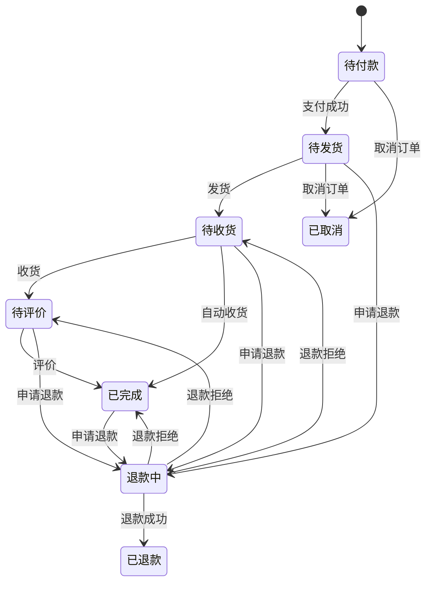
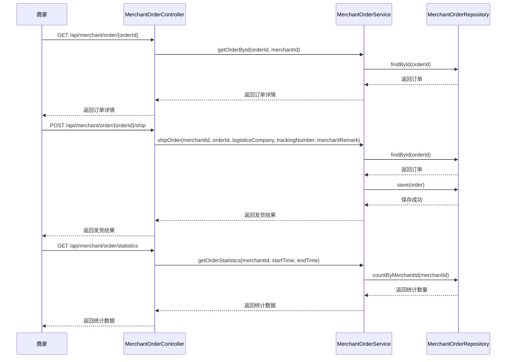

# 商家订单API

<cite>
**Referenced Files in This Document**   
- [MerchantOrderController.java](file://backend/merchant-service/src/main/java/com/mall/merchant/controller/MerchantOrderController.java)
- [MerchantOrderService.java](file://backend/merchant-service/src/main/java/com/mall/merchant/service/MerchantOrderService.java)
- [MerchantOrderServiceImpl.java](file://backend/merchant-service/src/main/java/com/mall/merchant/service/impl/MerchantOrderServiceImpl.java)
- [MerchantOrderRepository.java](file://backend/merchant-service/src/main/java/com/mall/merchant/repository/MerchantOrderRepository.java)
- [MerchantOrder.java](file://backend/merchant-service/src/main/java/com/mall/merchant/domain/entity/MerchantOrder.java)
- [系统实现报告.md](file://系统实现报告.md)
</cite>

## 目录
1. [简介](#简介)
2. [API规格](#api规格)
   1. [订单查询接口](#订单查询接口)
   2. [订单处理接口](#订单处理接口)
   3. [订单统计接口](#订单统计接口)
3. [订单状态机与业务流程](#订单状态机与业务流程)
4. [API调用序列](#api调用序列)
5. [异常处理策略](#异常处理策略)
6. [附录](#附录)

## 简介
商家订单API为商家提供了一套完整的订单管理功能，包括订单查询、处理、统计等核心操作。该API基于`MerchantOrderController`中的端点实现，旨在帮助开发者理解商家订单的全生命周期管理方式。通过本API，商家可以高效地管理其订单，从订单创建到完成的每一个环节。

**Section sources**
- [MerchantOrderController.java](file://backend/merchant-service/src/main/java/com/mall/merchant/controller/MerchantOrderController.java#L22-L469)

## API规格

### 订单查询接口
订单查询接口允许商家根据不同的条件查询订单信息，包括订单详情、分页列表、待发货、待收货和退款订单等。

#### 获取订单详情
- **端点**: `GET /api/merchant/order/{orderId}`
- **描述**: 根据订单ID获取订单的详细信息。
- **参数**:
  - `orderId`: 订单ID (路径参数)
  - `merchantId`: 商家ID (查询参数)
- **返回**: 订单详情对象。

#### 分页查询订单列表
- **端点**: `GET /api/merchant/order/list`
- **描述**: 根据条件分页查询商家的订单列表。
- **参数**:
  - `merchantId`: 商家ID (查询参数)
  - `page`: 页码 (查询参数, 默认值: 1)
  - `size`: 每页大小 (查询参数, 默认值: 10)
  - `orderNumber`: 订单号 (可选, 查询参数)
  - `status`: 订单状态 (可选, 查询参数)
  - `userId`: 用户ID (可选, 查询参数)
  - `startTime`: 开始时间 (可选, 查询参数)
  - `endTime`: 结束时间 (可选, 查询参数)
- **返回**: 订单分页列表。

#### 获取待发货订单
- **端点**: `GET /api/merchant/order/pending-shipment`
- **描述**: 获取需要发货的订单列表。
- **参数**:
  - `merchantId`: 商家ID (查询参数)
  - `page`: 页码 (查询参数, 默认值: 1)
  - `size`: 每页大小 (查询参数, 默认值: 10)
- **返回**: 待发货订单列表。

#### 获取待收货订单
- **端点**: `GET /api/merchant/order/pending-receipt`
- **描述**: 获取已发货但未收货的订单列表。
- **参数**:
  - `merchantId`: 商家ID (查询参数)
  - `page`: 页码 (查询参数, 默认值: 1)
  - `size`: 每页大小 (查询参数, 默认值: 10)
- **返回**: 待收货订单列表。

#### 获取退款订单
- **端点**: `GET /api/merchant/order/refund`
- **描述**: 获取申请退款的订单列表。
- **参数**:
  - `merchantId`: 商家ID (查询参数)
  - `page`: 页码 (查询参数, 默认值: 1)
  - `size`: 每页大小 (查询参数, 默认值: 10)
- **返回**: 退款订单列表。

**Section sources**
- [MerchantOrderController.java](file://backend/merchant-service/src/main/java/com/mall/merchant/controller/MerchantOrderController.java#L50-L160)

### 订单处理接口
订单处理接口提供了订单的发货、批量发货、确认收货、取消订单和处理退款等功能。

#### 发货
- **端点**: `POST /api/merchant/order/{orderId}/ship`
- **描述**: 处理订单发货，更新物流信息。
- **参数**:
  - `orderId`: 订单ID (路径参数)
  - `merchantId`: 商家ID (查询参数)
  - `logisticsCompany`: 物流公司 (查询参数)
  - `trackingNumber`: 物流单号 (查询参数)
  - `merchantRemark`: 商家备注 (可选, 查询参数)
- **返回**: 发货结果。

#### 批量发货
- **端点**: `POST /api/merchant/order/batch-ship`
- **描述**: 批量处理多个订单的发货。
- **参数**:
  - `merchantId`: 商家ID (查询参数)
  - `shipmentInfo`: 发货信息列表 (请求体)
- **返回**: 批量发货结果。

#### 确认收货
- **端点**: `POST /api/merchant/order/{orderId}/confirm-receipt`
- **描述**: 商家代替用户确认收货。
- **参数**:
  - `orderId`: 订单ID (路径参数)
  - `merchantId`: 商家ID (查询参数)
- **返回**: 确认收货结果。

#### 取消订单
- **端点**: `POST /api/merchant/order/{orderId}/cancel`
- **描述**: 取消未发货的订单。
- **参数**:
  - `orderId`: 订单ID (路径参数)
  - `merchantId`: 商家ID (查询参数)
  - `reason`: 取消原因 (可选, 查询参数)
- **返回**: 取消订单结果。

#### 处理退款
- **端点**: `POST /api/merchant/order/{orderId}/refund`
- **描述**: 处理用户的退款申请。
- **参数**:
  - `orderId`: 订单ID (路径参数)
  - `merchantId`: 商家ID (查询参数)
  - `approved`: 是否同意退款 (查询参数)
  - `reason`: 处理原因 (可选, 查询参数)
- **返回**: 处理退款结果。

**Section sources**
- [MerchantOrderController.java](file://backend/merchant-service/src/main/java/com/mall/merchant/controller/MerchantOrderController.java#L190-L273)

### 订单统计接口
订单统计接口提供了订单的统计数据，包括订单状态统计、热销商品统计、客户购买统计和每日销售统计等。

#### 获取订单统计数据
- **端点**: `GET /api/merchant/order/statistics`
- **描述**: 获取商家订单的统计信息。
- **参数**:
  - `merchantId`: 商家ID (查询参数)
  - `startTime`: 开始时间 (可选, 查询参数)
  - `endTime`: 结束时间 (可选, 查询参数)
- **返回**: 统计数据。

#### 获取订单状态统计
- **端点**: `GET /api/merchant/order/status-statistics`
- **描述**: 获取各个状态的订单数量统计。
- **参数**:
  - `merchantId`: 商家ID (查询参数)
- **返回**: 状态统计数据。

#### 获取热销商品统计
- **端点**: `GET /api/merchant/order/hot-products`
- **描述**: 获取销量排名靠前的商品统计。
- **参数**:
  - `merchantId`: 商家ID (查询参数)
  - `limit`: 数量限制 (查询参数, 默认值: 10)
  - `startTime`: 开始时间 (可选, 查询参数)
  - `endTime`: 结束时间 (可选, 查询参数)
- **返回**: 热销商品统计。

#### 获取客户购买统计
- **端点**: `GET /api/merchant/order/customer-statistics`
- **描述**: 获取客户购买行为统计。
- **参数**:
  - `merchantId`: 商家ID (查询参数)
  - `limit`: 数量限制 (查询参数, 默认值: 10)
  - `startTime`: 开始时间 (可选, 查询参数)
  - `endTime`: 结束时间 (可选, 查询参数)
- **返回**: 客户购买统计。

#### 获取每日销售统计
- **端点**: `GET /api/merchant/order/daily-sales`
- **描述**: 获取指定时间范围内的每日销售数据。
- **参数**:
  - `merchantId`: 商家ID (查询参数)
  - `startTime`: 开始时间 (查询参数)
  - `endTime`: 结束时间 (查询参数)
- **返回**: 每日销售统计。

**Section sources**
- [MerchantOrderController.java](file://backend/merchant-service/src/main/java/com/mall/merchant/controller/MerchantOrderController.java#L323-L406)

## 订单状态机与业务流程
订单状态机定义了订单在其生命周期中的各个状态及其转换规则。订单状态包括：待付款、待发货、待收货、待评价、已完成、已取消、退款中、已退款。每个状态都有明确的转换条件和操作。

**Diagram sources**
- [MerchantOrder.java](file://backend/merchant-service/src/main/java/com/mall/merchant/domain/entity/MerchantOrder.java#L105-L107)
- [系统实现报告.md](file://系统实现报告.md#L216)

## API调用序列
API调用序列描述了商家在处理订单时的典型调用流程。以下是一个典型的订单处理流程：

1. **获取订单详情**: 商家首先获取订单的详细信息。
2. **发货**: 商家处理订单发货，更新物流信息。
3. **确认收货**: 在特殊情况下，商家代替用户确认收货。
4. **处理退款**: 如果用户申请退款，商家处理退款请求。
5. **更新订单备注**: 商家可以更新订单的备注信息。
6. **获取订单统计数据**: 商家获取订单的统计数据，以便进行业务分析。

**Diagram sources**
- [MerchantOrderController.java](file://backend/merchant-service/src/main/java/com/mall/merchant/controller/MerchantOrderController.java#L50-L190)
- [MerchantOrderService.java](file://backend/merchant-service/src/main/java/com/mall/merchant/service/MerchantOrderService.java#L28-L105)
- [MerchantOrderRepository.java](file://backend/merchant-service/src/main/java/com/mall/merchant/repository/MerchantOrderRepository.java#L34-L43)

## 异常处理策略
异常处理策略确保了API在遇到错误时能够提供清晰的错误信息，帮助开发者快速定位和解决问题。常见的异常包括订单不存在、无权限访问、订单状态不允许操作等。

- **订单不存在**: 当请求的订单ID不存在时，返回`R.fail("订单不存在")`。
- **无权限访问**: 当订单不属于请求的商家时，返回`R.fail("无权限访问该订单")`。
- **订单状态不允许操作**: 当订单状态不允许执行特定操作时，返回相应的错误信息，如`R.fail("订单状态不允许发货")`。

**Section sources**
- [MerchantOrderServiceImpl.java](file://backend/merchant-service/src/main/java/com/mall/merchant/service/impl/MerchantOrderServiceImpl.java#L63-L82)

## 附录
### 订单状态码
| 状态码 | 状态描述 |
|--------|----------|
| 1      | 待付款   |
| 2      | 待发货   |
| 3      | 待收货   |
| 4      | 待评价   |
| 5      | 已完成   |
| 6      | 已取消   |
| 7      | 退款中   |
| 8      | 已退款   |

### 支付方式码
| 支付方式码 | 支付方式描述 |
|------------|--------------|
| 1          | 微信支付     |
| 2          | 支付宝       |
| 3          | 银行卡       |

**Section sources**
- [MerchantOrder.java](file://backend/merchant-service/src/main/java/com/mall/merchant/domain/entity/MerchantOrder.java#L110-L113)