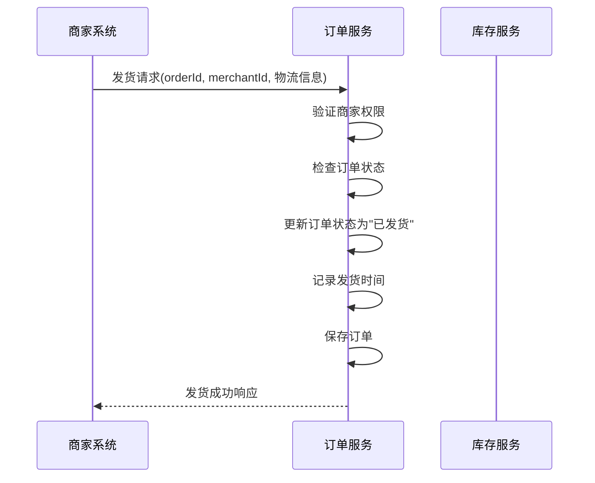
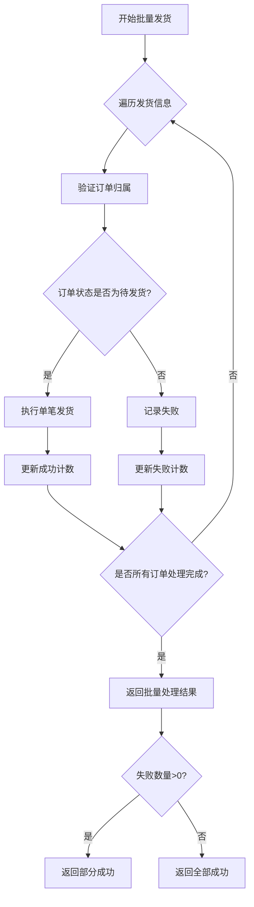
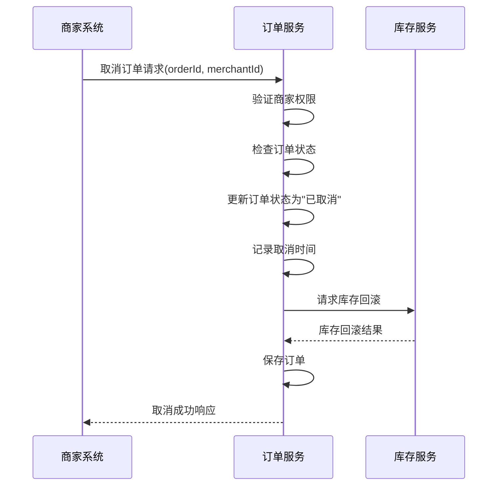
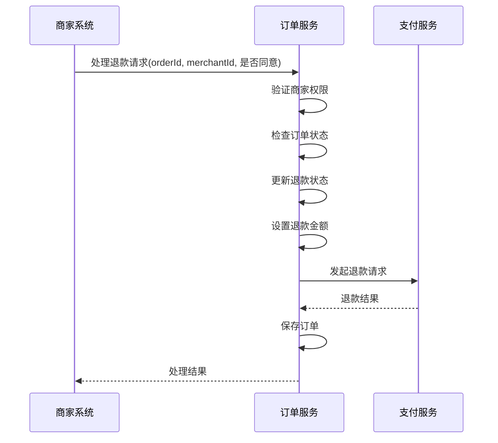
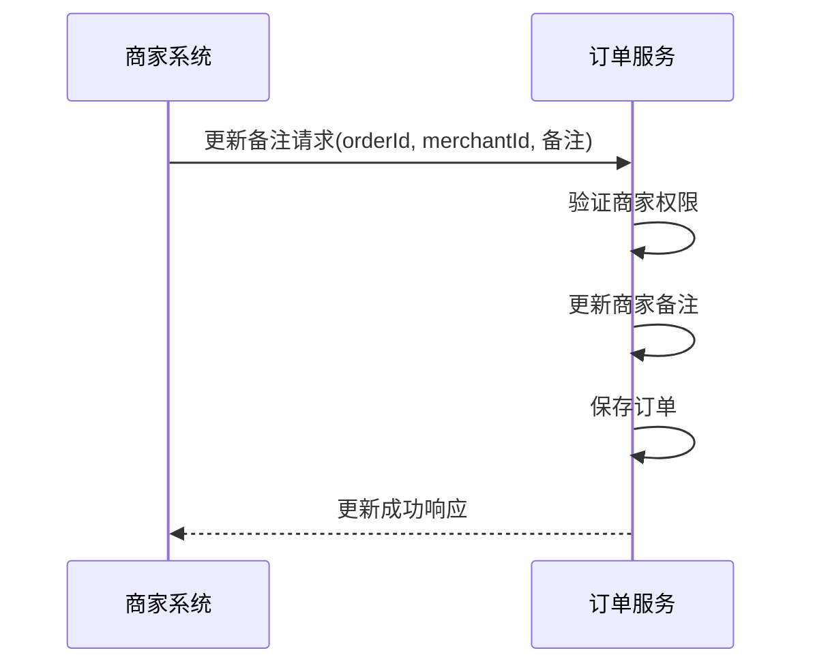
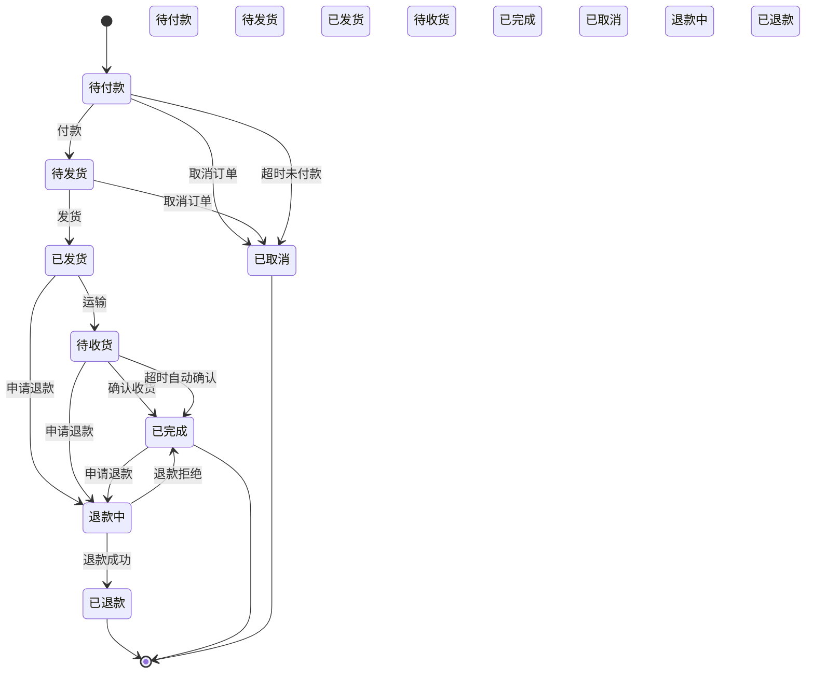

# 商家订单处理API

<cite>
**本文档引用的文件**
- [MerchantOrderController.java](file://backend\merchant-service\src\main\java\com\mall\merchant\controller\MerchantOrderController.java)
- [MerchantOrderServiceImpl.java](file://backend\merchant-service\src\main\java\com\mall\merchant\service\impl\MerchantOrderServiceImpl.java)
- [MerchantOrder.java](file://backend\merchant-service\src\main\java\com\mall\merchant\domain\entity\MerchantOrder.java)
- [OrderStatus.java](file://backend\order-service\src\main\java\com\mall\order\enums\OrderStatus.java)
- [RefundServiceImpl.java](file://backend\payment-service\src\main\java\com\mall\payment\service\impl\RefundServiceImpl.java)
- [StockService.java](file://backend\product-service\src\main\java\com\mall\product\service\StockService.java)
</cite>

## 目录
1. [简介](#简介)
2. [核心操作接口](#核心操作接口)
   1. [订单发货](#订单发货)
   2. [批量发货](#批量发货)
   3. [取消订单](#取消订单)
   4. [处理退款](#处理退款)
   5. [更新订单备注](#更新订单备注)
3. [订单状态机](#订单状态机)
4. [权限校验机制](#权限校验机制)
5. [事务处理策略](#事务处理策略)
6. [异常处理指南](#异常处理指南)

## 简介
本文档详细描述了商家订单处理API的规格，涵盖了订单发货、取消、退款处理、备注更新等核心操作接口。文档基于`MerchantOrderController`中的`@PostMapping`和`@PutMapping`端点，详细说明了单笔/批量发货、取消订单、处理退款申请、更新物流信息和订单备注等API的业务规则、状态转换逻辑、权限校验机制和事务处理策略。同时提供了完整的订单状态机转换图和异常处理指南，帮助开发者正确实现订单全生命周期的操作功能。

**Section sources**
- [MerchantOrderController.java](file://backend\merchant-service\src\main\java\com\mall\merchant\controller\MerchantOrderController.java#L22-L469)

## 核心操作接口

### 订单发货
处理单笔订单的发货操作，更新物流信息。

**接口规格**
- **端点**: `POST /api/merchant/order/{orderId}/ship`
- **请求参数**:
  - `orderId` (路径参数): 订单ID
  - `merchantId` (查询参数): 商家ID
  - `logisticsCompany` (查询参数): 物流公司
  - `trackingNumber` (查询参数): 物流单号
  - `merchantRemark` (查询参数, 可选): 商家备注

**业务规则**
1. 订单必须属于请求的商家
2. 订单状态必须为"待发货"（状态码2）
3. 必须提供物流公司和物流单号

**状态转换**
- **前状态**: 待发货 (2)
- **后状态**: 已发货 (3)

**权限校验**
- 验证`merchantId`与订单的商家ID是否匹配

**事务处理**
- 使用`@Transactional`注解确保操作的原子性
- 更新订单状态、发货时间和物流信息



**Diagram sources**
- [MerchantOrderController.java](file://backend\merchant-service\src\main\java\com\mall\merchant\controller\MerchantOrderController.java#L190-L200)
- [MerchantOrderServiceImpl.java](file://backend\merchant-service\src\main\java\com\mall\merchant\service\impl\MerchantOrderServiceImpl.java#L337-L377)

### 批量发货
批量处理多个订单的发货操作。

**接口规格**
- **端点**: `POST /api/merchant/order/batch-ship`
- **请求参数**:
  - `merchantId` (查询参数): 商家ID
  - `shipmentInfo` (请求体): 发货信息列表，包含订单ID、物流公司、物流单号等

**业务规则**
1. 所有订单必须属于请求的商家
2. 每个订单的状态必须为"待发货"（状态码2）
3. 返回批量处理结果，包括成功和失败的数量

**状态转换**
- **前状态**: 待发货 (2)
- **后状态**: 已发货 (3)

**权限校验**
- 验证每个订单的`merchantId`与请求的商家ID是否匹配

**事务处理**
- 使用`@Transactional`注解
- 对每个订单独立处理，记录成功和失败数量
- 整体操作在一个事务中完成



**Diagram sources**
- [MerchantOrderController.java](file://backend\merchant-service\src\main\java\com\mall\merchant\controller\MerchantOrderController.java#L210-L217)
- [MerchantOrderServiceImpl.java](file://backend\merchant-service\src\main\java\com\mall\merchant\service\impl\MerchantOrderServiceImpl.java#L392-L431)

### 取消订单
取消未发货的订单。

**接口规格**
- **端点**: `POST /api/merchant/order/{orderId}/cancel`
- **请求参数**:
  - `orderId` (路径参数): 订单ID
  - `merchantId` (查询参数): 商家ID
  - `reason` (查询参数, 可选): 取消原因

**业务规则**
1. 订单必须属于请求的商家
2. 订单状态必须为"待付款"（状态码1）或"待发货"（状态码2）
3. 取消后订单状态变为"已取消"（状态码6）

**状态转换**
- **前状态**: 待付款 (1) 或 待发货 (2)
- **后状态**: 已取消 (6)

**权限校验**
- 验证`merchantId`与订单的商家ID是否匹配

**事务处理**
- 使用`@Transactional`注解
- 更新订单状态为已取消
- 记录取消时间和原因
- 触发库存回滚



**Diagram sources**
- [MerchantOrderController.java](file://backend\merchant-service\src\main\java\com\mall\merchant\controller\MerchantOrderController.java#L245-L253)
- [MerchantOrderServiceImpl.java](file://backend\merchant-service\src\main\java\com\mall\merchant\service\impl\MerchantOrderServiceImpl.java#L489-L523)

### 处理退款
处理用户的退款申请。

**接口规格**
- **端点**: `POST /api/merchant/order/{orderId}/refund`
- **请求参数**:
  - `orderId` (路径参数): 订单ID
  - `merchantId` (查询参数): 商家ID
  - `approved` (查询参数): 是否同意退款
  - `reason` (查询参数, 可选): 处理原因

**业务规则**
1. 订单必须属于请求的商家
2. 订单状态必须为"已付款"（状态码2）、"已发货"（状态码3）或"已完成"（状态码5）
3. 如果同意退款，订单状态变为"退款成功"（退款状态码2）
4. 如果拒绝退款，订单状态变为"退款失败"（退款状态码3）

**状态转换**
- **前状态**: 已付款/已发货/已完成
- **后状态**: 退款成功/退款失败

**权限校验**
- 验证`merchantId`与订单的商家ID是否匹配

**事务处理**
- 使用`@Transactional`注解
- 更新订单的退款状态、退款金额和退款时间
- 调用支付服务处理实际退款



**Diagram sources**
- [MerchantOrderController.java](file://backend\merchant-service\src\main\java\com\mall\merchant\controller\MerchantOrderController.java#L265-L274)
- [MerchantOrderServiceImpl.java](file://backend\merchant-service\src\main\java\com\mall\merchant\service\impl\MerchantOrderServiceImpl.java#L540-L585)

### 更新订单备注
商家更新订单的备注信息。

**接口规格**
- **端点**: `PUT /api/merchant/order/{orderId}/remark`
- **请求参数**:
  - `orderId` (路径参数): 订单ID
  - `merchantId` (查询参数): 商家ID
  - `remark` (查询参数): 备注内容

**业务规则**
1. 订单必须属于请求的商家
2. 备注内容不能为空

**状态转换**
- **前状态**: 任意状态
- **后状态**: 同前状态（仅更新备注）

**权限校验**
- 验证`merchantId`与订单的商家ID是否匹配

**事务处理**
- 使用`@Transactional`注解
- 更新订单的商家备注字段
- 保存订单



**Diagram sources**
- [MerchantOrderController.java](file://backend\merchant-service\src\main\java\com\mall\merchant\controller\MerchantOrderController.java#L285-L293)
- [MerchantOrderServiceImpl.java](file://backend\merchant-service\src\main\java\com\mall\merchant\service\impl\MerchantOrderServiceImpl.java#L596-L625)

## 订单状态机
展示了订单在整个生命周期中的状态转换。



**Diagram sources**
- [OrderStatus.java](file://backend\order-service\src\main\java\com\mall\order\enums\OrderStatus.java#L11-L56)
- [MerchantOrder.java](file://backend\merchant-service\src\main\java\com\mall\merchant\domain\entity\MerchantOrder.java#L104-L107)

## 权限校验机制
确保商家只能操作属于自己的订单。

**校验流程**
1. 每个操作接口都接收`merchantId`参数
2. 服务层验证订单的`merchantId`与请求的`merchantId`是否匹配
3. 如果不匹配，返回权限错误

**实现代码**
```java
// 验证订单是否属于该商家
if (!order.getMerchantId().equals(merchantId)) {
    log.warn("订单不属于该商家，订单ID：{}，商家ID：{}", orderId, merchantId);
    return R.fail("无权限操作该订单");
}
```

**Section sources**
- [MerchantOrderServiceImpl.java](file://backend\merchant-service\src\main\java\com\mall\merchant\service\impl\MerchantOrderServiceImpl.java#L72-L75)

## 事务处理策略
确保订单操作的原子性和数据一致性。

**策略要点**
1. 使用Spring的`@Transactional`注解管理事务
2. 关键操作（发货、取消、退款）都在事务中执行
3. 事务失败时自动回滚
4. 分布式锁防止并发操作

**事务边界**
- 单个订单操作：方法级别事务
- 批量操作：整体事务，部分成功时返回详细结果

**Section sources**
- [MerchantOrderServiceImpl.java](file://backend\merchant-service\src\main\java\com\mall\merchant\service\impl\MerchantOrderServiceImpl.java#L338-L339)

## 异常处理指南
处理订单操作中的各种异常情况。

### 库存回滚
当订单取消时，需要回滚已扣减的库存。

**处理流程**
1. 订单服务调用库存服务的`rollbackStock`方法
2. 传递商品ID、SKU ID、数量和订单号
3. 库存服务验证参数并增加库存

```java
// 恢复库存
List<OrderItem> orderItems = orderItemRepository.findByOrderId(orderId);
for (OrderItem item : orderItems) {
    Map<String, Object> restoreRequest = new HashMap<>();
    restoreRequest.put("productId", item.getProductId());
    restoreRequest.put("quantity", item.getQuantity());
    restoreRequest.put("orderNo", order.getOrderNo());
    productClient.restoreStock(restoreRequest);
}
```

**Section sources**
- [StockService.java](file://backend\product-service\src\main\java\com\mall\product\service\StockService.java#L56-L57)

### 支付退款
当订单取消且已付款时，需要发起退款。

**处理流程**
1. 订单服务调用支付服务的`refund`方法
2. 传递订单号、退款金额和原因
3. 支付服务处理实际的退款流程

```java
// 如果已付款，需要申请退款
if (order.getStatus() == OrderStatus.PAID) {
    Map<String, Object> refundRequest = new HashMap<>();
    refundRequest.put("orderNo", order.getOrderNo());
    refundRequest.put("amount", order.getPayableAmount());
    refundRequest.put("reason", "订单取消");
    
    paymentClient.refund(refundRequest);
}
```

**Section sources**
- [RefundServiceImpl.java](file://backend\payment-service\src\main\java\com\mall\payment\service\impl\RefundServiceImpl.java#L183-L235)