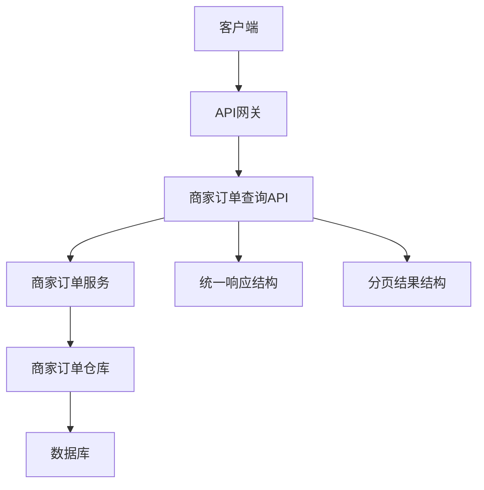
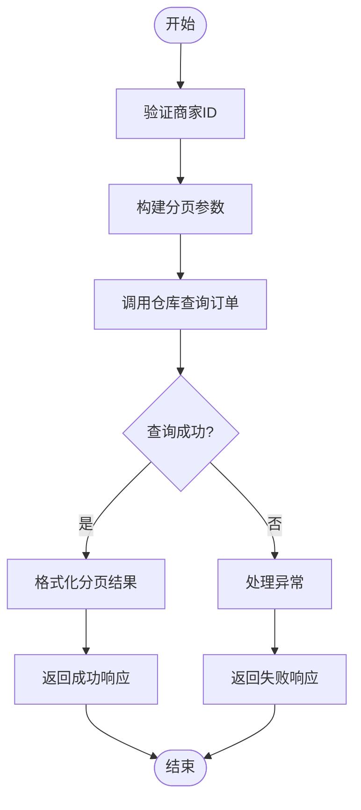
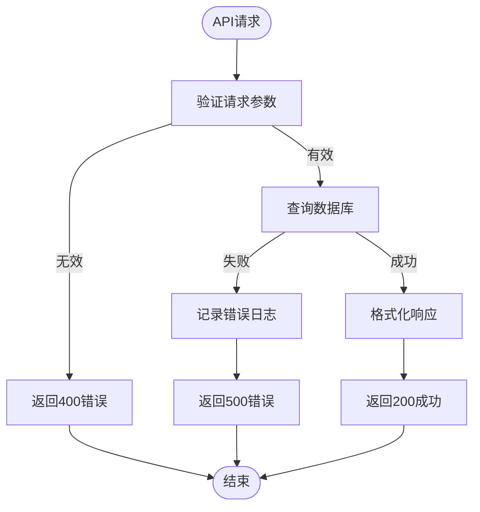

# 商家订单查询API

<cite>
**Referenced Files in This Document**   
- [MerchantOrderController.java](file://backend/merchant-service/src/main/java/com/mall/merchant/controller/MerchantOrderController.java)
- [MerchantOrderService.java](file://backend/merchant-service/src/main/java/com/mall/merchant/service/MerchantOrderService.java)
- [MerchantOrder.java](file://backend/merchant-service/src/main/java/com/mall/merchant/domain/entity/MerchantOrder.java)
- [MerchantOrderRepository.java](file://backend/merchant-service/src/main/java/com/mall/merchant/repository/MerchantOrderRepository.java)
- [R.java](file://backend/common-core/src/main/java/com/mall/common/core/domain/R.java)
- [PageResult.java](file://backend/common-core/src/main/java/com/mall/common/core/domain/PageResult.java)
</cite>

## Table of Contents
1. [Introduction](#introduction)
2. [API Overview](#api-overview)
3. [Response Structure](#response-structure)
4. [Order Detail Query](#order-detail-query)
5. [Order List Query](#order-list-query)
6. [Status-Based Queries](#status-based-queries)
7. [Time-Based Queries](#time-based-queries)
8. [Performance Optimization](#performance-optimization)
9. [Error Handling](#error-handling)
10. [Usage Examples](#usage-examples)

## Introduction

本API文档详细描述了商家订单查询系统的各项功能，旨在为开发者提供一个高效、可靠的订单数据检索接口。系统基于Spring Cloud微服务架构，通过`MerchantOrderController`中的`@GetMapping`端点，实现了对订单详情、列表查询、条件筛选等核心功能的支持。

商家订单查询API是商家后台系统的核心组成部分，它允许商家通过多种条件（如订单状态、时间范围、订单号等）来检索和管理其订单数据。API设计遵循RESTful原则，使用标准的HTTP方法和状态码，确保了接口的易用性和一致性。

该系统不仅支持基本的订单信息查询，还提供了丰富的统计和分析功能，帮助商家更好地了解其业务状况。通过合理的分页机制和过滤条件，API能够高效地处理大量订单数据，确保在高并发场景下的性能和稳定性。

**Section sources**
- [MerchantOrderController.java](file://backend/merchant-service/src/main/java/com/mall/merchant/controller/MerchantOrderController.java#L22-L469)

## API Overview

商家订单查询API提供了一套完整的RESTful接口，用于管理和查询商家订单。所有API端点均以`/api/merchant/order`为前缀，通过HTTP GET方法进行数据检索。

API的主要功能包括：
- **订单详情获取**：根据订单ID或订单号获取单个订单的详细信息。
- **分页查询**：支持按页码和每页大小分页查询订单列表。
- **条件筛选**：支持按订单号、订单状态、用户ID、支付方式和时间范围等条件进行筛选。
- **状态查询**：提供专门的端点来查询特定状态的订单，如待发货、待收货和退款中的订单。
- **时间范围查询**：支持按创建时间范围查询订单，便于进行时间维度的数据分析。

API的设计充分考虑了性能和可扩展性，通过合理的分页和索引策略，确保了在处理大量数据时的高效性。同时，API还提供了详细的错误处理机制，帮助开发者快速定位和解决问题。



**Diagram sources**
- [MerchantOrderController.java](file://backend/merchant-service/src/main/java/com/mall/merchant/controller/MerchantOrderController.java#L31-L35)
- [R.java](file://backend/common-core/src/main/java/com/mall/common/core/domain/R.java#L13-L15)
- [PageResult.java](file://backend/common-core/src/main/java/com/mall/common/core/domain/PageResult.java#L16-L18)

**Section sources**
- [MerchantOrderController.java](file://backend/merchant-service/src/main/java/com/mall/merchant/controller/MerchantOrderController.java#L31-L35)

## Response Structure

所有API响应均采用统一的响应结构，由`R<T>`类定义。该结构确保了响应的一致性和可预测性，便于客户端进行解析和处理。

### 统一响应结构 (R<T>)

| 字段 | 类型 | 描述 |
|------|------|------|
| code | int | 状态码，200表示成功，500表示失败 |
| message | string | 响应消息，描述操作结果 |
| data | T | 响应数据，具体类型根据API而定 |
| timestamp | long | 响应时间戳，单位为毫秒 |

### 分页结果结构 (PageResult<T>)

对于分页查询API，响应数据为`PageResult<T>`类型，包含以下字段：

| 字段 | 类型 | 描述 |
|------|------|------|
| records | List<T> | 当前页的数据列表 |
| total | Long | 总记录数 |
| current | Long | 当前页码 |
| size | Long | 每页大小 |
| pages | Long | 总页数 |

**Section sources**
- [R.java](file://backend/common-core/src/main/java/com/mall/common/core/domain/R.java#L13-L136)
- [PageResult.java](file://backend/common-core/src/main/java/com/mall/common/core/domain/PageResult.java#L16-L57)

## Order Detail Query

### 获取订单详情

根据订单ID获取订单的详细信息。

**Endpoint**: `GET /api/merchant/order/{orderId}`

#### 请求参数

| 参数 | 位置 | 类型 | 必填 | 描述 |
|------|------|------|------|------|
| orderId | 路径 | Long | 是 | 订单ID |
| merchantId | 查询参数 | Long | 是 | 商家ID |

#### 响应示例

```json
{
  "code": 200,
  "message": "操作成功",
  "data": {
    "orderNo": "202501270001",
    "merchantId": 1001,
    "userId": 2001,
    "productName": "商品名称",
    "totalAmount": 100.00,
    "status": 2,
    "statusText": "待发货"
  },
  "timestamp": 1732717200000
}
```

#### 业务逻辑

1. 验证订单ID和商家ID的有效性。
2. 从数据库中查询订单信息。
3. 验证订单是否属于指定商家。
4. 返回订单详情。

**Section sources**
- [MerchantOrderController.java](file://backend/merchant-service/src/main/java/com/mall/merchant/controller/MerchantOrderController.java#L50-L57)
- [MerchantOrderService.java](file://backend/merchant-service/src/main/java/com/mall/merchant/service/MerchantOrderService.java#L28-L29)
- [MerchantOrderRepository.java](file://backend/merchant-service/src/main/java/com/mall/merchant/repository/MerchantOrderRepository.java#L26-L27)

### 根据订单号获取订单

根据订单号获取订单信息。

**Endpoint**: `GET /api/merchant/order/number/{orderNumber}`

#### 请求参数

| 参数 | 位置 | 类型 | 必填 | 描述 |
|------|------|------|------|------|
| orderNumber | 路径 | String | 是 | 订单号 |
| merchantId | 查询参数 | Long | 是 | 商家ID |

#### 响应示例

```json
{
  "code": 200,
  "message": "操作成功",
  "data": {
    "orderNo": "202501270001",
    "merchantId": 1001,
    "userId": 2001,
    "productName": "商品名称",
    "totalAmount": 100.00,
    "status": 2,
    "statusText": "待发货"
  },
  "timestamp": 1732717200000
}
```

#### 业务逻辑

1. 验证订单号和商家ID的有效性。
2. 从数据库中查询订单信息。
3. 验证订单是否属于指定商家。
4. 返回订单详情。

**Section sources**
- [MerchantOrderController.java](file://backend/merchant-service/src/main/java/com/mall/merchant/controller/MerchantOrderController.java#L67-L74)
- [MerchantOrderService.java](file://backend/merchant-service/src/main/java/com/mall/merchant/service/MerchantOrderService.java#L37-L38)
- [MerchantOrderRepository.java](file://backend/merchant-service/src/main/java/com/mall/merchant/repository/MerchantOrderRepository.java#L34-L35)

## Order List Query

### 分页查询订单列表

根据条件分页查询商家的订单列表。

**Endpoint**: `GET /api/merchant/order/list`

#### 请求参数

| 参数 | 位置 | 类型 | 必填 | 描述 | 默认值 |
|------|------|------|------|------|------|
| merchantId | 查询参数 | Long | 是 | 商家ID | - |
| page | 查询参数 | Integer | 否 | 页码 | 1 |
| size | 查询参数 | Integer | 否 | 每页大小 | 10 |
| orderNumber | 查询参数 | String | 否 | 订单号 | - |
| status | 查询参数 | Integer | 否 | 订单状态 | - |
| userId | 查询参数 | Long | 否 | 用户ID | - |
| startTime | 查询参数 | LocalDateTime | 否 | 开始时间 | - |
| endTime | 查询参数 | LocalDateTime | 否 | 结束时间 | - |

#### 响应示例

```json
{
  "code": 200,
  "message": "操作成功",
  "data": {
    "records": [
      {
        "orderNo": "202501270001",
        "merchantId": 1001,
        "userId": 2001,
        "productName": "商品名称",
        "totalAmount": 100.00,
        "status": 2,
        "statusText": "待发货"
      }
    ],
    "total": 100,
    "current": 1,
    "size": 10,
    "pages": 10
  },
  "timestamp": 1732717200000
}
```

#### 业务逻辑

1. 验证商家ID的有效性。
2. 构建分页参数。
3. 根据条件调用仓库层查询订单列表。
4. 将查询结果封装为分页结果并返回。



**Diagram sources**
- [MerchantOrderController.java](file://backend/merchant-service/src/main/java/com/mall/merchant/controller/MerchantOrderController.java#L90-L103)
- [MerchantOrderServiceImpl.java](file://backend/merchant-service/src/main/java/com/mall/merchant/service/impl/MerchantOrderServiceImpl.java#L132-L149)
- [MerchantOrderRepository.java](file://backend/merchant-service/src/main/java/com/mall/merchant/repository/MerchantOrderRepository.java#L87-L99)

**Section sources**
- [MerchantOrderController.java](file://backend/merchant-service/src/main/java/com/mall/merchant/controller/MerchantOrderController.java#L90-L103)
- [MerchantOrderServiceImpl.java](file://backend/merchant-service/src/main/java/com/mall/merchant/service/impl/MerchantOrderServiceImpl.java#L132-L149)
- [MerchantOrderRepository.java](file://backend/merchant-service/src/main/java/com/mall/merchant/repository/MerchantOrderRepository.java#L87-L99)

## Status-Based Queries

### 获取待发货订单

获取需要发货的订单列表。

**Endpoint**: `GET /api/merchant/order/pending-shipment`

#### 请求参数

| 参数 | 位置 | 类型 | 必填 | 描述 | 默认值 |
|------|------|------|------|------|------|
| merchantId | 查询参数 | Long | 是 | 商家ID | - |
| page | 查询参数 | Integer | 否 | 页码 | 1 |
| size | 查询参数 | Integer | 否 | 每页大小 | 10 |

#### 响应示例

```json
{
  "code": 200,
  "message": "操作成功",
  "data": {
    "records": [
      {
        "orderNo": "202501270001",
        "merchantId": 1001,
        "userId": 2001,
        "productName": "商品名称",
        "totalAmount": 100.00,
        "status": 2,
        "statusText": "待发货"
      }
    ],
    "total": 50,
    "current": 1,
    "size": 10,
    "pages": 5
  },
  "timestamp": 1732717200000
}
```

#### 业务逻辑

1. 验证商家ID的有效性。
2. 构建分页参数，按支付时间升序排序。
3. 调用仓库层查询待发货订单。
4. 将查询结果封装为分页结果并返回。

**Section sources**
- [MerchantOrderController.java](file://backend/merchant-service/src/main/java/com/mall/merchant/controller/MerchantOrderController.java#L114-L122)
- [MerchantOrderServiceImpl.java](file://backend/merchant-service/src/main/java/com/mall/merchant/service/impl/MerchantOrderServiceImpl.java#L232-L244)
- [MerchantOrderRepository.java](file://backend/merchant-service/src/main/java/com/mall/merchant/repository/MerchantOrderRepository.java#L192-L193)

### 获取待收货订单

获取已发货但未收货的订单列表。

**Endpoint**: `GET /api/merchant/order/pending-receipt`

#### 请求参数

| 参数 | 位置 | 类型 | 必填 | 描述 | 默认值 |
|------|------|------|------|------|------|
| merchantId | 查询参数 | Long | 是 | 商家ID | - |
| page | 查询参数 | Integer | 否 | 页码 | 1 |
| size | 查询参数 | Integer | 否 | 每页大小 | 10 |

#### 响应示例

```json
{
  "code": 200,
  "message": "操作成功",
  "data": {
    "records": [
      {
        "orderNo": "202501270002",
        "merchantId": 1001,
        "userId": 2001,
        "productName": "商品名称",
        "totalAmount": 150.00,
        "status": 3,
        "statusText": "待收货"
      }
    ],
    "total": 30,
    "current": 1,
    "size": 10,
    "pages": 3
  },
  "timestamp": 1732717200000
}
```

#### 业务逻辑

1. 验证商家ID的有效性。
2. 构建分页参数，按发货时间升序排序。
3. 调用仓库层查询待收货订单。
4. 将查询结果封装为分页结果并返回。

**Section sources**
- [MerchantOrderController.java](file://backend/merchant-service/src/main/java/com/mall/merchant/controller/MerchantOrderController.java#L133-L141)
- [MerchantOrderServiceImpl.java](file://backend/merchant-service/src/main/java/com/mall/merchant/service/impl/MerchantOrderServiceImpl.java#L259-L271)
- [MerchantOrderRepository.java](file://backend/merchant-service/src/main/java/com/mall/merchant/repository/MerchantOrderRepository.java#L202-L203)

### 获取退款订单

获取申请退款的订单列表。

**Endpoint**: `GET /api/merchant/order/refund`

#### 请求参数

| 参数 | 位置 | 类型 | 必填 | 描述 | 默认值 |
|------|------|------|------|------|------|
| merchantId | 查询参数 | Long | 是 | 商家ID | - |
| page | 查询参数 | Integer | 否 | 页码 | 1 |
| size | 查询参数 | Integer | 否 | 每页大小 | 10 |

#### 响应示例

```json
{
  "code": 200,
  "message": "操作成功",
  "data": {
    "records": [
      {
        "orderNo": "202501270003",
        "merchantId": 1001,
        "userId": 2001,
        "productName": "商品名称",
        "totalAmount": 200.00,
        "status": 7,
        "statusText": "退款中"
      }
    ],
    "total": 10,
    "current": 1,
    "size": 10,
    "pages": 1
  },
  "timestamp": 1732717200000
}
```

#### 业务逻辑

1. 验证商家ID的有效性。
2. 构建分页参数，按退款时间降序排序。
3. 调用仓库层查询退款订单。
4. 将查询结果封装为分页结果并返回。

**Section sources**
- [MerchantOrderController.java](file://backend/merchant-service/src/main/java/com/mall/merchant/controller/MerchantOrderController.java#L152-L160)
- [MerchantOrderServiceImpl.java](file://backend/merchant-service/src/main/java/com/mall/merchant/service/impl/MerchantOrderServiceImpl.java#L286-L298)
- [MerchantOrderRepository.java](file://backend/merchant-service/src/main/java/com/mall/merchant/repository/MerchantOrderRepository.java#L212-L213)

## Time-Based Queries

### 按时间范围查询订单

支持按创建时间范围查询订单，便于进行时间维度的数据分析。

**Endpoint**: `GET /api/merchant/order/list`

#### 请求参数

| 参数 | 位置 | 类型 | 必填 | 描述 |
|------|------|------|------|------|
| startTime | 查询参数 | LocalDateTime | 否 | 开始时间，格式：yyyy-MM-dd HH:mm:ss |
| endTime | 查询参数 | LocalDateTime | 否 | 结束时间，格式：yyyy-MM-dd HH:mm:ss |

#### 业务逻辑

当提供`startTime`和`endTime`参数时，API会将时间范围作为查询条件，筛选出在指定时间范围内创建的订单。查询使用JPQL语句，确保了查询的高效性和准确性。

```java
@Query("SELECT o FROM MerchantOrder o WHERE o.merchantId = :merchantId AND " +
       "(:orderNo IS NULL OR o.orderNo LIKE %:orderNo%) AND " +
       "(:status IS NULL OR o.status = :status) AND " +
       "(:paymentMethod IS NULL OR o.paymentMethod = :paymentMethod) AND " +
       "(:startTime IS NULL OR o.createTime >= :startTime) AND " +
       "(:endTime IS NULL OR o.createTime <= :endTime)")
Page<MerchantOrder> findByConditions(@Param("merchantId") Long merchantId,
                                    @Param("orderNo") String orderNo,
                                    @Param("status") Integer status,
                                    @Param("paymentMethod") Integer paymentMethod,
                                    @Param("startTime") LocalDateTime startTime,
                                    @Param("endTime") LocalDateTime endTime,
                                    Pageable pageable);
```

**Section sources**
- [MerchantOrderController.java](file://backend/merchant-service/src/main/java/com/mall/merchant/controller/MerchantOrderController.java#L99-L100)
- [MerchantOrderRepository.java](file://backend/merchant-service/src/main/java/com/mall/merchant/repository/MerchantOrderRepository.java#L87-L99)

## Performance Optimization

为了确保API在高并发场景下的性能和稳定性，建议采取以下优化措施：

### 合理使用分页

- **避免全量查询**：始终使用分页查询，避免一次性加载大量数据。
- **合理设置每页大小**：根据实际需求设置合适的每页大小，通常建议在10-50之间。
- **利用缓存**：对于频繁查询但不常变化的数据，可以考虑使用Redis等缓存技术。

### 数据库索引优化

为提高查询效率，建议在以下字段上创建索引：

| 字段 | 索引类型 | 描述 |
|------|----------|------|
| merchant_id | 普通索引 | 提高按商家ID查询的效率 |
| order_no | 唯一索引 | 确保订单号唯一性，提高查询效率 |
| status | 普通索引 | 提高按状态查询的效率 |
| create_time | 普通索引 | 提高按时间范围查询的效率 |
| user_id | 普通索引 | 提高按用户ID查询的效率 |

### 查询优化建议

- **避免N+1查询**：在查询订单列表时，确保相关数据（如商品信息）通过JOIN一次性加载，避免在循环中进行多次数据库查询。
- **使用投影查询**：如果只需要部分字段，可以使用投影查询，减少数据传输量。
- **合理使用缓存**：对于不经常变化的数据（如商品信息），可以考虑使用缓存，减少数据库压力。

**Section sources**
- [MerchantOrderRepository.java](file://backend/merchant-service/src/main/java/com/mall/merchant/repository/MerchantOrderRepository.java#L34-L35)
- [MerchantOrder.java](file://backend/merchant-service/src/main/java/com/mall/merchant/domain/entity/MerchantOrder.java#L28-L35)

## Error Handling

API提供了完善的错误处理机制，确保在出现异常时能够返回有意义的错误信息。

### 常见错误码

| 状态码 | 错误码 | 描述 |
|--------|--------|------|
| 200 | 200 | 操作成功 |
| 400 | 500 | 请求参数错误 |
| 404 | 500 | 订单不存在 |
| 500 | 500 | 服务器内部错误 |

### 错误处理流程



**Diagram sources**
- [MerchantOrderServiceImpl.java](file://backend/merchant-service/src/main/java/com/mall/merchant/service/impl/MerchantOrderServiceImpl.java#L58-L83)
- [MerchantOrderServiceImpl.java](file://backend/merchant-service/src/main/java/com/mall/merchant/service/impl/MerchantOrderServiceImpl.java#L92-L117)

**Section sources**
- [MerchantOrderServiceImpl.java](file://backend/merchant-service/src/main/java/com/mall/merchant/service/impl/MerchantOrderServiceImpl.java#L58-L117)

## Usage Examples

### 查询待发货订单

```bash
curl -X GET "http://localhost:8087/api/merchant/order/pending-shipment?merchantId=1001&page=1&size=10"
```

### 按时间范围查询订单

```bash
curl -X GET "http://localhost:8087/api/merchant/order/list?merchantId=1001&startTime=2025-01-01%2000:00:00&endTime=2025-01-31%2023:59:59"
```

### 根据订单号查询订单

```bash
curl -X GET "http://localhost:8087/api/merchant/order/number/202501270001?merchantId=1001"
```

这些示例展示了如何使用API进行常见的订单查询操作。开发者可以根据实际需求调整参数，实现更复杂的查询逻辑。

**Section sources**
- [MerchantOrderController.java](file://backend/merchant-service/src/main/java/com/mall/merchant/controller/MerchantOrderController.java#L114-L122)
- [MerchantOrderController.java](file://backend/merchant-service/src/main/java/com/mall/merchant/controller/MerchantOrderController.java#L90-L103)
- [MerchantOrderController.java](file://backend/merchant-service/src/main/java/com/mall/merchant/controller/MerchantOrderController.java#L67-L74)