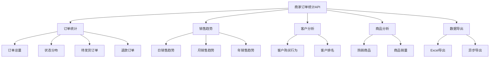
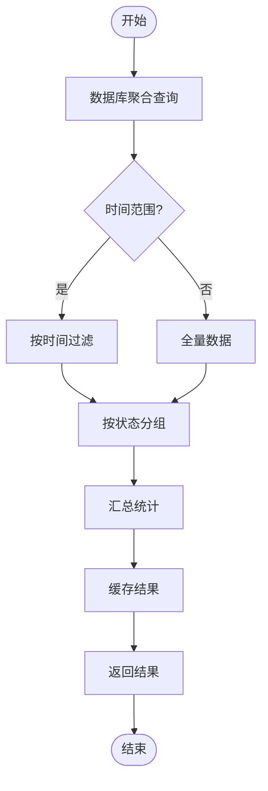
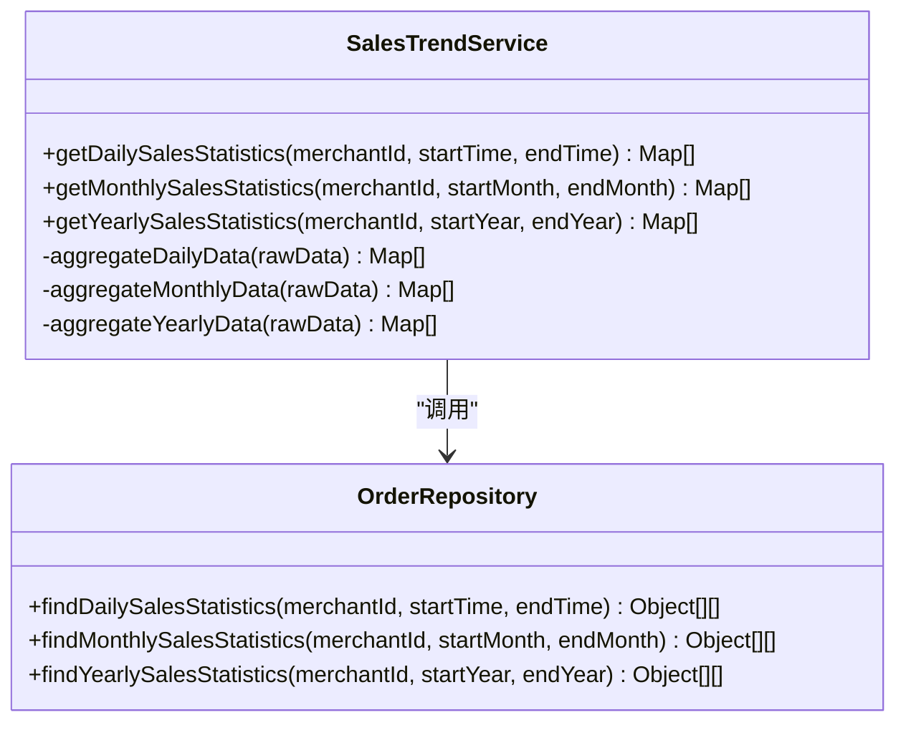
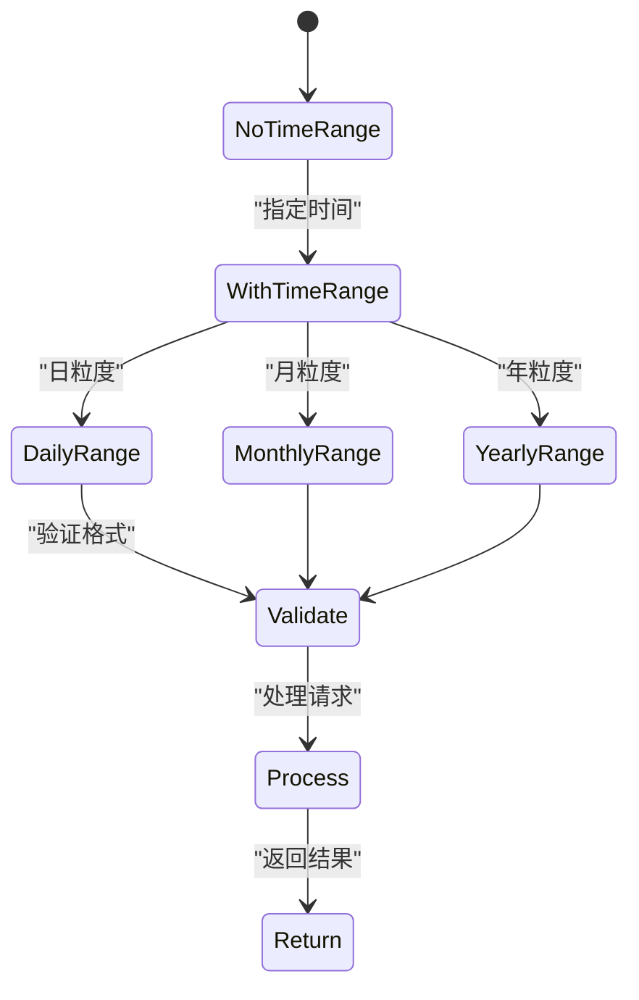
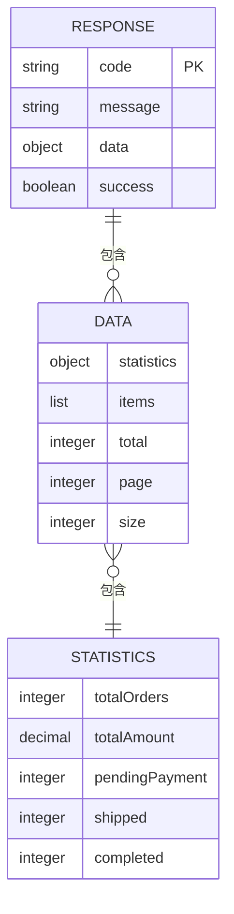
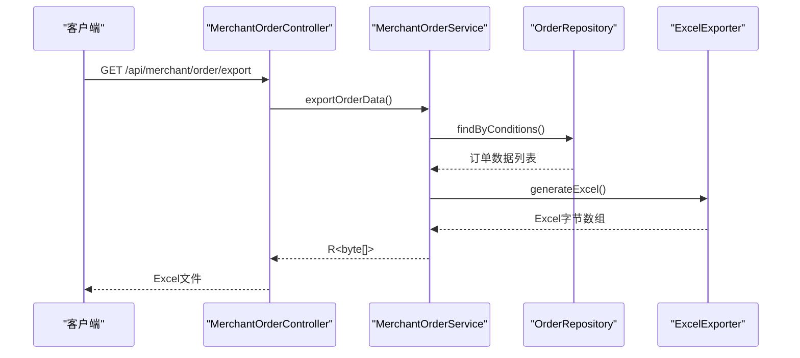
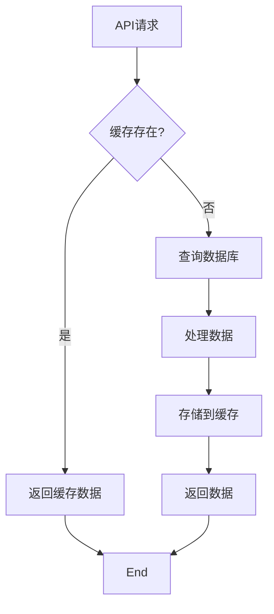

# 商家订单统计API

<cite>
**本文档引用文件**   
- [MerchantOrderController.java](file://backend\merchant-service\src\main\java\com\mall\merchant\controller\MerchantOrderController.java)
- [MerchantStatisticsController.java](file://backend\merchant-service\src\main\java\com\mall\merchant\controller\MerchantStatisticsController.java)
- [MerchantStatisticsService.java](file://backend\merchant-service\src\main\java\com\mall\merchant\service\MerchantStatisticsService.java)
- [OrderStatsDTO.java](file://backend\order-service\src\main\java\com\mall\order\dto\OrderStatsDTO.java)
- [MerchantStatistics.java](file://backend\merchant-service\src\main\java\com\mall\merchant\domain\entity\MerchantStatistics.java)
</cite>

## 目录
1. [简介](#简介)
2. [核心统计接口](#核心统计接口)
3. [数据聚合逻辑](#数据聚合逻辑)
4. [时间范围与分页参数](#时间范围与分页参数)
5. [响应格式](#响应格式)
6. [数据导出功能](#数据导出功能)
7. [统计接口详细说明](#统计接口详细说明)
8. [最佳实践](#最佳实践)

## 简介
商家订单统计API为商家端提供全面的数据分析和报表功能，支持订单总量、状态分布、热销商品、客户购买行为、日/月销售趋势等多维度统计。该API基于`MerchantOrderController`和`MerchantStatisticsController`中的统计相关端点构建，为开发者提供了一套完整的数据分析解决方案。

**本文档引用文件**
- [MerchantOrderController.java](file://backend\merchant-service\src\main\java\com\mall\merchant\controller\MerchantOrderController.java#L22-L469)
- [MerchantStatisticsController.java](file://backend\merchant-service\src\main\java\com\mall\merchant\controller\MerchantStatisticsController.java#L21-L645)

## 核心统计接口
商家订单统计API提供了丰富的统计接口，涵盖订单、销售、客户和商品等多个维度的分析功能。



**图表来源**
- [MerchantOrderController.java](file://backend\merchant-service\src\main\java\com\mall\merchant\controller\MerchantOrderController.java#L22-L469)
- [MerchantStatisticsController.java](file://backend\merchant-service\src\main\java\com\mall\merchant\controller\MerchantStatisticsController.java#L21-L645)

**本文档引用文件**
- [MerchantOrderController.java](file://backend\merchant-service\src\main\java\com\mall\merchant\controller\MerchantOrderController.java#L22-L469)
- [MerchantStatisticsController.java](file://backend\merchant-service\src\main\java\com\mall\merchant\controller\MerchantStatisticsController.java#L21-L645)

## 数据聚合逻辑
商家订单统计API采用多层级的数据聚合策略，确保统计结果的准确性和高效性。

### 订单数据聚合
订单统计接口通过数据库聚合查询实现高效的数据统计，主要采用以下策略：



**图表来源**
- [MerchantOrderController.java](file://backend\merchant-service\src\main\java\com\mall\merchant\controller\MerchantOrderController.java#L22-L469)
- [MerchantStatisticsService.java](file://backend\merchant-service\src\main\java\com\mall\merchant\service\MerchantStatisticsService.java#L10-L286)

### 销售趋势聚合
销售趋势数据通过时间序列聚合实现，支持不同时间粒度的分析：



**图表来源**
- [MerchantOrderController.java](file://backend\merchant-service\src\main\java\com\mall\merchant\controller\MerchantOrderController.java#L22-L469)
- [MerchantStatisticsService.java](file://backend\merchant-service\src\main\java\com\mall\merchant\service\MerchantStatisticsService.java#L10-L286)

**本文档引用文件**
- [MerchantOrderController.java](file://backend\merchant-service\src\main\java\com\mall\merchant\controller\MerchantOrderController.java#L22-L469)
- [MerchantStatisticsService.java](file://backend\merchant-service\src\main\java\com\mall\merchant\service\MerchantStatisticsService.java#L10-L286)

## 时间范围与分页参数
统计接口支持灵活的时间范围和分页参数，满足不同场景的查询需求。

### 时间范围参数


**图表来源**
- [MerchantOrderController.java](file://backend\merchant-service\src\main\java\com\mall\merchant\controller\MerchantOrderController.java#L22-L469)

### 分页参数
分页参数遵循统一的规范，确保接口的一致性：

| 参数 | 类型 | 必填 | 默认值 | 说明 |
|------|------|------|--------|------|
| page | Integer | 否 | 1 | 页码 |
| size | Integer | 否 | 10 | 每页大小 |
| merchantId | Long | 是 | - | 商家ID |

**图表来源**
- [MerchantOrderController.java](file://backend\merchant-service\src\main\java\com\mall\merchant\controller\MerchantOrderController.java#L22-L469)

**本文档引用文件**
- [MerchantOrderController.java](file://backend\merchant-service\src\main\java\com\mall\merchant\controller\MerchantOrderController.java#L22-L469)

## 响应格式
所有统计接口遵循统一的响应格式，确保前端处理的一致性。

### 响应结构


**图表来源**
- [OrderStatsDTO.java](file://backend\order-service\src\main\java\com\mall\order\dto\OrderStatsDTO.java#L1-L57)
- [MerchantStatistics.java](file://backend\merchant-service\src\main\java\com\mall\merchant\domain\entity\MerchantStatistics.java#L1-L58)

### 成功响应示例
```json
{
  "code": "200",
  "message": "成功",
  "success": true,
  "data": {
    "totalOrders": 150,
    "totalAmount": 25680.50,
    "pendingPayment": 20,
    "shipped": 80,
    "completed": 50
  }
}
```

### 错误响应示例
```json
{
  "code": "500",
  "message": "获取统计信息失败",
  "success": false,
  "data": null
}
```

**本文档引用文件**
- [OrderStatsDTO.java](file://backend\order-service\src\main\java\com\mall\order\dto\OrderStatsDTO.java#L1-L57)
- [MerchantStatistics.java](file://backend\merchant-service\src\main\java\com\mall\merchant\domain\entity\MerchantStatistics.java#L1-L58)

## 数据导出功能
商家订单统计API提供强大的数据导出功能，支持Excel格式的订单数据导出。

### 导出实现细节


**图表来源**
- [MerchantOrderController.java](file://backend\merchant-service\src\main\java\com\mall\merchant\controller\MerchantOrderController.java#L427-L448)
- [MerchantOrderServiceImpl.java](file://backend\merchant-service\src\main\java\com\mall\merchant\service\impl\MerchantOrderServiceImpl.java#L167-L216)

### 导出策略
| 特性 | 说明 |
|------|------|
| 文件格式 | Excel (.xlsx) |
| 字符编码 | UTF-8 |
| 文件大小限制 | 100MB |
| 导出策略 | 同步导出 |
| 支持的过滤条件 | 订单号、状态、支付方式、时间范围 |

**本文档引用文件**
- [MerchantOrderController.java](file://backend\merchant-service\src\main\java\com\mall\merchant\controller\MerchantOrderController.java#L427-L448)
- [MerchantOrderServiceImpl.java](file://backend\merchant-service\src\main\java\com\mall\merchant\service\impl\MerchantOrderServiceImpl.java#L167-L216)

## 统计接口详细说明
本节详细说明各个统计接口的规格和使用方法。

### 订单总量统计
获取商家订单的总体统计信息。

**接口信息**
- **URL**: `/api/merchant/order/statistics`
- **方法**: GET
- **参数**:
  - `merchantId`: 商家ID (必填)
  - `startTime`: 开始时间 (可选)
  - `endTime`: 结束时间 (可选)

**本文档引用文件**
- [MerchantOrderController.java](file://backend\merchant-service\src\main\java\com\mall\merchant\controller\MerchantOrderController.java#L323-L331)

### 订单状态分布
获取各个状态的订单数量统计。

**接口信息**
- **URL**: `/api/merchant/order/status-statistics`
- **方法**: GET
- **参数**:
  - `merchantId`: 商家ID (必填)

**本文档引用文件**
- [MerchantOrderController.java](file://backend\merchant-service\src\main\java\com\mall\merchant\controller\MerchantOrderController.java#L340-L345)

### 热销商品统计
获取销量排名靠前的商品统计。

**接口信息**
- **URL**: `/api/merchant/order/hot-products`
- **方法**: GET
- **参数**:
  - `merchantId`: 商家ID (必填)
  - `limit`: 数量限制 (可选, 默认10)
  - `startTime`: 开始时间 (可选)
  - `endTime`: 结束时间 (可选)

**本文档引用文件**
- [MerchantOrderController.java](file://backend\merchant-service\src\main\java\com\mall\merchant\controller\MerchantOrderController.java#L357-L366)

### 客户购买行为
获取客户购买行为统计。

**接口信息**
- **URL**: `/api/merchant/order/customer-statistics`
- **方法**: GET
- **参数**:
  - `merchantId`: 商家ID (必填)
  - `limit`: 数量限制 (可选, 默认10)
  - `startTime`: 开始时间 (可选)
  - `endTime`: 结束时间 (可选)

**本文档引用文件**
- [MerchantOrderController.java](file://backend\merchant-service\src\main\java\com\mall\merchant\controller\MerchantOrderController.java#L378-L387)

### 日/月销售趋势
获取指定时间范围内的销售趋势数据。

**接口信息**
- **URL**: `/api/merchant/order/daily-sales`
- **方法**: GET
- **参数**:
  - `merchantId`: 商家ID (必填)
  - `startTime`: 开始时间 (必填)
  - `endTime`: 结束时间 (必填)

**本文档引用文件**
- [MerchantOrderController.java](file://backend\merchant-service\src\main\java\com\mall\merchant\controller\MerchantOrderController.java#L398-L406)

## 最佳实践
为确保商家订单统计API的高效使用，建议遵循以下最佳实践。

### 缓存策略


**图表来源**
- [MerchantOrderController.java](file://backend\merchant-service\src\main\java\com\mall\merchant\controller\MerchantOrderController.java#L22-L469)

### 性能优化
- 对于大数据量的导出操作，建议使用分页查询
- 合理设置时间范围，避免查询过长的时间跨度
- 利用缓存机制减少数据库查询压力
- 对频繁访问的统计接口实施结果缓存

**本文档引用文件**
- [MerchantOrderController.java](file://backend\merchant-service\src\main\java\com\mall\merchant\controller\MerchantOrderController.java#L22-L469)
- [MerchantStatisticsController.java](file://backend\merchant-service\src\main\java\com\mall\merchant\controller\MerchantStatisticsController.java#L21-L645)