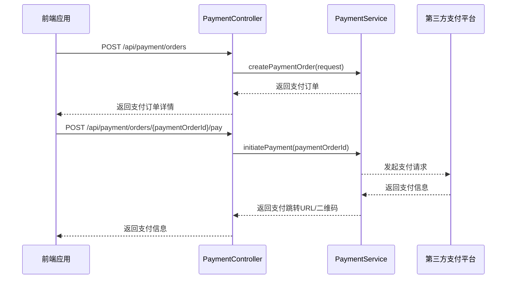
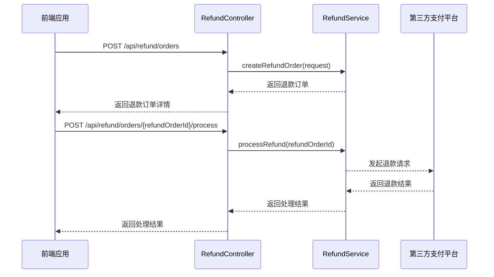
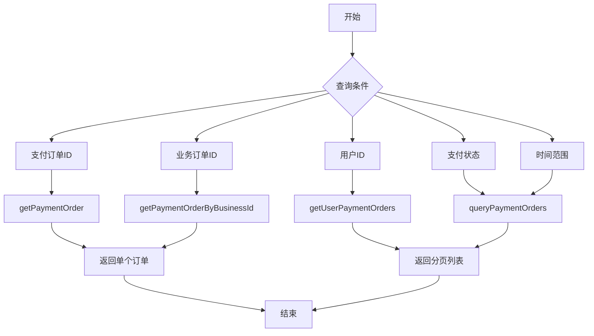
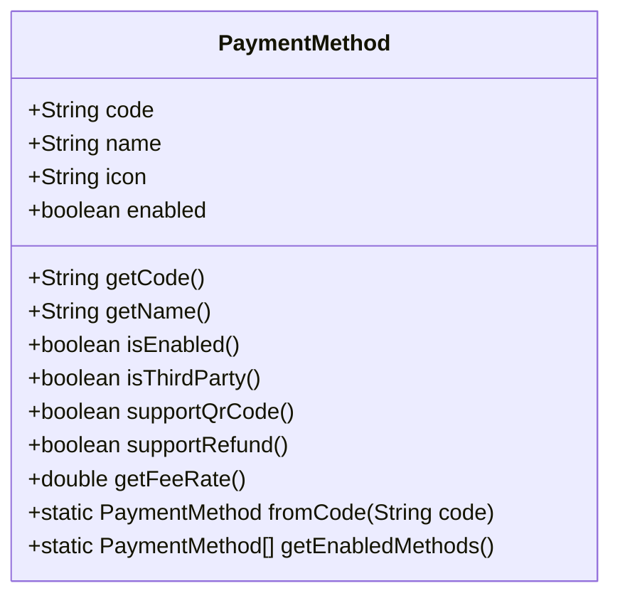
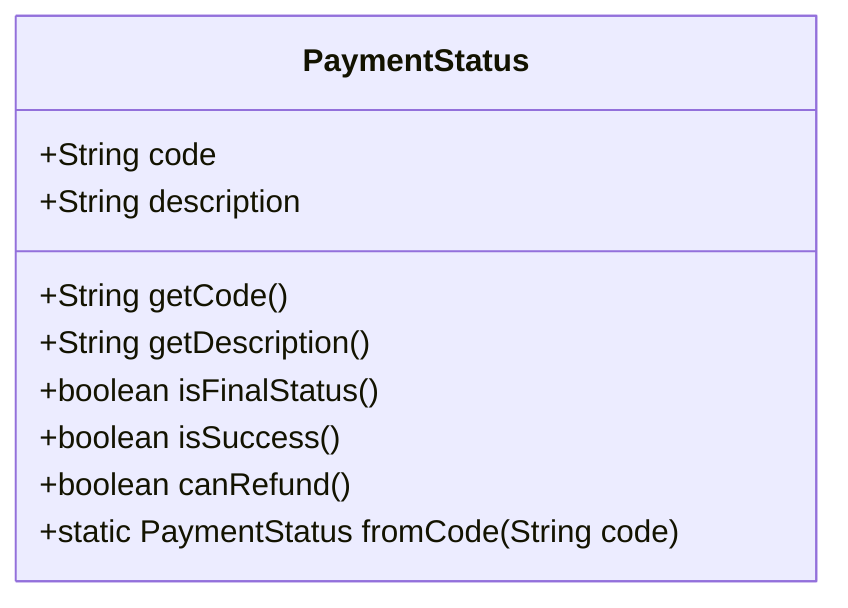
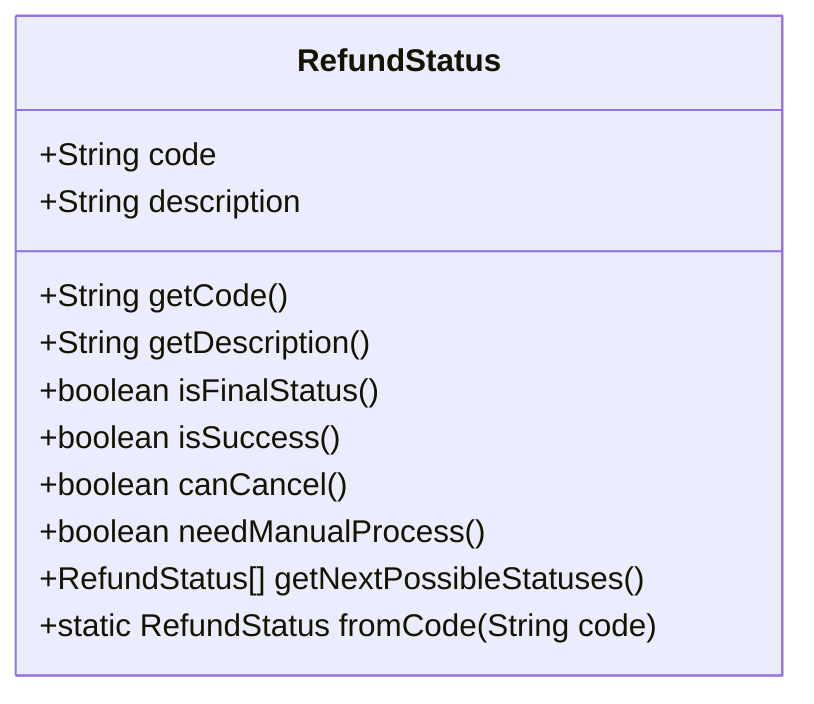
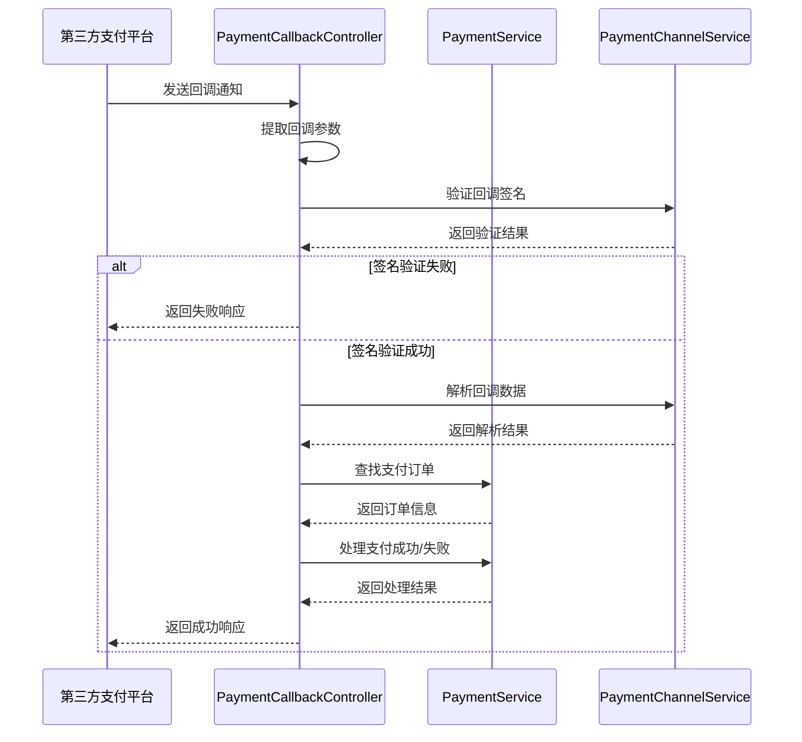
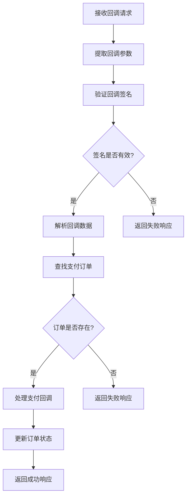

# 支付服务API

<cite>
**本文档引用文件**   
- [PaymentController.java](file://backend/payment-service/src/main/java/com/mall/payment/controller/PaymentController.java)
- [RefundController.java](file://backend/payment-service/src/main/java/com/mall/payment/controller/RefundController.java)
- [PaymentCallbackController.java](file://backend/payment-service/src/main/java/com/mall/payment/controller/PaymentCallbackController.java)
- [PaymentCreateRequest.java](file://backend/payment-service/src/main/java/com/mall/payment/dto/request/PaymentCreateRequest.java)
- [RefundCreateRequest.java](file://backend/payment-service/src/main/java/com/mall/payment/dto/request/RefundCreateRequest.java)
- [PaymentMethod.java](file://backend/payment-service/src/main/java/com/mall/payment/enums/PaymentMethod.java)
- [PaymentStatus.java](file://backend/payment-service/src/main/java/com/mall/payment/enums/PaymentStatus.java)
- [RefundStatus.java](file://backend/payment-service/src/main/java/com/mall/payment/enums/RefundStatus.java)
</cite>

## 目录
1. [简介](#简介)
2. [支付订单管理](#支付订单管理)
3. [退款订单管理](#退款订单管理)
4. [支付状态查询](#支付状态查询)
5. [支付方式枚举](#支付方式枚举)
6. [支付状态枚举](#支付状态枚举)
7. [退款状态枚举](#退款状态枚举)
8. [支付回调集成](#支付回调集成)
9. [安全验证机制](#安全验证机制)

## 简介
支付服务API提供完整的支付和退款功能，支持多种支付方式，包括支付宝、微信支付和银行卡支付。本API文档详细描述了支付创建、支付查询、退款处理等核心接口，以及支付回调的集成方案和安全验证机制。开发者可以通过本API实现完整的支付流程集成，包括创建支付订单、查询支付状态、处理退款申请等功能。

**本文档引用文件**   
- [PaymentController.java](file://backend/payment-service/src/main/java/com/mall/payment/controller/PaymentController.java)
- [RefundController.java](file://backend/payment-service/src/main/java/com/mall/payment/controller/RefundController.java)

## 支付订单管理
支付订单管理API提供创建支付订单、发起支付、取消支付等功能。创建支付订单时需要提供业务订单ID、用户ID、支付金额等必要信息。系统支持多种支付方式，包括支付宝、微信支付和银行卡支付。

**图表来源**  
- [PaymentController.java](file://backend/payment-service/src/main/java/com/mall/payment/controller/PaymentController.java#L93-L117)
- [PaymentController.java](file://backend/payment-service/src/main/java/com/mall/payment/controller/PaymentController.java#L297-L319)

**本节来源**  
- [PaymentController.java](file://backend/payment-service/src/main/java/com/mall/payment/controller/PaymentController.java#L58-L527)

## 退款订单管理
退款订单管理API提供创建退款订单、处理退款、查询退款状态等功能。用户可以申请退款，系统会根据支付状态判断是否可以退款。退款申请需要经过审核流程，审核通过后才会发起实际的退款操作。

**图表来源**  
- [RefundController.java](file://backend/payment-service/src/main/java/com/mall/payment/controller/RefundController.java#L50-L68)
- [RefundController.java](file://backend/payment-service/src/main/java/com/mall/payment/controller/RefundController.java#L218-L237)

**本节来源**  
- [RefundController.java](file://backend/payment-service/src/main/java/com/mall/payment/controller/RefundController.java#L33-L469)

## 支付状态查询
支付状态查询API提供主动查询支付状态的功能，用于同步第三方支付平台的支付状态。系统支持根据支付订单ID查询订单详情，也支持分页查询支付订单列表。查询结果包含支付订单的完整信息，包括支付金额、支付方式、支付状态等。

**图表来源**  
- [PaymentController.java](file://backend/payment-service/src/main/java/com/mall/payment/controller/PaymentController.java#L133-L157)
- [PaymentController.java](file://backend/payment-service/src/main/java/com/mall/payment/controller/PaymentController.java#L165-L188)

**本节来源**  
- [PaymentController.java](file://backend/payment-service/src/main/java/com/mall/payment/controller/PaymentController.java#L133-L483)

## 支付方式枚举
支付方式枚举定义了系统支持的各种支付方式，包括第三方支付、银行卡支付、账户支付和数字货币支付。每种支付方式都有对应的代码、名称、图标和启用状态。系统还提供了判断支付方式特性的方法，如是否支持扫码支付、是否支持退款等。

**图表来源**  
- [PaymentMethod.java](file://backend/payment-service/src/main/java/com/mall/payment/enums/PaymentMethod.java#L34-L220)

**本节来源**  
- [PaymentMethod.java](file://backend/payment-service/src/main/java/com/mall/payment/enums/PaymentMethod.java#L34-L220)

## 支付状态枚举
支付状态枚举定义了支付订单的各种状态，用于跟踪支付流程的进展。支付状态包括待支付、支付中、支付成功、支付失败、已取消、已过期、已退款和部分退款。系统提供了判断状态特性的方法，如是否为终态状态、是否可以退款等。

**图表来源**  
- [PaymentStatus.java](file://backend/payment-service/src/main/java/com/mall/payment/enums/PaymentStatus.java#L35-L162)

**本节来源**  
- [PaymentStatus.java](file://backend/payment-service/src/main/java/com/mall/payment/enums/PaymentStatus.java#L35-L162)

## 退款状态枚举
退款状态枚举定义了退款订单的各种状态，用于跟踪退款流程的进展。退款状态包括待审核、审核中、待人工审核、审核通过、审核拒绝、处理中、退款成功、退款失败、已取消和异常。系统提供了判断状态特性的方法，如是否为终态状态、是否可以取消等。

**图表来源**  
- [RefundStatus.java](file://backend/payment-service/src/main/java/com/mall/payment/enums/RefundStatus.java#L38-L207)

**本节来源**  
- [RefundStatus.java](file://backend/payment-service/src/main/java/com/mall/payment/enums/RefundStatus.java#L38-L207)

## 支付回调集成
支付回调集成方案用于处理来自第三方支付平台的支付和退款回调通知。系统支持支付宝、微信支付和银行卡支付的回调处理。回调处理流程包括接收回调请求、验证签名、解析数据、更新订单状态和返回响应。不同支付平台的回调格式和响应要求有所不同。

**图表来源**  
- [PaymentCallbackController.java](file://backend/payment-service/src/main/java/com/mall/payment/controller/PaymentCallbackController.java#L108-L166)
- [PaymentCallbackController.java](file://backend/payment-service/src/main/java/com/mall/payment/controller/PaymentCallbackController.java#L180-L240)

**本节来源**  
- [PaymentCallbackController.java](file://backend/payment-service/src/main/java/com/mall/payment/controller/PaymentCallbackController.java#L65-L576)

## 安全验证机制
安全验证机制确保支付回调的合法性和完整性。系统采用签名验证机制，使用预共享密钥对回调数据进行签名验证。不同支付平台的签名算法和参数要求有所不同。系统还记录了所有回调请求的详细日志，便于问题排查和安全审计。

**图表来源**  
- [PaymentCallbackController.java](file://backend/payment-service/src/main/java/com/mall/payment/controller/PaymentCallbackController.java#L118-L123)
- [PaymentCallbackController.java](file://backend/payment-service/src/main/java/com/mall/payment/controller/PaymentCallbackController.java#L190-L195)

**本节来源**  
- [PaymentCallbackController.java](file://backend/payment-service/src/main/java/com/mall/payment/controller/PaymentCallbackController.java#L118-L123)
- [PaymentChannelService.java](file://backend/payment-service/src/main/java/com/mall/payment/service/PaymentChannelService.java)