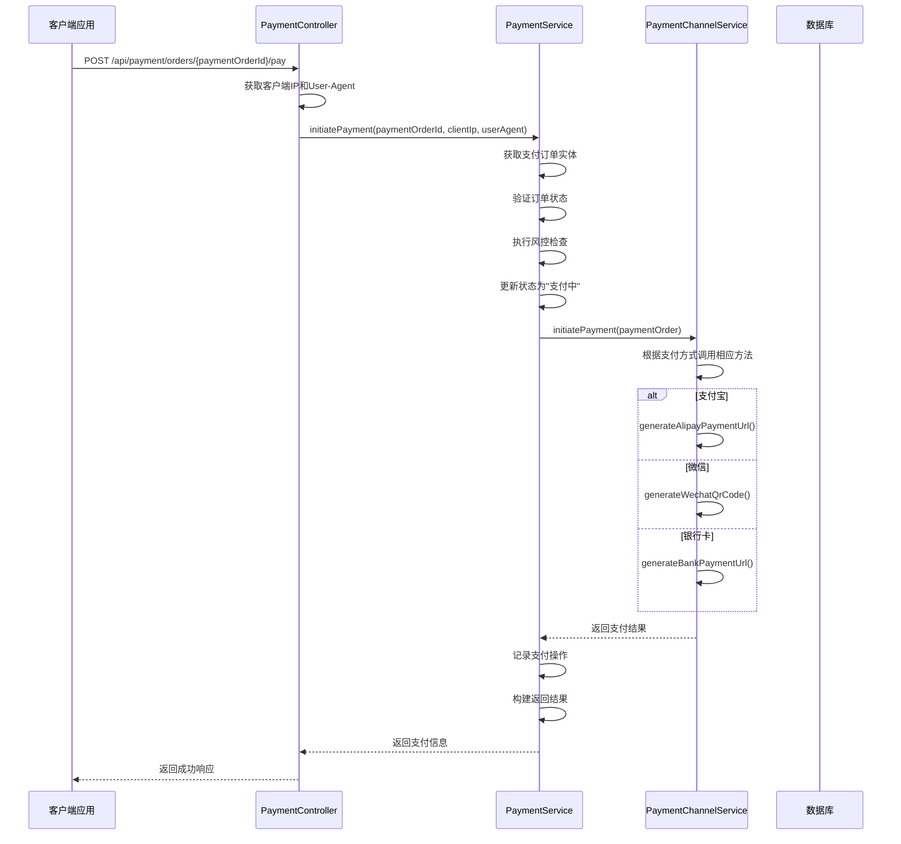
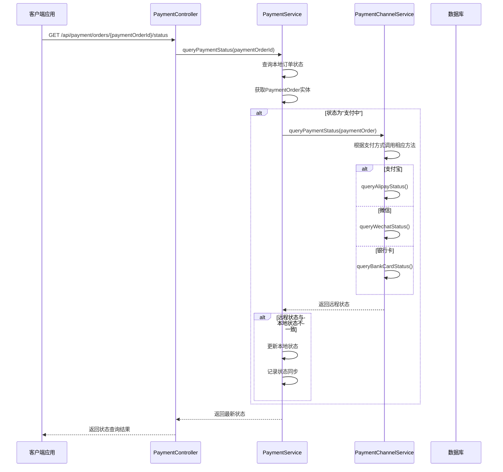
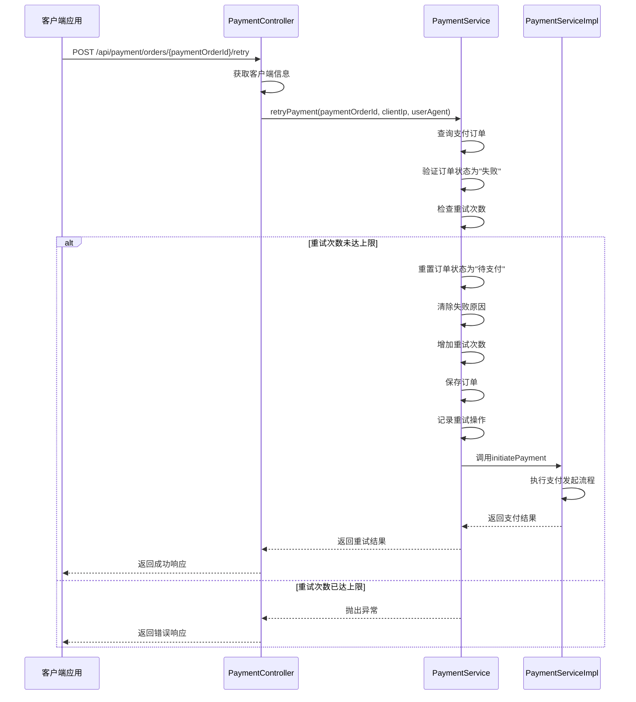
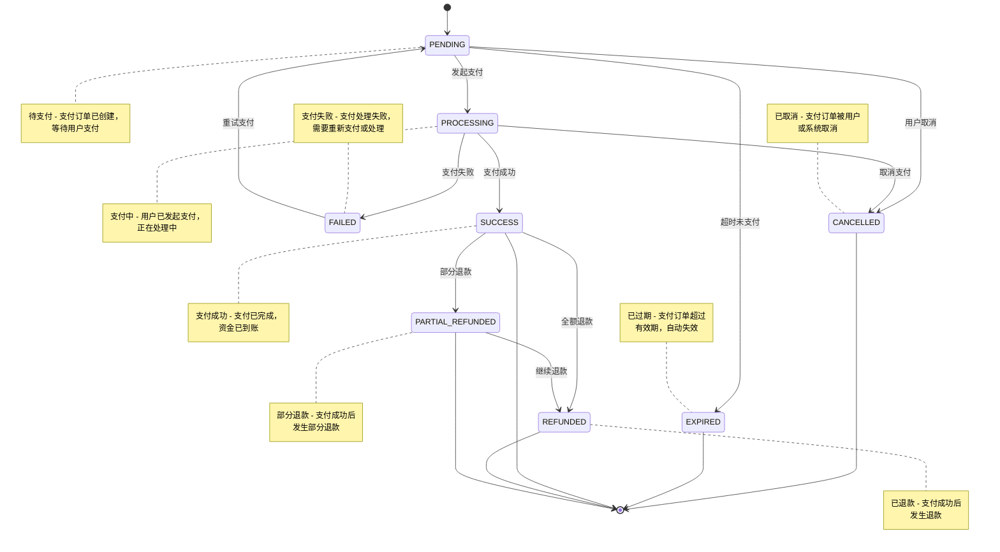
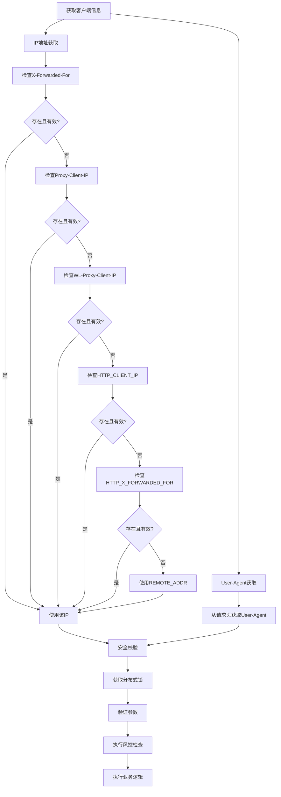
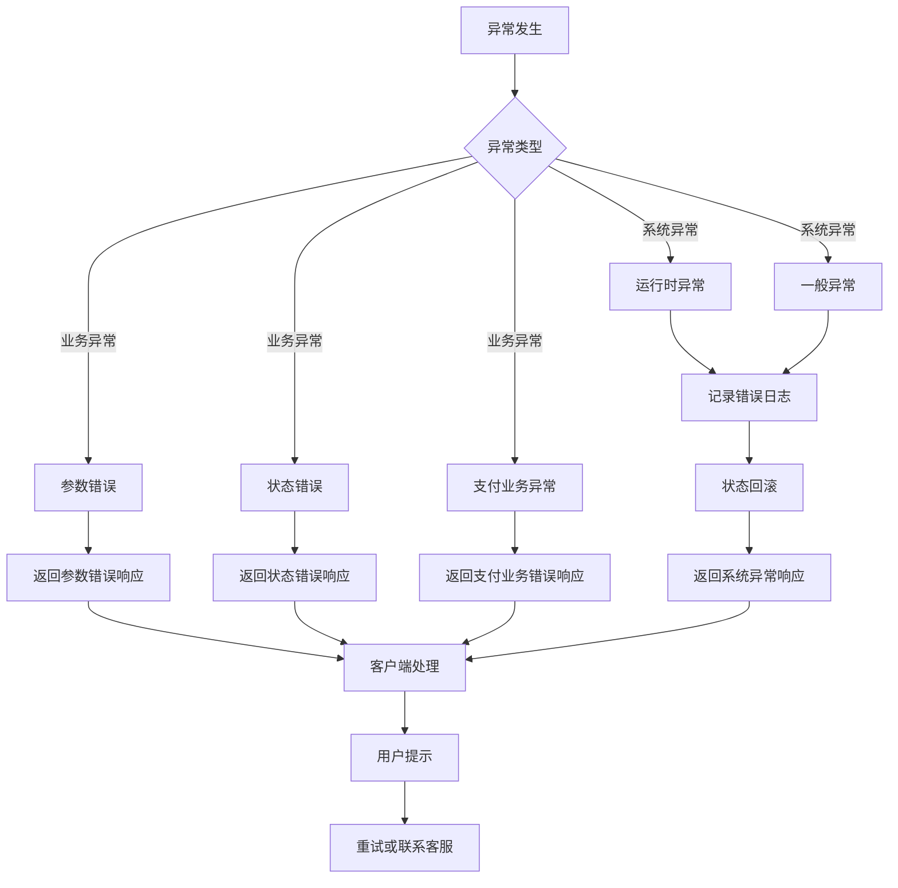

# 支付流程管理API

<cite>
**本文档引用文件**   
- [PaymentController.java](file://backend/payment-service/src/main/java/com/mall/payment/controller/PaymentController.java)
- [PaymentServiceImpl.java](file://backend/payment-service/src/main/java/com/mall/payment/service/impl/PaymentServiceImpl.java)
- [PaymentChannelServiceImpl.java](file://backend/payment-service/src/main/java/com/mall/payment/service/impl/PaymentChannelServiceImpl.java)
- [PaymentStatus.java](file://backend/payment-service/src/main/java/com/mall/payment/enums/PaymentStatus.java)
- [PaymentMethod.java](file://backend/payment-service/src/main/java/com/mall/payment/enums/PaymentMethod.java)
- [PaymentOrder.java](file://backend/payment-service/src/main/java/com/mall/payment/entity/PaymentOrder.java)
- [PaymentOrderResponse.java](file://backend/payment-service/src/main/java/com/mall/payment/dto/response/PaymentOrderResponse.java)
- [PaymentCreateRequest.java](file://backend/payment-service/src/main/java/com/mall/payment/dto/request/PaymentCreateRequest.java)
- [IpUtil.java](file://backend/admin-service/src/main/java/com/mall/admin/util/IpUtil.java)
</cite>

## 目录
1. [简介](#简介)
2. [支付发起](#支付发起)
3. [状态查询](#状态查询)
4. [支付重试](#支付重试)
5. [支付状态机](#支付状态机)
6. [安全与校验](#安全与校验)
7. [异常处理](#异常处理)

## 简介
本API文档详细描述了支付流程管理的核心功能，包括支付发起、状态查询和重试等关键操作。文档基于支付服务中的核心方法，深入解析支付流程的各个阶段及其状态转换逻辑。重点说明了不同支付方式下的支付信息结构差异、状态同步机制以及完整的支付生命周期管理。

**Section sources**
- [PaymentController.java](file://backend/payment-service/src/main/java/com/mall/payment/controller/PaymentController.java#L296-L330)
- [PaymentServiceImpl.java](file://backend/payment-service/src/main/java/com/mall/payment/service/impl/PaymentServiceImpl.java#L339-L411)

## 支付发起
支付发起是支付流程的起点，通过调用`initiatePayment`方法启动支付过程。该方法接收支付订单ID、客户端IP和User-Agent等参数，执行完整的支付流程。

### 请求参数
- `paymentOrderId`: 支付订单ID，路径参数，不能为空
- `clientIp`: 客户端IP地址，自动从请求头获取
- `userAgent`: 用户代理信息，自动从请求头获取

### 处理流程
1. **参数验证**: 验证支付订单ID的有效性
2. **状态检查**: 确认订单处于"待支付"状态
3. **风控检查**: 执行支付前的风险控制检查
4. **状态更新**: 将订单状态更新为"支付中"
5. **调用支付渠道**: 根据支付方式调用相应的第三方支付接口
6. **返回结果**: 构建并返回支付信息

### 支付信息结构
`initiatePayment`方法返回的支付信息包含以下字段：
- `paymentUrl`: 支付跳转URL或二维码内容
- `paymentOrderId`: 支付订单ID
- `orderId`: 业务订单ID
- `amount`: 支付金额
- `paymentMethod`: 支付方式
- `clientIp`: 客户端IP
- `userAgent`: 用户代理信息

### 不同支付方式的差异
#### 支付宝
- 返回支付跳转URL，用户需要重定向到该URL完成支付
- 支持表单提交和扫码支付两种模式
- 需要处理支付宝的异步通知和同步返回

#### 微信
- 返回二维码URL，用户通过微信扫描完成支付
- 支持小程序支付和公众号支付
- 需要处理微信的支付结果通知

#### 银行卡
- 返回网银支付页面的跳转URL
- 支持多种银行的在线支付
- 需要处理银行的支付结果回调

**Diagram sources**
- [PaymentController.java](file://backend/payment-service/src/main/java/com/mall/payment/controller/PaymentController.java#L296-L330)
- [PaymentServiceImpl.java](file://backend/payment-service/src/main/java/com/mall/payment/service/impl/PaymentServiceImpl.java#L339-L411)
- [PaymentChannelServiceImpl.java](file://backend/payment-service/src/main/java/com/mall/payment/service/impl/PaymentChannelServiceImpl.java#L88-L109)

**Section sources**
- [PaymentController.java](file://backend/payment-service/src/main/java/com/mall/payment/controller/PaymentController.java#L296-L330)
- [PaymentServiceImpl.java](file://backend/payment-service/src/main/java/com/mall/payment/service/impl/PaymentServiceImpl.java#L339-L411)
- [PaymentChannelServiceImpl.java](file://backend/payment-service/src/main/java/com/mall/payment/service/impl/PaymentChannelServiceImpl.java#L88-L109)

## 状态查询
状态查询功能通过`queryPaymentStatus`方法实现，用于主动查询支付订单的最新状态，确保本地状态与第三方平台状态的一致性。

### 主动查询机制
状态查询采用主动查询机制，当订单处于"支付中"状态时，系统会主动调用第三方支付平台的查询接口获取最新状态。

### 状态同步流程
1. **查询本地状态**: 首先从数据库获取订单的本地状态
2. **判断是否需要同步**: 如果本地状态为"支付中"，则需要同步远程状态
3. **调用第三方查询**: 根据支付方式调用相应的查询方法
4. **状态比对**: 比较远程状态与本地状态是否一致
5. **状态更新**: 如果状态不一致，更新本地状态并记录同步操作

### 在状态同步中的作用
状态同步机制解决了以下问题：
- **网络异常**: 当支付回调因网络问题未能到达时，通过主动查询可以及时更新状态
- **状态不一致**: 确保本地系统状态与第三方平台状态保持一致
- **用户查询**: 为用户提供准确的支付状态信息

**Diagram sources**
- [PaymentController.java](file://backend/payment-service/src/main/java/com/mall/payment/controller/PaymentController.java#L381-L403)
- [PaymentServiceImpl.java](file://backend/payment-service/src/main/java/com/mall/payment/service/impl/PaymentServiceImpl.java#L578-L611)
- [PaymentChannelServiceImpl.java](file://backend/payment-service/src/main/java/com/mall/payment/service/impl/PaymentChannelServiceImpl.java#L117-L139)

**Section sources**
- [PaymentController.java](file://backend/payment-service/src/main/java/com/mall/payment/controller/PaymentController.java#L381-L403)
- [PaymentServiceImpl.java](file://backend/payment-service/src/main/java/com/mall/payment/service/impl/PaymentServiceImpl.java#L578-L611)
- [PaymentChannelServiceImpl.java](file://backend/payment-service/src/main/java/com/mall/payment/service/impl/PaymentChannelServiceImpl.java#L117-L139)

## 支付重试
支付重试功能通过`retryPayment`方法实现，允许对支付失败的订单进行重新支付尝试。

### 重试条件
- **订单状态**: 只有状态为"支付失败"的订单才能重试
- **重试次数**: 每个订单最多允许重试3次
- **时间限制**: 重试操作需在订单有效期内进行

### 重试流程
1. **查询支付订单**: 获取支付订单的详细信息
2. **验证订单状态**: 确认订单处于"支付失败"状态
3. **检查重试次数**: 验证重试次数是否超过上限
4. **重置订单状态**: 将订单状态重置为"待支付"
5. **更新重试计数**: 增加重试次数
6. **发起支付**: 调用`initiatePayment`方法重新发起支付

### 重试策略
- **指数退避**: 建议客户端在重试时采用指数退避策略，避免频繁请求
- **用户提示**: 在重试前向用户提示可能的原因和解决方案
- **风控检查**: 每次重试都会重新执行风控检查，确保支付安全

**Diagram sources**
- [PaymentController.java](file://backend/payment-service/src/main/java/com/mall/payment/controller/PaymentController.java#L413-L446)
- [PaymentServiceImpl.java](file://backend/payment-service/src/main/java/com/mall/payment/service/impl/PaymentServiceImpl.java#L664-L703)

**Section sources**
- [PaymentController.java](file://backend/payment-service/src/main/java/com/mall/payment/controller/PaymentController.java#L413-L446)
- [PaymentServiceImpl.java](file://backend/payment-service/src/main/java/com/mall/payment/service/impl/PaymentServiceImpl.java#L664-L703)

## 支付状态机
支付状态机展示了支付订单从创建到最终状态的完整生命周期流转。

**Diagram sources**
- [PaymentStatus.java](file://backend/payment-service/src/main/java/com/mall/payment/enums/PaymentStatus.java#L38-L140)
- [PaymentOrder.java](file://backend/payment-service/src/main/java/com/mall/payment/entity/PaymentOrder.java#L215-L237)

**Section sources**
- [PaymentStatus.java](file://backend/payment-service/src/main/java/com/mall/payment/enums/PaymentStatus.java#L38-L140)
- [PaymentOrder.java](file://backend/payment-service/src/main/java/com/mall/payment/entity/PaymentOrder.java#L215-L237)

## 安全与校验
支付流程中的安全校验机制确保了支付操作的安全性和可靠性。

### 客户端信息传递
#### IP地址传递
系统通过以下方式获取客户端IP地址，考虑了代理服务器的情况：
1. 从`X-Forwarded-For`头获取
2. 从`Proxy-Client-IP`头获取
3. 从`WL-Proxy-Client-IP`头获取
4. 从`HTTP_CLIENT_IP`头获取
5. 从`HTTP_X_FORWARDED_FOR`头获取
6. 从`REMOTE_ADDR`获取

当存在多个IP时，取第一个IP作为客户端真实IP。

#### User-Agent传递
User-Agent信息直接从HTTP请求头中获取，用于识别客户端类型和版本。

### 安全校验机制
#### 分布式锁
在关键操作中使用分布式锁防止并发问题：
- **支付发起**: 防止重复支付
- **支付成功回调**: 防止重复处理
- **支付失败回调**: 防止重复处理

#### 风控检查
支付前执行全面的风控检查，包括：
- 金额限制检查
- 频率限制检查
- IP黑名单检查
- 设备限制检查
- 时间限制检查

#### 参数验证
使用JSR-303验证注解确保输入参数的有效性：
- `@NotBlank`: 验证字符串不为空
- `@NotNull`: 验证对象不为null
- `@DecimalMin`: 验证最小值
- `@DecimalMax`: 验证最大值
- `@Pattern`: 验证正则表达式

**Diagram sources**
- [PaymentController.java](file://backend/payment-service/src/main/java/com/mall/payment/controller/PaymentController.java#L487-L515)
- [IpUtil.java](file://backend/admin-service/src/main/java/com/mall/admin/util/IpUtil.java#L15-L58)
- [PaymentServiceImpl.java](file://backend/payment-service/src/main/java/com/mall/payment/service/impl/PaymentServiceImpl.java#L346-L350)

**Section sources**
- [PaymentController.java](file://backend/payment-service/src/main/java/com/mall/payment/controller/PaymentController.java#L487-L515)
- [IpUtil.java](file://backend/admin-service/src/main/java/com/mall/admin/util/IpUtil.java#L15-L58)
- [PaymentServiceImpl.java](file://backend/payment-service/src/main/java/com/mall/payment/service/impl/PaymentServiceImpl.java#L346-L350)

## 异常处理
支付流程中的异常处理机制确保了系统的稳定性和用户体验。

### 异常分类
#### 业务异常
- `IllegalArgumentException`: 参数错误
- `IllegalStateException`: 状态错误
- `PaymentException`: 支付业务异常

#### 系统异常
- `RuntimeException`: 运行时异常
- `Exception`: 一般异常

### 异常处理建议
#### 客户端处理
- **参数错误**: 检查请求参数是否符合要求
- **状态错误**: 刷新订单状态，确认当前状态是否允许操作
- **系统异常**: 稍后重试或联系客服

#### 服务端处理
- **记录日志**: 详细记录异常信息，便于排查问题
- **状态回滚**: 在异常发生时回滚订单状态
- **监控告警**: 对关键异常进行监控和告警

### 重试策略
- **指数退避**: 采用指数退避策略进行重试
- **最大重试次数**: 设置合理的最大重试次数
- **熔断机制**: 在连续失败时触发熔断，避免雪崩

**Diagram sources**
- [PaymentController.java](file://backend/payment-service/src/main/java/com/mall/payment/controller/PaymentController.java#L321-L329)
- [PaymentServiceImpl.java](file://backend/payment-service/src/main/java/com/mall/payment/service/impl/PaymentServiceImpl.java#L391-L405)

**Section sources**
- [PaymentController.java](file://backend/payment-service/src/main/java/com/mall/payment/controller/PaymentController.java#L321-L329)
- [PaymentServiceImpl.java](file://backend/payment-service/src/main/java/com/mall/payment/service/impl/PaymentServiceImpl.java#L391-L405)