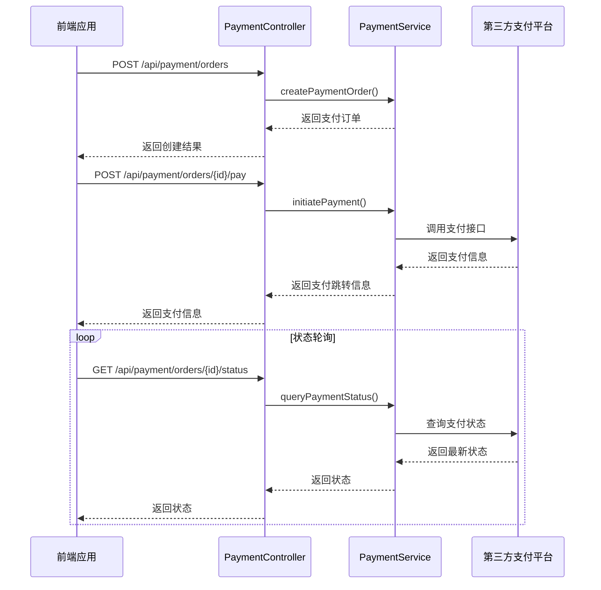
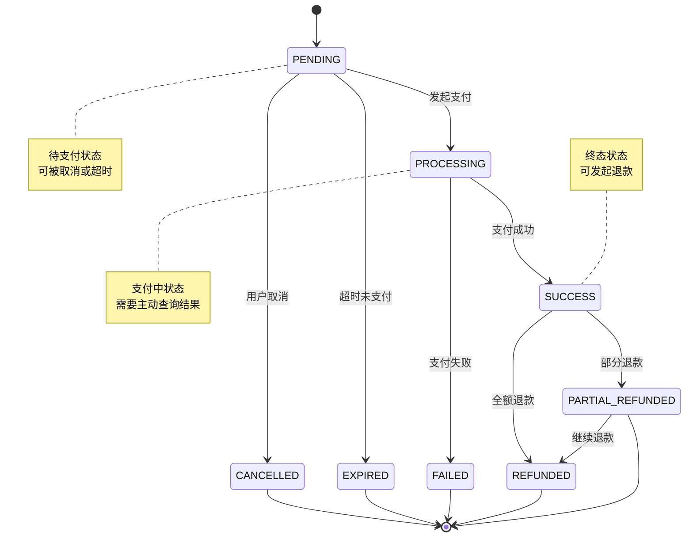

# 支付管理API

<cite>
**本文档引用文件**  
- [PaymentController.java](file://backend/payment-service/src/main/java/com/mall/payment/controller/PaymentController.java)
- [PaymentService.java](file://backend/payment-service/src/main/java/com/mall/payment/service/PaymentService.java)
- [PaymentMethod.java](file://backend/payment-service/src/main/java/com/mall/payment/enums/PaymentMethod.java)
- [PaymentStatus.java](file://backend/payment-service/src/main/java/com/mall/payment/enums/PaymentStatus.java)
- [PaymentCreateRequest.java](file://backend/payment-service/src/main/java/com/mall/payment/dto/request/PaymentCreateRequest.java)
- [PaymentOrderResponse.java](file://backend/payment-service/src/main/java/com/mall/payment/dto/response/PaymentOrderResponse.java)
</cite>

## 目录
1. [简介](#简介)
2. [核心API接口](#核心api接口)
3. [支付方式枚举](#支付方式枚举)
4. [支付状态枚举与流转](#支付状态枚举与流转)
5. [支付流程时序图](#支付流程时序图)
6. [支付状态机图](#支付状态机图)
7. [错误码说明](#错误码说明)
8. [重试机制与幂等性](#重试机制与幂等性)

## 简介
支付管理API提供完整的支付订单生命周期管理功能，包括创建支付订单、发起支付、查询订单状态、取消订单等核心操作。该服务作为微服务架构中的独立支付模块，通过RESTful接口为前端应用和其他服务提供安全可靠的支付能力。

支付服务支持多种支付方式，包括支付宝、微信支付、银行卡等，并具备完善的权限控制、日志记录和异常处理机制。所有接口均通过Nacos进行服务注册与发现，使用Redis实现缓存和分布式锁，确保高并发场景下的数据一致性。

**Section sources**
- [PaymentServiceApplication.java](file://backend/payment-service/src/main/java/com/mall/payment/PaymentServiceApplication.java#L30-L40)

## 核心API接口

### 创建支付订单（createPaymentOrder）
创建新的支付订单，初始化支付流程。

- **端点**: `POST /api/payment/orders`
- **权限要求**: USER角色，支持资源所有者访问
- **请求参数**: `PaymentCreateRequest`对象
- **响应格式**: 包含`success`、`message`和`data`（支付订单详情）的JSON对象
- **使用场景**: 用户提交订单后调用此接口创建对应的支付订单

**Section sources**
- [PaymentController.java](file://backend/payment-service/src/main/java/com/mall/payment/controller/PaymentController.java#L92-L124)
- [PaymentService.java](file://backend/payment-service/src/main/java/com/mall/payment/service/PaymentService.java#L44-L60)

### 发起支付（initiatePayment）
根据支付订单ID发起实际支付流程。

- **端点**: `POST /api/payment/orders/{paymentOrderId}/pay`
- **权限要求**: USER角色
- **请求参数**: 支付订单ID（路径参数）
- **响应格式**: 包含支付跳转URL或二维码信息的JSON对象
- **使用场景**: 用户确认支付时调用，获取第三方支付平台的支付信息

**Section sources**
- [PaymentController.java](file://backend/payment-service/src/main/java/com/mall/payment/controller/PaymentController.java#L296-L330)
- [PaymentService.java](file://backend/payment-service/src/main/java/com/mall/payment/service/PaymentService.java#L78-L85)

### 查询支付订单列表（queryPaymentOrders）
分页查询支付订单，支持多条件筛选。

- **端点**: `GET /api/payment/orders`
- **权限要求**: ADMIN角色
- **查询参数**: 用户ID、状态、时间范围、分页信息
- **响应格式**: 分页响应对象，包含订单列表和分页元数据
- **使用场景**: 管理后台查看所有支付订单

**Section sources**
- [PaymentController.java](file://backend/payment-service/src/main/java/com/mall/payment/controller/PaymentController.java#L201-L235)
- [PaymentService.java](file://backend/payment-service/src/main/java/com/mall/payment/service/PaymentService.java#L68-L76)

### 查询用户支付订单（getUserPaymentOrders）
查询指定用户的支付订单列表。

- **端点**: `GET /api/payment/orders/user/{userId}`
- **权限要求**: USER或ADMIN角色，支持资源所有者访问
- **路径参数**: 用户ID
- **分页参数**: page、size
- **响应格式**: 分页响应对象
- **使用场景**: 用户个人中心查看自己的支付记录

**Section sources**
- [PaymentController.java](file://backend/payment-service/src/main/java/com/mall/payment/controller/PaymentController.java#L245-L267)
- [PaymentService.java](file://backend/payment-service/src/main/java/com/mall/payment/service/PaymentService.java#L87-L94)

### 取消支付订单（cancelPaymentOrder）
取消未完成的支付订单。

- **端点**: `POST /api/payment/orders/{paymentOrderId}/cancel`
- **权限要求**: 无特定角色限制，但需验证订单状态
- **路径参数**: 支付订单ID
- **查询参数**: 取消原因（可选）
- **响应格式**: 操作结果和消息
- **使用场景**: 用户主动取消订单或系统超时自动取消

**Section sources**
- [PaymentController.java](file://backend/payment-service/src/main/java/com/mall/payment/controller/PaymentController.java#L340-L372)
- [PaymentService.java](file://backend/payment-service/src/main/java/com/mall/payment/service/PaymentService.java#L110-L118)

### 查询支付状态（queryPaymentStatus）
主动查询支付订单的最新状态。

- **端点**: `GET /api/payment/orders/{paymentOrderId}/status`
- **权限要求**: 无特定角色限制
- **路径参数**: 支付订单ID
- **响应格式**: 包含支付订单ID和当前状态的对象
- **使用场景**: 前端轮询或后台定时同步支付状态

**Section sources**
- [PaymentController.java](file://backend/payment-service/src/main/java/com/mall/payment/controller/PaymentController.java#L381-L403)
- [PaymentService.java](file://backend/payment-service/src/main/java/com/mall/payment/service/PaymentService.java#L102-L108)

### 重试支付（retryPayment）
对失败的支付订单重新发起支付。

- **端点**: `POST /api/payment/orders/{paymentOrderId}/retry`
- **权限要求**: 无特定角色限制
- **路径参数**: 支付订单ID
- **响应格式**: 新的支付信息
- **使用场景**: 支付失败后用户点击重试按钮

**Section sources**
- [PaymentController.java](file://backend/payment-service/src/main/java/com/mall/payment/controller/PaymentController.java#L413-L446)
- [PaymentService.java](file://backend/payment-service/src/main/java/com/mall/payment/service/PaymentService.java#L96-L100)

## 支付方式枚举
`PaymentMethod`枚举定义了系统支持的所有支付方式及其属性。

| 支付方式代码 | 名称 | 是否启用 | 是否支持扫码 | 是否支持退款 | 手续费率 |
|------------|------|---------|------------|------------|---------|
| ALIPAY | 支付宝 | 是 | 是 | 是 | 0.6% |
| WECHAT | 微信支付 | 是 | 是 | 是 | 0.6% |
| BANK_CARD | 银行卡 | 是 | 否 | 是 | 0.8% |
| BALANCE | 余额支付 | 是 | 否 | 是 | 0.0% |
| CREDIT_CARD | 信用卡 | 否 | 否 | 是 | 0.8% |
| PAYPAL | PayPal | 否 | 否 | 是 | 2.9% |
| CRYPTO | 数字货币 | 否 | 否 | 否 | 1.0% |

**Section sources**
- [PaymentMethod.java](file://backend/payment-service/src/main/java/com/mall/payment/enums/PaymentMethod.java#L33-L219)

## 支付状态枚举与流转
`PaymentStatus`枚举定义了支付订单的生命周期状态。

### 状态定义
| 状态代码 | 描述 | 是否终态 | 是否成功 | 是否可退款 |
|--------|------|---------|---------|----------|
| PENDING | 待支付 | 否 | 否 | 否 |
| PROCESSING | 支付中 | 否 | 否 | 否 |
| SUCCESS | 支付成功 | 是 | 是 | 是 |
| FAILED | 支付失败 | 是 | 否 | 否 |
| CANCELLED | 已取消 | 是 | 否 | 否 |
| EXPIRED | 已过期 | 是 | 否 | 否 |
| REFUNDED | 已退款 | 是 | 是 | 否 |
| PARTIAL_REFUNDED | 部分退款 | 是 | 是 | 是 |

### 状态流转规则
- `PENDING` → `PROCESSING`：用户发起支付
- `PENDING` → `CANCELLED`：用户或系统取消订单
- `PENDING` → `EXPIRED`：订单超时未支付
- `PROCESSING` → `SUCCESS`：支付成功
- `PROCESSING` → `FAILED`：支付失败
- `SUCCESS` → `REFUNDED`：全额退款
- `SUCCESS` → `PARTIAL_REFUNDED`：部分退款
- `PARTIAL_REFUNDED` → `REFUNDED`：继续退款至全额

**Section sources**
- [PaymentStatus.java](file://backend/payment-service/src/main/java/com/mall/payment/enums/PaymentStatus.java#L34-L161)

## 支付流程时序图

**Diagram sources**
- [PaymentController.java](file://backend/payment-service/src/main/java/com/mall/payment/controller/PaymentController.java#L92-L124)
- [PaymentController.java](file://backend/payment-service/src/main/java/com/mall/payment/controller/PaymentController.java#L296-L330)
- [PaymentController.java](file://backend/payment-service/src/main/java/com/mall/payment/controller/PaymentController.java#L381-L403)

## 支付状态机图

**Diagram sources**
- [PaymentStatus.java](file://backend/payment-service/src/main/java/com/mall/payment/enums/PaymentStatus.java#L34-L161)

## 错误码说明
| 错误类型 | HTTP状态码 | 说明 | 处理建议 |
|--------|----------|------|--------|
| 参数错误 | 400 Bad Request | 请求参数无效 | 检查请求参数格式和必填项 |
| 状态错误 | 400 Bad Request | 订单状态不允许当前操作 | 检查订单当前状态 |
| 资源未找到 | 404 Not Found | 支付订单不存在 | 确认支付订单ID正确 |
| 权限不足 | 403 Forbidden | 用户无权访问该资源 | 检查用户角色和权限 |
| 系统异常 | 500 Internal Server Error | 服务端处理失败 | 重试或联系技术支持 |

**Section sources**
- [PaymentController.java](file://backend/payment-service/src/main/java/com/mall/payment/controller/PaymentController.java#L519-L525)

## 重试机制与幂等性
### 重试机制
- 支付失败后可通过`/retry`接口重新发起支付
- 同一订单最多允许3次重试
- 重试间隔建议大于30秒
- 重试时会生成新的客户端票据，避免重复支付

### 幂等性保证
- **创建订单**: 基于业务订单ID实现幂等，相同业务订单ID不会创建多个支付订单
- **发起支付**: 同一支付订单ID的支付请求具有幂等性，重复请求返回相同支付信息
- **取消订单**: 已取消的订单再次取消返回成功，不影响系统状态
- **查询操作**: 所有查询接口均为天然幂等

所有写操作均通过分布式锁确保在高并发场景下的数据一致性，防止重复操作。

**Section sources**
- [PaymentController.java](file://backend/payment-service/src/main/java/com/mall/payment/controller/PaymentController.java#L92-L124)
- [PaymentController.java](file://backend/payment-service/src/main/java/com/mall/payment/controller/PaymentController.java#L296-L330)
- [PaymentService.java](file://backend/payment-service/src/main/java/com/mall/payment/service/PaymentService.java#L44-L60)