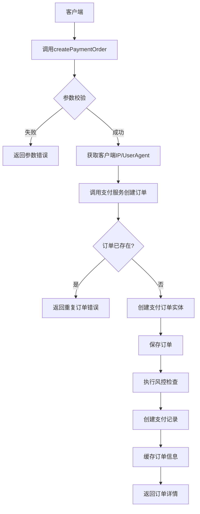
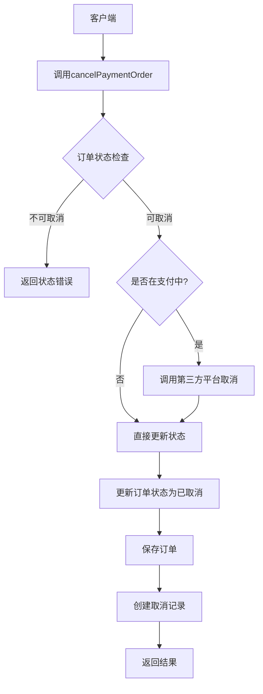
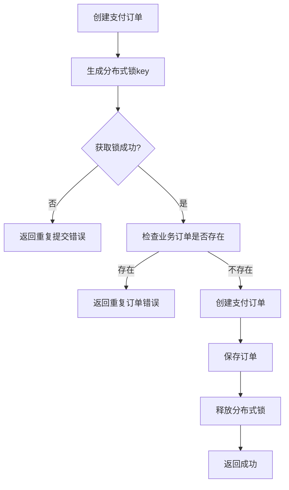
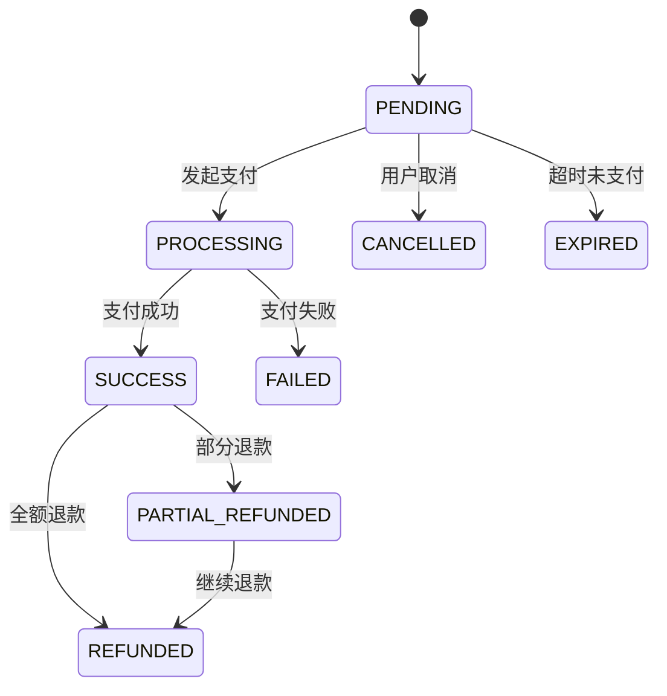
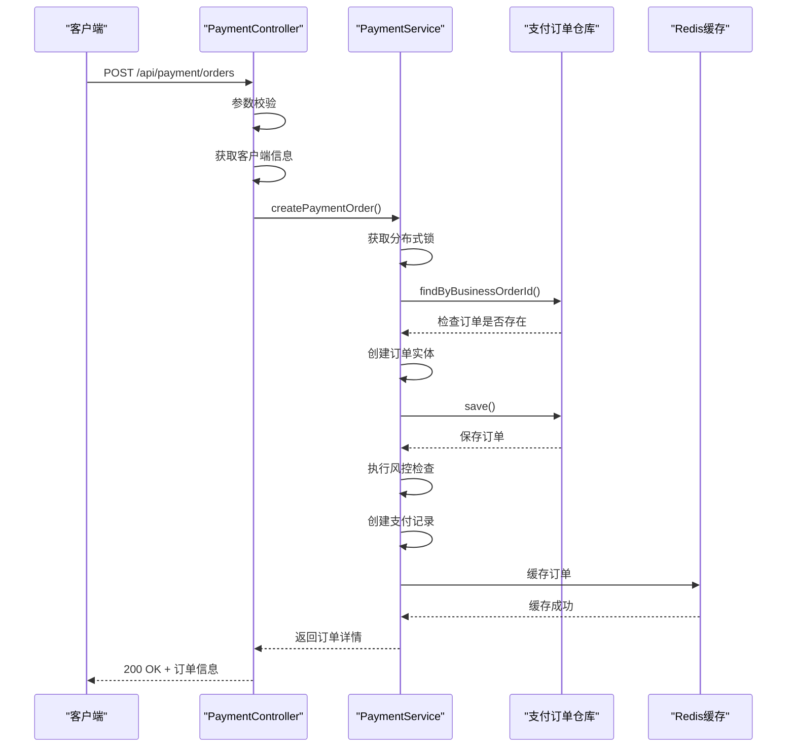
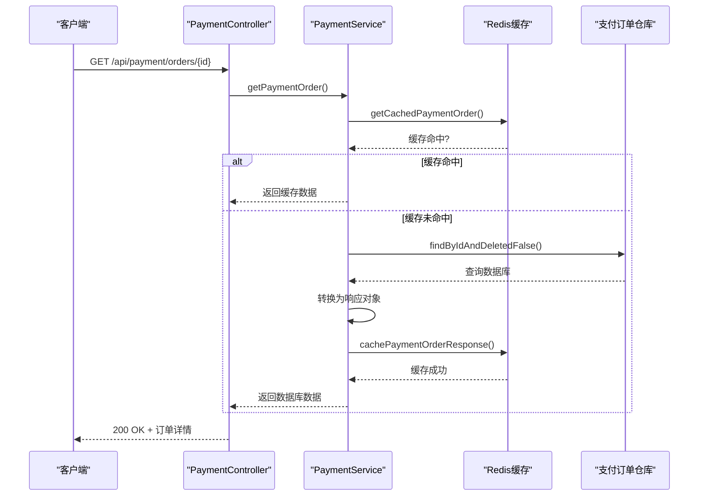

# 支付订单管理API

<cite>
**本文档引用文件**  
- [PaymentController.java](file://backend/payment-service/src/main/java/com/mall/payment/controller/PaymentController.java)
- [PaymentCreateRequest.java](file://backend/payment-service/src/main/java/com/mall/payment/dto/request/PaymentCreateRequest.java)
- [PaymentOrderResponse.java](file://backend/payment-service/src/main/java/com/mall/payment/dto/response/PaymentOrderResponse.java)
- [PaymentStatus.java](file://backend/payment-service/src/main/java/com/mall/payment/enums/PaymentStatus.java)
- [PaymentServiceImpl.java](file://backend/payment-service/src/main/java/com/mall/payment/service/impl/PaymentServiceImpl.java)
</cite>

## 目录
1. [简介](#简介)
2. [核心接口说明](#核心接口说明)
3. [请求参数校验规则](#请求参数校验规则)
4. [响应数据结构](#响应数据结构)
5. [权限控制规则](#权限控制规则)
6. [错误码说明](#错误码说明)
7. [幂等性处理机制](#幂等性处理机制)
8. [状态流转说明](#状态流转说明)
9. [交互时序图](#交互时序图)
10. [最佳实践建议](#最佳实践建议)

## 简介

支付订单管理API提供了完整的支付订单生命周期管理功能，涵盖支付订单的创建、查询、取消和分页查询等核心操作。该服务通过`PaymentController`暴露RESTful接口，支持用户发起支付、查询订单状态、取消未支付订单以及管理员进行订单数据统计等功能。

系统采用微服务架构设计，通过`PaymentService`实现业务逻辑，结合分布式锁保障幂等性，并通过缓存优化查询性能。所有接口均具备完善的参数校验、异常处理和日志记录机制，确保系统的稳定性和可维护性。

**Section sources**
- [PaymentController.java](file://backend/payment-service/src/main/java/com/mall/payment/controller/PaymentController.java#L28-L57)

## 核心接口说明

### 创建支付订单

**接口路径**：`POST /api/payment/orders`  
**权限要求**：USER角色，且仅能操作自己的订单  
**功能描述**：根据业务订单信息创建支付订单，返回支付订单详情



**请求参数**：
- `businessOrderId`：业务订单ID（必填）
- `userId`：用户ID（必填）
- `amount`：支付金额（必填）
- `paymentMethod`：支付方式（必填）
- `description`：支付描述
- `returnUrl`：支付成功返回URL
- `notifyUrl`：异步通知URL

**响应示例**：
```json
{
  "success": true,
  "message": "支付订单创建成功",
  "data": {
    "id": "PAY20251101001",
    "orderId": "BUS20251101001",
    "userId": "U1001",
    "amount": 99.99,
    "status": "PENDING"
  }
}
```

**Section sources**
- [PaymentController.java](file://backend/payment-service/src/main/java/com/mall/payment/controller/PaymentController.java#L92-L124)
- [PaymentCreateRequest.java](file://backend/payment-service/src/main/java/com/mall/payment/dto/request/PaymentCreateRequest.java#L44-L256)
- [PaymentServiceImpl.java](file://backend/payment-service/src/main/java/com/mall/payment/service/impl/PaymentServiceImpl.java#L148-L209)

### 查询支付订单详情

**接口路径**：`GET /api/payment/orders/{paymentOrderId}`  
**权限要求**：USER或ADMIN角色  
**功能描述**：根据支付订单ID查询订单详情

该接口首先尝试从缓存获取订单信息，若缓存未命中则查询数据库，并将结果写入缓存以提升后续查询性能。

**响应字段**：
- `id`：支付订单ID
- `orderId`：关联的业务订单ID
- `userId`：用户ID
- `amount`：支付金额
- `status`：支付状态
- `createdAt`：创建时间

**Section sources**
- [PaymentController.java](file://backend/payment-service/src/main/java/com/mall/payment/controller/PaymentController.java#L132-L156)
- [PaymentServiceImpl.java](file://backend/payment-service/src/main/java/com/mall/payment/service/impl/PaymentServiceImpl.java#L218-L241)

### 分页查询支付订单

**接口路径**：`GET /api/payment/orders`  
**权限要求**：ADMIN角色  
**功能描述**：支持多种条件组合的分页查询

**查询参数**：
- `userId`：用户ID（可选）
- `status`：支付状态（可选）
- `startTime`：开始时间（可选）
- `endTime`：结束时间（可选）
- `page`：页码（默认1）
- `size`：每页大小（默认10）

**响应结构**：
```json
{
  "success": true,
  "data": {
    "content": [...],
    "totalElements": 100,
    "page": 1,
    "size": 10
  }
}
```

**Section sources**
- [PaymentController.java](file://backend/payment-service/src/main/java/com/mall/payment/controller/PaymentController.java#L201-L235)
- [PaymentServiceImpl.java](file://backend/payment-service/src/main/java/com/mall/payment/service/impl/PaymentServiceImpl.java#L279-L304)

### 查询用户支付订单列表

**接口路径**：`GET /api/payment/orders/user/{userId}`  
**权限要求**：USER或ADMIN角色，支持资源所有者访问  
**功能描述**：查询指定用户的支付订单列表

此接口允许用户查询自己的订单，管理员可查询任意用户订单。

**Section sources**
- [PaymentController.java](file://backend/payment-service/src/main/java/com/mall/payment/controller/PaymentController.java#L245-L267)
- [PaymentServiceImpl.java](file://backend/payment-service/src/main/java/com/mall/payment/service/impl/PaymentServiceImpl.java#L314-L327)

### 取消支付订单

**接口路径**：`POST /api/payment/orders/{paymentOrderId}/cancel`  
**权限要求**：无特定角色限制  
**功能描述**：取消未支付的订单



**请求参数**：
- `paymentOrderId`：支付订单ID（路径参数）
- `reason`：取消原因（可选）

**Section sources**
- [PaymentController.java](file://backend/payment-service/src/main/java/com/mall/payment/controller/PaymentController.java#L340-L372)
- [PaymentServiceImpl.java](file://backend/payment-service/src/main/java/com/mall/payment/service/impl/PaymentServiceImpl.java#L531-L570)

## 请求参数校验规则

所有接口均采用JSR-303标准进行参数校验，确保数据的完整性和安全性。

| 字段 | 校验规则 | 错误信息 |
|------|---------|---------|
| businessOrderId | 非空，长度≤64 | "业务订单ID不能为空" |
| userId | 非空，长度≤36 | "用户ID不能为空" |
| amount | ≥0.01且≤999999.99 | "支付金额必须大于0.01" |
| paymentMethod | 非空 | "支付方式不能为空" |
| returnUrl | HTTPS格式，长度≤500 | "返回URL格式不正确" |
| notifyUrl | HTTPS格式，长度≤500 | "通知URL格式不正确" |
| expireMinutes | 1-1440分钟 | "过期时间至少为1分钟" |
| clientIp | IP地址格式 | "客户端IP格式不正确" |

**Section sources**
- [PaymentCreateRequest.java](file://backend/payment-service/src/main/java/com/mall/payment/dto/request/PaymentCreateRequest.java#L47-L105)

## 响应数据结构

### PaymentOrderResponse字段说明

| 字段名 | 类型 | 说明 |
|-------|------|------|
| id | String | 支付订单ID |
| orderId | String | 业务订单ID |
| userId | String | 用户ID |
| amount | BigDecimal | 支付金额 |
| paymentMethod | PaymentMethod | 支付方式 |
| status | PaymentStatus | 支付状态 |
| description | String | 支付描述 |
| returnUrl | String | 支付成功返回URL |
| notifyUrl | String | 异步通知URL |
| expireTime | LocalDateTime | 过期时间 |
| thirdPartyOrderNo | String | 第三方订单号 |
| payTime | LocalDateTime | 支付完成时间 |
| actualAmount | BigDecimal | 实际支付金额 |
| feeAmount | BigDecimal | 手续费 |
| failureReason | String | 失败原因 |
| retryCount | Integer | 重试次数 |
| createdAt | LocalDateTime | 创建时间 |
| updatedAt | LocalDateTime | 更新时间 |
| paymentRecords | List | 支付记录列表 |
| refundOrders | List | 退款订单列表 |
| expired | Boolean | 是否已过期 |
| canPay | Boolean | 是否可以支付 |
| canCancel | Boolean | 是否可以取消 |
| canRefund | Boolean | 是否可以退款 |
| refundableAmount | BigDecimal | 可退款金额 |
| qrCodeUrl | String | 支付二维码URL |
| payUrl | String | 支付跳转URL |

**Section sources**
- [PaymentOrderResponse.java](file://backend/payment-service/src/main/java/com/mall/payment/dto/response/PaymentOrderResponse.java#L53-L200)

## 权限控制规则

系统采用基于角色和资源所有者的双重权限控制机制。

### 角色权限矩阵

| 接口 | USER | ADMIN | 说明 |
|------|------|-------|------|
| createPaymentOrder | ✓ | ✗ | 仅用户可创建订单 |
| getPaymentOrder | ✓ | ✓ | 用户和管理员可查询 |
| queryPaymentOrders | ✗ | ✓ | 仅管理员可分页查询 |
| getUserPaymentOrders | ✓ | ✓ | 支持所有者访问 |
| cancelPaymentOrder | ✓ | ✓ | 所有角色可取消 |

### 权限注解说明

使用`@RequirePermission`注解实现权限控制：
- `value`：允许访问的角色列表
- `allowOwner`：是否允许资源所有者访问
- `ownerField`：所有者字段名

**Section sources**
- [PaymentController.java](file://backend/payment-service/src/main/java/com/mall/payment/controller/PaymentController.java#L94-L247)

## 错误码说明

系统采用统一的错误响应格式：

```json
{
  "success": false,
  "error": "错误类型",
  "message": "错误描述"
}
```

### 常见错误类型

| 错误类型 | HTTP状态码 | 说明 | 示例 |
|---------|-----------|------|------|
| 参数错误 | 400 | 请求参数校验失败 | "支付金额必须大于0.01" |
| 状态错误 | 400 | 订单状态不允许操作 | "订单状态不允许取消" |
| 系统异常 | 500 | 服务端异常 | "创建支付订单失败" |
| 订单不存在 | 404 | 查询的订单不存在 | "支付订单不存在" |
| 重复提交 | 400 | 订单正在处理中 | "订单正在处理中，请勿重复提交" |

**Section sources**
- [PaymentController.java](file://backend/payment-service/src/main/java/com/mall/payment/controller/PaymentController.java#L519-L525)

## 幂等性处理机制

为防止重复提交导致的重复订单问题，系统采用分布式锁机制保障幂等性。

### 幂等性实现流程



**关键实现**：
1. 锁key：`payment_lock:businessOrderId`
2. 锁超时：30秒
3. 异常处理：finally块确保锁的释放

**Section sources**
- [PaymentServiceImpl.java](file://backend/payment-service/src/main/java/com/mall/payment/service/impl/PaymentServiceImpl.java#L148-L209)

## 状态流转说明

### 支付状态枚举

| 状态代码 | 状态描述 | 说明 |
|---------|---------|------|
| PENDING | 待支付 | 订单已创建，等待支付 |
| PROCESSING | 支付中 | 用户已发起支付 |
| SUCCESS | 支付成功 | 支付已完成 |
| FAILED | 支付失败 | 支付处理失败 |
| CANCELLED | 已取消 | 订单被取消 |
| EXPIRED | 已过期 | 订单已过期 |
| REFUNDED | 已退款 | 支付后已退款 |
| PARTIAL_REFUNDED | 部分退款 | 支付后部分退款 |

### 状态流转图



**状态检查方法**：
- `isFinalStatus()`：判断是否为终态
- `isSuccess()`：判断是否成功
- `canRefund()`：判断是否可退款

**Section sources**
- [PaymentStatus.java](file://backend/payment-service/src/main/java/com/mall/payment/enums/PaymentStatus.java#L36-L161)

## 交互时序图

### 创建支付订单时序图



**Diagram sources**
- [PaymentController.java](file://backend/payment-service/src/main/java/com/mall/payment/controller/PaymentController.java#L92-L124)
- [PaymentServiceImpl.java](file://backend/payment-service/src/main/java/com/mall/payment/service/impl/PaymentServiceImpl.java#L148-L209)

### 查询支付订单时序图



**Diagram sources**
- [PaymentController.java](file://backend/payment-service/src/main/java/com/mall/payment/controller/PaymentController.java#L132-L156)
- [PaymentServiceImpl.java](file://backend/payment-service/src/main/java/com/mall/payment/service/impl/PaymentServiceImpl.java#L218-L241)

## 最佳实践建议

1. **幂等性保证**：在前端按钮点击后立即禁用，防止用户重复提交
2. **超时处理**：设置合理的请求超时时间（建议30秒）
3. **错误重试**：对网络错误进行指数退避重试，最多3次
4. **数据缓存**：频繁查询的订单信息应本地缓存
5. **日志监控**：关键操作需记录详细日志，便于问题排查
6. **安全防护**：敏感信息（如金额）需进行前端校验和后端双重校验
7. **用户体验**：支付页面应显示剩余支付时间倒计时
8. **异常处理**：对第三方支付接口调用需设置熔断机制

**Section sources**
- [PaymentController.java](file://backend/payment-service/src/main/java/com/mall/payment/controller/PaymentController.java#L62-L65)
- [PaymentServiceImpl.java](file://backend/payment-service/src/main/java/com/mall/payment/service/impl/PaymentServiceImpl.java#L148-L209)