# 退款处理与审核API

<cite>
**本文档引用文件**   
- [RefundController.java](file://backend\payment-service\src\main\java\com\mall\payment\controller\RefundController.java)
- [RefundStatus.java](file://backend\payment-service\src\main\java\com\mall\payment\enums\RefundStatus.java)
- [RefundServiceImpl.java](file://backend\payment-service\src\main\java\com\mall\payment\service\impl\RefundServiceImpl.java)
- [RefundService.java](file://backend\payment-service\src\main\java\com\mall\payment\service\RefundService.java)
- [RefundApprovalRequest.java](file://backend\admin-service\src\main\java\com\mall\admin\domain\dto\RefundApprovalRequest.java)
</cite>

## 目录
1. [简介](#简介)
2. [核心接口说明](#核心接口说明)
3. [退款状态机流转](#退款状态机流转)
4. [批量处理待审核退款](#批量处理待审核退款)
5. [使用场景与案例](#使用场景与案例)
6. [错误处理与重试机制](#错误处理与重试机制)
7. [权限控制](#权限控制)

## 简介
本API文档详细描述了在线商城系统中退款处理与审核的核心功能。系统通过`RefundController`提供了一套完整的退款生命周期管理接口，涵盖退款申请、审核、处理、取消和重试等关键操作。退款流程严格遵循状态机模型，确保业务逻辑的完整性和数据一致性。

退款系统采用分层架构设计，控制器层负责接收HTTP请求，服务层实现核心业务逻辑，持久层管理数据存储。整个流程支持商家后台人工审核、系统自动处理以及人工干预重试等多种业务场景，满足不同复杂度的退款需求。

**Section sources**
- [RefundController.java](file://backend\payment-service\src\main\java\com\mall\payment\controller\RefundController.java#L25-L32)

## 核心接口说明
退款处理与审核API提供了四个核心操作接口：处理退款、审核退款、取消退款和重试退款。这些接口共同构成了完整的退款生命周期管理功能。

### 处理退款接口
`processRefund`接口用于发起实际的退款流程，调用第三方支付平台的退款接口。该接口将退款订单状态从"待审核"或"审核通过"变更为"处理中"，并触发与第三方支付系统的交互。

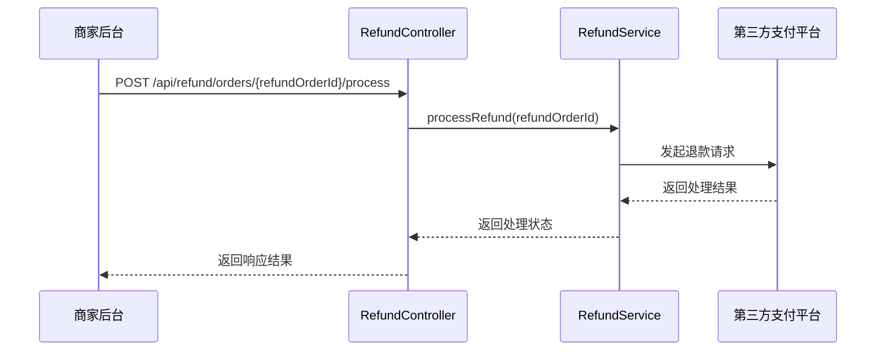

**Diagram sources**
- [RefundController.java](file://backend\payment-service\src\main\java\com\mall\payment\controller\RefundController.java#L217-L245)
- [RefundService.java](file://backend\payment-service\src\main\java\com\mall\payment\service\RefundService.java#L133-L134)

### 审核退款接口
`auditRefund`接口用于对退款申请进行人工审核，决定是否同意退款。此接口需要提供审核结果、审核意见和审核人ID等参数，是商家后台处理退款申请的核心功能。

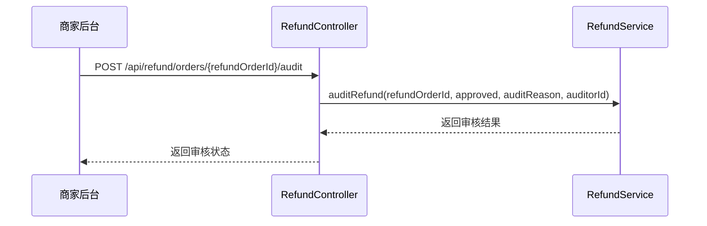

**Diagram sources**
- [RefundController.java](file://backend\payment-service\src\main\java\com\mall\payment\controller\RefundController.java#L258-L284)
- [RefundService.java](file://backend\payment-service\src\main\java\com\mall\payment\service\RefundService.java#L146-L147)

### 取消退款接口
`cancelRefund`接口用于取消退款申请，支持用户主动取消或系统自动取消。该操作会将退款订单状态变更为"已取消"，并记录取消原因。

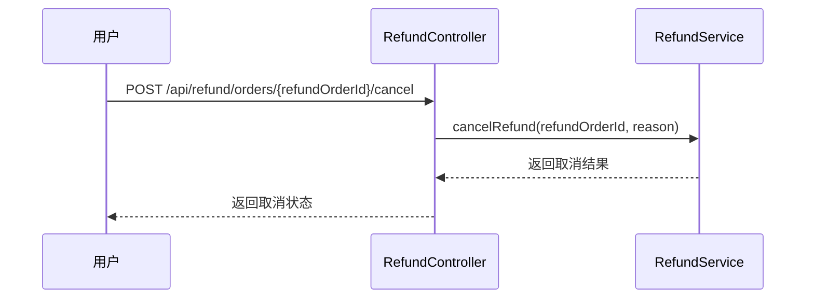

**Diagram sources**
- [RefundController.java](file://backend\payment-service\src\main\java\com\mall\payment\controller\RefundController.java#L295-L323)
- [RefundService.java](file://backend\payment-service\src\main\java\com\mall\payment\service\RefundService.java#L181-L182)

### 重试退款接口
`retryRefund`接口用于对失败的退款订单进行重试。当首次退款失败后，可通过此接口重新发起退款请求，系统会自动增加重试次数计数。

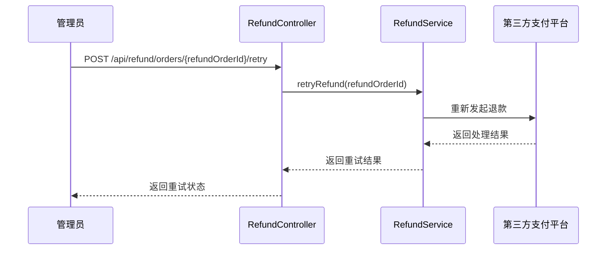

**Diagram sources**
- [RefundController.java](file://backend\payment-service\src\main\java\com\mall\payment\controller\RefundController.java#L364-L391)
- [RefundService.java](file://backend\payment-service\src\main\java\com\mall\payment\service\RefundService.java#L199-L200)

**Section sources**
- [RefundController.java](file://backend\payment-service\src\main\java\com\mall\payment\controller\RefundController.java#L217-L391)

## 退款状态机流转
退款订单的状态管理采用状态机模式，通过`RefundStatus`枚举类定义了完整的状态流转逻辑。状态机确保了退款流程的严谨性和数据一致性。

### 状态定义
`RefundStatus`枚举类定义了以下主要状态：
- **PENDING（待审核）**：退款申请已提交，等待审核
- **REVIEWING（审核中）**：退款申请正在审核中
- **APPROVED（审核通过）**：退款申请审核通过，准备处理
- **PROCESSING（处理中）**：退款正在处理中，已向第三方发起退款
- **SUCCESS（退款成功）**：退款已成功，资金已退回
- **FAILED（退款失败）**：退款处理失败
- **CANCELLED（已取消）**：退款申请被取消
- **REJECTED（审核拒绝）**：退款申请被拒绝

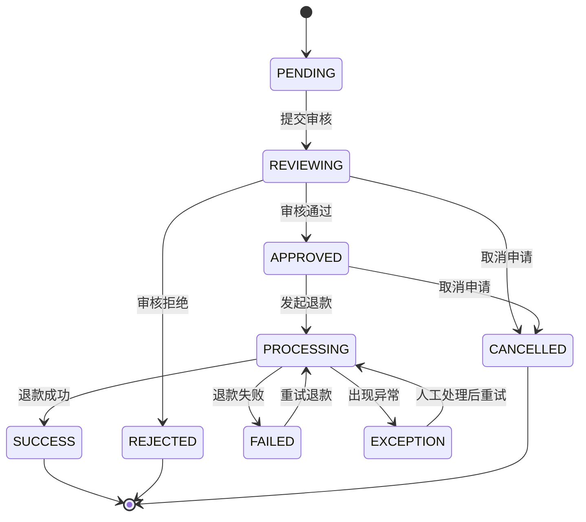

**Diagram sources**
- [RefundStatus.java](file://backend\payment-service\src\main\java\com\mall\payment\enums\RefundStatus.java#L44-L89)

### 状态流转规则
退款状态的流转遵循严格的业务规则：
1. **初始状态**：退款申请创建后，状态为"PENDING"（待审核）
2. **审核阶段**：从"PENDING"状态可流转至"REVIEWING"（审核中），审核通过后变为"APPROVED"（审核通过），审核拒绝则变为"REJECTED"（审核拒绝）
3. **处理阶段**：从"APPROVED"状态发起退款，状态变更为"PROCESSING"（处理中）
4. **终态状态**："SUCCESS"（成功）、"FAILED"（失败）、"CANCELLED"（取消）和"REJECTED"（拒绝）为终态，不可再变更
5. **异常处理**：当处理过程中出现异常时，状态可变为"EXCEPTION"，经人工处理后可重新进入"PROCESSING"状态

状态机提供了`getNextPossibleStatuses()`方法，用于获取当前状态可能的下一个状态列表，确保状态变更的合法性。

**Section sources**
- [RefundStatus.java](file://backend\payment-service\src\main\java\com\mall\payment\enums\RefundStatus.java#L189-L205)

## 批量处理待审核退款
`batchProcessPendingRefunds`接口用于批量处理待审核的退款申请，通常由定时任务调用，自动处理符合条件的退款申请。

### 触发机制
该接口通过定时任务定期调用，系统会扫描所有状态为"PENDING"（待审核）的退款订单，并根据预设的业务规则进行自动审核。这种机制可以显著提高处理效率，减少人工干预。

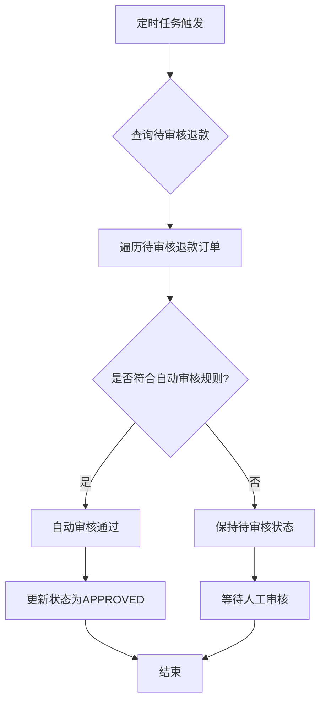

**Diagram sources**
- [RefundController.java](file://backend\payment-service\src\main\java\com\mall\payment\controller\RefundController.java#L435-L454)
- [RefundServiceImpl.java](file://backend\payment-service\src\main\java\com\mall\payment\service\impl\RefundServiceImpl.java#L485-L509)

### 业务场景
批量处理功能适用于以下业务场景：
1. **小额退款自动通过**：对于金额较小的退款申请（如低于100元），系统可自动审核通过，提高处理效率
2. **特定商品类型自动处理**：某些商品类型（如数字商品）的退款申请可设置为自动通过
3. **高信誉用户优待**：对于信誉良好的用户，其退款申请可享受自动审核待遇
4. **促销活动期间**：在大促期间，退款申请量激增，批量处理可有效缓解人工审核压力

自动审核规则在`RefundServiceImpl`的`shouldAutoApprove`方法中实现，可根据业务需求灵活配置。

**Section sources**
- [RefundController.java](file://backend\payment-service\src\main\java\com\mall\payment\controller\RefundController.java#L435-L454)
- [RefundServiceImpl.java](file://backend\payment-service\src\main\java\com\mall\payment\service\impl\RefundServiceImpl.java#L485-L509)

## 使用场景与案例
退款处理与审核API支持多种实际业务场景，满足不同角色的操作需求。

### 商家后台审核退款
商家管理员通过后台系统审核退款申请，这是最常见的使用场景。管理员可以查看退款详情、审核意见，并决定是否同意退款。

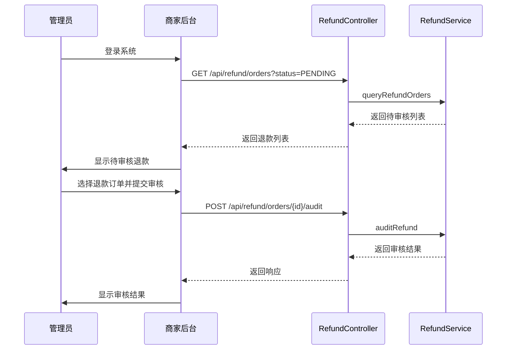

**Diagram sources**
- [RefundController.java](file://backend\payment-service\src\main\java\com\mall\payment\controller\RefundController.java#L151-L176)
- [RefundController.java](file://backend\payment-service\src\main\java\com\mall\payment\controller\RefundController.java#L258-L284)

### 系统自动处理
对于符合预设规则的退款申请，系统可自动完成审核和处理流程，无需人工干预。

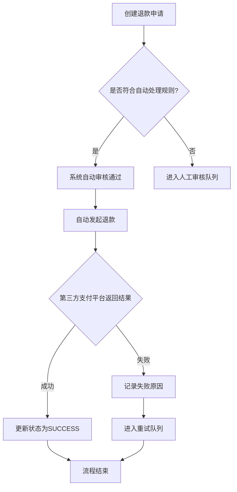

**Diagram sources**
- [RefundServiceImpl.java](file://backend\payment-service\src\main\java\com\mall\payment\service\impl\RefundServiceImpl.java#L485-L509)
- [RefundServiceImpl.java](file://backend\payment-service\src\main\java\com\mall\payment\service\impl\RefundServiceImpl.java#L184-L234)

### 人工干预重试
当自动退款失败后，管理员可手动触发重试操作，这是处理异常情况的重要手段。

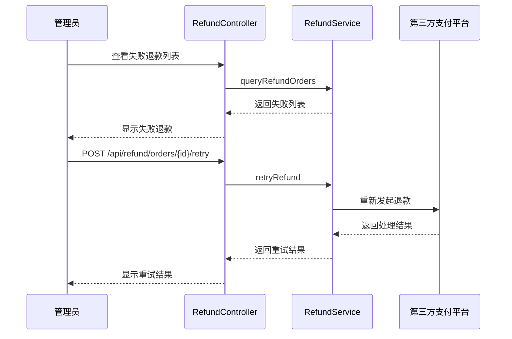

**Diagram sources**
- [RefundController.java](file://backend\payment-service\src\main\java\com\mall\payment\controller\RefundController.java#L364-L391)
- [RefundService.java](file://backend\payment-service\src\main\java\com\mall\payment\service\RefundService.java#L199-L200)

**Section sources**
- [RefundController.java](file://backend\payment-service\src\main\java\com\mall\payment\controller\RefundController.java#L151-L176)
- [RefundController.java](file://backend\payment-service\src\main\java\com\mall\payment\controller\RefundController.java#L258-L284)
- [RefundController.java](file://backend\payment-service\src\main\java\com\mall\payment\controller\RefundController.java#L364-L391)

## 错误处理与重试机制
退款系统设计了完善的错误处理和重试机制，确保在异常情况下仍能保证业务的连续性和数据的一致性。

### 异常状态处理
当退款过程中出现异常时，系统会将状态变更为"EXCEPTION"，并记录详细的错误信息。管理员可查看异常详情，进行人工干预后重新发起退款。

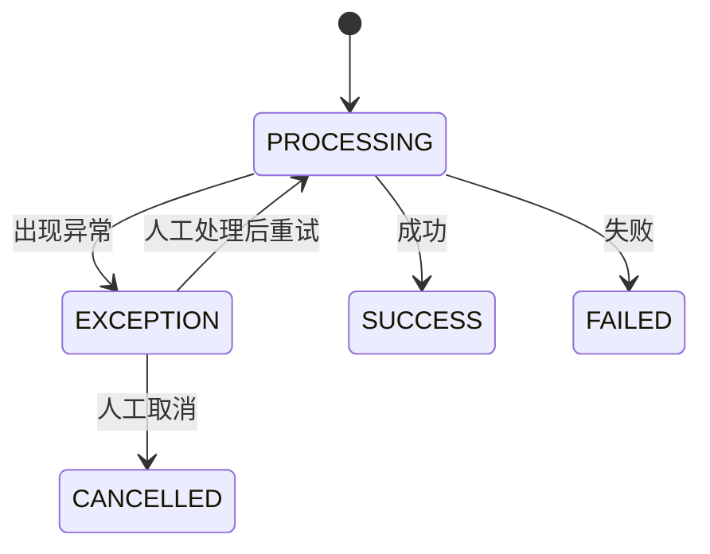

**Diagram sources**
- [RefundStatus.java](file://backend\payment-service\src\main\java\com\mall\payment\enums\RefundStatus.java#L88-L88)

### 重试策略
系统实现了智能重试策略，包括：
1. **重试次数限制**：每个退款订单最多重试3次，防止无限循环
2. **重试间隔控制**：每次重试之间有一定的时间间隔，避免频繁调用第三方接口
3. **失败原因分析**：记录每次失败的原因，便于问题排查
4. **自动重试任务**：定时任务会自动处理可重试的失败订单

重试机制通过`retryRefund`接口实现，该接口会检查当前状态和重试次数，确保重试操作的合法性。

**Section sources**
- [RefundServiceImpl.java](file://backend\payment-service\src\main\java\com\mall\payment\service\impl\RefundServiceImpl.java#L427-L445)

## 权限控制
退款API实施了严格的权限控制，确保只有授权用户才能执行相应操作。

### 权限注解
系统使用`@RequirePermission`注解实现权限控制，该注解定义了不同接口的访问权限要求。

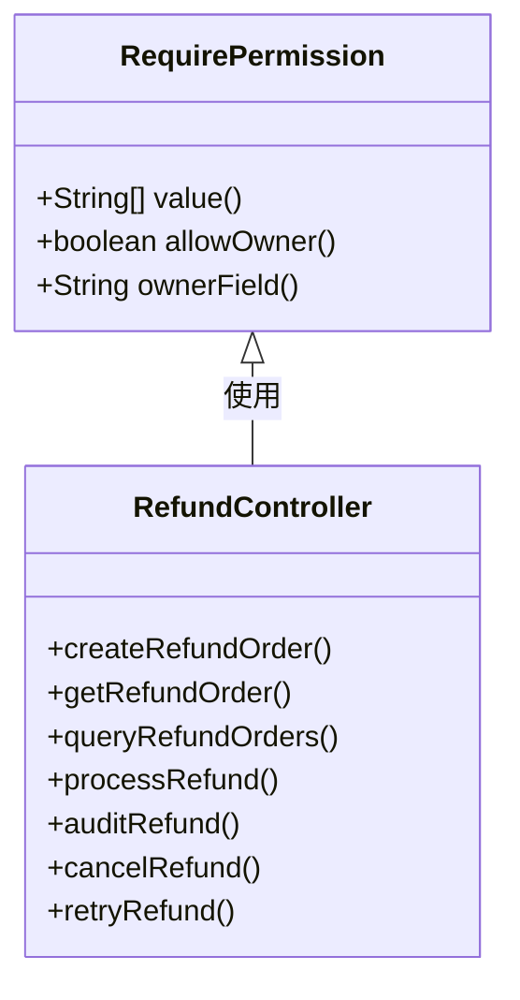

**Diagram sources**
- [RefundController.java](file://backend\payment-service\src\main\java\com\mall\payment\controller\RefundController.java#L3-L3)
- [RefundController.java](file://backend\payment-service\src\main\java\com\mall\payment\controller\RefundController.java#L50-L52)

### 权限规则
不同接口的权限要求如下：
- **创建退款**：用户或管理员可操作，且仅限于自己的订单
- **查询退款**：用户可查询自己的退款，管理员可查询所有退款
- **处理退款**：无特殊权限要求，但需符合状态机规则
- **审核退款**：仅管理员可操作
- **取消退款**：用户可取消自己的退款，管理员可取消任何退款
- **重试退款**：仅管理员可操作

权限控制确保了系统的安全性，防止未授权访问和操作。

**Section sources**
- [RefundController.java](file://backend\payment-service\src\main\java\com\mall\payment\controller\RefundController.java#L50-L52)
- [RefundController.java](file://backend\payment-service\src\main\java\com\mall\payment\controller\RefundController.java#L152-L152)
- [RefundController.java](file://backend\payment-service\src\main\java\com\mall\payment\controller\RefundController.java#L188-L189)