# 退款管理API

<cite>
**本文档引用文件**   
- [RefundController.java](file://backend/payment-service/src/main/java/com/mall/payment/controller/RefundController.java)
- [RefundCreateRequest.java](file://backend/payment-service/src/main/java/com/mall/payment/dto/request/RefundCreateRequest.java)
- [RefundOrderResponse.java](file://backend/payment-service/src/main/java/com/mall/payment/dto/response/RefundOrderResponse.java)
- [RefundStatus.java](file://backend/payment-service/src/main/java/com/mall/payment/enums/RefundStatus.java)
- [RefundServiceImpl.java](file://backend/payment-service/src/main/java/com/mall/payment/service/impl/RefundServiceImpl.java)
- [RefundService.java](file://backend/payment-service/src/main/java/com/mall/payment/service/RefundService.java)
- [RefundOrder.java](file://backend/payment-service/src/main/java/com/mall/payment/entity/RefundOrder.java)
- [RefundRecordResponse.java](file://backend/payment-service/src/main/java/com/mall/payment/dto/response/RefundRecordResponse.java)
- [RefundOrderRepository.java](file://backend/payment-service/src/main/java/com/mall/payment/repository/RefundOrderRepository.java)
</cite>

## 目录
1. [简介](#简介)
2. [核心API接口](#核心api接口)
3. [退款状态管理](#退款状态管理)
4. [退款审核流程](#退款审核流程)
5. [批量处理机制](#批量处理机制)
6. [错误处理与重试](#错误处理与重试)
7. [数据模型](#数据模型)

## 简介
退款管理API提供了一套完整的退款订单生命周期管理功能，支持用户申请、商家审核、系统自动处理等场景。该API基于支付服务模块实现，通过`RefundController`暴露RESTful接口，涵盖退款订单创建、处理、审核、状态查询等核心功能。系统支持多种退款类型，包括用户申请、系统自动和客服处理，并实现了完善的审核流程和状态流转机制。

**Section sources**
- [RefundController.java](file://backend/payment-service/src/main/java/com/mall/payment/controller/RefundController.java#L25-L468)
- [RefundService.java](file://backend/payment-service/src/main/java/com/mall/payment/service/RefundService.java#L53-L277)

## 核心API接口

### 创建退款订单
`createRefundOrder`接口用于创建新的退款订单，根据支付订单发起退款申请。

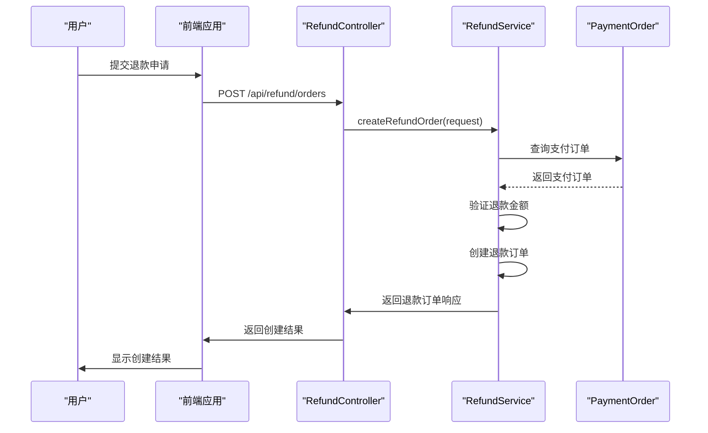

**Diagram sources**
- [RefundController.java](file://backend/payment-service/src/main/java/com/mall/payment/controller/RefundController.java#L50-L78)
- [RefundServiceImpl.java](file://backend/payment-service/src/main/java/com/mall/payment/service/impl/RefundServiceImpl.java#L96-L117)

### 处理退款
`processRefund`接口用于发起实际的退款流程，调用第三方支付平台的退款接口。

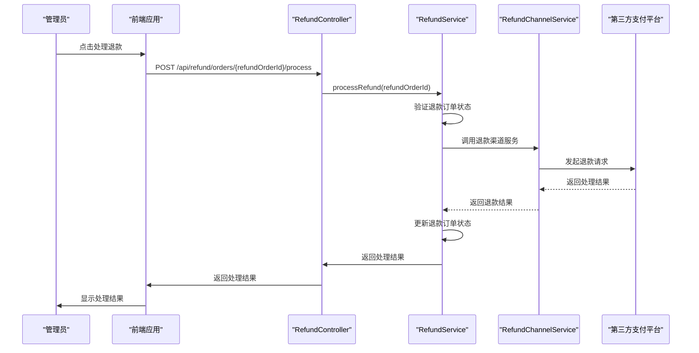

**Diagram sources**
- [RefundController.java](file://backend/payment-service/src/main/java/com/mall/payment/controller/RefundController.java#L218-L246)
- [RefundServiceImpl.java](file://backend/payment-service/src/main/java/com/mall/payment/service/impl/RefundServiceImpl.java#L184-L235)

### 审核退款
`auditRefund`接口用于对退款申请进行人工审核，决定是否同意退款。

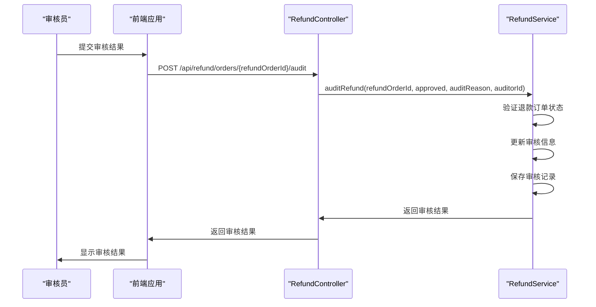

**Diagram sources**
- [RefundController.java](file://backend/payment-service/src/main/java/com/mall/payment/controller/RefundController.java#L258-L285)
- [RefundServiceImpl.java](file://backend/payment-service/src/main/java/com/mall/payment/service/impl/RefundServiceImpl.java#L255-L286)

### 状态查询
`queryRefundStatus`接口用于主动查询第三方支付平台的退款状态，实现状态同步。

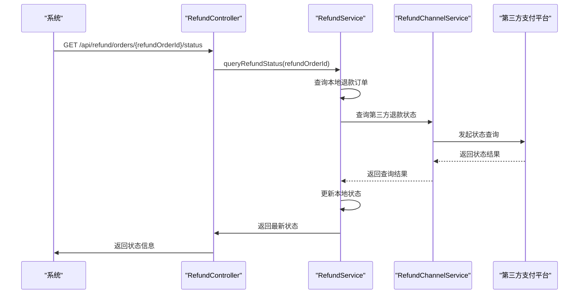

**Diagram sources**
- [RefundController.java](file://backend/payment-service/src/main/java/com/mall/payment/controller/RefundController.java#L333-L355)
- [RefundServiceImpl.java](file://backend/payment-service/src/main/java/com/mall/payment/service/impl/RefundServiceImpl.java#L379-L422)

## 退款状态管理

### RefundStatus枚举值
`RefundStatus`枚举定义了退款订单的各种状态，用于跟踪退款流程的进展。

| 状态代码 | 状态描述 | 说明 |
|---------|---------|------|
| PENDING | 待审核 | 退款申请已提交，等待审核 |
| REVIEWING | 审核中 | 退款申请正在审核中 |
| PENDING_REVIEW | 待人工审核 | 需要人工介入审核的退款申请 |
| APPROVED | 审核通过 | 退款申请审核通过，准备处理 |
| REJECTED | 审核拒绝 | 退款申请被拒绝 |
| PROCESSING | 处理中 | 退款正在处理中，已向第三方发起退款 |
| SUCCESS | 退款成功 | 退款已成功，资金已退回 |
| FAILED | 退款失败 | 退款处理失败 |
| CANCELLED | 已取消 | 退款申请被取消 |
| EXCEPTION | 异常 | 退款过程中出现异常，需要人工处理 |

**Section sources**
- [RefundStatus.java](file://backend/payment-service/src/main/java/com/mall/payment/enums/RefundStatus.java#L38-L207)

### 状态流转规则
退款订单的状态遵循特定的流转规则，确保业务流程的正确性。

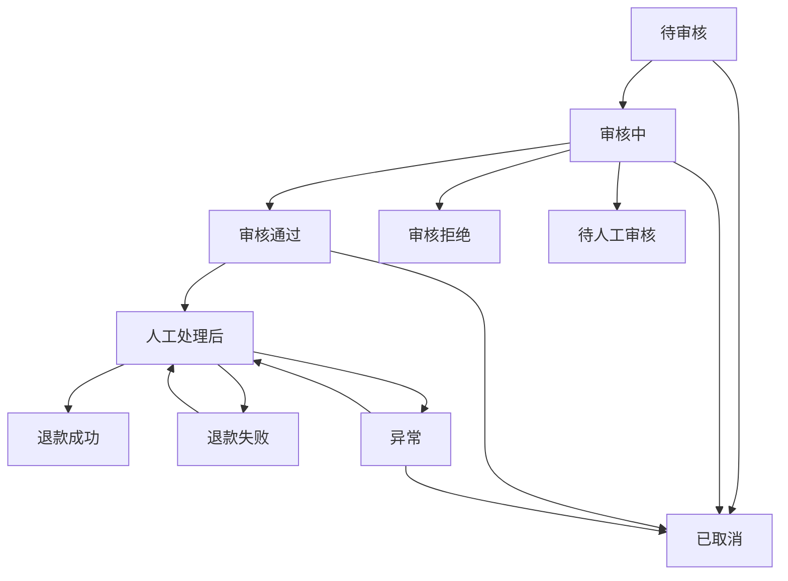

**Diagram sources**
- [RefundStatus.java](file://backend/payment-service/src/main/java/com/mall/payment/enums/RefundStatus.java#L189-L205)
- [RefundOrder.java](file://backend/payment-service/src/main/java/com/mall/payment/entity/RefundOrder.java#L290-L322)

## 退款审核流程

### 审核流程说明
退款审核流程支持自动审核和人工审核两种模式，确保退款申请的合规性。

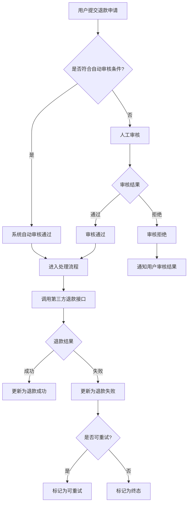

**Diagram sources**
- [RefundServiceImpl.java](file://backend/payment-service/src/main/java/com/mall/payment/service/impl/RefundServiceImpl.java#L486-L509)
- [RefundController.java](file://backend/payment-service/src/main/java/com/mall/payment/controller/RefundController.java#L258-L285)

### 审核权限控制
系统通过`@RequirePermission`注解实现审核权限控制，确保只有授权用户才能执行审核操作。

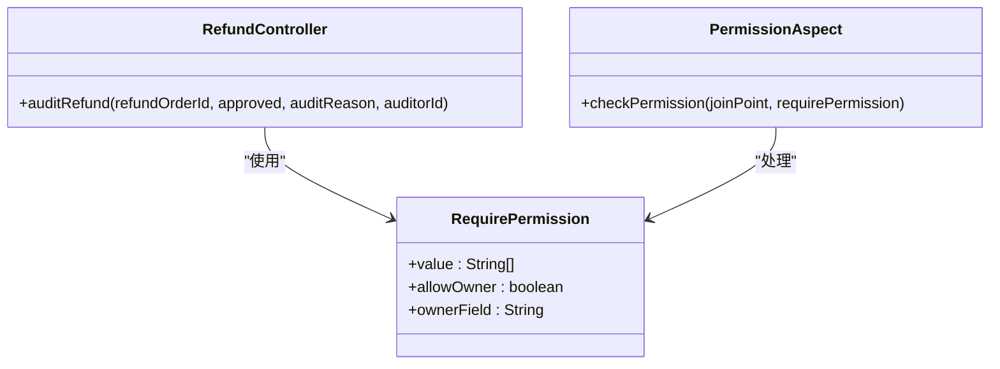

**Diagram sources**
- [RefundController.java](file://backend/payment-service/src/main/java/com/mall/payment/controller/RefundController.java#L258-L285)
- [RequirePermission.java](file://backend/payment-service/src/main/java/com/mall/payment/annotation/RequirePermission.java)
- [PermissionAspect.java](file://backend/payment-service/src/main/java/com/mall/payment/aspect/PermissionAspect.java)

## 批量处理机制

### 批量处理流程
系统提供批量处理待审核退款申请的功能，通过定时任务自动处理符合条件的退款申请。

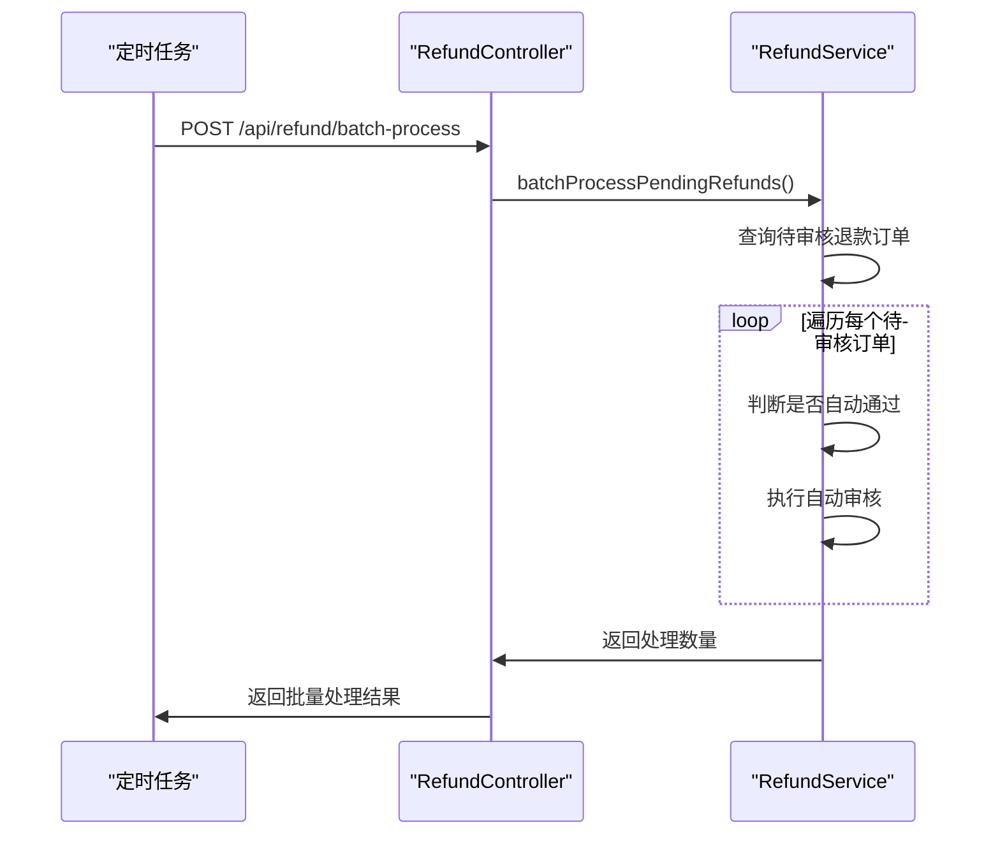

**Diagram sources**
- [RefundController.java](file://backend/payment-service/src/main/java/com/mall/payment/controller/RefundController.java#L435-L455)
- [RefundServiceImpl.java](file://backend/payment-service/src/main/java/com/mall/payment/service/impl/RefundServiceImpl.java#L486-L509)

### 批量处理规则
批量处理遵循预设的业务规则，确保自动审核的准确性和安全性。

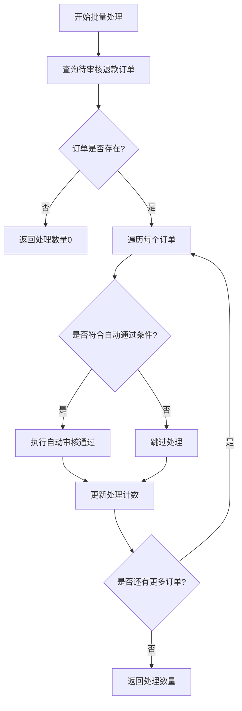

**Diagram sources**
- [RefundServiceImpl.java](file://backend/payment-service/src/main/java/com/mall/payment/service/impl/RefundServiceImpl.java#L486-L509)

## 错误处理与重试

### 错误处理机制
系统实现了完善的错误处理机制，确保退款流程的稳定性和可靠性。

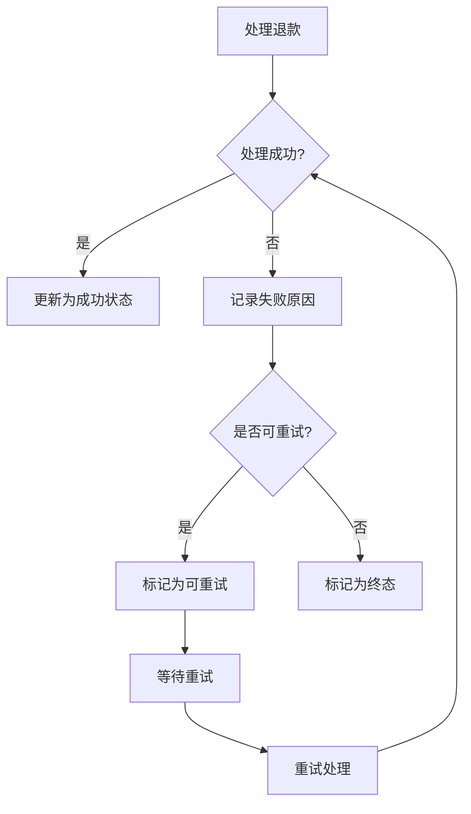

**Diagram sources**
- [RefundServiceImpl.java](file://backend/payment-service/src/main/java/com/mall/payment/service/impl/RefundServiceImpl.java#L184-L248)
- [RefundOrder.java](file://backend/payment-service/src/main/java/com/mall/payment/entity/RefundOrder.java#L379-L382)

### 重试机制
系统支持失败退款订单的重试功能，提高退款成功率。

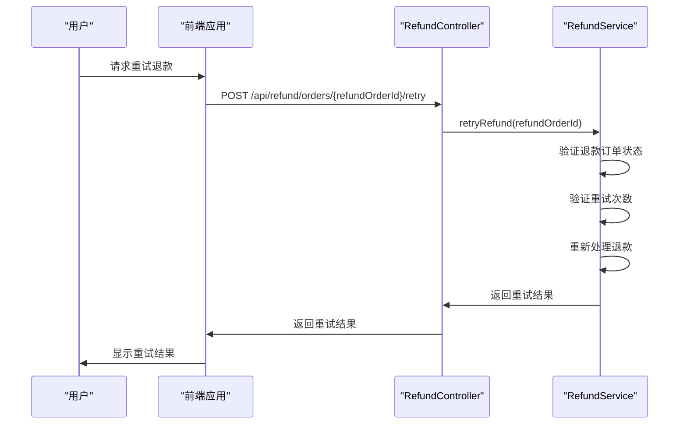

**Diagram sources**
- [RefundController.java](file://backend/payment-service/src/main/java/com/mall/payment/controller/RefundController.java#L364-L384)
- [RefundServiceImpl.java](file://backend/payment-service/src/main/java/com/mall/payment/service/impl/RefundServiceImpl.java#L427-L445)

## 数据模型

### 退款订单实体
`RefundOrder`实体类存储退款申请的基本信息，包括退款金额、退款原因、审核状态等。

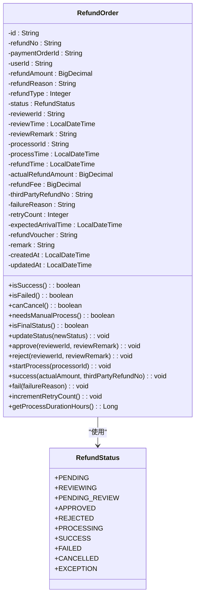

**Diagram sources**
- [RefundOrder.java](file://backend/payment-service/src/main/java/com/mall/payment/entity/RefundOrder.java#L77-L572)
- [RefundStatus.java](file://backend/payment-service/src/main/java/com/mall/payment/enums/RefundStatus.java#L38-L207)

### 请求响应模型
系统定义了标准化的请求和响应DTO，确保API接口的规范性和一致性。

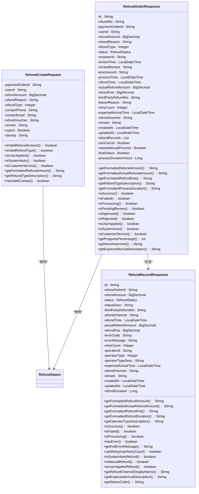

**Diagram sources**
- [RefundCreateRequest.java](file://backend/payment-service/src/main/java/com/mall/payment/dto/request/RefundCreateRequest.java#L16-L226)
- [RefundOrderResponse.java](file://backend/payment-service/src/main/java/com/mall/payment/dto/response/RefundOrderResponse.java#L18-L566)
- [RefundRecordResponse.java](file://backend/payment-service/src/main/java/com/mall/payment/dto/response/RefundRecordResponse.java#L17-L368)
- [RefundStatus.java](file://backend/payment-service/src/main/java/com/mall/payment/enums/RefundStatus.java#L38-L207)