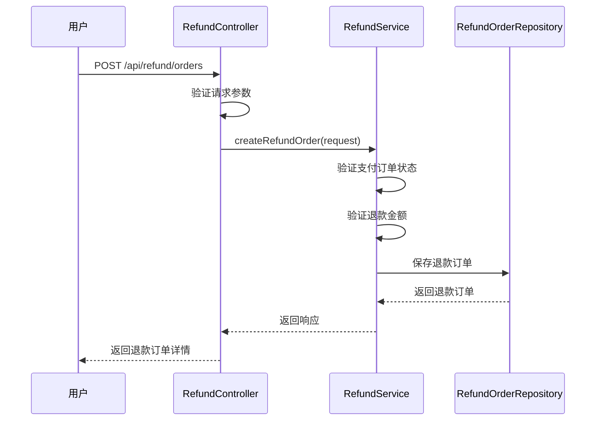
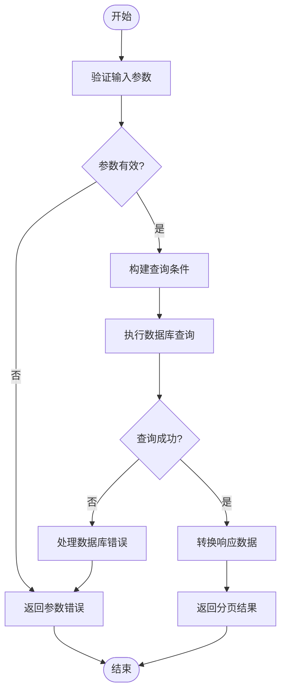
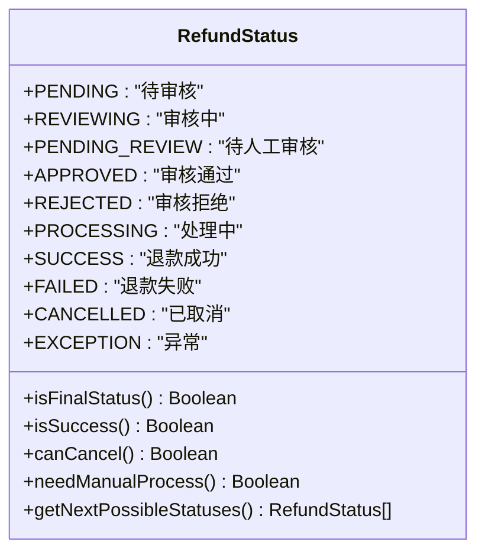
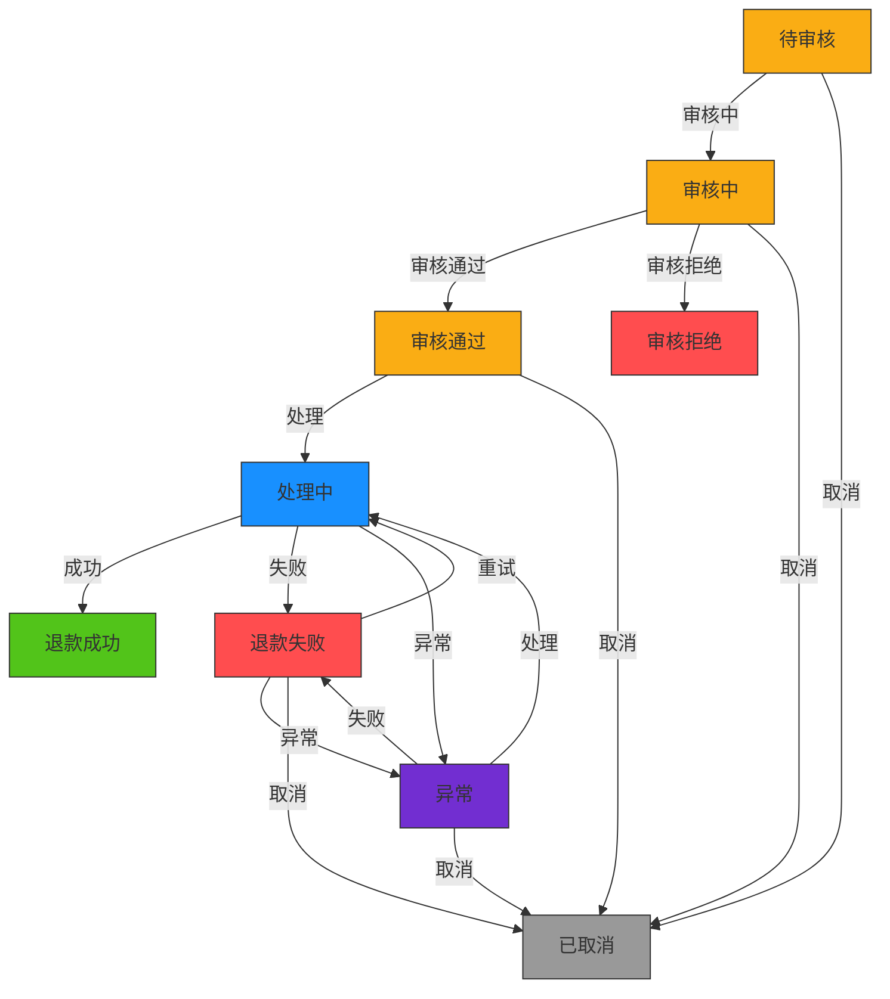
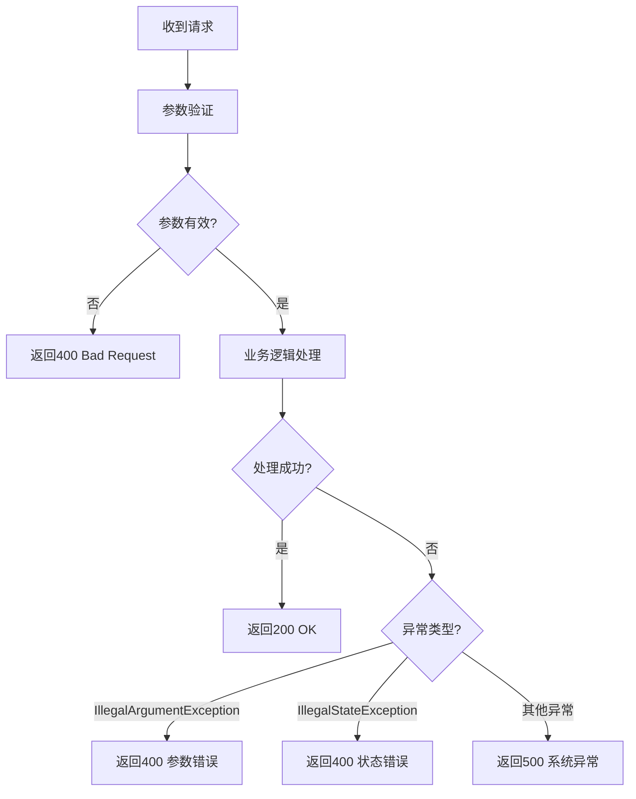

# 退款订单管理API

<cite>
**Referenced Files in This Document**   
- [RefundController.java](file://backend/payment-service/src/main/java/com/mall/payment/controller/RefundController.java)
- [RefundCreateRequest.java](file://backend/payment-service/src/main/java/com/mall/payment/dto/request/RefundCreateRequest.java)
- [RefundOrderResponse.java](file://backend/payment-service/src/main/java/com/mall/payment/dto/response/RefundOrderResponse.java)
- [RefundRecordResponse.java](file://backend/payment-service/src/main/java/com/mall/payment/dto/response/RefundRecordResponse.java)
- [RefundStatus.java](file://backend/payment-service/src/main/java/com/mall/payment/enums/RefundStatus.java)
- [RefundService.java](file://backend/payment-service/src/main/java/com/mall/payment/service/RefundService.java)
</cite>

## 目录
1. [简介](#简介)
2. [核心API端点](#核心api端点)
3. [请求对象：RefundCreateRequest](#请求对象refundcreaterequest)
4. [响应对象：RefundOrderResponse](#响应对象refundorderresponse)
5. [退款状态管理](#退款状态管理)
6. [使用示例](#使用示例)
7. [错误处理](#错误处理)
8. [总结](#总结)

## 简介
退款订单管理API为在线商城系统提供了完整的退款功能，支持用户创建退款申请、商家或管理员查询退款记录、以及退款订单的全生命周期管理。该API基于`RefundController`控制器实现，提供了创建退款订单、查询退款详情、根据支付订单ID查询退款列表、分页查询退款订单等核心功能。

API设计遵循RESTful原则，通过HTTP方法和状态码提供清晰的接口语义。系统实现了完整的权限控制，确保不同角色（用户、管理员）只能访问其权限范围内的数据。退款流程包含审核、处理、状态同步等环节，确保资金安全和业务合规。

**Section sources**
- [RefundController.java](file://backend/payment-service/src/main/java/com/mall/payment/controller/RefundController.java#L32-L468)

## 核心API端点

### 创建退款订单
创建新的退款订单，用户提交退款申请。

**端点**: `POST /api/refund/orders`  
**权限**: 用户或管理员（需为订单所有者）  
**请求体**: `RefundCreateRequest`  
**响应**: `RefundOrderResponse`



**Diagram sources**
- [RefundController.java](file://backend/payment-service/src/main/java/com/mall/payment/controller/RefundController.java#L50-L78)
- [RefundService.java](file://backend/payment-service/src/main/java/com/mall/payment/service/RefundService.java#L79-L87)
- [RefundOrder.java](file://backend/payment-service/src/main/java/com/mall/payment/entity/RefundOrder.java#L66-L571)

### 查询退款订单详情
根据退款订单ID查询退款详情。

**端点**: `GET /api/refund/orders/{refundOrderId}`  
**权限**: 无特定权限要求  
**路径参数**: `refundOrderId` (退款订单ID)  
**响应**: `RefundOrderResponse`

### 根据支付订单ID查询退款列表
查询与特定支付订单关联的所有退款订单。

**端点**: `GET /api/refund/orders/payment/{paymentOrderId}`  
**权限**: 无特定权限要求  
**路径参数**: `paymentOrderId` (支付订单ID)  
**响应**: `List<RefundOrderResponse>`

### 分页查询退款订单
支持多种条件的组合查询，用于商家或管理员查询退款记录。

**端点**: `GET /api/refund/orders`  
**权限**: 仅管理员  
**查询参数**:
- `userId`: 用户ID
- `status`: 退款状态
- `startTime`: 开始时间
- `endTime`: 结束时间
- `page`: 页码（默认1）
- `size`: 每页大小（默认10）

**响应**: `PageResponse<RefundOrderResponse>`



**Diagram sources**
- [RefundController.java](file://backend/payment-service/src/main/java/com/mall/payment/controller/RefundController.java#L151-L176)
- [RefundService.java](file://backend/payment-service/src/main/java/com/mall/payment/service/RefundService.java#L109-L111)
- [PageResponse.java](file://backend/payment-service/src/main/java/com/mall/payment/dto/response/PageResponse.java#L50-L264)

### 查询用户退款订单列表
查询特定用户的退款订单，支持分页。

**端点**: `GET /api/refund/orders/user/{userId}`  
**权限**: 用户或管理员（需为用户所有者）  
**路径参数**: `userId` (用户ID)  
**查询参数**: `page`, `size`  
**响应**: `PageResponse<RefundOrderResponse>`

**Section sources**
- [RefundController.java](file://backend/payment-service/src/main/java/com/mall/payment/controller/RefundController.java#L50-L455)

## 请求对象：RefundCreateRequest
`RefundCreateRequest`是创建退款订单的请求数据传输对象，定义了创建退款订单所需的所有参数及其验证规则。

### 字段约束和验证规则
| 字段 | 类型 | 必填 | 约束条件 | 错误消息 |
|------|------|------|----------|----------|
| paymentOrderId | String | 是 | 长度不超过36字符 | 支付订单ID不能为空<br>支付订单ID长度不能超过36个字符 |
| userId | String | 是 | 长度不超过36字符 | 用户ID不能为空<br>用户ID长度不能超过36个字符 |
| refundAmount | BigDecimal | 是 | 大于0.01，不超过999999.99，保留2位小数 | 退款金额不能为空<br>退款金额必须大于0.01<br>退款金额不能超过999999.99<br>退款金额格式不正确 |
| refundReason | String | 是 | 长度在5-500字符之间 | 退款原因不能为空<br>退款原因长度必须在5-500个字符之间 |
| refundType | Integer | 是 | 值为1、2或3 | 退款类型不能为空<br>退款类型必须为1、2或3 |
| contactPhone | String | 否 | 符合手机号格式 | 联系电话格式不正确 |
| contactEmail | String | 否 | 符合邮箱格式 | 联系邮箱格式不正确 |
| refundVoucher | String | 否 | 长度不超过500字符 | 退款凭证URL长度不能超过500个字符 |
| remark | String | 否 | 长度不超过500字符 | 备注信息长度不能超过500个字符 |
| urgent | Boolean | 否 | 默认false | 无 |
| clientIp | String | 否 | 符合IP地址格式 | 客户端IP格式不正确 |

### 辅助方法
`RefundCreateRequest`类提供了多个辅助方法来验证和处理请求数据：

- `isValidRefundAmount()`: 验证退款金额是否有效
- `isValidRefundType()`: 验证退款类型是否有效
- `isUserApplied()`: 判断是否为用户申请退款
- `isSystemAuto()`: 判断是否为系统自动退款
- `isCustomerService()`: 判断是否为客服处理退款
- `getFormattedRefundAmount()`: 获取格式化的退款金额
- `getRefundTypeDescription()`: 获取退款类型描述
- `hasValidContact()`: 验证联系方式是否完整

**Section sources**
- [RefundCreateRequest.java](file://backend/payment-service/src/main/java/com/mall/payment/dto/request/RefundCreateRequest.java#L16-L225)

## 响应对象：RefundOrderResponse
`RefundOrderResponse`是退款订单的响应数据传输对象，包含了退款订单的完整信息。

### 完整数据结构
| 字段 | 类型 | 描述 |
|------|------|------|
| id | String | 退款订单ID |
| refundNo | String | 退款单号 |
| paymentOrderId | String | 支付订单ID |
| userId | String | 用户ID |
| refundAmount | BigDecimal | 退款金额 |
| refundReason | String | 退款原因 |
| refundType | Integer | 退款类型 |
| refundTypeDesc | String | 退款类型描述 |
| status | RefundStatus | 退款状态 |
| statusDesc | String | 退款状态描述 |
| reviewerId | String | 审核人ID |
| reviewTime | LocalDateTime | 审核时间 |
| reviewRemark | String | 审核备注 |
| processorId | String | 处理人ID |
| processTime | LocalDateTime | 处理时间 |
| refundTime | LocalDateTime | 退款完成时间 |
| actualRefundAmount | BigDecimal | 实际退款金额 |
| refundFee | BigDecimal | 退款手续费 |
| thirdPartyRefundNo | String | 第三方退款单号 |
| failureReason | String | 失败原因 |
| retryCount | Integer | 重试次数 |
| expectedArrivalTime | LocalDateTime | 预计到账时间 |
| refundVoucher | String | 退款凭证 |
| remark | String | 备注信息 |
| createdAt | LocalDateTime | 创建时间 |
| updatedAt | LocalDateTime | 更新时间 |
| refundRecords | List<RefundRecordResponse> | 退款记录列表 |
| canCancel | Boolean | 是否可以取消 |
| needsManualProcess | Boolean | 是否需要人工处理 |
| finalStatus | Boolean | 是否处于终态 |
| processDurationHours | Long | 处理耗时（小时） |

### 辅助方法
`RefundOrderResponse`类提供了丰富的辅助方法来获取格式化信息和判断状态：

- `getFormattedRefundAmount()`: 获取格式化的退款金额（带¥符号）
- `getFormattedActualRefundAmount()`: 获取格式化的实际退款金额
- `getFormattedRefundFee()`: 获取格式化的退款手续费
- `getRefundTypeDescription()`: 获取退款类型描述
- `getFormattedProcessDuration()`: 获取格式化的处理耗时
- `isSuccess()`: 判断是否为成功状态
- `isFailed()`: 判断是否为失败状态
- `isProcessing()`: 判断是否为处理中状态
- `isPendingReview()`: 判断是否为待审核状态
- `isApproved()`: 判断是否已审核通过
- `isRejected()`: 判断是否已审核拒绝
- `isUserApplied()`: 判断是否为用户申请退款
- `isSystemAuto()`: 判断是否为系统自动退款
- `isCustomerService()`: 判断是否为客服处理退款
- `getProgressPercentage()`: 获取退款进度百分比
- `getNextActionHint()`: 获取下一步操作提示
- `getExpectedArrivalDescription()`: 获取预计到账时间描述

**Section sources**
- [RefundOrderResponse.java](file://backend/payment-service/src/main/java/com/mall/payment/dto/response/RefundOrderResponse.java#L18-L565)
- [RefundRecordResponse.java](file://backend/payment-service/src/main/java/com/mall/payment/dto/response/RefundRecordResponse.java#L17-L367)

## 退款状态管理
系统定义了完整的退款状态机，确保退款流程的规范性和可追踪性。

### 退款状态枚举


**Diagram sources**
- [RefundStatus.java](file://backend/payment-service/src/main/java/com/mall/payment/enums/RefundStatus.java#L37-L206)

### 状态转换规则


**Diagram sources**
- [RefundStatus.java](file://backend/payment-service/src/main/java/com/mall/payment/enums/RefundStatus.java#L37-L206)
- [RefundOrder.java](file://backend/payment-service/src/main/java/com/mall/payment/entity/RefundOrder.java#L66-L571)

## 使用示例

### 用户创建退款申请
```json
POST /api/refund/orders
Content-Type: application/json

{
  "paymentOrderId": "PAY_20241201_001",
  "userId": "USR_20241201_001",
  "refundAmount": 99.99,
  "refundReason": "商品与描述不符",
  "refundType": 1,
  "contactPhone": "13800138000",
  "contactEmail": "user@example.com",
  "refundVoucher": "https://example.com/voucher.jpg",
  "remark": "请尽快处理",
  "urgent": true,
  "clientIp": "192.168.1.100"
}
```

### 商家查询退款记录
```json
GET /api/refund/orders?userId=USR_20241201_001&status=APPROVED&page=1&size=10
```

### 管理员分页查询所有退款订单
```json
GET /api/refund/orders?page=1&size=20
```

### 根据支付订单ID查询退款列表
```json
GET /api/refund/orders/payment/PAY_20241201_001
```

**Section sources**
- [RefundController.java](file://backend/payment-service/src/main/java/com/mall/payment/controller/RefundController.java#L50-L455)

## 错误处理
API提供了统一的错误响应格式，便于客户端处理错误情况。

### 错误响应格式
```json
{
  "success": false,
  "error": "错误类型",
  "message": "错误详细信息"
}
```

### 常见错误类型
| HTTP状态码 | 错误类型 | 场景 |
|-----------|---------|------|
| 400 | 参数错误 | 请求参数验证失败 |
| 400 | 状态错误 | 退款订单状态不允许当前操作 |
| 404 | Not Found | 退款订单不存在 |
| 500 | 系统异常 | 服务器内部错误 |

### 异常处理策略


**Section sources**
- [RefundController.java](file://backend/payment-service/src/main/java/com/mall/payment/controller/RefundController.java#L69-L77)

## 总结
退款订单管理API提供了一套完整的退款功能，支持从创建退款申请到查询退款记录的全生命周期管理。API设计考虑了安全性、可扩展性和易用性，通过清晰的接口定义和详细的文档说明，帮助开发者快速集成退款功能。

关键特性包括：
- 完整的权限控制，确保数据安全
- 详细的参数验证，防止无效请求
- 丰富的状态管理，支持复杂的业务流程
- 统一的错误处理，便于客户端处理异常
- 分页查询支持，适用于大数据量场景

开发者可以基于此API实现用户退款申请、商家退款管理、管理员监控等业务功能，满足在线商城系统的退款需求。

**Section sources**
- [RefundController.java](file://backend/payment-service/src/main/java/com/mall/payment/controller/RefundController.java#L32-L468)
- [RefundService.java](file://backend/payment-service/src/main/java/com/mall/payment/service/RefundService.java#L52-L276)