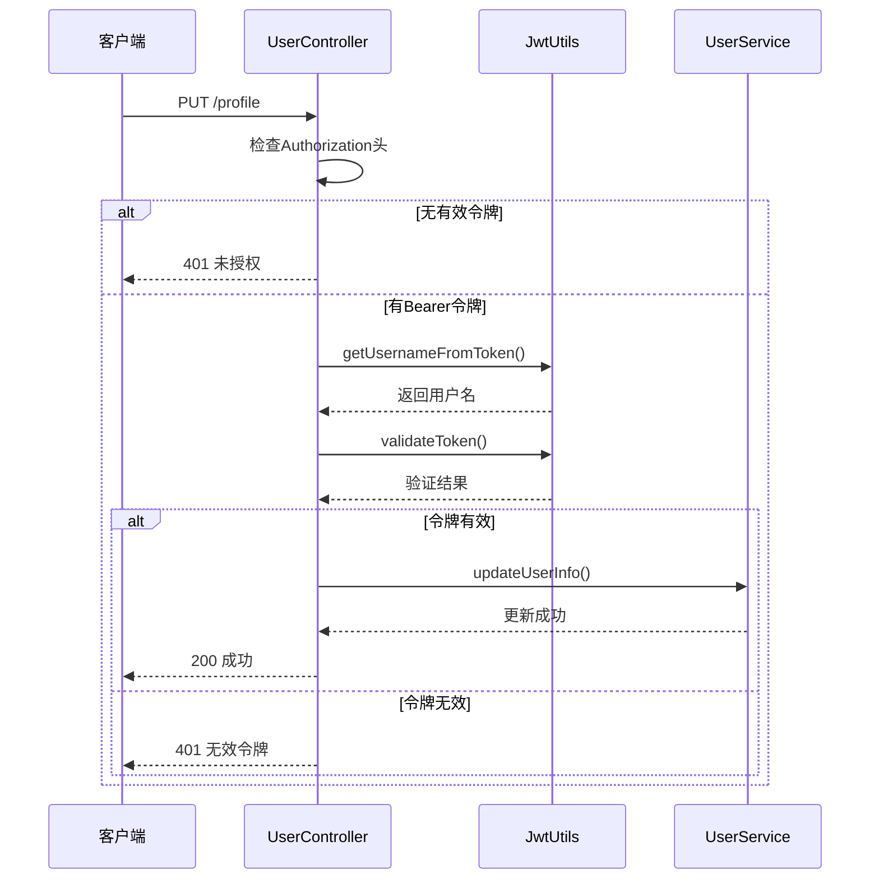

# 个人信息API

<cite>
**本文档引用文件**   
- [UserController.java](file://backend/user-service/src/main/java/com/mall/user/controller/UserController.java)
- [UpdateUserRequest.java](file://backend/user-service/src/main/java/com/mall/user/domain/dto/UpdateUserRequest.java)
- [UserInfoResponse.java](file://backend/user-service/src/main/java/com/mall/user/domain/vo/UserInfoResponse.java)
- [JwtUtils.java](file://backend/user-service/src/main/java/com/mall/user/utils/JwtUtils.java)
</cite>

## 目录
1. [个人信息API](#个人信息api)
2. [用户信息获取与更新接口](#用户信息获取与更新接口)
3. [请求参数与响应格式](#请求参数与响应格式)
4. [JWT令牌认证机制](#jwt令牌认证机制)
5. [开发模式特殊处理](#开发模式特殊处理)
6. [用户名、邮箱、手机号可用性检查](#用户名邮箱手机号可用性检查)
7. [错误处理策略](#错误处理策略)

## 用户信息获取与更新接口

用户信息管理通过`/profile`端点实现，支持GET方法获取用户信息和PUT方法更新用户信息。该接口位于`UserController`中，是用户个人信息管理的核心功能。

**接口路径**  
- 获取用户信息：`GET /api/users/profile` 或 `GET /users/profile`
- 更新用户信息：`PUT /api/users/profile` 或 `PUT /users/profile`

**功能说明**  
- GET请求用于获取当前登录用户的详细信息
- PUT请求用于更新当前登录用户的基本资料
- 接口通过JWT令牌进行身份验证，确保操作的安全性

**Section sources**
- [UserController.java](file://backend/user-service/src/main/java/com/mall/user/controller/UserController.java#L189-L325)

## 请求参数与响应格式

### 更新用户信息请求（UpdateUserRequest）

更新用户信息时需要提供以下字段：

| 字段 | 类型 | 必填 | 描述 | 示例值 | 校验规则 |
|------|------|------|------|--------|----------|
| username | String | 否 | 用户名 | john_doe | - |
| nickname | String | 否 | 昵称 | 新昵称 | 长度2-20字符 |
| email | String | 否 | 邮箱 | user@example.com | 符合邮箱格式 |
| phone | String | 否 | 手机号 | 13800138000 | 1开头的11位数字 |
| gender | Integer | 否 | 性别 | 1 | 0-未知 1-男 2-女 |
| birthday | String | 否 | 生日 | 1990-01-01 | 日期格式 |
| avatar | String | 否 | 头像URL | https://example.com/avatar.jpg | - |
| bio | String | 否 | 个人简介 | 这是个人简介 | 最长200字符 |

### 用户信息响应（UserInfoResponse）

获取用户信息时返回的完整用户数据：

| 字段 | 类型 | 描述 | 示例值 |
|------|------|------|--------|
| userId | Long | 用户ID | 123456 |
| username | String | 用户名 | john_doe |
| nickname | String | 昵称 | 新昵称 |
| email | String | 邮箱 | user@example.com |
| phone | String | 手机号 | 13800138000 |
| avatar | String | 头像 | https://example.com/avatar.jpg |
| gender | Integer | 性别 | 1 |
| birthday | String | 生日 | 1990-01-01 |
| bio | String | 个人简介 | 这是个人简介 |
| status | Integer | 状态 | 1 |
| createTime | LocalDateTime | 创建时间 | 2025-01-27 10:00:00 |
| lastLoginTime | LocalDateTime | 最后登录时间 | 2025-11-11 14:30:00 |
| hasSetPassword | Boolean | 是否已设置密码 | true |

**Section sources**
- [UpdateUserRequest.java](file://backend/user-service/src/main/java/com/mall/user/domain/dto/UpdateUserRequest.java#L17-L129)
- [UserInfoResponse.java](file://backend/user-service/src/main/java/com/mall/user/domain/vo/UserInfoResponse.java#L14-L229)

## JWT令牌认证机制

### 令牌传递方式

JWT令牌通过HTTP请求头中的Authorization字段传递，格式如下：

```
Authorization: Bearer <JWT_TOKEN>
```

### 令牌验证流程



**Diagram sources**
- [UserController.java](file://backend/user-service/src/main/java/com/mall/user/controller/UserController.java#L277-L325)
- [JwtUtils.java](file://backend/user-service/src/main/java/com/mall/user/utils/JwtUtils.java#L79-L98)

## 开发模式特殊处理

在开发模式下，系统提供特殊处理机制以方便测试：

### 开发模式判断

通过配置项`security.jwt.enabled`控制是否启用JWT认证：
- `true`：生产模式，强制验证JWT令牌
- `false`：开发模式，使用默认测试用户

### 默认测试用户

当`security.jwt.enabled=false`时：
- GET请求：直接使用`user_17698275192`作为测试用户
- PUT请求：优先使用请求体中的username，若无则使用默认测试用户

### 开发模式优势

- 无需生成JWT令牌即可测试接口
- 简化前端开发调试流程
- 提高开发效率，减少认证相关问题排查时间

**Section sources**
- [UserController.java](file://backend/user-service/src/main/java/com/mall/user/controller/UserController.java#L199-L202)
- [UserController.java](file://backend/user-service/src/main/java/com/mall/user/controller/UserController.java#L289-L294)

## 用户名、邮箱、手机号可用性检查

系统提供三个独立接口用于检查用户信息的唯一性：

### 接口列表

| 接口 | HTTP方法 | 路径 | 参数 | 响应示例 |
|------|--------|------|------|----------|
| 检查用户名 | GET | /check-username | username | {"success":true,"available":true,"message":"用户名可用"} |
| 检查邮箱 | GET | /check-email | email | {"success":true,"available":true,"message":"邮箱可用"} |
| 检查手机号 | GET | /check-phone | phone | {"success":true,"available":true,"message":"手机号可用"} |

### 使用示例

```http
GET /api/users/check-username?username=john_doe HTTP/1.1
Host: localhost:8080
```

```json
{
  "success": true,
  "available": false,
  "message": "用户名已被使用"
}
```

### 前端集成建议

在用户注册或修改信息时，应在输入框失去焦点时调用相应的检查接口，实时反馈可用性状态，提升用户体验。

**Section sources**
- [UserController.java](file://backend/user-service/src/main/java/com/mall/user/controller/UserController.java#L399-L484)

## 错误处理策略

### 常见错误码

| 状态码 | 错误类型 | 原因 | 处理建议 |
|--------|--------|------|----------|
| 400 | Bad Request | 请求参数无效 | 检查请求体格式和参数值 |
| 401 | Unauthorized | 未提供或无效认证令牌 | 检查Authorization头和JWT令牌 |
| 404 | Not Found | 用户信息不存在 | 确认用户是否存在 |
| 500 | Internal Server Error | 服务器内部错误 | 联系管理员 |

### 错误响应格式

所有错误响应遵循统一格式：
```json
{
  "success": false,
  "message": "错误描述信息"
}
```

### 异常处理机制

系统通过全局异常处理器捕获并处理各类异常，确保：
- 敏感信息不暴露给客户端
- 错误信息对用户友好
- 关键错误被记录到日志系统

**Section sources**
- [UserController.java](file://backend/user-service/src/main/java/com/mall/user/controller/UserController.java#L206-L210)
- [UserController.java](file://backend/user-service/src/main/java/com/mall/user/controller/UserController.java#L300-L303)
- [UserController.java](file://backend/user-service/src/main/java/com/mall/user/controller/UserController.java#L249-L252)