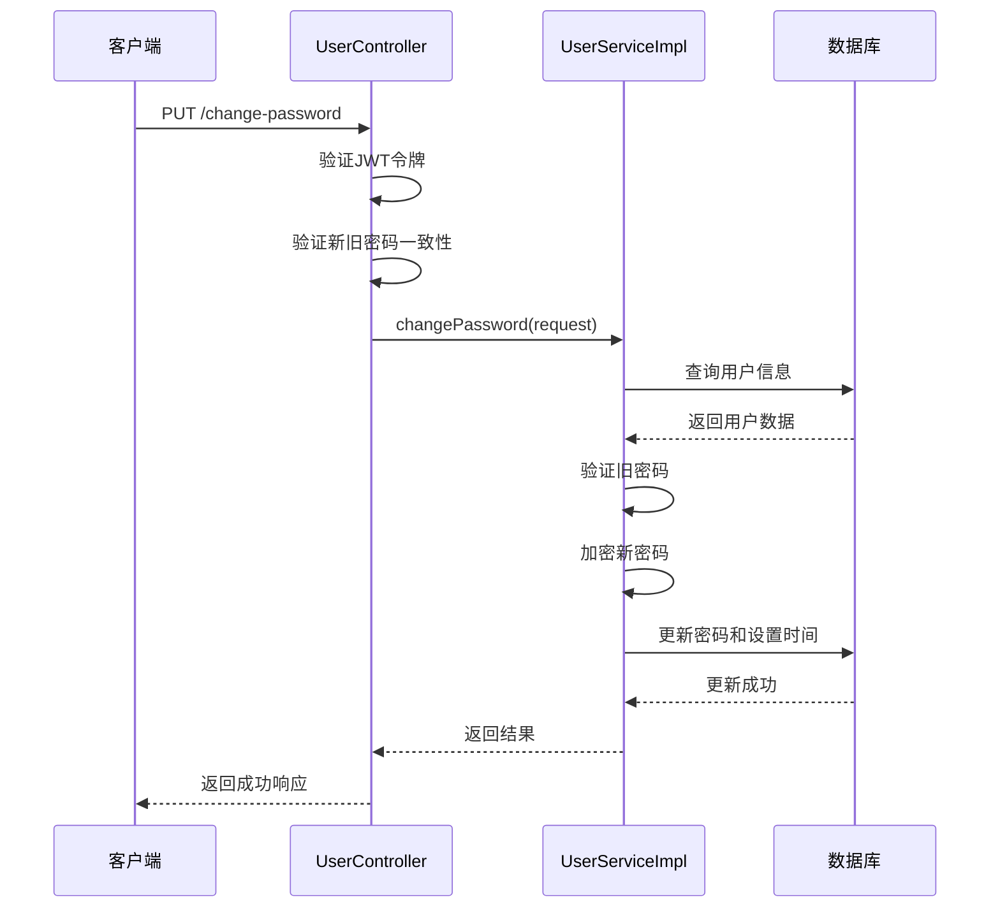
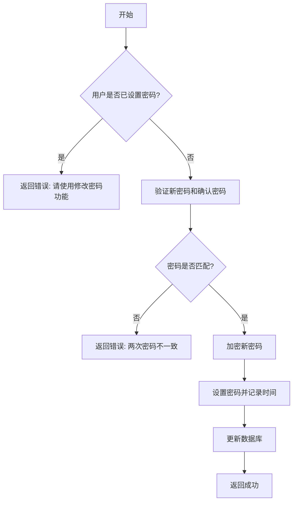

# 安全设置API

<cite>
**本文档引用文件**   
- [UserController.java](file://backend/user-service/src/main/java/com/mall/user/controller/UserController.java)
- [ChangePasswordRequest.java](file://backend/user-service/src/main/java/com/mall/user/dto/ChangePasswordRequest.java)
- [UserServiceImpl.java](file://backend/user-service/src/main/java/com/mall/user/service/impl/UserServiceImpl.java)
- [User.java](file://backend/user-service/src/main/java/com/mall/user/domain/entity/User.java)
</cite>

## 目录
1. [简介](#简介)
2. [密码修改接口](#密码修改接口)
3. [首次设置密码接口](#首次设置密码接口)
4. [密码强度要求](#密码强度要求)
5. [错误处理](#错误处理)
6. [安全最佳实践](#安全最佳实践)

## 简介

安全设置API提供了用户修改密码和首次设置密码的功能。系统区分了两种用户场景：普通用户通过账号密码登录，需要提供旧密码才能修改密码；SMS登录用户在首次使用时需要设置密码，此时无需提供旧密码。该API通过JWT令牌进行身份验证，确保操作的安全性。

## 密码修改接口

`/change-password` 接口用于已设置密码的用户修改其密码。该操作需要提供旧密码以验证身份。

**请求方法**  
PUT

**请求路径**  
`/api/users/change-password`

**认证要求**  
需要在请求头中包含有效的JWT令牌：
```
Authorization: Bearer <token>
```

**请求参数结构**  
```json
{
  "oldPassword": "当前密码",
  "newPassword": "新密码",
  "confirmNewPassword": "确认新密码"
}
```

**参数说明**
- `oldPassword`: 当前使用的密码，不能为空
- `newPassword`: 新密码，长度必须在6-20个字符之间
- `confirmNewPassword`: 确认新密码，必须与`newPassword`一致

**业务逻辑流程**
1. 验证JWT令牌的有效性
2. 检查新密码与确认密码是否一致
3. 根据用户名查找用户信息
4. 验证旧密码是否正确（使用BCrypt加密比对）
5. 更新密码并记录密码设置时间



**Diagram sources**
- [UserController.java](file://backend/user-service/src/main/java/com/mall/user/controller/UserController.java#L342-L391)
- [UserServiceImpl.java](file://backend/user-service/src/main/java/com/mall/user/service/impl/UserServiceImpl.java#L152-L177)

**Section sources**
- [UserController.java](file://backend/user-service/src/main/java/com/mall/user/controller/UserController.java#L342-L391)
- [ChangePasswordRequest.java](file://backend/user-service/src/main/java/com/mall/user/dto/ChangePasswordRequest.java#L6-L61)

## 首次设置密码接口

`/set-password` 接口专为SMS登录用户首次设置密码而设计。由于这些用户之前没有密码，因此不需要提供旧密码。

**请求方法**  
PUT

**请求路径**  
`/api/users/set-password`

**认证要求**  
需要在请求头中包含有效的JWT令牌：
```
Authorization: Bearer <token>
```

**请求参数结构**  
```json
{
  "newPassword": "新密码",
  "confirmPassword": "确认密码"
}
```

**参数说明**
- `newPassword`: 新密码，不能为空，长度6-20字符
- `confirmPassword`: 确认密码，必须与`newPassword`一致

**业务逻辑差异**
与普通密码修改相比，首次设置密码有以下关键差异：
1. **无需旧密码**：请求体不包含旧密码字段
2. **状态检查**：系统会检查用户是否已经设置过密码（通过`password_set_time`字段）
3. **仅限首次**：如果用户已经设置过密码，则不允许再次通过此接口设置



**Diagram sources**
- [UserController.java](file://backend/user-service/src/main/java/com/mall/user/controller/UserController.java#L552-L617)
- [UserServiceImpl.java](file://backend/user-service/src/main/java/com/mall/user/service/impl/UserServiceImpl.java#L188-L213)

**Section sources**
- [UserController.java](file://backend/user-service/src/main/java/com/mall/user/controller/UserController.java#L552-L617)
- [User.java](file://backend/user-service/src/main/java/com/mall/user/domain/entity/User.java#L38)

## 密码强度要求

系统对密码设置有以下安全要求：

**长度要求**
- 最小长度：6个字符
- 最大长度：20个字符

**一致性校验**
- 新密码必须与确认密码完全一致
- 系统在服务端进行比对，防止客户端绕过验证

**加密存储**
- 所有密码使用BCrypt算法进行单向加密存储
- 加密强度为BCrypt的默认强度
- 旧密码不会被明文存储或传输

**安全机制**
- 密码修改时必须验证旧密码
- 首次设置密码后，`password_set_time`字段会被设置，防止重复设置
- JWT令牌验证确保操作者身份的真实性

## 错误处理

API提供了详细的错误响应，帮助客户端正确处理各种异常情况。

**常见错误码**
| 状态码 | 错误代码 | 错误消息 | 说明 |
|--------|---------|---------|------|
| 400 | - | "新密码和确认密码不一致" | 新密码与确认密码不匹配 |
| 400 | - | "新密码不能为空" | 新密码字段为空 |
| 400 | - | "当前密码不能为空" | 旧密码字段为空 |
| 401 | - | "未提供有效的认证令牌" | 请求头缺少Authorization字段 |
| 401 | - | "无效的认证令牌" | JWT令牌无效或已过期 |
| 400 | - | "旧密码错误" | 提供的旧密码不正确 |
| 400 | - | "密码已设置，请使用修改密码功能" | SMS用户尝试重复设置密码 |

**错误响应格式**
```json
{
  "success": false,
  "message": "错误描述信息",
  "code": 400
}
```

**Section sources**
- [UserController.java](file://backend/user-service/src/main/java/com/mall/user/controller/UserController.java#L342-L617)
- [UserServiceImpl.java](file://backend/user-service/src/main/java/com/mall/user/service/impl/UserServiceImpl.java#L152-L213)

## 安全最佳实践

为了确保密码相关操作的安全性，建议遵循以下最佳实践：

**客户端实践**
- 在用户输入密码时进行实时验证
- 不要在前端JavaScript中暴露密码验证逻辑
- 使用HTTPS加密传输所有密码相关请求
- 清除表单中的密码字段，防止浏览器自动填充

**服务端安全措施**
- 所有密码修改操作都需要身份验证
- 密码在数据库中始终加密存储
- 提供详细的错误信息，但不泄露安全敏感信息
- 记录关键操作日志（未来可扩展）

**密码策略建议**
- 鼓励用户使用包含字母、数字和特殊字符的组合
- 定期提示用户更新密码
- 实现登录失败次数限制（当前版本未实现）
- 考虑增加多因素认证选项

**监控与审计**
- 监控异常的密码修改行为
- 记录密码修改的时间戳
- 提供用户查看最近安全活动的功能

**Section sources**
- [UserController.java](file://backend/user-service/src/main/java/com/mall/user/controller/UserController.java#L342-L617)
- [UserServiceImpl.java](file://backend/user-service/src/main/java/com/mall/user/service/impl/UserServiceImpl.java#L152-L213)
- [User.java](file://backend/user-service/src/main/java/com/mall/user/domain/entity/User.java#L38)