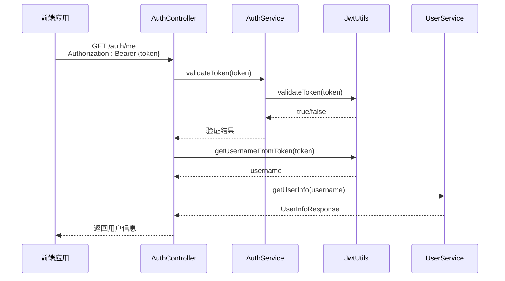

# 用户验证API

<cite>
**本文档引用文件**   
- [AuthController.java](file://backend/user-service/src/main/java/com/mall/user/controller/AuthController.java)
- [AuthService.java](file://backend/user-service/src/main/java/com/mall/user/service/AuthService.java)
- [JwtUtils.java](file://backend/user-service/src/main/java/com/mall/user/utils/JwtUtils.java)
- [UserService.java](file://backend/user-service/src/main/java/com/mall/user/service/UserService.java)
</cite>

## 目录
1. [简介](#简介)
2. [Token验证接口 (/validate)](#token验证接口-validate)
3. [获取当前用户信息接口 (/me)](#获取当前用户信息接口-me)
4. [服务间调用流程](#服务间调用流程)
5. [错误处理示例](#错误处理示例)
6. [安全与最佳实践](#安全与最佳实践)

## 简介
本API文档详细描述了用户身份验证系统中的两个核心接口：`/validate` 和 `/me`。这两个接口分别用于服务间Token验证和前端获取当前登录用户信息。系统采用JWT（JSON Web Token）作为身份验证机制，通过`AuthController`控制器暴露RESTful端点，确保微服务架构下的安全通信和用户信息获取。

**Section sources**
- [AuthController.java](file://backend/user-service/src/main/java/com/mall/user/controller/AuthController.java#L19-L207)

## Token验证接口 (/validate)

### 接口说明
该接口供其他微服务调用，用于验证访问令牌（Access Token）的有效性。通过此接口，服务可以确认调用方的身份是否合法，从而实现服务间的安全通信。

### 接口详情
- **HTTP方法**: `GET`
- **URL路径**: `/auth/validate`
- **请求头要求**: 
  - `Authorization`: Bearer {token}（必须包含有效的JWT令牌）
- **响应格式**: 
  ```json
  {
    "success": true,
    "message": "Token有效",
    "data": true
  }
  ```
  - `data`字段为布尔值，`true`表示Token有效，`false`表示无效。

### 验证逻辑
1. 从`Authorization`请求头中提取JWT令牌（去除`Bearer `前缀）。
2. 调用`AuthService.validateToken()`方法进行验证。
3. 验证过程包括：
   - 检查Token是否在黑名单中（已登出）。
   - 解析Token并获取用户名。
   - 使用`JwtUtils.validateToken()`验证Token的签名和过期时间。
4. 返回布尔值结果。

**Section sources**
- [AuthController.java](file://backend/user-service/src/main/java/com/mall/user/controller/AuthController.java#L132-L151)
- [AuthService.java](file://backend/user-service/src/main/java/com/mall/user/service/AuthService.java#L60-L66)
- [JwtUtils.java](file://backend/user-service/src/main/java/com/mall/user/utils/JwtUtils.java#L91-L98)

## 获取当前用户信息接口 (/me)

### 接口说明
该接口供前端应用调用，用于获取当前登录用户的详细信息。前端在用户登录后，可以使用此接口获取用户的个人资料，用于展示用户中心、个人设置等页面。

### 接口详情
- **HTTP方法**: `GET`
- **URL路径**: `/auth/me`
- **请求头要求**: 
  - `Authorization`: Bearer {token}（必须包含有效的JWT令牌）
- **响应格式**: 
  ```json
  {
    "success": true,
    "message": "获取用户信息成功",
    "data": {
      "userId": 1,
      "username": "user123",
      "nickname": "昵称",
      "email": "user@example.com",
      "phone": "13800138000",
      "avatar": "http://example.com/avatar.jpg",
      "gender": 1,
      "birthday": "1990-01-01",
      "bio": "个人简介",
      "hasSetPassword": true
    }
  }
  ```

### 处理流程
1. 从`Authorization`请求头中提取JWT令牌。
2. 调用`AuthService.validateToken()`验证Token有效性。
3. 使用`JwtUtils.getUsernameFromToken()`从Token中解析出用户名。
4. 调用`UserService.getUserInfo(username)`根据用户名查询用户数据库，获取完整用户信息。
5. 构建并返回`UserInfoResponse`对象。



**Diagram sources**
- [AuthController.java](file://backend/user-service/src/main/java/com/mall/user/controller/AuthController.java#L153-L187)
- [UserService.java](file://backend/user-service/src/main/java/com/mall/user/service/UserService.java#L14-L25)

## 服务间调用流程
在微服务架构中，服务间调用遵循以下流程：
1. **服务A**收到带有`Authorization`头的请求。
2. **服务A**调用**认证服务**的`/auth/validate`接口，验证Token。
3. 认证服务返回验证结果（布尔值）。
4. 如果验证通过，**服务A**继续处理业务逻辑；否则，返回401未授权错误。

此机制确保了服务间通信的安全性，避免了每个服务都需要直接访问用户数据库。

**Section sources**
- [AuthController.java](file://backend/user-service/src/main/java/com/mall/user/controller/AuthController.java#L132-L151)
- [AuthService.java](file://backend/user-service/src/main/java/com/mall/user/service/AuthService.java#L60-L66)

## 错误处理示例
### Token过期
- **场景**: Token已超过有效期。
- **处理**: `JwtUtils.validateToken()`抛出`JwtException`，`AuthService.validateToken()`返回`false`。
- **响应**: 
  ```json
  {
    "success": true,
    "message": "Token无效",
    "data": false
  }
  ```

### Token格式错误
- **场景**: Token格式不正确或签名无效。
- **处理**: `JwtUtils.getClaimsFromToken()`抛出`JwtException`，`AuthService.validateToken()`返回`false`。
- **响应**: 同上。

### Token为空
- **场景**: 请求头中未提供Token。
- **处理**: 控制器直接返回失败响应。
- **响应**: 
  ```json
  {
    "success": false,
    "message": "Token不能为空",
    "data": null
  }
  ```

### 用户不存在
- **场景**: Token中的用户名在数据库中不存在。
- **处理**: `UserService.getUserInfo()`返回`null`。
- **响应**: 
  ```json
  {
    "success": false,
    "message": "用户不存在",
    "data": null
  }
  ```

**Section sources**
- [AuthController.java](file://backend/user-service/src/main/java/com/mall/user/controller/AuthController.java#L137-L150)
- [JwtUtils.java](file://backend/user-service/src/main/java/com/mall/user/utils/JwtUtils.java#L91-L98)

## 安全与最佳实践
1. **Token存储**: 前端应将Token存储在`HttpOnly`的Cookie中，防止XSS攻击。
2. **刷新机制**: 使用刷新令牌（Refresh Token）机制，避免频繁登录。
3. **黑名单管理**: 登出时应将Token加入黑名单，防止被继续使用。
4. **HTTPS**: 所有API调用必须通过HTTPS进行，确保传输安全。
5. **最小权限**: 服务间调用应遵循最小权限原则，仅暴露必要的接口。

**Section sources**
- [AuthController.java](file://backend/user-service/src/main/java/com/mall/user/controller/AuthController.java#L94-L108)
- [AuthService.java](file://backend/user-service/src/main/java/com/mall/user/service/AuthService.java#L43-L49)