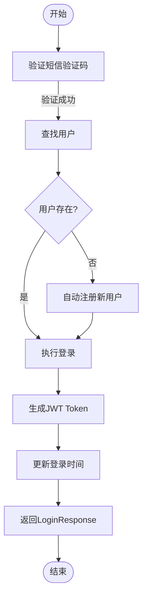
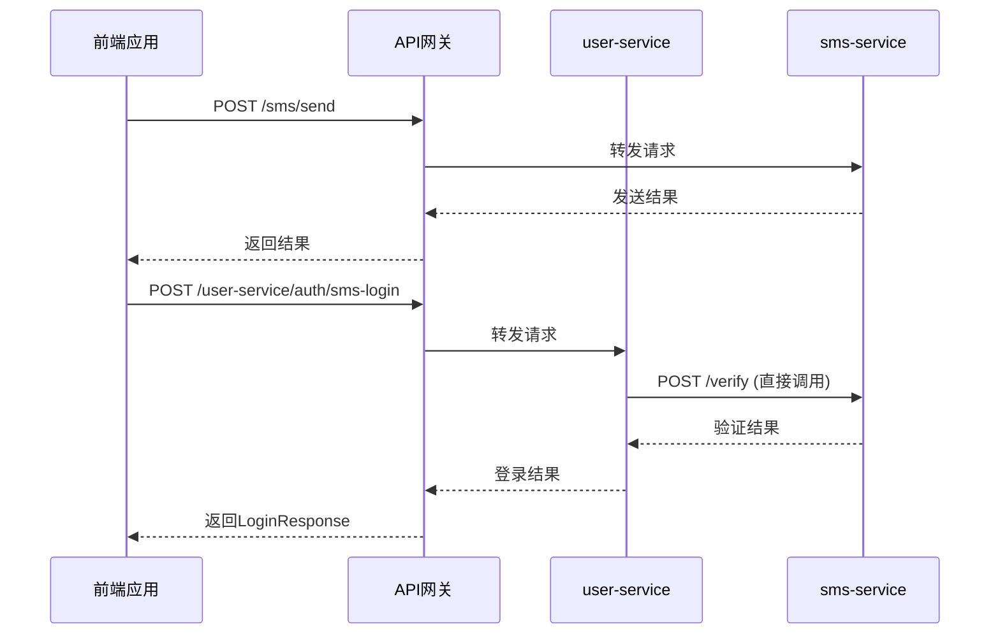

# 登录注册API

<cite>
**本文档引用文件**  
- [AuthController.java](file://backend/user-service/src/main/java/com/mall/user/controller/AuthController.java)
- [LoginRequest.java](file://backend/user-service/src/main/java/com/mall/user/dto/LoginRequest.java)
- [RegisterRequest.java](file://backend/user-service/src/main/java/com/mall/user/dto/RegisterRequest.java)
- [LoginResponse.java](file://backend/user-service/src/main/java/com/mall/user/dto/LoginResponse.java)
- [AuthServiceImpl.java](file://backend/user-service/src/main/java/com/mall/user/service/impl/AuthServiceImpl.java)
- [SmsPushServiceImpl.java](file://backend/sms-service/src/main/java/com/mall/sms/service/impl/SmsPushServiceImpl.java)
- [auth.js](file://frontend/src/api/auth.js)
</cite>

## 目录
1. [简介](#简介)
2. [API概览](#api概览)
3. [用户注册接口](#用户注册接口)
4. [用户登录接口](#用户登录接口)
5. [短信验证码登录接口](#短信验证码登录接口)
6. [密码加密机制](#密码加密机制)
7. [短信验证码流程](#短信验证码流程)
8. [错误处理与常见错误码](#错误处理与常见错误码)
9. [前端集成示例](#前端集成示例)
10. [与auth-service交互说明](#与auth-service交互说明)

## 简介
本API文档详细描述了在线商城系统的用户认证功能，涵盖用户注册、密码登录和短信验证码登录三大核心接口。文档基于`user-service`中的`AuthController`实现，重点说明了各接口的请求参数、响应格式、认证机制及错误处理策略。系统采用JWT进行身份验证，BCrypt进行密码加密，并通过`sms-service`实现短信验证码的发送与验证。特别地，短信验证码登录支持“未注册自动注册”功能，提升用户体验。本文档旨在为前端开发者提供完整的集成指南。

**本文档引用文件**  
- [AuthController.java](file://backend/user-service/src/main/java/com/mall/user/controller/AuthController.java)
- [LoginRequest.java](file://backend/user-service/src/main/java/com/mall/user/dto/LoginRequest.java)

## API概览
用户认证API提供以下核心端点，均位于`/user-service/auth`路径下：

| 接口名称 | HTTP方法 | URL路径 | 说明 |
| :--- | :--- | :--- | :--- |
| 用户注册 | POST | `/register` | 创建新用户账户 |
| 用户登录 | POST | `/login` | 使用用户名和密码登录 |
| 短信登录 | POST | `/sms-login` | 使用手机号和验证码登录（支持自动注册） |
| 用户登出 | POST | `/logout` | 使当前Token失效 |
| 刷新Token | POST | `/refresh` | 使用刷新Token获取新访问Token |

所有请求和响应均使用JSON格式，通过`common-core`模块中的`R<T>`类进行统一封装。

**本文档引用文件**  
- [AuthController.java](file://backend/user-service/src/main/java/com/mall/user/controller/AuthController.java)

## 用户注册接口

### 接口详情
- **HTTP方法**: POST
- **URL路径**: `/user-service/auth/register`
- **认证要求**: 无需认证

### 请求参数
请求体为`RegisterRequest`对象，包含以下字段：

| 参数名 | 类型 | 必填 | 说明 | 示例 |
| :--- | :--- | :--- | :--- | :--- |
| `username` | String | 是 | 用户名，3-20位字母、数字或下划线 | `john_doe` |
| `password` | String | 是 | 密码，6-20位字符 | `123456` |
| `confirmPassword` | String | 是 | 确认密码，需与`password`一致 | `123456` |
| `email` | String | 是 | 邮箱地址，需符合邮箱格式 | `john@example.com` |
| `phone` | String | 否 | 手机号，11位数字 | `13800138000` |
| `nickname` | String | 否 | 用户昵称 | `John` |

### 响应格式
成功时返回`R<LoginResponse>`，包含Token和用户信息。

```json
{
  "code": 200,
  "message": "注册成功",
  "data": {
    "accessToken": "eyJhbGciOiJIUzI1NiIsInR5cCI6IkpXVCJ9...",
    "refreshToken": "eyJhbGciOiJIUzI1NiIsInR5cCI6IkpXVCJ9...",
    "tokenType": "Bearer",
    "expiresIn": 3600,
    "userInfo": {
      "id": 1,
      "username": "john_doe",
      "nickname": "John",
      "email": "john@example.com",
      "phone": "13800138000"
    }
  }
}
```

### 业务逻辑
1. 服务端校验所有请求参数。
2. 检查用户名、邮箱、手机号是否唯一。
3. 若提供了手机号，需通过`sms-service`验证验证码。
4. 使用BCrypt加密密码后创建用户。
5. 注册成功后，自动生成JWT Token并返回`LoginResponse`，实现“注册即登录”。

**本文档引用文件**  
- [AuthController.java](file://backend/user-service/src/main/java/com/mall/user/controller/AuthController.java#L75-L88)
- [RegisterRequest.java](file://backend/user-service/src/main/java/com/mall/user/dto/RegisterRequest.java)
- [AuthServiceImpl.java](file://backend/user-service/src/main/java/com/mall/user/service/impl/AuthServiceImpl.java#L282-L370)

## 用户登录接口

### 接口详情
- **HTTP方法**: POST
- **URL路径**: `/user-service/auth/login`
- **认证要求**: 无需认证

### 请求参数
请求体为`LoginRequest`对象，包含以下字段：

| 参数名 | 类型 | 必填 | 说明 | 示例 |
| :--- | :--- | :--- | :--- | :--- |
| `username` | String | 是 | 用户名或手机号 | `john_doe` 或 `13800138000` |
| `password` | String | 是 | 用户密码 | `123456` |

### 响应格式
成功时返回`R<LoginResponse>`，与注册接口相同。

```json
{
  "code": 200,
  "message": "登录成功",
  "data": {
    "accessToken": "eyJhbGciOiJIUzI1NiIsInR5cCI6IkpXVCJ9...",
    "refreshToken": "eyJhbGciOiJIUzI1NiIsInR5cCI6IkpXVCJ9...",
    "tokenType": "Bearer",
    "expiresIn": 3600,
    "userInfo": {
      "id": 1,
      "username": "john_doe",
      "nickname": "John"
    }
  }
}
```

### 业务逻辑
1. 根据`username`字段查找用户（支持用户名或手机号登录）。
2. 验证用户状态是否为启用。
3. 使用BCrypt验证密码。
4. 验证通过后，生成JWT Token，更新用户最后登录时间，并返回`LoginResponse`。

**本文档引用文件**  
- [AuthController.java](file://backend/user-service/src/main/java/com/mall/user/controller/AuthController.java#L60-L73)
- [LoginRequest.java](file://backend/user-service/src/main/java/com/mall/user/dto/LoginRequest.java)
- [AuthServiceImpl.java](file://backend/user-service/src/main/java/com/mall/user/service/impl/AuthServiceImpl.java#L125-L181)

## 短信验证码登录接口

### 接口详情
- **HTTP方法**: POST
- **URL路径**: `/user-service/auth/sms-login`
- **认证要求**: 无需认证

### 请求参数
请求体为`LoginRequest`对象，但使用`phone`和`smsCode`字段：

| 参数名 | 类型 | 必填 | 说明 | 示例 |
| :--- | :--- | :--- | :--- | :--- |
| `phone` | String | 是 | 手机号 | `13800138000` |
| `smsCode` | String | 是 | 收到的短信验证码 | `123456` |

### 响应格式
成功时返回`R<LoginResponse>`，与登录接口相同。

```json
{
  "code": 200,
  "message": "登录成功",
  "data": {
    "accessToken": "eyJhbGciOiJIUzI1NiIsInR5cCI6IkpXVCJ9...",
    "refreshToken": "eyJhbGciOiJIUzI1NiIsInR5cCI6IkpXVCJ9...",
    "tokenType": "Bearer",
    "expiresIn": 3600,
    "userInfo": {
      "id": 2,
      "username": "user_13800138000",
      "nickname": "用户8000"
    }
  }
}
```

### 业务逻辑
此接口实现“智能登录”：
1. 调用`sms-service`验证手机号和验证码。
2. 在用户数据库中根据手机号查找用户。
3. **若用户存在**：验证通过后直接登录。
4. **若用户不存在**：自动创建新用户（用户名为`user_手机号`，昵称为`用户后四位`），然后登录。
5. 返回`LoginResponse`。



**本文档引用文件**  
- [AuthController.java](file://backend/user-service/src/main/java/com/mall/user/controller/AuthController.java#L45-L58)
- [LoginRequest.java](file://backend/user-service/src/main/java/com/mall/user/dto/LoginRequest.java)
- [AuthServiceImpl.java](file://backend/user-service/src/main/java/com/mall/user/service/impl/AuthServiceImpl.java#L193-L270)

## 密码加密机制
系统采用**BCrypt**算法对用户密码进行加密存储，确保安全性。

- **加密实现**：在`AuthServiceImpl`中，使用`PasswordEncoder`（Spring Security的`BCryptPasswordEncoder`）对明文密码进行哈希。
- **加密过程**：`passwordEncoder.encode(rawPassword)`。
- **验证过程**：`passwordEncoder.matches(rawPassword, encodedPassword)`。
- **前端提示**：前端在发送密码前无需进行任何加密，由后端负责安全处理。

**本文档引用文件**  
- [AuthServiceImpl.java](file://backend/user-service/src/main/java/com/mall/user/service/impl/AuthServiceImpl.java#L52)
- [PasswordUtil.java](file://backend/admin-service/src/main/java/com/mall/admin/util/PasswordUtil.java)

## 短信验证码流程
短信验证码功能由独立的`sms-service`提供，`user-service`通过`WebClient`调用其接口。

### 发送验证码
- **前端调用**：`sendSmsCode(phoneNumber, purpose)`
- **后端路径**：`/sms/send` (通过网关)
- **用途(purpose)**：`LOGIN`, `REGISTER`, `RESET_PASSWORD`等，决定短信内容。

### 验证验证码
- **后端调用**：`user-service`的`AuthServiceImpl`直接调用`sms-service`的`/verify`端点。
- **请求参数**：`phoneNumber`, `code`, `purpose`。
- **验证逻辑**：`sms-service`检查Redis中存储的验证码是否匹配且未过期。



**本文档引用文件**  
- [SmsPushServiceImpl.java](file://backend/sms-service/src/main/java/com/mall/sms/service/impl/SmsPushServiceImpl.java)
- [AuthServiceImpl.java](file://backend/user-service/src/main/java/com/mall/user/service/impl/AuthServiceImpl.java#L81-L120)
- [auth.js](file://frontend/src/api/auth.js)

## 错误处理与常见错误码
系统使用统一的`R<T>`类封装响应，错误时`code`不为200，`message`包含错误信息。

| 错误码 | 错误信息 | 原因 | 解决方案 |
| :--- | :--- | :--- | :--- |
| 400 | 用户名不能为空 | `username`为空 | 检查请求体，确保字段完整 |
| 400 | 用户名已存在 | 注册时用户名重复 | 更换用户名 |
| 400 | 邮箱已被使用 | 注册时邮箱重复 | 更换邮箱 |
| 400 | 手机号已被使用 | 注册时手机号重复 | 更换手机号 |
| 400 | 验证码错误或已过期 | 验证码不匹配或超时 | 重新获取验证码 |
| 400 | 两次输入的密码不一致 | `password`与`confirmPassword`不同 | 确保两次输入一致 |
| 401 | 用户名或密码错误 | 登录凭据无效 | 检查用户名和密码 |
| 401 | 用户已被禁用 | 账户状态为禁用 | 联系管理员 |
| 500 | 用户注册失败 | 数据库操作异常 | 重试或联系开发 |

**本文档引用文件**  
- [AuthController.java](file://backend/user-service/src/main/java/com/mall/user/controller/AuthController.java)
- [AuthServiceImpl.java](file://backend/user-service/src/main/java/com/mall/user/service/impl/AuthServiceImpl.java)

## 前端集成示例
前端通过`src/api/auth.js`封装的函数调用API。

### 用户注册
```javascript
import { register } from '@/api/auth'

const registerData = {
  username: 'newuser',
  password: 'mypassword',
  confirmPassword: 'mypassword',
  email: 'new@example.com',
  phone: '13800138000'
}

register(registerData).then(response => {
  // 处理成功，response.data 包含 LoginResponse
  const { accessToken, userInfo } = response.data
  // 存储Token，跳转首页
}).catch(error => {
  // 处理错误，error.response.data.message 包含错误信息
})
```

### 短信验证码登录
```javascript
import { sendSmsCode, loginBySms } from '@/api/auth'

// 发送验证码
sendSmsCode('13800138000', 'LOGIN').then(() => {
  // 提示用户查收短信
}).catch(error => {
  // 提示发送失败
})

// 登录
const loginData = {
  phone: '13800138000',
  smsCode: '123456'
}

loginBySms(loginData).then(response => {
  // 登录成功，处理Token和用户信息
}).catch(error => {
  // 处理错误，如验证码错误
})
```

**本文档引用文件**  
- [auth.js](file://frontend/src/api/auth.js)

## 与auth-service交互说明
虽然用户认证逻辑主要在`user-service`中实现，但`auth-service`作为独立的认证服务，提供通用的Token验证功能。

- **Token生成与验证**：`user-service`内部使用`JwtUtils`生成和验证JWT，不直接依赖`auth-service`。
- **服务间调用**：`auth-service`的`/validate`端点可供其他微服务（如`order-service`）调用，以验证来自`user-service`的Token是否有效。
- **职责分离**：`user-service`负责用户数据和业务逻辑，`auth-service`可作为未来统一认证中心的基础。

**本文档引用文件**  
- [AuthController.java](file://backend/auth-service/src/main/java/com/mall/auth/controller/AuthController.java)
- [AuthController.java](file://backend/user-service/src/main/java/com/mall/user/controller/AuthController.java)