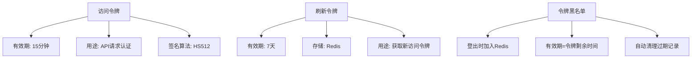
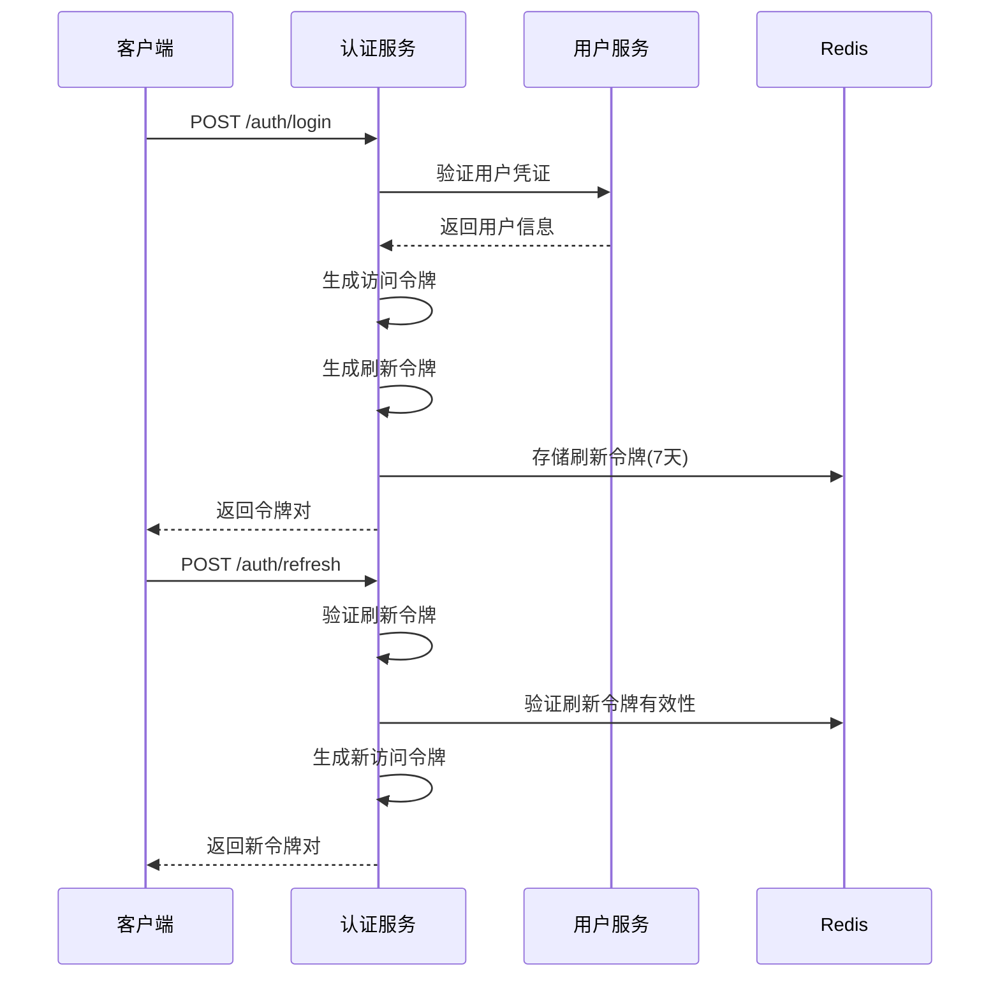
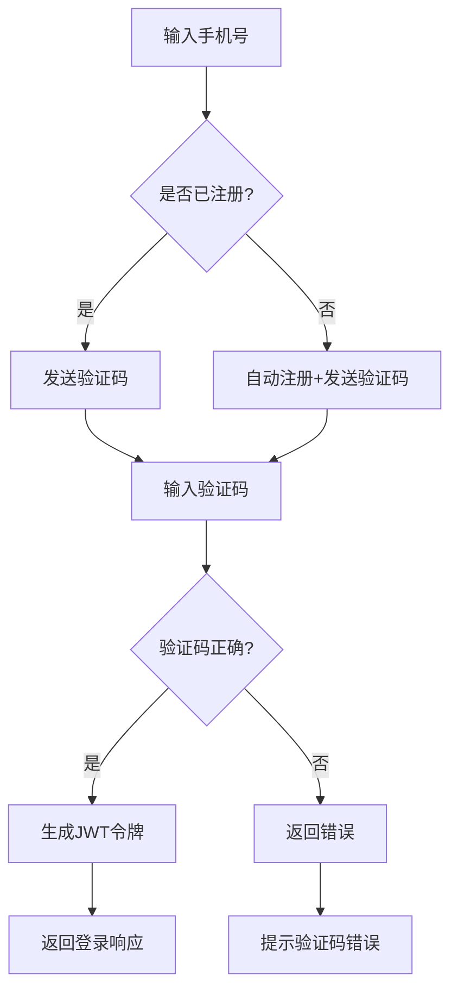

# 认证API

<cite>
**本文档引用文件**  
- [AuthController.java](file://backend/auth-service/src/main/java/com/mall/auth/controller/AuthController.java)
- [LoginRequest.java](file://backend/auth-service/src/main/java/com/mall/auth/dto/LoginRequest.java)
- [LoginResponse.java](file://backend/auth-service/src/main/java/com/mall/auth/dto/LoginResponse.java)
- [RefreshTokenRequest.java](file://backend/auth-service/src/main/java/com/mall/auth/dto/RefreshTokenRequest.java)
- [TokenValidationRequest.java](file://backend/auth-service/src/main/java/com/mall/auth/dto/TokenValidationRequest.java)
- [AuthService.java](file://backend/auth-service/src/main/java/com/mall/auth/service/AuthService.java)
- [JwtUtils.java](file://backend/auth-service/src/main/java/com/mall/auth/utils/JwtUtils.java)
- [README.md](file://backend/auth-service/README.md)
</cite>

## 目录
1. [简介](#简介)
2. [核心认证接口](#核心认证接口)
3. [JWT令牌机制](#jwt令牌机制)
4. [短信验证码登录流程](#短信验证码登录流程)
5. [错误码处理](#错误码处理)
6. [前端集成指南](#前端集成指南)
7. [服务交互说明](#服务交互说明)

## 简介
本认证API文档详细描述了用户登录、注册、令牌刷新与验证等核心认证功能。系统采用基于JWT的无状态认证机制，通过`auth-service`提供统一的认证服务，与`user-service`进行用户凭证验证交互。所有API均遵循RESTful设计规范，使用JSON格式进行数据交换。

**本文档引用文件**  
- [AuthController.java](file://backend/auth-service/src/main/java/com/mall/auth/controller/AuthController.java)
- [README.md](file://backend/auth-service/README.md)

## 核心认证接口

### 用户登录接口
- **HTTP方法**: `POST`
- **URL路径**: `/auth/login`
- **请求参数**: `LoginRequest`
- **响应格式**: `LoginResponse`
- **认证要求**: 无需认证

#### 请求参数结构
```json
{
  "username": "用户账号或手机号",
  "password": "登录密码",
  "loginType": "登录类型（password/sms，默认password）"
}
```

#### 响应数据结构
```json
{
  "success": true,
  "message": "登录成功",
  "data": {
    "accessToken": "访问令牌",
    "refreshToken": "刷新令牌",
    "tokenType": "Bearer",
    "expiresIn": 900,
    "userId": 1001,
    "username": "user123"
  }
}
```

**本文档引用文件**  
- [AuthController.java](file://backend/auth-service/src/main/java/com/mall/auth/controller/AuthController.java#L47-L70)
- [LoginRequest.java](file://backend/auth-service/src/main/java/com/mall/auth/dto/LoginRequest.java)
- [LoginResponse.java](file://backend/auth-service/src/main/java/com/mall/auth/dto/LoginResponse.java)

### 令牌刷新接口
- **HTTP方法**: `POST`
- **URL路径**: `/auth/refresh`
- **请求参数**: `RefreshTokenRequest`
- **响应格式**: `LoginResponse`
- **认证要求**: 无需认证

#### 请求参数结构
```json
{
  "refreshToken": "有效的刷新令牌"
}
```

#### 响应示例
```json
{
  "success": true,
  "message": "令牌刷新成功",
  "data": {
    "accessToken": "新的访问令牌",
    "refreshToken": "原刷新令牌",
    "expiresIn": 900
  }
}
```

**本文档引用文件**  
- [AuthController.java](file://backend/auth-service/src/main/java/com/mall/auth/controller/AuthController.java#L78-L101)
- [RefreshTokenRequest.java](file://backend/auth-service/src/main/java/com/mall/auth/dto/RefreshTokenRequest.java)

### 令牌验证接口
- **HTTP方法**: `POST`
- **URL路径**: `/auth/validate`
- **请求参数**: `TokenValidationRequest`
- **响应格式**: JSON对象
- **认证要求**: 无需认证

#### 请求参数结构
```json
{
  "token": "待验证的访问令牌"
}
```

#### 响应示例
```json
{
  "success": true,
  "data": {
    "valid": true
  }
}
```

**本文档引用文件**  
- [AuthController.java](file://backend/auth-service/src/main/java/com/mall/auth/controller/AuthController.java#L109-L121)
- [TokenValidationRequest.java](file://backend/auth-service/src/main/java/com/mall/auth/dto/TokenValidationRequest.java)

### 用户登出接口
- **HTTP方法**: `POST`
- **URL路径**: `/auth/logout`
- **请求头**: `Authorization: Bearer {token}`
- **响应格式**: JSON对象
- **认证要求**: 需要有效访问令牌

#### 响应示例
```json
{
  "success": true,
  "message": "登出成功"
}
```

**本文档引用文件**  
- [AuthController.java](file://backend/auth-service/src/main/java/com/mall/auth/controller/AuthController.java#L129-L157)

## JWT令牌机制

### 令牌策略


**图示来源**  
- [README.md](file://backend/auth-service/README.md#L157-L173)
- [AuthService.java](file://backend/auth-service/src/main/java/com/mall/auth/service/AuthService.java#L156-L169)

### 令牌生成与验证流程


**图示来源**  
- [AuthService.java](file://backend/auth-service/src/main/java/com/mall/auth/service/AuthService.java#L54-L93)
- [JwtUtils.java](file://backend/auth-service/src/main/java/com/mall/auth/utils/JwtUtils.java)

## 短信验证码登录流程
系统支持手机号+验证码方式登录，未注册用户将自动完成注册流程。该功能由`user-service`实现，`auth-service`通过统一接口进行集成。



**本文档引用文件**  
- [AuthController.java](file://backend/user-service/src/main/java/com/mall/user/controller/AuthController.java#L49-L58)

## 错误码处理

### 常见错误响应
| 错误类型 | HTTP状态码 | 错误消息示例 | 处理建议 |
|---------|----------|------------|--------|
| 用户名不存在 | 400 | 用户名或密码错误 | 检查用户名和密码 |
| 密码错误 | 400 | 用户名或密码错误 | 提示用户重新输入 |
| 令牌无效 | 400 | 无效的刷新令牌 | 引导用户重新登录 |
| 令牌过期 | 400 | 刷新令牌已失效 | 调用刷新接口或重新登录 |
| 用户服务不可用 | 500 | 用户服务不可用，请稍后重试 | 检查网络或稍后重试 |

### 统一错误响应格式
```json
{
  "success": false,
  "message": "错误描述信息"
}
```

**本文档引用文件**  
- [AuthService.java](file://backend/auth-service/src/main/java/com/mall/auth/service/AuthService.java#L62-L63)
- [AuthController.java](file://backend/auth-service/src/main/java/com/mall/auth/controller/AuthController.java#L64-L68)

## 前端集成指南

### 请求示例
```javascript
// 用户登录
fetch('/auth/login', {
  method: 'POST',
  headers: { 'Content-Type': 'application/json' },
  body: JSON.stringify({
    username: 'user123',
    password: 'pass123',
    loginType: 'password'
  })
})

// 令牌刷新
fetch('/auth/refresh', {
  method: 'POST',
  headers: { 'Content-Type': 'application/json' },
  body: JSON.stringify({
    refreshToken: 'your_refresh_token'
  })
})
```

### 认证拦截器
建议在前端实现统一的请求拦截器，自动添加`Authorization`头，并处理401状态码（未授权）的令牌刷新逻辑。

**本文档引用文件**  
- [frontend/src/utils/request.js](file://frontend/src/utils/request.js)

## 服务交互说明

### 与用户服务集成
认证服务通过WebClient调用用户服务进行凭证验证：

```java
POST http://user-service/api/users/validate
Body: {
  "username": "admin",
  "password": "123456"
}
```

### 网关集成
所有认证请求通过Spring Cloud Gateway路由到`auth-service`，网关负责统一的认证头处理和请求转发。

**本文档引用文件**  
- [AuthService.java](file://backend/auth-service/src/main/java/com/mall/auth/service/AuthService.java#L189-L195)
- [README.md](file://backend/auth-service/README.md#L187-L197)