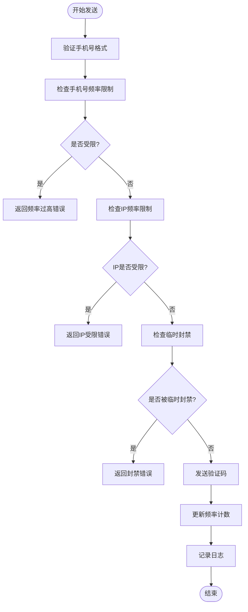
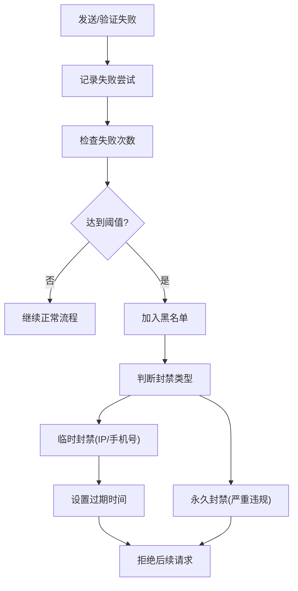
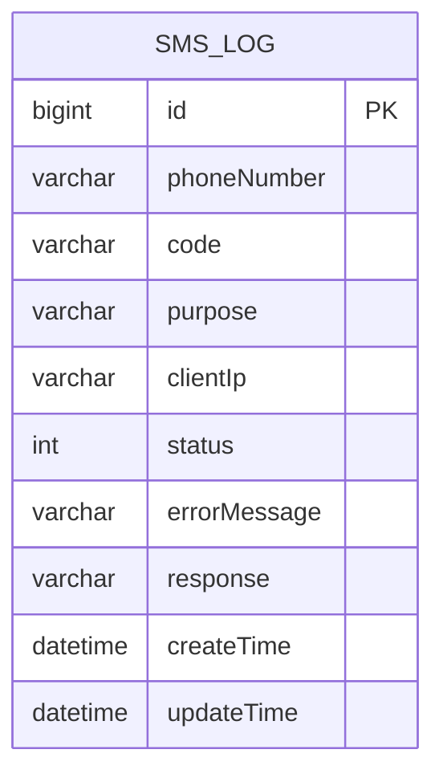
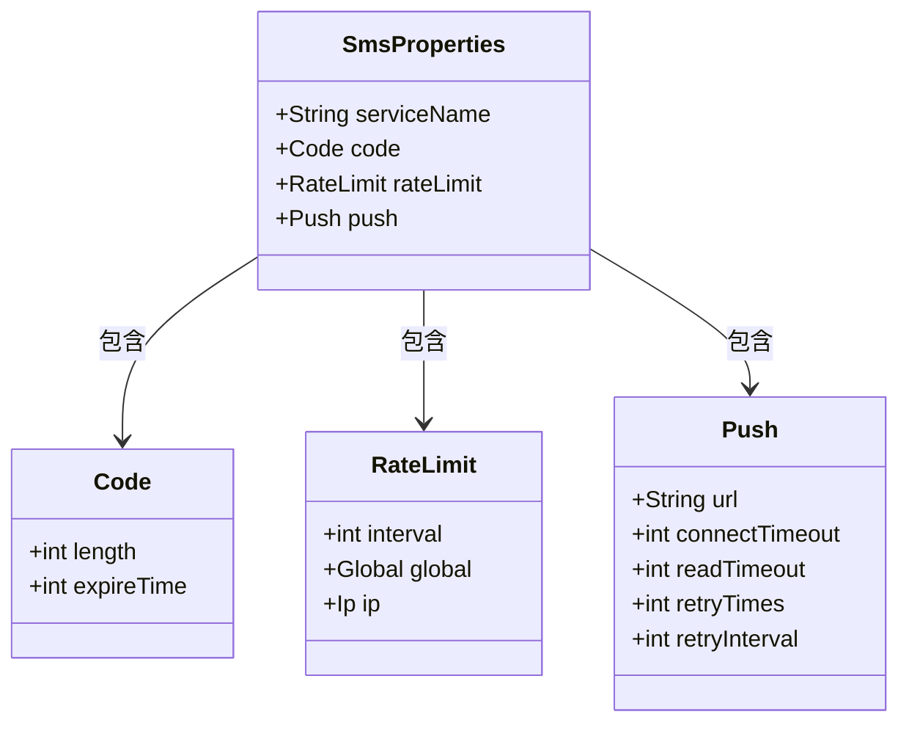

# 短信服务API

<cite>
**本文档引用文件**  
- [SmsController.java](file://backend/sms-service/src/main/java/com/mall/sms/controller/SmsController.java)
- [GatewaySmsController.java](file://backend/sms-service/src/main/java/com/mall/sms/controller/GatewaySmsController.java)
- [SendSmsRequest.java](file://backend/sms-service/src/main/java/com/mall/sms/dto/SendSmsRequest.java)
- [VerifySmsRequest.java](file://backend/sms-service/src/main/java/com/mall/sms/dto/VerifySmsRequest.java)
- [SmsLog.java](file://backend/sms-service/src/main/java/com/mall/sms/entity/SmsLog.java)
- [SmsBlacklist.java](file://backend/sms-service/src/main/java/com/mall/sms/entity/SmsBlacklist.java)
- [SmsService.java](file://backend/sms-service/src/main/java/com/mall/sms/service/SmsService.java)
- [SmsSecurityService.java](file://backend/sms-service/src/main/java/com/mall/sms/service/SmsSecurityService.java)
- [SmsRedisService.java](file://backend/sms-service/src/main/java/com/mall/sms/service/SmsRedisService.java)
- [SmsProperties.java](file://backend/sms-service/src/main/java/com/mall/sms/config/SmsProperties.java)
</cite>

## 目录
1. [简介](#简介)
2. [核心API接口](#核心api接口)
3. [短信频率限制机制](#短信频率限制机制)
4. [黑名单校验机制](#黑名单校验机制)
5. [发送日志记录](#发送日志记录)
6. [网关集成规范](#网关集成规范)
7. [安全集成建议](#安全集成建议)
8. [配置说明](#配置说明)

## 简介

本短信服务为系统提供验证码发送与验证功能，支持手机号验证、IP地址控制、频率限制、黑名单管理及完整日志记录。服务通过RESTful API对外暴露，可用于用户注册、登录、身份验证等场景。

服务具备以下核心特性：
- 验证码发送与验证
- 多维度频率限制（手机号、IP）
- 黑名单自动封禁机制
- 完整操作日志审计
- 支持网关统一接入

**Section sources**
- [SmsController.java](file://backend/sms-service/src/main/java/com/mall/sms/controller/SmsController.java#L1-L123)
- [SmsService.java](file://backend/sms-service/src/main/java/com/mall/sms/service/SmsService.java#L1-L38)

## 核心API接口

### 发送短信验证码

**端点**：`POST /send`  
**用途**：向指定手机号发送验证码

#### 请求参数
```json
{
  "phoneNumber": "13800138000",
  "purpose": "register"
}
```

| 字段 | 类型 | 必填 | 说明 |
|------|------|------|------|
| phoneNumber | string | 是 | 手机号码，需符合中国大陆手机号格式 |
| purpose | string | 是 | 验证码用途，如 register、login、reset_password |

#### 响应示例
成功：
```json
{
  "code": 200,
  "message": "验证码发送成功",
  "data": null
}
```

失败：
```json
{
  "code": 500,
  "message": "验证码发送失败",
  "data": null
}
```

**Section sources**
- [SendSmsRequest.java](file://backend/sms-service/src/main/java/com/mall/sms/dto/SendSmsRequest.java#L1-L29)
- [SmsController.java](file://backend/sms-service/src/main/java/com/mall/sms/controller/SmsController.java#L34-L62)

### 验证短信验证码

**端点**：`POST /verify`  
**用途**：验证用户输入的验证码是否正确

#### 请求参数
```json
{
  "phoneNumber": "13800138000",
  "code": "123456",
  "purpose": "register"
}
```

| 字段 | 类型 | 必填 | 说明 |
|------|------|------|------|
| phoneNumber | string | 是 | 手机号码 |
| code | string | 是 | 用户输入的6位数字验证码 |
| purpose | string | 是 | 验证码用途，需与发送时一致 |

#### 响应示例
成功：
```json
{
  "code": 200,
  "message": "验证码正确",
  "data": null
}
```

失败：
```json
{
  "code": 500,
  "message": "验证码错误或已过期",
  "data": null
}
```

**Section sources**
- [VerifySmsRequest.java](file://backend/sms-service/src/main/java/com/mall/sms/dto/VerifySmsRequest.java#L1-L36)
- [SmsController.java](file://backend/sms-service/src/main/java/com/mall/sms/controller/SmsController.java#L71-L99)

## 短信频率限制机制

系统通过Redis实现多维度频率控制，防止恶意刷短信。

### 限制规则



**Diagram sources**
- [SmsRedisService.java](file://backend/sms-service/src/main/java/com/mall/sms/service/SmsRedisService.java#L1-L90)
- [SmsSecurityService.java](file://backend/sms-service/src/main/java/com/mall/sms/service/SmsSecurityService.java#L1-L50)

### 配置参数

| 限制类型 | 最大请求次数 | 时间窗口 | 说明 |
|---------|-------------|---------|------|
| 同一手机号 | 1次 | 60秒 | 防止同一号码频繁请求 |
| 单IP地址 | 20次 | 60秒 | 防止单IP大量请求 |
| 全局请求 | 1000次 | 60秒 | 防止服务被压垮 |

**Section sources**
- [SmsProperties.java](file://backend/sms-service/src/main/java/com/mall/sms/config/SmsProperties.java#L51-L93)

## 黑名单校验机制

系统自动检测异常行为并加入黑名单，支持永久和临时封禁。

### 黑名单判定流程



**Diagram sources**
- [SmsSecurityService.java](file://backend/sms-service/src/main/java/com/mall/sms/service/SmsSecurityService.java#L1-L50)
- [SmsBlacklist.java](file://backend/sms-service/src/main/java/com/mall/sms/entity/SmsBlacklist.java#L1-L60)

### 黑名单类型

| 类型 | 字段 | 说明 |
|------|------|------|
| phone | phoneNumber | 手机号码被列入黑名单 |
| ip | clientIp | IP地址被列入黑名单 |

**Section sources**
- [SmsBlacklist.java](file://backend/sms-service/src/main/java/com/mall/sms/entity/SmsBlacklist.java#L1-L60)

## 发送日志记录

所有短信操作均记录到数据库，便于审计与排查。

### 日志表结构



**Diagram sources**
- [SmsLog.java](file://backend/sms-service/src/main/java/com/mall/sms/entity/SmsLog.java#L1-L73)

### 字段说明

| 字段 | 类型 | 说明 |
|------|------|------|
| id | bigint | 主键 |
| phoneNumber | varchar | 手机号码 |
| code | varchar | 验证码（加密存储） |
| purpose | varchar | 用途 |
| clientIp | varchar | 客户端IP |
| status | int | 状态：0-失败，1-成功 |
| errorMessage | varchar | 错误信息 |
| response | varchar | 第三方响应 |
| createTime | datetime | 创建时间 |
| updateTime | datetime | 更新时间 |

**Section sources**
- [SmsLog.java](file://backend/sms-service/src/main/java/com/mall/sms/entity/SmsLog.java#L1-L73)

## 网关集成规范

通过`GatewaySmsController`提供网关兼容接口。

### 网关端点

| 方法 | 路径 | 说明 |
|------|------|------|
| POST | /sms/send | 发送验证码（网关路径） |
| POST | /sms/verify | 验证验证码（网关路径） |
| GET | /sms/health | 健康检查 |

### 响应格式

使用统一响应体`R<T>`：

```json
{
  "code": 200,
  "msg": "SMS服务运行正常",
  "data": null
}
```

**Section sources**
- [GatewaySmsController.java](file://backend/sms-service/src/main/java/com/mall/sms/controller/GatewaySmsController.java#L1-L91)

## 安全集成建议

为确保安全使用短信服务，请遵循以下最佳实践：

1. **前端限制**：按钮点击后禁用60秒
2. **用途区分**：不同业务使用不同`purpose`值
3. **IP透传**：确保网关正确传递`X-Forwarded-For`头
4. **错误处理**：不暴露具体失败原因给用户
5. **监控告警**：关注异常发送量和失败率

**Section sources**
- [SmsController.java](file://backend/sms-service/src/main/java/com/mall/sms/controller/SmsController.java#L108-L121)
- [GatewaySmsController.java](file://backend/sms-service/src/main/java/com/mall/sms/controller/GatewaySmsController.java#L78-L90)

## 配置说明

### 主要配置项



**Diagram sources**
- [SmsProperties.java](file://backend/sms-service/src/main/java/com/mall/sms/config/SmsProperties.java#L1-L122)

### 验证码配置
- **长度**：6位数字
- **过期时间**：180秒

### 推送服务配置
- **URL**：https://push.spug.cc/send/zEMdom2N49mpgabP
- **连接超时**：5000毫秒
- **读取超时**：10000毫秒
- **重试次数**：3次

**Section sources**
- [SmsProperties.java](file://backend/sms-service/src/main/java/com/mall/sms/config/SmsProperties.java#L1-L122)