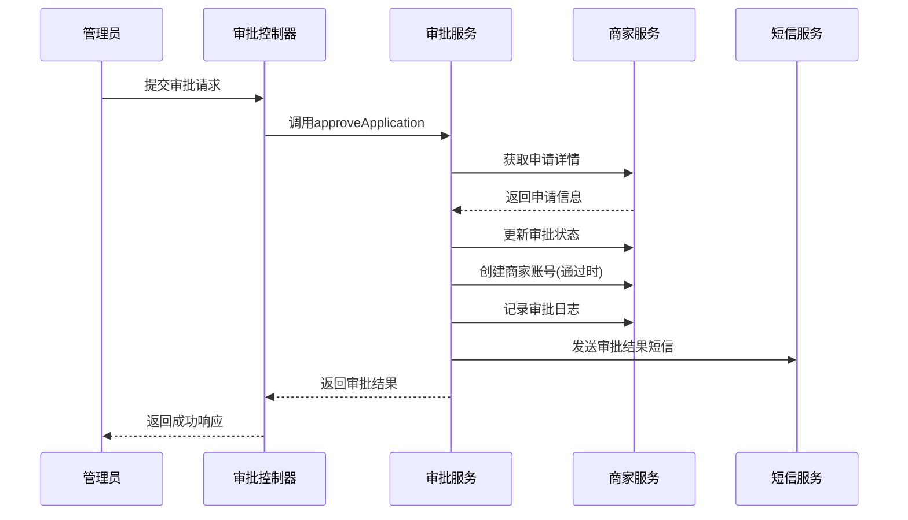
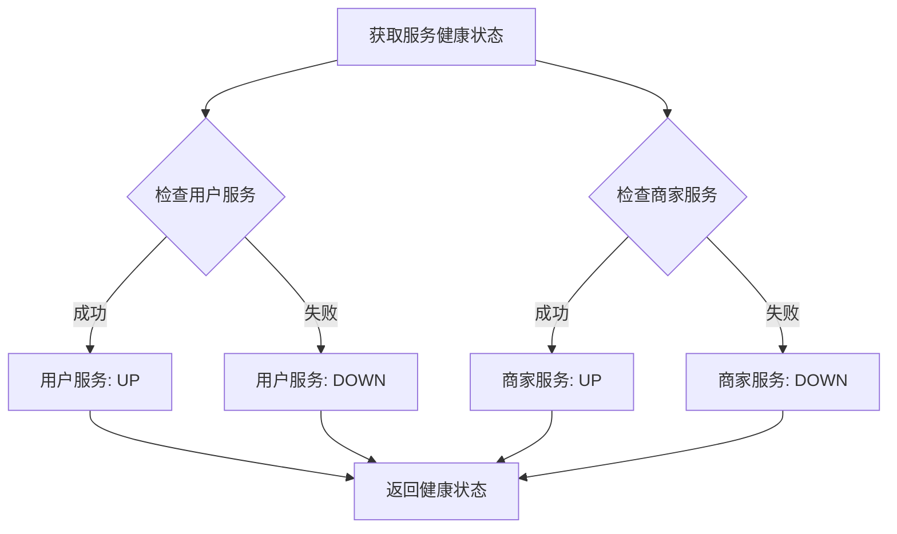

# 管理服务API

<cite>
**本文档引用文件**  
- [UserManagementController.java](file://backend/admin-service/src/main/java/com/mall/admin/controller/UserManagementController.java)
- [MerchantApprovalController.java](file://backend/admin-service/src/main/java/com/mall/admin/controller/MerchantApprovalController.java)
- [ApprovalRequest.java](file://backend/admin-service/src/main/java/com/mall/admin/domain/dto/ApprovalRequest.java)
- [AssignRolesRequest.java](file://backend/admin-service/src/main/java/com/mall/admin/domain/dto/AssignRolesRequest.java)
- [ServiceHealthVO.java](file://backend/admin-service/src/main/java/com/mall/admin/domain/vo/ServiceHealthVO.java)
- [SystemStatisticsVO.java](file://backend/admin-service/src/main/java/com/mall/admin/domain/vo/SystemStatisticsVO.java)
- [SystemMonitorController.java](file://backend/admin-service/src/main/java/com/mall/admin/controller/SystemMonitorController.java)
</cite>

## 目录
1. [简介](#简介)
2. [用户管理API](#用户管理api)
3. [商家审核API](#商家审核api)
4. [系统监控API](#系统监控api)
5. [请求对象说明](#请求对象说明)
6. [响应结构](#响应结构)

## 简介
本API文档详细描述了后台管理服务的核心功能，包括用户管理、商家审核和系统监控三大模块。文档旨在帮助管理员理解各接口的调用方式、权限要求和操作流程，确保系统管理工作的顺利进行。

## 用户管理API

### 获取用户列表
**接口**: `GET /admin/users`  
**权限**: 管理员  
**描述**: 分页查询用户列表，支持关键词和状态筛选。

**参数**:
- `page`: 页码，默认为1
- `size`: 每页大小，默认为10
- `keyword`: 搜索关键词
- `status`: 用户状态

**响应**: 返回分页的用户列表数据。

**代码路径**
- [UserManagementController.java#L27-L39](file://backend/admin-service/src/main/java/com/mall/admin/controller/UserManagementController.java#L27-L39)
- [UserManagementService.java#L24-L24](file://backend/admin-service/src/main/java/com/mall/admin/service/UserManagementService.java#L24-L24)

### 获取用户详情
**接口**: `GET /admin/users/{id}`  
**权限**: 管理员  
**描述**: 根据用户ID获取用户详细信息。

**参数**:
- `id`: 用户ID

**响应**: 返回用户详细信息。

**代码路径**
- [UserManagementController.java#L41-L48](file://backend/admin-service/src/main/java/com/mall/admin/controller/UserManagementController.java#L41-L48)
- [UserManagementService.java#L32-L32](file://backend/admin-service/src/main/java/com/mall/admin/service/UserManagementService.java#L32-L32)

### 禁用用户
**接口**: `PUT /admin/users/{id}/disable`  
**权限**: 管理员  
**描述**: 禁用指定用户账号。

**参数**:
- `id`: 用户ID

**操作流程**:
1. 验证管理员身份
2. 调用用户服务禁用账号
3. 记录审计日志

**代码路径**
- [UserManagementController.java#L50-L58](file://backend/admin-service/src/main/java/com/mall/admin/controller/UserManagementController.java#L50-L58)
- [UserManagementService.java#L40-L40](file://backend/admin-service/src/main/java/com/mall/admin/service/UserManagementService.java#L40-L40)

### 启用用户
**接口**: `PUT /admin/users/{id}/enable`  
**权限**: 管理员  
**描述**: 启用被禁用的用户账号。

**参数**:
- `id`: 用户ID

**操作流程**:
1. 验证管理员身份
2. 调用用户服务启用账号
3. 记录审计日志

**代码路径**
- [UserManagementController.java#L60-L68](file://backend/admin-service/src/main/java/com/mall/admin/controller/UserManagementController.java#L60-L68)
- [UserManagementService.java#L48-L48](file://backend/admin-service/src/main/java/com/mall/admin/service/UserManagementService.java#L48-L48)

### 获取用户统计数据
**接口**: `GET /admin/users/stats`  
**权限**: 管理员  
**描述**: 获取用户相关的统计信息。

**响应**: 返回包含总用户数、活跃用户数等统计信息。

**代码路径**
- [UserManagementController.java#L71-L77](file://backend/admin-service/src/main/java/com/mall/admin/controller/UserManagementController.java#L71-L77)
- [UserManagementService.java#L55-L55](file://backend/admin-service/src/main/java/com/mall/admin/service/UserManagementService.java#L55-L55)

## 商家审核API

### 获取商家申请列表
**接口**: `GET /admin/merchants/applications`  
**权限**: 管理员  
**描述**: 获取商家入驻申请列表，支持分页、状态和关键词筛选。

**参数**:
- `page`: 页码
- `size`: 每页大小
- `status`: 审核状态
- `keyword`: 搜索关键词

**响应**: 返回分页的申请列表，包含申请ID、店铺名称、联系人等信息。

**代码路径**
- [MerchantApprovalController.java#L31-L58](file://backend/admin-service/src/main/java/com/mall/admin/controller/MerchantApprovalController.java#L31-L58)
- [MerchantApprovalService.java#L25-L25](file://backend/admin-service/src/main/java/com/mall/admin/service/MerchantApprovalService.java#L25-L25)

### 获取申请详情
**接口**: `GET /admin/merchants/applications/{id}`  
**权限**: 管理员  
**描述**: 获取指定商家申请的详细信息。

**参数**:
- `id`: 申请ID

**响应**: 返回申请的完整信息，包括企业信息、联系人信息等。

**代码路径**
- [MerchantApprovalController.java#L68-L85](file://backend/admin-service/src/main/java/com/mall/admin/controller/MerchantApprovalController.java#L68-L85)
- [MerchantApprovalService.java#L46-L46](file://backend/admin-service/src/main/java/com/mall/admin/service/MerchantApprovalService.java#L46-L46)

### 审批商家申请
**接口**: `PUT /admin/merchants/applications/{id}/approve`  
**权限**: 管理员  
**描述**: 审批商家入驻申请，支持通过或拒绝。

**参数**:
- `id`: 申请ID
- `body`: 审批请求对象

**操作流程**:
1. 验证申请状态（未审批）
2. 验证审批结果和拒绝原因
3. 更新申请状态
4. 如果通过，创建商家账号
5. 记录审批日志
6. 发送短信通知

**代码路径**
- [MerchantApprovalController.java#L96-L124](file://backend/admin-service/src/main/java/com/mall/admin/controller/MerchantApprovalController.java#L96-L124)
- [MerchantApprovalService.java#L37-L37](file://backend/admin-service/src/main/java/com/mall/admin/service/MerchantApprovalService.java#L37-L37)

**Diagram sources**
- [MerchantApprovalController.java](file://backend/admin-service/src/main/java/com/mall/admin/controller/MerchantApprovalController.java#L96-L124)
- [MerchantApprovalServiceImpl.java](file://backend/admin-service/src/main/java/com/mall/admin/service/impl/MerchantApprovalServiceImpl.java#L83-L154)

## 系统监控API

### 获取系统概览
**接口**: `GET /admin/system/overview`  
**权限**: 管理员  
**描述**: 获取系统核心统计数据。

**响应**: 返回`SystemStatisticsVO`对象，包含：
- 总用户数
- 今日新增用户
- 活跃用户数
- 总商家数
- 待审核商家
- 总订单数
- 今日订单数
- 总交易额
- 今日交易额

**代码路径**
- [SystemMonitorController.java#L29-L34](file://backend/admin-service/src/main/java/com/mall/admin/controller/SystemMonitorController.java#L29-L34)
- [SystemMonitorService.java#L18-L18](file://backend/admin-service/src/main/java/com/mall/admin/service/SystemMonitorService.java#L18-L18)

### 获取服务健康状态
**接口**: `GET /admin/system/health`  
**权限**: 管理员  
**描述**: 检查各微服务的健康状态。

**响应**: 返回`ServiceHealthVO`对象，包含：
- 服务名称
- 整体状态
- 响应时间
- 各服务实例状态

**检查的服务**:
- 用户服务
- 商家服务

**代码路径**
- [SystemMonitorController.java#L38-L43](file://backend/admin-service/src/main/java/com/mall/admin/controller/SystemMonitorController.java#L38-L43)
- [SystemMonitorService.java#L25-L25](file://backend/admin-service/src/main/java/com/mall/admin/service/SystemMonitorService.java#L25-L25)

**Diagram sources**
- [SystemMonitorServiceImpl.java](file://backend/admin-service/src/main/java/com/mall/admin/service/impl/SystemMonitorServiceImpl.java#L60-L85)

## 请求对象说明

### ApprovalRequest
**用途**: 商家审批请求  
**路径**: `backend/admin-service/src/main/java/com/mall/admin/domain/dto/ApprovalRequest.java`

**属性**:
- `approved`: Boolean类型，是否通过审批（必填）
- `reason`: String类型，审批备注或拒绝原因

**验证规则**:
- `approved`字段不能为空
- 拒绝时必须提供`reason`

**代码路径**
- [ApprovalRequest.java#L13-L24](file://backend/admin-service/src/main/java/com/mall/admin/domain/dto/ApprovalRequest.java#L13-L24)

### AssignRolesRequest
**用途**: 分配角色请求  
**路径**: `backend/admin-service/src/main/java/com/mall/admin/domain/dto/AssignRolesRequest.java`

**属性**:
- `roleIds`: Long类型列表，角色ID列表（必填）

**验证规则**:
- `roleIds`不能为空

**代码路径**
- [AssignRolesRequest.java#L11-L15](file://backend/admin-service/src/main/java/com/mall/admin/domain/dto/AssignRolesRequest.java#L11-L15)

### MerchantApprovalRequest
**用途**: 商家审批请求（备用）  
**路径**: `backend/admin-service/src/main/java/com/mall/admin/domain/dto/MerchantApprovalRequest.java`

**属性**:
- `approved`: Boolean类型，是否通过审批
- `reason`: String类型，审批意见

**代码路径**
- [MerchantApprovalRequest.java#L11-L18](file://backend/admin-service/src/main/java/com/mall/admin/domain/dto/MerchantApprovalRequest.java#L11-L18)

### RefundApprovalRequest
**用途**: 退款审批请求  
**路径**: `backend/admin-service/src/main/java/com/mall/admin/domain/dto/RefundApprovalRequest.java`

**属性**:
- `approved`: Boolean类型，是否通过审批
- `refundAmount`: BigDecimal类型，退款金额
- `reason`: String类型，审批意见

**代码路径**
- [RefundApprovalRequest.java#L11-L22](file://backend/admin-service/src/main/java/com/mall/admin/domain/dto/RefundApprovalRequest.java#L11-L22)

## 响应结构

### ServiceHealthVO
**用途**: 服务健康信息  
**路径**: `backend/admin-service/src/main/java/com/mall/admin/domain/vo/ServiceHealthVO.java`

**属性**:
- `name`: 服务名称
- `status`: 状态（UP/DOWN）
- `responseTime`: 响应时间（毫秒）
- `services`: 服务列表及状态映射

**代码路径**
- [ServiceHealthVO.java#L10-L31](file://backend/admin-service/src/main/java/com/mall/admin/domain/vo/ServiceHealthVO.java#L10-L31)

### SystemStatisticsVO
**用途**: 系统统计数据  
**路径**: `backend/admin-service/src/main/java/com/mall/admin/domain/vo/SystemStatisticsVO.java`

**属性**:
- `totalUsers`: 总用户数
- `todayNewUsers`: 今日新增用户
- `activeUsers`: 活跃用户数
- `totalMerchants`: 总商家数
- `pendingMerchants`: 待审核商家
- `totalOrders`: 总订单数
- `todayOrders`: 今日订单数
- `totalRevenue`: 总交易额
- `todayRevenue`: 今日交易额

**代码路径**
- [SystemStatisticsVO.java#L10-L57](file://backend/admin-service/src/main/java/com/mall/admin/domain/vo/SystemStatisticsVO.java#L10-L57)