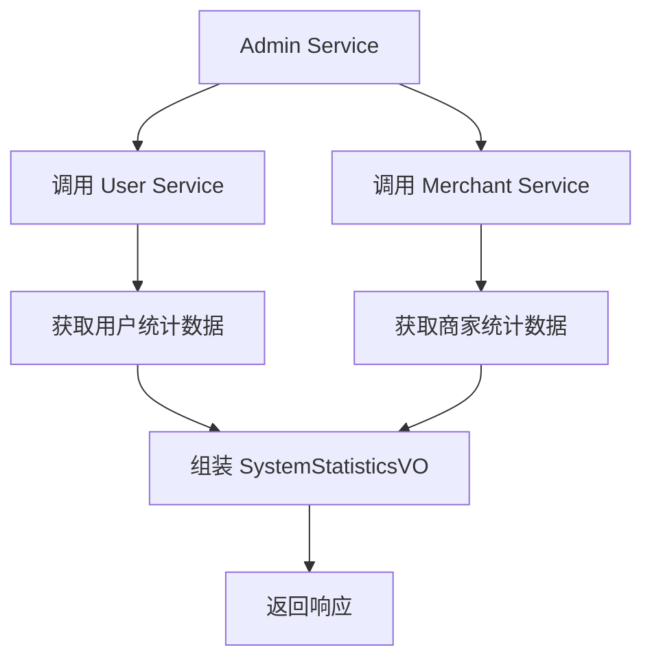
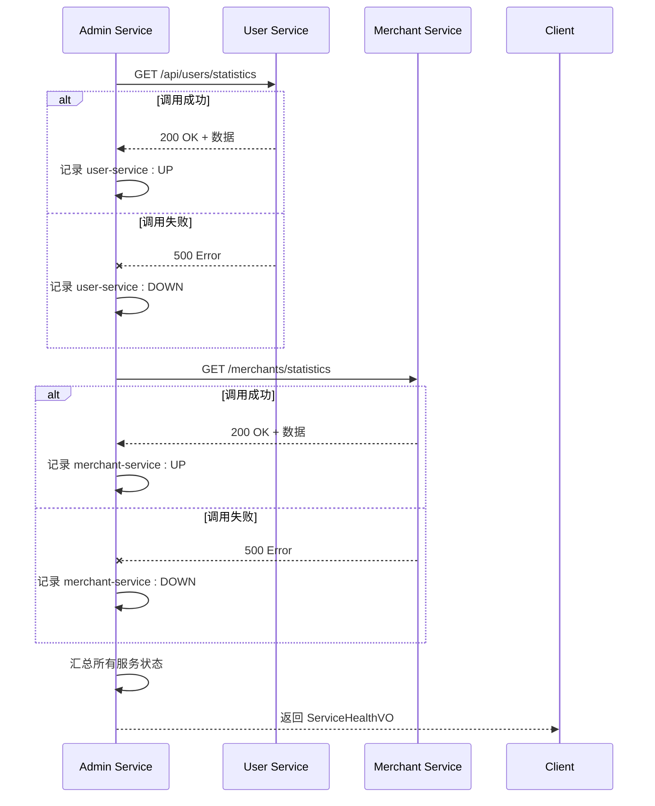

# 系统监控API

<cite>
**本文档引用文件**  
- [SystemMonitorController.java](file://backend/admin-service/src/main/java/com/mall/admin/controller/SystemMonitorController.java)
- [SystemStatisticsVO.java](file://backend/admin-service/src/main/java/com/mall/admin/domain/vo/SystemStatisticsVO.java)
- [ServiceHealthVO.java](file://backend/admin-service/src/main/java/com/mall/admin/domain/vo/ServiceHealthVO.java)
- [SystemMonitorServiceImpl.java](file://backend/admin-service/src/main/java/com/mall/admin/service/impl/SystemMonitorServiceImpl.java)
- [UserServiceClient.java](file://backend/admin-service/src/main/java/com/mall/admin/client/UserServiceClient.java)
- [MerchantServiceClient.java](file://backend/admin-service/src/main/java/com/mall/admin/client/MerchantServiceClient.java)
- [UserServiceImpl.java](file://backend/user-service/src/main/java/com/mall/user/service/impl/UserServiceImpl.java)
- [MerchantServiceImpl.java](file://backend/merchant-service/src/main/java/com/mall/merchant/service/impl/MerchantServiceImpl.java)
</cite>

## 目录
1. [简介](#简介)
2. [系统概览接口](#系统概览接口)
3. [服务健康状态接口](#服务健康状态接口)
4. [接口调用建议与性能考虑](#接口调用建议与性能考虑)
5. [监控数据在运维中的应用](#监控数据在运维中的应用)
6. [响应示例](#响应示例)
7. [故障排查](#故障排查)
8. [总结](#总结)

## 简介
本系统监控API为管理员提供系统运行状态的实时视图，包含业务数据统计和微服务健康检查两大核心功能。通过`GET /admin/system/overview`接口可获取用户、商家、订单等关键业务指标，通过`GET /admin/system/health`接口可检查各微服务的连通性与响应状态。这些接口是日常系统监控、性能分析和故障诊断的重要工具。

**Section sources**
- [SystemMonitorController.java](file://backend/admin-service/src/main/java/com/mall/admin/controller/SystemMonitorController.java#L12-L43)

## 系统概览接口

`GET /admin/system/overview` 接口返回 `SystemStatisticsVO` 对象，该对象封装了系统的核心业务统计数据，为管理员提供业务运营的宏观视图。

### SystemStatisticsVO 对象说明

`SystemStatisticsVO` 对象包含以下统计指标：

| 字段名 | 类型 | 说明 |
| :--- | :--- | :--- |
| `totalUsers` | `Long` | 系统中的总用户数 |
| `todayNewUsers` | `Long` | 今日新增用户数 |
| `activeUsers` | `Long` | 活跃用户数（通常指近期有登录或交易行为的用户） |
| `totalMerchants` | `Long` | 系统中的总商家数量 |
| `pendingMerchants` | `Long` | 待审核的商家数量 |
| `totalOrders` | `Long` | 系统中的总订单数量 |
| `todayOrders` | `Long` | 今日订单数量 |
| `totalRevenue` | `BigDecimal` | 系统历史累计总交易额 |
| `todayRevenue` | `BigDecimal` | 今日累计交易额 |

### 数据获取流程

该接口的数据并非直接从数据库查询，而是通过服务间调用聚合而来。其调用流程如下：



**Diagram sources**
- [SystemMonitorServiceImpl.java](file://backend/admin-service/src/main/java/com/mall/admin/service/impl/SystemMonitorServiceImpl.java#L30-L58)
- [UserServiceClient.java](file://backend/admin-service/src/main/java/com/mall/admin/client/UserServiceClient.java#L67-L68)
- [MerchantServiceClient.java](file://backend/admin-service/src/main/java/com/mall/admin/client/MerchantServiceClient.java#L64-L65)

**Section sources**
- [SystemStatisticsVO.java](file://backend/admin-service/src/main/java/com/mall/admin/domain/vo/SystemStatisticsVO.java#L5-L55)
- [SystemMonitorServiceImpl.java](file://backend/admin-service/src/main/java/com/mall/admin/service/impl/SystemMonitorServiceImpl.java#L30-L58)

## 服务健康状态接口

`GET /admin/system/health` 接口返回 `ServiceHealthVO` 对象，用于检查系统中各微服务的健康状态，是系统可用性监控的关键。

### ServiceHealthVO 对象说明

`ServiceHealthVO` 对象包含以下信息：

| 字段名 | 类型 | 说明 |
| :--- | :--- | :--- |
| `name` | `String` | 服务名称（在本实现中可能未填充） |
| `status` | `String` | 整体状态（UP/DOWN） |
| `responseTime` | `Long` | 响应时间（毫秒，在本实现中可能未填充） |
| `services` | `Map<String, String>` | 服务列表及其状态的映射，是核心信息 |

### 健康检查机制

该接口通过向下游服务发起实际的API调用来进行健康检查。如果调用成功，则认为服务健康（UP）；如果抛出异常，则认为服务不健康（DOWN）。



**Diagram sources**
- [SystemMonitorServiceImpl.java](file://backend/admin-service/src/main/java/com/mall/admin/service/impl/SystemMonitorServiceImpl.java#L61-L85)
- [UserServiceClient.java](file://backend/admin-service/src/main/java/com/mall/admin/client/UserServiceClient.java#L67-L68)
- [MerchantServiceClient.java](file://backend/admin-service/src/main/java/com/mall/admin/client/MerchantServiceClient.java#L64-L65)

**Section sources**
- [ServiceHealthVO.java](file://backend/admin-service/src/main/java/com/mall/admin/domain/vo/ServiceHealthVO.java#L5-L30)
- [SystemMonitorServiceImpl.java](file://backend/admin-service/src/main/java/com/mall/admin/service/impl/SystemMonitorServiceImpl.java#L61-L85)

## 接口调用建议与性能考虑

为确保系统稳定和监控数据的准确性，建议遵循以下调用策略：

- **调用频率**：建议将`/admin/system/overview`和`/admin/system/health`接口的调用频率控制在每5-10分钟一次。过于频繁的调用会增加`admin-service`、`user-service`和`merchant-service`的负载，尤其是在数据量大的情况下。
- **性能影响**：`/admin/system/overview`接口的性能主要取决于下游服务的响应速度。它会并行或串行调用用户服务和商家服务的统计接口。在高并发场景下，应考虑在`admin-service`中引入缓存机制，例如使用Redis缓存统计结果，缓存有效期可设置为5分钟，以减轻数据库压力。
- **错误处理**：当某个下游服务（如`user-service`）不可用时，`SystemMonitorServiceImpl`会捕获异常并记录错误日志，但不会中断整个流程。此时，`SystemStatisticsVO`中对应的用户统计数据将为0或null，而其他数据（如商家数据）仍能正常返回，保证了部分数据的可用性。

**Section sources**
- [SystemMonitorServiceImpl.java](file://backend/admin-service/src/main/java/com/mall/admin/service/impl/SystemMonitorServiceImpl.java#L34-L56)

## 监控数据在运维中的应用

这些监控接口在系统运维中扮演着至关重要的角色：

- **日常监控**：管理员可以通过定时任务或监控平台定期调用这些接口，生成系统健康报告。`SystemStatisticsVO`中的数据可用于绘制用户增长、订单量变化等业务趋势图。
- **故障排查**：当系统出现异常时，`/admin/system/health`接口是首要的诊断工具。通过检查`services`映射，可以快速定位是哪个微服务出现了问题。例如，如果`user-service`的状态为`DOWN`，则可以立即排查用户服务的数据库连接、JVM状态或网络问题。
- **容量规划**：长期积累的`SystemStatisticsVO`数据，如`totalUsers`和`totalOrders`的增长趋势，可以为数据库扩容、服务器资源升级等容量规划决策提供数据支持。

## 响应示例

### 系统概览响应示例

```json
{
  "code": 200,
  "message": "OK",
  "data": {
    "totalUsers": 15230,
    "todayNewUsers": 45,
    "activeUsers": 8921,
    "totalMerchants": 234,
    "pendingMerchants": 12,
    "totalOrders": 45678,
    "todayOrders": 231,
    "totalRevenue": "1234567.89",
    "todayRevenue": "8923.50"
  }
}
```

### 服务健康状态响应示例

```json
{
  "code": 200,
  "message": "OK",
  "data": {
    "name": "admin-service",
    "status": "UP",
    "responseTime": null,
    "services": {
      "user-service": "UP",
      "merchant-service": "UP"
    }
  }
}
```

一个服务宕机的示例：
```json
{
  "data": {
    "services": {
      "user-service": "DOWN",
      "merchant-service": "UP"
    }
  }
}
```

## 故障排查

当监控接口返回异常时，可按以下步骤进行排查：

1.  **检查`/admin/system/health`**：首先调用此接口，确认是哪个具体服务（如`user-service`）处于`DOWN`状态。
2.  **检查目标服务**：直接访问故障服务的健康检查端点（如果存在）或其主页面，确认服务进程是否在运行。
3.  **检查日志**：查看`admin-service`的日志，搜索`获取用户统计失败`或`获取商家统计失败`等错误信息，日志中会包含具体的异常堆栈，有助于定位问题根源（如数据库连接超时、网络不通等）。
4.  **检查依赖**：如果服务本身运行正常，检查其依赖项，如数据库、Redis、消息队列等是否可用。

**Section sources**
- [SystemMonitorServiceImpl.java](file://backend/admin-service/src/main/java/com/mall/admin/service/impl/SystemMonitorServiceImpl.java#L42-L44)
- [SystemMonitorServiceImpl.java](file://backend/admin-service/src/main/java/com/mall/admin/service/impl/SystemMonitorServiceImpl.java#L55-L56)

## 总结

系统监控API提供了强大的系统状态洞察力。`/admin/system/overview`接口为业务运营提供了数据支持，而`/admin/system/health`接口则是保障系统稳定性的技术基石。通过合理使用这些接口，管理员可以实现对系统的全面监控，及时发现并解决潜在问题，确保在线商城的平稳运行。