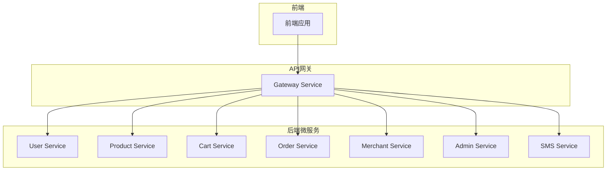
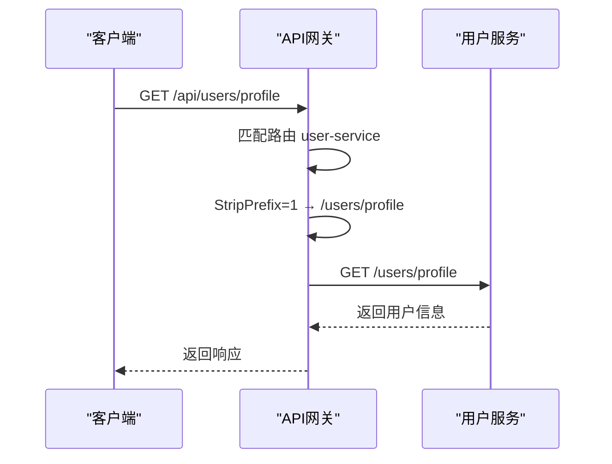
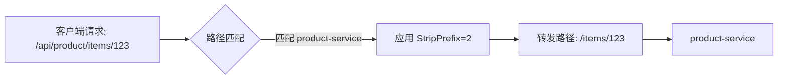
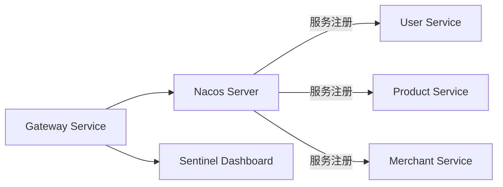

# 网关API

<cite>
**本文档引用的文件**  
- [application.yml](file://backend/gateway-service/src/main/resources/application.yml)
- [GatewayApplication.java](file://backend/gateway-service/src/main/java/com/mall/gateway/GatewayApplication.java)
- [application.yml](file://backend/auth-service/src/main/resources/application.yml)
- [application.yml](file://backend/admin-service/src/main/resources/application.yml)
- [application.yml](file://backend/user-service/src/main/resources/application.yml)
</cite>

## 目录
1. [简介](#简介)
2. [项目结构](#项目结构)
3. [核心组件](#核心组件)
4. [架构概览](#架构概览)
5. [详细组件分析](#详细组件分析)
6. [依赖分析](#依赖分析)
7. [性能考虑](#性能考虑)
8. [故障排除指南](#故障排除指南)
9. [结论](#结论)

## 简介
本文档旨在全面描述基于Spring Cloud Gateway构建的API网关服务，重点涵盖路由配置、过滤器规则、跨域资源共享（CORS）设置、Sentinel限流集成以及管理端点访问方式。通过解析`application.yml`中的`gateway.routes`配置，详细说明各微服务的路由ID、目标服务、路径匹配规则和前缀剥离策略。同时，解释全局CORS配置的安全含义，并提供客户端请求如何被网关路由至后端微服务的流程示例，帮助开发者深入理解网关工作机制与配置管理。

## 项目结构
网关服务位于`backend/gateway-service`目录下，是整个系统对外的统一入口。其主要职责包括请求路由、协议转换、安全控制、限流熔断等。网关通过Nacos实现服务发现，自动感知后端微服务实例的变化，并结合Spring Cloud Gateway的路由机制完成请求转发。



**Diagram sources**
- [application.yml](file://backend/gateway-service/src/main/resources/application.yml#L23-L111)

**Section sources**
- [application.yml](file://backend/gateway-service/src/main/resources/application.yml#L1-L151)
- [GatewayApplication.java](file://backend/gateway-service/src/main/java/com/mall/gateway/GatewayApplication.java#L1-L18)

## 核心组件
网关服务的核心功能由Spring Cloud Gateway提供，通过声明式配置实现灵活的路由与过滤机制。`GatewayApplication.java`作为启动类，启用服务发现功能，使网关能够从Nacos注册中心动态获取服务列表。`application.yml`中定义了所有路由规则、全局CORS策略、Sentinel集成及管理端点配置，构成了网关行为的基石。

**Section sources**
- [GatewayApplication.java](file://backend/gateway-service/src/main/java/com/mall/gateway/GatewayApplication.java#L1-L18)
- [application.yml](file://backend/gateway-service/src/main/resources/application.yml#L23-L111)

## 架构概览
API网关采用典型的微服务网关架构，位于客户端与后端微服务之间，承担请求入口、路由分发、安全校验、流量控制等职责。网关通过`spring.cloud.gateway.routes`配置静态路由规则，结合`discovery.locator.enabled=true`实现基于服务发现的动态路由。所有外部请求首先到达网关，经由路径匹配和过滤器处理后，转发至对应的目标微服务。



**Diagram sources**
- [application.yml](file://backend/gateway-service/src/main/resources/application.yml#L30-L35)
- [application.yml](file://backend/user-service/src/main/resources/application.yml#L1-L120)

## 详细组件分析

### 路由配置分析
网关通过`spring.cloud.gateway.routes`配置多个路由规则，每个规则包含ID、目标URI、断言（predicates）和过滤器（filters）。以下是主要路由的详细说明：

| 路由ID | 目标服务 | 路径匹配规则 | 前缀剥离规则 | 说明 |
|--------|----------|--------------|----------------|------|
| user-service | lb://user-service | /api/users/** | StripPrefix=1 | 用户服务主路由，剥离`/api`前缀 |
| user-service-compat | lb://user-service | /api/user-service/** | StripPrefix=2 | 兼容路由，剥离`/api/user-service`前缀 |
| product-service | lb://product-service | /api/product/** | StripPrefix=2 | 商品服务路由，剥离`/api/product`前缀 |
| cart-service | lb://cart-service | /api/cart/** | StripPrefix=2 | 购物车服务路由 |
| order-service | lb://order-service | /api/order/** | StripPrefix=2 | 订单服务路由 |
| merchant-service | lb://merchant-service | /api/merchant/** | StripPrefix=1 | 商家服务单数形式路由 |
| merchant-service-plural | lb://merchant-service | /api/merchants/** | StripPrefix=1 | 商家服务复数形式路由 |
| admin-service | lb://admin-service | /api/admin/** | StripPrefix=1 | 管理服务路由 |
| sms-service | lb://sms-service | /api/sms/** | StripPrefix=2 | 短信服务路由 |

**Section sources**
- [application.yml](file://backend/gateway-service/src/main/resources/application.yml#L29-L111)

### 过滤器规则
网关使用`StripPrefix`过滤器实现路径重写，确保转发到后端服务的请求路径正确。例如，当客户端请求`/api/users/profile`时，`user-service`路由的`StripPrefix=1`会移除第一个路径段`/api`，实际转发给用户服务的路径为`/users/profile`。对于`product-service`，`StripPrefix=2`会移除`/api/product`，保留后续路径。



**Diagram sources**
- [application.yml](file://backend/gateway-service/src/main/resources/application.yml#L46-L51)

### 跨域设置
网关通过`spring.cloud.gateway.globalcors`配置全局CORS策略，允许所有来源、方法和头部的跨域请求，适用于开发和测试环境。

```yaml
globalcors:
  cors-configurations:
    "[/**]":
      allowedOriginPatterns: "*"
      allowedMethods: "*"
      allowedHeaders: "*"
      allowCredentials: true
      exposedHeaders: "Content-Disposition,Content-Type,Cache-Control"
```

该配置表示：
- `allowedOriginPatterns: "*"`：允许所有域发起跨域请求
- `allowedMethods: "*"`：允许所有HTTP方法（GET、POST、PUT、DELETE等）
- `allowedHeaders: "*"`：允许所有请求头
- `allowCredentials: true`：允许携带凭据（如Cookie、Authorization头）
- `exposedHeaders`：指定客户端可访问的响应头

**安全考虑**：此配置在生产环境中存在安全风险，建议限制`allowedOriginPatterns`为受信任的前端域名，并根据实际需求明确指定`allowedMethods`和`allowedHeaders`。

**Section sources**
- [application.yml](file://backend/gateway-service/src/main/resources/application.yml#L112-L119)

## 依赖分析
网关服务依赖于Nacos进行服务注册与发现，通过`spring.cloud.nacos.discovery`配置连接本地Nacos服务器。同时，网关集成了Sentinel实现流量控制，配置了Sentinel Dashboard地址和Nacos数据源，用于动态管理限流规则。



**Diagram sources**
- [application.yml](file://backend/gateway-service/src/main/resources/application.yml#L14-L27)
- [application.yml](file://backend/gateway-service/src/main/resources/application.yml#L122-L132)

**Section sources**
- [application.yml](file://backend/gateway-service/src/main/resources/application.yml#L14-L27)
- [application.yml](file://backend/gateway-service/src/main/resources/application.yml#L122-L132)

## 性能考虑
- **日志级别**：网关配置了DEBUG级别的日志输出，有助于调试路由和过滤器行为，但在生产环境中应调整为INFO或WARN以减少I/O开销。
- **连接池**：后端服务（如admin-service）配置了HikariCP连接池，优化数据库访问性能。
- **缓存**：auth-service和user-service使用Redis存储令牌和会话信息，减轻数据库压力。
- **限流**：通过Sentinel集成，可在网关层面对特定路由或资源进行流量控制，防止突发流量导致服务雪崩。

## 故障排除指南
- **路由不生效**：检查`application.yml`中路由ID是否唯一，路径匹配规则是否正确，确保目标服务已注册到Nacos。
- **CORS错误**：确认`globalcors`配置已正确加载，检查浏览器控制台的预检请求（OPTIONS）响应头。
- **404错误**：验证请求路径是否匹配任一路由规则，注意`StripPrefix`对路径的影响。
- **服务不可达**：检查Nacos控制台，确认目标服务实例健康且网关能正常发现服务。
- **Sentinel未生效**：确保Sentinel Dashboard运行正常，检查`spring.cloud.sentinel.datasource`配置的数据ID和组ID是否匹配。

**Section sources**
- [application.yml](file://backend/gateway-service/src/main/resources/application.yml#L135-L140)
- [application.yml](file://backend/admin-service/src/main/resources/application.yml#L74-L79)
- [application.yml](file://backend/auth-service/src/main/resources/application.yml#L62-L67)

## 结论
API网关作为系统的统一入口，通过灵活的路由配置、强大的过滤器机制和全局CORS支持，有效解耦了前端应用与后端微服务。结合Nacos服务发现和Sentinel流量治理，实现了高可用、易扩展的微服务架构。开发者应理解各路由规则的匹配逻辑和前缀剥离行为，合理配置CORS策略，并利用管理端点和Sentinel Dashboard进行监控与调优，确保网关稳定高效运行。