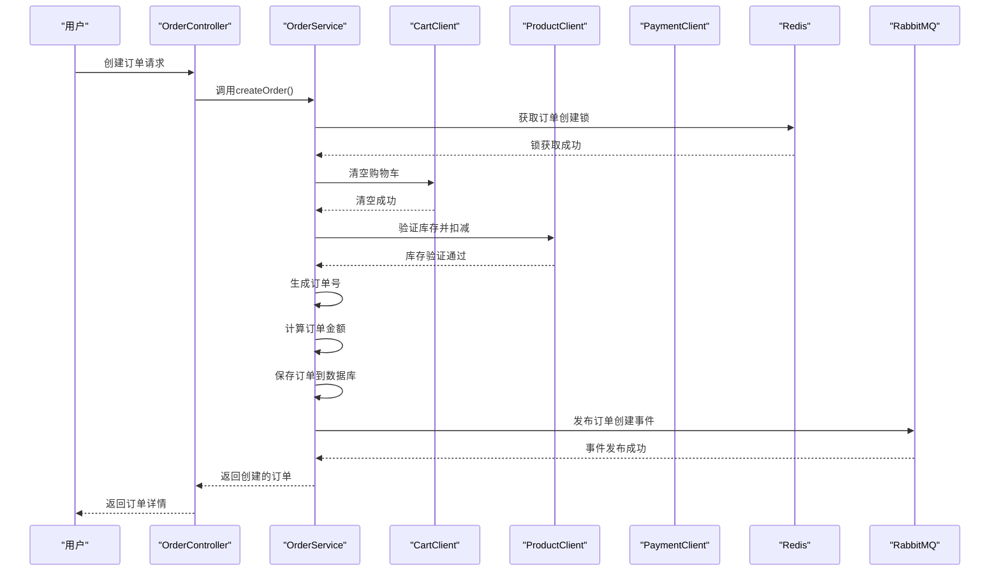
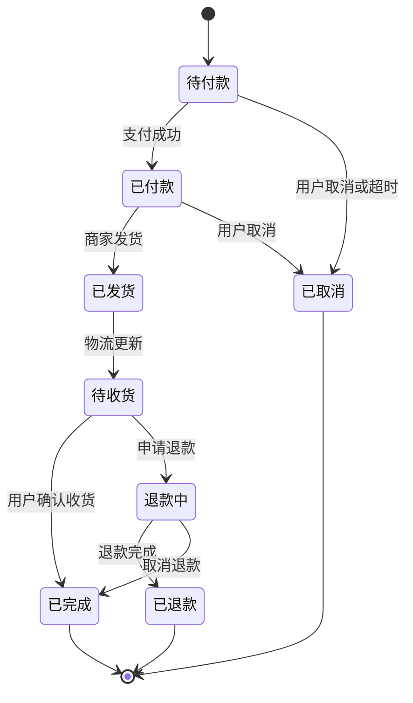
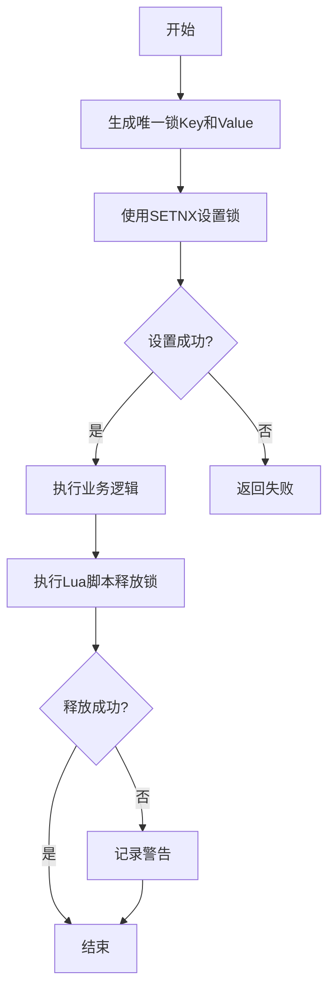

# 订单服务API

<cite>
**本文档引用文件**   
- [OrderController.java](file://backend/order-service/src/main/java/com/mall/order/controller/OrderController.java)
- [CreateOrderRequest.java](file://backend/order-service/src/main/java/com/mall/order/dto/CreateOrderRequest.java)
- [OrderDTO.java](file://backend/order-service/src/main/java/com/mall/order/dto/OrderDTO.java)
- [OrderItemDTO.java](file://backend/order-service/src/main/java/com/mall/order/dto/OrderItemDTO.java)
- [OrderStatus.java](file://backend/order-service/src/main/java/com/mall/order/enums/OrderStatus.java)
- [DistributedLockService.java](file://backend/order-service/src/main/java/com/mall/order/service/DistributedLockService.java)
- [OrderServiceImpl.java](file://backend/order-service/src/main/java/com/mall/order/service/impl/OrderServiceImpl.java)
- [OrderEvent.java](file://backend/order-service/src/main/java/com/mall/order/event/OrderEvent.java)
- [OrderEventType.java](file://backend/order-service/src/main/java/com/mall/order/event/OrderEventType.java)
- [OrderEventPublisher.java](file://backend/order-service/src/main/java/com/mall/order/event/OrderEventPublisher.java)
- [数据字典.md](file://数据字典.md)
</cite>

## 目录
1. [简介](#简介)
2. [API概览](#api概览)
3. [核心数据结构](#核心数据结构)
4. [订单创建流程](#订单创建流程)
5. [订单状态机](#订单状态机)
6. [分布式事务与库存扣减](#分布式事务与库存扣减)
7. [API详细规格](#api详细规格)
8. [请求示例](#请求示例)
9. [错误处理](#错误处理)
10. [性能与安全](#性能与安全)

## 简介
订单服务是电商平台的核心模块，负责处理用户从下单到收货的完整生命周期管理。本服务提供RESTful API接口，支持订单创建、查询、状态更新、支付、退款等关键功能。系统采用分布式架构，通过Redis实现分布式锁，RabbitMQ实现事件驱动，确保高并发场景下的数据一致性和系统可靠性。

**Section sources**
- [OrderController.java](file://backend/order-service/src/main/java/com/mall/order/controller/OrderController.java#L1-L251)

## API概览
订单服务提供以下核心API端点：

| 端点 | 方法 | 描述 |
|------|------|------|
| `/orders` | POST | 创建新订单 |
| `/orders` | GET | 获取订单列表 |
| `/orders/{id}` | GET | 获取订单详情 |
| `/orders/{id}/cancel` | PUT | 取消订单 |
| `/orders/{id}/confirm` | PUT | 确认收货 |
| `/orders/{id}/refund` | POST | 申请退款 |
| `/orders/{id}/pay` | POST | 发起支付 |
| `/orders/stats` | GET | 获取订单统计 |

所有API均返回统一的响应格式，包含状态码、消息和数据体。

**Section sources**
- [OrderController.java](file://backend/order-service/src/main/java/com/mall/order/controller/OrderController.java#L15-L251)

## 核心数据结构

### OrderDTO
订单数据传输对象，用于订单信息的传输和展示。

**字段说明：**
- `id`: 订单ID
- `orderNo`: 订单号
- `userId`: 用户ID
- `status`: 订单状态
- `statusDesc`: 订单状态描述
- `totalAmount`: 商品总金额
- `shippingFee`: 运费
- `discountAmount`: 优惠金额
- `payableAmount`: 应付金额
- `receiverName`: 收货人姓名
- `receiverPhone`: 收货人电话
- `receiverAddress`: 收货地址

### OrderItemDTO
订单项数据传输对象，表示订单中的具体商品项。

**字段说明：**
- `id`: 订单项ID
- `orderId`: 订单ID
- `productId`: 商品ID
- `productName`: 商品名称
- `productImage`: 商品图片
- `productSpec`: 商品规格
- `unitPrice`: 商品单价
- `quantity`: 购买数量
- `subtotal`: 小计金额

### CreateOrderRequest
创建订单请求DTO，用于接收前端创建订单的请求参数。

**字段说明：**
- `userId`: 用户ID（必填）
- `receiverName`: 收货人姓名（必填）
- `receiverPhone`: 收货人电话（必填）
- `receiverAddress`: 收货地址（必填）
- `shippingFee`: 运费
- `discountAmount`: 优惠金额
- `remark`: 订单备注
- `orderItems`: 订单项列表（必填）

**Section sources**
- [OrderDTO.java](file://backend/order-service/src/main/java/com/mall/order/dto/OrderDTO.java#L1-L79)
- [OrderItemDTO.java](file://backend/order-service/src/main/java/com/mall/order/dto/OrderItemDTO.java#L1-L62)
- [CreateOrderRequest.java](file://backend/order-service/src/main/java/com/mall/order/dto/CreateOrderRequest.java#L1-L94)

## 订单创建流程
订单创建是一个复杂的分布式事务过程，涉及多个服务的协同工作。



**Diagram sources**
- [OrderController.java](file://backend/order-service/src/main/java/com/mall/order/controller/OrderController.java#L98-L104)
- [OrderServiceImpl.java](file://backend/order-service/src/main/java/com/mall/order/service/impl/OrderServiceImpl.java#L1-L917)
- [DistributedLockService.java](file://backend/order-service/src/main/java/com/mall/order/service/DistributedLockService.java#L1-L161)
- [OrderEventPublisher.java](file://backend/order-service/src/main/java/com/mall/order/event/OrderEventPublisher.java#L1-L88)

## 订单状态机
订单在整个生命周期中会经历多种状态转换，系统通过状态机严格控制状态变更。



**状态转换规则：**
- **待付款 → 已付款**：用户完成支付
- **待付款 → 已取消**：用户主动取消或订单超时
- **已付款 → 已发货**：商家处理订单并发货
- **已发货 → 待收货**：物流系统更新配送状态
- **待收货 → 已完成**：用户确认收货
- **待收货 → 退款中**：用户申请退款
- **退款中 → 已退款**：退款流程完成
- **退款中 → 已完成**：用户取消退款申请

**Section sources**
- [OrderStatus.java](file://backend/order-service/src/main/java/com/mall/order/enums/OrderStatus.java#L1-L113)
- [OrderServiceImpl.java](file://backend/order-service/src/main/java/com/mall/order/service/impl/OrderServiceImpl.java#L333-L424)

## 分布式事务与库存扣减
为确保高并发场景下的数据一致性，系统采用分布式锁和事件驱动机制来保证事务的原子性。

### 分布式锁机制
系统基于Redis实现分布式锁，防止并发操作导致的数据不一致问题。



**关键特性：**
- 使用`SETNX`命令确保锁的互斥性
- 设置过期时间防止死锁
- 使用Lua脚本保证释放锁的原子性
- 锁Key包含业务标识，如`lock:order:create:123`

### 库存扣减原子性
库存扣减通过以下机制保证原子性：

1. **预扣减机制**：在订单创建时调用商品服务进行库存预扣减
2. **分布式事务**：使用RabbitMQ事件驱动，确保订单创建和库存扣减的最终一致性
3. **补偿机制**：订单取消时自动释放预扣减的库存

**Section sources**
- [DistributedLockService.java](file://backend/order-service/src/main/java/com/mall/order/service/DistributedLockService.java#L1-L161)
- [OrderServiceImpl.java](file://backend/order-service/src/main/java/com/mall/order/service/impl/OrderServiceImpl.java#L1-L917)
- [OrderEvent.java](file://backend/order-service/src/main/java/com/mall/order/event/OrderEvent.java#L1-L146)

## API详细规格

### 创建订单
创建新订单，需提供完整的订单信息。

**端点：** `POST /orders`

**请求体：**
```json
{
  "userId": 123,
  "receiverName": "张三",
  "receiverPhone": "13800138000",
  "receiverAddress": "北京市朝阳区xxx街道",
  "shippingFee": 10.00,
  "discountAmount": 5.00,
  "remark": "请尽快发货",
  "orderItems": [
    {
      "productId": 456,
      "productSpec": "红色, XL",
      "quantity": 2
    }
  ]
}
```

**响应：**
```json
{
  "code": 200,
  "msg": "操作成功",
  "data": {
    "id": 789,
    "orderNo": "ORD20250121000001",
    "userId": 123,
    "status": "pending",
    "statusDesc": "待付款",
    "totalAmount": 195.00,
    "shippingFee": 10.00,
    "discountAmount": 5.00,
    "payableAmount": 190.00,
    "receiverName": "张三",
    "receiverPhone": "13800138000",
    "receiverAddress": "北京市朝阳区xxx街道"
  }
}
```

**Section sources**
- [OrderController.java](file://backend/order-service/src/main/java/com/mall/order/controller/OrderController.java#L98-L104)
- [CreateOrderRequest.java](file://backend/order-service/src/main/java/com/mall/order/dto/CreateOrderRequest.java#L1-L94)

### 获取订单列表
分页查询用户的订单列表，支持按状态筛选。

**端点：** `GET /orders`

**查询参数：**
- `userId`: 用户ID（必填）
- `status`: 订单状态（可选）
- `page`: 页码，从0开始（默认0）
- `size`: 每页大小（默认10）

**响应：**
```json
{
  "code": 200,
  "msg": "操作成功",
  "data": {
    "content": [...],
    "totalElements": 15,
    "totalPages": 2,
    "size": 10,
    "number": 0,
    "first": true,
    "last": false,
    "empty": false
  }
}
```

**Section sources**
- [OrderController.java](file://backend/order-service/src/main/java/com/mall/order/controller/OrderController.java#L45-L75)

### 获取订单详情
根据订单ID获取订单的详细信息。

**端点：** `GET /orders/{id}`

**查询参数：**
- `userId`: 用户ID

**响应：**
```json
{
  "code": 200,
  "msg": "操作成功",
  "data": {
    "id": 789,
    "orderNo": "ORD20250121000001",
    "userId": 123,
    "status": "pending",
    "statusDesc": "待付款",
    "totalAmount": 195.00,
    "shippingFee": 10.00,
    "discountAmount": 5.00,
    "payableAmount": 190.00,
    "receiverName": "张三",
    "receiverPhone": "13800138000",
    "receiverAddress": "北京市朝阳区xxx街道"
  }
}
```

**Section sources**
- [OrderController.java](file://backend/order-service/src/main/java/com/mall/order/controller/OrderController.java#L84-L90)

### 取消订单
取消指定订单，需提供用户ID和取消原因。

**端点：** `PUT /orders/{id}/cancel`

**查询参数：**
- `userId`: 用户ID
- `reason`: 取消原因（可选）

**响应：**
```json
{
  "code": 200,
  "msg": "操作成功",
  "data": true
}
```

**Section sources**
- [OrderController.java](file://backend/order-service/src/main/java/com/mall/order/controller/OrderController.java#L114-L124)

### 确认收货
用户确认收到商品，订单状态变更为已完成。

**端点：** `PUT /orders/{id}/confirm`

**查询参数：**
- `userId`: 用户ID

**响应：**
```json
{
  "code": 200,
  "msg": "操作成功",
  "data": true
}
```

**Section sources**
- [OrderController.java](file://backend/order-service/src/main/java/com/mall/order/controller/OrderController.java#L133-L142)

## 请求示例

### 创建订单完整示例
```json
{
  "userId": 1001,
  "receiverName": "李四",
  "receiverPhone": "13900139000",
  "receiverAddress": "上海市浦东新区陆家嘴金融中心1号",
  "shippingFee": 8.00,
  "discountAmount": 0.00,
  "remark": "工作日请放快递柜",
  "orderItems": [
    {
      "productId": 2001,
      "productSpec": "黑色, 128GB",
      "quantity": 1
    },
    {
      "productId": 2002,
      "productSpec": "白色, 64GB",
      "quantity": 2
    }
  ]
}
```

### 订单状态转换示例
1. **创建订单后**：状态为`待付款`
2. **支付成功后**：状态变为`已付款`
3. **商家发货后**：状态变为`已发货`
4. **用户确认收货后**：状态变为`已完成`

**Section sources**
- [OrderController.java](file://backend/order-service/src/main/java/com/mall/order/controller/OrderController.java#L98-L104)
- [OrderStatus.java](file://backend/order-service/src/main/java/com/mall/order/enums/OrderStatus.java#L1-L113)

## 错误处理
系统定义了统一的错误处理机制，常见错误码如下：

| 错误码 | 描述 | 可能原因 |
|--------|------|----------|
| 400 | 请求参数错误 | 缺少必填字段或字段格式不正确 |
| 404 | 资源未找到 | 订单ID不存在或用户无权访问 |
| 409 | 状态冲突 | 订单状态不允许当前操作 |
| 429 | 请求过于频繁 | 分布式锁获取失败 |
| 500 | 服务器内部错误 | 系统异常或数据库错误 |

**异常处理策略：**
- 使用`@Valid`注解进行请求参数校验
- 自定义异常处理器统一处理业务异常
- 记录详细日志便于问题排查

**Section sources**
- [OrderController.java](file://backend/order-service/src/main/java/com/mall/order/controller/OrderController.java#L27-L31)
- [OrderServiceImpl.java](file://backend/order-service/src/main/java/com/mall/order/service/impl/OrderServiceImpl.java#L1-L917)

## 性能与安全

### 性能优化
- **缓存策略**：使用Redis缓存订单详情和用户订单列表
- **分页查询**：大列表查询采用分页机制
- **异步处理**：非核心流程（如日志记录、事件发布）采用异步方式
- **数据库索引**：为常用查询字段建立索引

### 安全措施
- **身份验证**：所有API需通过JWT验证用户身份
- **权限控制**：用户只能操作自己的订单
- **防重放攻击**：使用分布式锁防止重复提交
- **数据校验**：严格校验请求参数，防止恶意数据

**Section sources**
- [OrderController.java](file://backend/order-service/src/main/java/com/mall/order/controller/OrderController.java#L27-L31)
- [DistributedLockService.java](file://backend/order-service/src/main/java/com/mall/order/service/DistributedLockService.java#L1-L161)