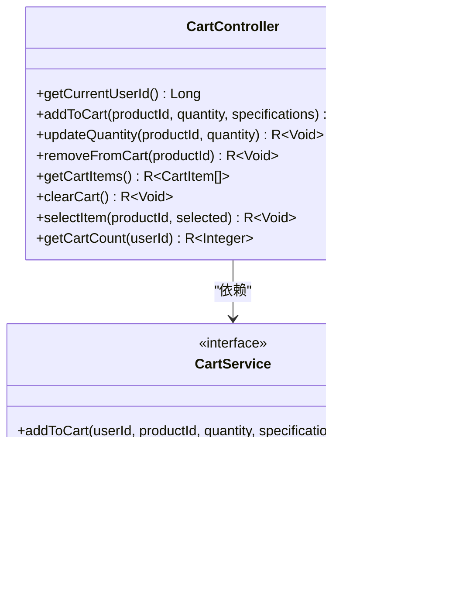

# 购物车服务API

<cite>
**本文档引用文件**   
- [CartController.java](file://backend/cart-service/src/main/java/com/mall/cart/controller/CartController.java)
- [CartItem.java](file://backend/cart-service/src/main/java/com/mall/cart/domain/entity/CartItem.java)
- [CartServiceImpl.java](file://backend/cart-service/src/main/java/com/mall/cart/service/impl/CartServiceImpl.java)
- [RedisConfig.java](file://backend/cart-service/src/main/java/com/mall/cart/config/RedisConfig.java)
- [CartSyncService.java](file://backend/cart-service/src/main/java/com/mall/cart/service/CartSyncService.java)
- [数据字典.md](file://数据字典.md)
</cite>

## 目录
1. [简介](#简介)
2. [项目结构](#项目结构)
3. [核心组件](#核心组件)
4. [架构概述](#架构概述)
5. [详细组件分析](#详细组件分析)
6. [依赖分析](#依赖分析)
7. [性能考虑](#性能考虑)
8. [故障排除指南](#故障排除指南)
9. [结论](#结论)

## 简介
本文档详细描述了购物车服务的API接口，包括添加、删除、更新和查询购物车项的功能。基于CartController中的REST端点，记录了添加商品到购物车、更新商品数量、删除购物车项、获取购物车详情等API的请求响应格式。同时说明了CartItem实体的关键字段和Redis存储策略，并提供了购物车合并（用户登录后）的实现逻辑和性能优化建议，帮助开发者理解购物车功能的API集成和数据一致性保障。

## 项目结构
购物车服务位于`backend/cart-service`目录下，主要包含以下结构：
- `src/main/java/com/mall/cart/controller`：控制器层，处理HTTP请求
- `src/main/java/com/mall/cart/domain/entity`：实体类定义
- `src/main/java/com/mall/cart/service`：服务接口与实现
- `src/main/java/com/mall/cart/config`：配置类，如Redis配置
- `src/main/resources`：资源配置文件

**Diagram sources**
- [CartController.java](file://backend/cart-service/src/main/java/com/mall/cart/controller/CartController.java#L20-L149)
- [CartItem.java](file://backend/cart-service/src/main/java/com/mall/cart/domain/entity/CartItem.java#L8-L62)

## 核心组件
购物车服务的核心组件包括CartController、CartItem实体类、CartService服务接口及其实现类CartServiceImpl。这些组件共同实现了购物车的基本功能，如添加商品、更新数量、删除商品、获取购物车列表等。

**Section sources**
- [CartController.java](file://backend/cart-service/src/main/java/com/mall/cart/controller/CartController.java#L20-L149)
- [CartItem.java](file://backend/cart-service/src/main/java/com/mall/cart/domain/entity/CartItem.java#L8-L62)
- [CartServiceImpl.java](file://backend/cart-service/src/main/java/com/mall/cart/service/impl/CartServiceImpl.java#L20-L491)

## 架构概述
购物车服务采用基于Redis的存储策略，将用户的购物车数据存储在Redis中，以提高读写性能。当用户未登录时，购物车数据存储在浏览器的LocalStorage中；用户登录后，前端会调用购物车合并接口，将LocalStorage中的数据同步到Redis中。

**Diagram sources**
- [CartController.java](file://backend/cart-service/src/main/java/com/mall/cart/controller/CartController.java#L20-L149)
- [CartServiceImpl.java](file://backend/cart-service/src/main/java/com/mall/cart/service/impl/CartServiceImpl.java#L20-L491)
- [RedisConfig.java](file://backend/cart-service/src/main/java/com/mall/cart/config/RedisConfig.java#L21-L55)

## 详细组件分析

### CartController分析
CartController是购物车服务的入口，负责处理所有与购物车相关的HTTP请求。它通过调用CartService来完成具体的业务逻辑。

#### API接口说明
| 接口 | 方法 | 描述 |
| --- | --- | --- |
| `/cart/add` | POST | 添加商品到购物车 |
| `/cart/update` | PUT | 更新购物车商品数量 |
| `/cart/remove` | DELETE | 从购物车删除商品 |
| `/cart/list` | GET | 获取用户购物车列表 |
| `/cart/clear` | DELETE | 清空购物车 |
| `/cart/select` | PUT | 选中/取消选中购物车商品 |
| `/cart/count` | GET | 获取购物车商品数量 |

**Diagram sources**
- [CartController.java](file://backend/cart-service/src/main/java/com/mall/cart/controller/CartController.java#L20-L149)
- [CartService.java](file://backend/cart-service/src/main/java/com/mall/cart/service/CartService.java#L7-L79)

### CartItem实体分析
CartItem实体类表示购物车中的一个商品项，包含了商品的基本信息，如商品ID、名称、价格、数量等。

**Diagram sources**
- [CartItem.java](file://backend/cart-service/src/main/java/com/mall/cart/domain/entity/CartItem.java#L8-L62)

### Redis存储策略
购物车数据存储在Redis中，使用Hash结构来存储每个用户的购物车信息。Key的格式为`cart:{userId}`，Field为`{productId}:{specifications}`，Value为序列化的CartItem对象。

**Diagram sources**
- [RedisConfig.java](file://backend/cart-service/src/main/java/com/mall/cart/config/RedisConfig.java#L21-L55)
- [CartServiceImpl.java](file://backend/cart-service/src/main/java/com/mall/cart/service/impl/CartServiceImpl.java#L35-L36)

## 依赖分析
购物车服务依赖于商品服务（product-service），通过Feign客户端调用商品服务的接口来获取商品信息。此外，购物车服务还依赖于Redis作为数据存储。

**Diagram sources**
- [CartServiceImpl.java](file://backend/cart-service/src/main/java/com/mall/cart/service/impl/CartServiceImpl.java#L41-L42)
- [ProductClient.java](file://backend/cart-service/src/main/java/com/mall/cart/client/ProductClient.java)

## 性能考虑
为了提高性能，购物车服务采用了以下优化措施：
1. 使用Redis作为缓存，减少数据库访问。
2. 在获取购物车列表时，批量获取商品信息，减少网络请求次数。
3. 设置合理的Redis过期时间，避免内存占用过高。

**Section sources**
- [CartServiceImpl.java](file://backend/cart-service/src/main/java/com/mall/cart/service/impl/CartServiceImpl.java#L36-L37)
- [RedisConfig.java](file://backend/cart-service/src/main/java/com/mall/cart/config/RedisConfig.java#L21-L55)

## 故障排除指南
### 常见问题
1. **购物车数据不同步**：检查用户登录状态，确保登录后调用购物车合并接口。
2. **商品信息不一致**：检查商品服务是否正常运行，确保商品信息能够正确获取。
3. **Redis连接失败**：检查Redis配置是否正确，确保Redis服务正常运行。

**Section sources**
- [CartServiceImpl.java](file://backend/cart-service/src/main/java/com/mall/cart/service/impl/CartServiceImpl.java)
- [RedisConfig.java](file://backend/cart-service/src/main/java/com/mall/cart/config/RedisConfig.java)

## 结论
购物车服务通过Redis实现了高性能的数据存储和访问，结合前端的LocalStorage，提供了良好的用户体验。通过合理的API设计和数据一致性保障机制，确保了购物车功能的稳定性和可靠性。未来可以进一步优化缓存策略，提升系统性能。