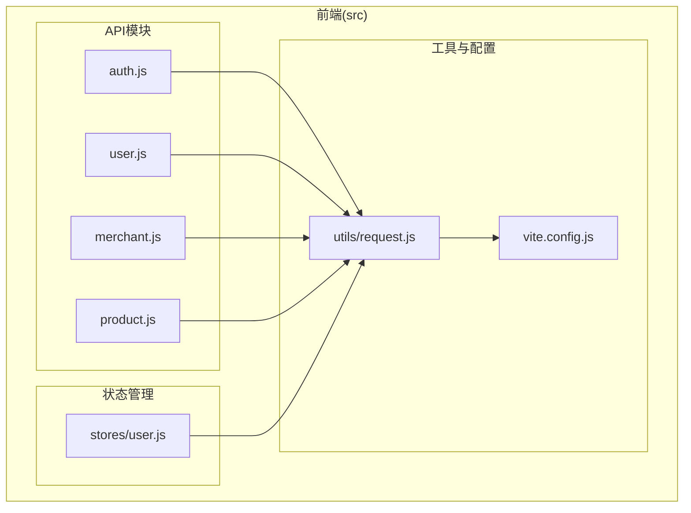
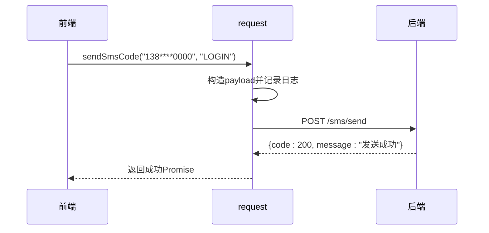
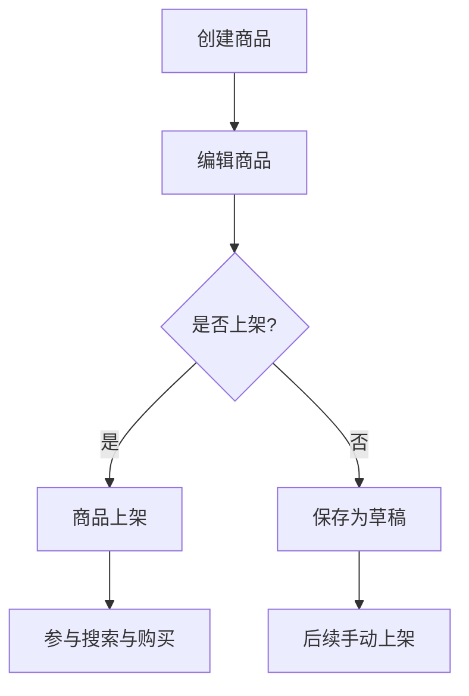
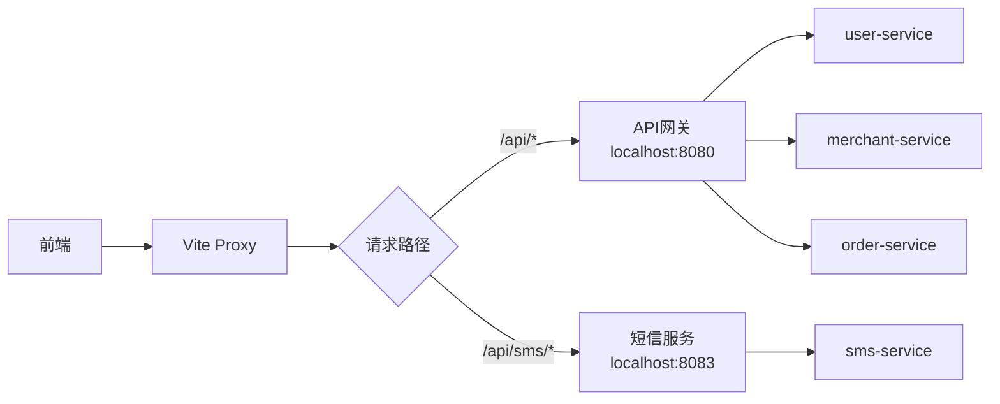

# API集成

<cite>
**本文档引用文件**  
- [request.js](file://frontend/src/utils/request.js)
- [vite.config.js](file://frontend/vite.config.js)
- [auth.js](file://frontend/src/api/auth.js)
- [user.js](file://frontend/src/api/user.js)
- [merchant.js](file://frontend/src/api/merchant.js)
- [product.js](file://frontend/src/api/merchant/product.js)
</cite>

## 目录
1. [项目结构](#项目结构)
2. [Axios封装与拦截器机制](#axios封装与拦截器机制)
3. [API服务模块定义与调用规范](#api服务模块定义与调用规范)
4. [Vite代理配置与微服务路由](#vite代理配置与微服务路由)
5. [API调用最佳实践](#api调用最佳实践)

## 项目结构

前端API相关代码组织清晰，遵循模块化设计原则。核心通信逻辑集中在`utils`目录下，接口定义按业务划分在`api`目录中。

**图示来源**  
- [request.js](file://frontend/src/utils/request.js)
- [vite.config.js](file://frontend/vite.config.js)
- [auth.js](file://frontend/src/api/auth.js)

## Axios封装与拦截器机制

### 请求拦截器：认证与安全注入

请求拦截器负责在发出请求前自动注入认证信息和安全令牌。通过`useUserStore()`获取当前用户状态，并根据请求路径判断是否需要添加JWT令牌。

对于非公开路径（如用户信息、订单操作等），若存在有效token，则自动在请求头中添加`Authorization: Bearer <token>`字段。公开路径（如登录、注册、短信发送）则跳过此步骤。

同时，为防止跨站请求伪造（CSRF），对`POST`、`PUT`、`PATCH`、`DELETE`等变更类请求，自动从Cookie中提取CSRF令牌并注入`X-CSRF-TOKEN`和`X-XSRF-TOKEN`两个标准头字段，提升后端兼容性。

此外，每个请求都会生成唯一的`X-Request-ID`，用于后端日志追踪和问题排查。

**代码路径**  
- `frontend/src/utils/request.js` 中 `service.interceptors.request.use`

**本节来源**  
- [request.js](file://frontend/src/utils/request.js#L35-L115)

### 响应拦截器：统一错误处理与Token刷新

响应拦截器对后端返回的数据进行统一处理，识别业务状态码并做出相应响应。

当收到`code: 401`或`success: false`的响应时，判定为认证失效或业务失败。对于401状态，调用`handleTokenExpired()`方法弹出重新登录提示框，并在用户确认后清除本地状态并跳转至首页。

拦截器还支持非标准响应格式的兼容处理。例如，当后端仅返回`{message: "操作成功"}`而无`code`字段时，前端会根据消息内容自动识别是否为成功响应，并转换为统一的成功格式对象。

针对不同HTTP状态码（400、403、404、500等），拦截器会自动弹出对应的Element Plus消息提示，提升用户体验。对于非关键性API（如购物车、商品浏览），401和404错误将被静默处理，避免频繁打扰用户。

**代码路径**  
- `frontend/src/utils/request.js` 中 `service.interceptors.response.use`

**本节来源**  
- [request.js](file://frontend/src/utils/request.js#L119-L254)

## API服务模块定义与调用规范

### 认证与用户服务（auth.js, user.js）

`auth.js`封装了用户认证相关接口，包括注册、登录、登出、刷新令牌以及短信验证码的发送与验证。其中`sendSmsCode`函数支持两种调用方式：位置参数（手机号, 用途）和对象参数（{phoneNumber, purpose}），增强了调用灵活性。

`user.js`定义了用户信息管理接口，如获取/更新个人资料、修改密码、绑定/解绑手机邮箱、上传头像等。特别说明：当前后端未实现文件上传端点，建议将图片转为Base64后通过`updateUserProfile`提交。

**本节来源**  
- [auth.js](file://frontend/src/api/auth.js#L10-L100)
- [user.js](file://frontend/src/api/user.js#L13-L177)

### 商家服务（merchant.js, product.js）

`merchant.js`提供商家入驻申请、登录、审批等管理接口。`product.js`则专注于商家商品全生命周期管理，包含创建、更新、上下架、库存管理、统计分析等功能。

所有商品操作均需传递`merchantId`作为查询参数，确保数据隔离与权限控制。支持批量操作（如批量上下架、批量删除、批量更新库存），提升管理效率。

**本节来源**  
- [merchant.js](file://frontend/src/api/merchant.js#L12-L72)
- [product.js](file://frontend/src/api/merchant/product.js#L13-L302)

## Vite代理配置与微服务路由

Vite开发服务器通过代理机制解决跨域问题，并将前端请求路由至后端微服务网关。

默认配置下，所有以`/api`开头的请求均被代理至`http://localhost:8080`（API网关服务）。网关根据路径前缀（如`/user-service`、`/merchant-service`）将请求转发至对应微服务实例，实现统一入口与服务发现。

为支持本地联调，配置了针对短信服务的直连代理规则：`/api/sms`请求将被重写为`/sms`并直接转发至`http://localhost:8083`（短信服务独立端口），避免因网关未启动导致验证码功能不可用。

**本节来源**  
- [vite.config.js](file://frontend/vite.config.js#L42-L56)

## API调用最佳实践

### 错误处理

- **全局拦截**：依赖`request.js`中的响应拦截器进行统一错误提示，避免在业务组件中重复编写`catch`逻辑。
- **静默失败**：对非关键性API（如购物车加载、商品推荐）的失败请求，可选择不弹出错误提示，保持界面流畅。
- **结构化日志**：利用`logger.debug/info/warn/error`记录关键请求与响应，便于调试与监控。

### 加载状态管理

- **组件级加载**：在调用API前后手动控制`loading`状态，避免重复提交。
- **全局加载指示器**：可通过Pinia状态管理全局加载状态，在`request.js`中注入请求计数器。

### 并发控制

- **防抖与节流**：对频繁触发的请求（如搜索、滚动加载）使用防抖或节流函数限制频率。
- **取消重复请求**：利用Axios的CancelToken机制，在发起新请求时取消未完成的旧请求，防止数据错乱。

**本节来源**  
- [request.js](file://frontend/src/utils/request.js)
- [vite.config.js](file://frontend/vite.config.js)
- [auth.js](file://frontend/src/api/auth.js)
- [user.js](file://frontend/src/api/user.js)
- [merchant.js](file://frontend/src/api/merchant.js)