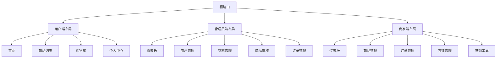
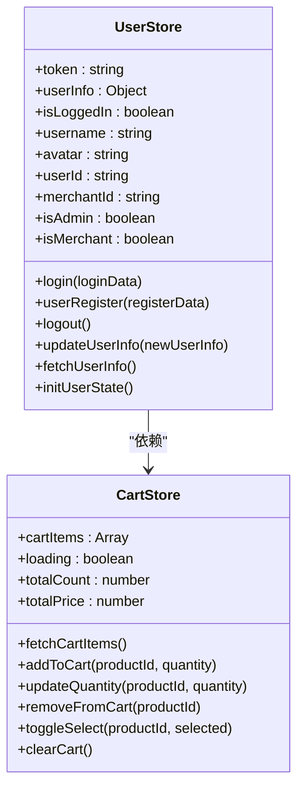
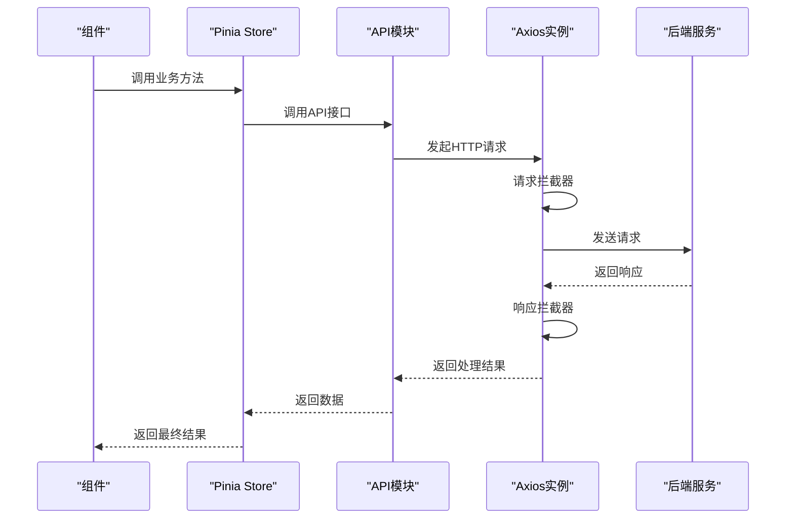
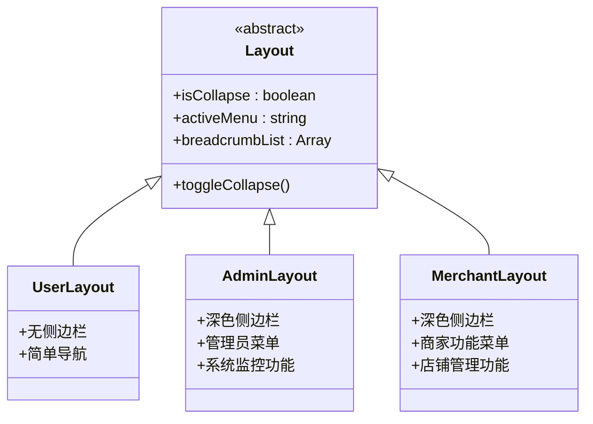
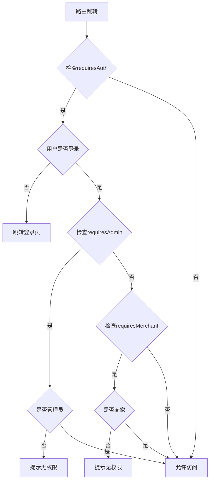
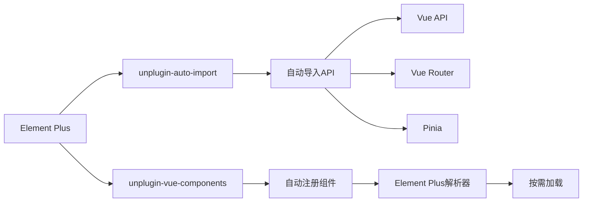
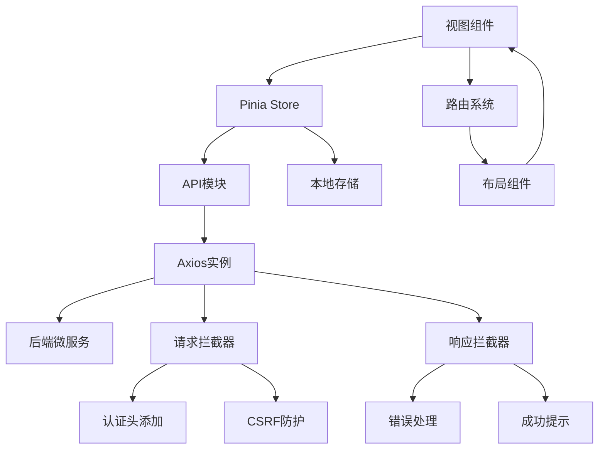
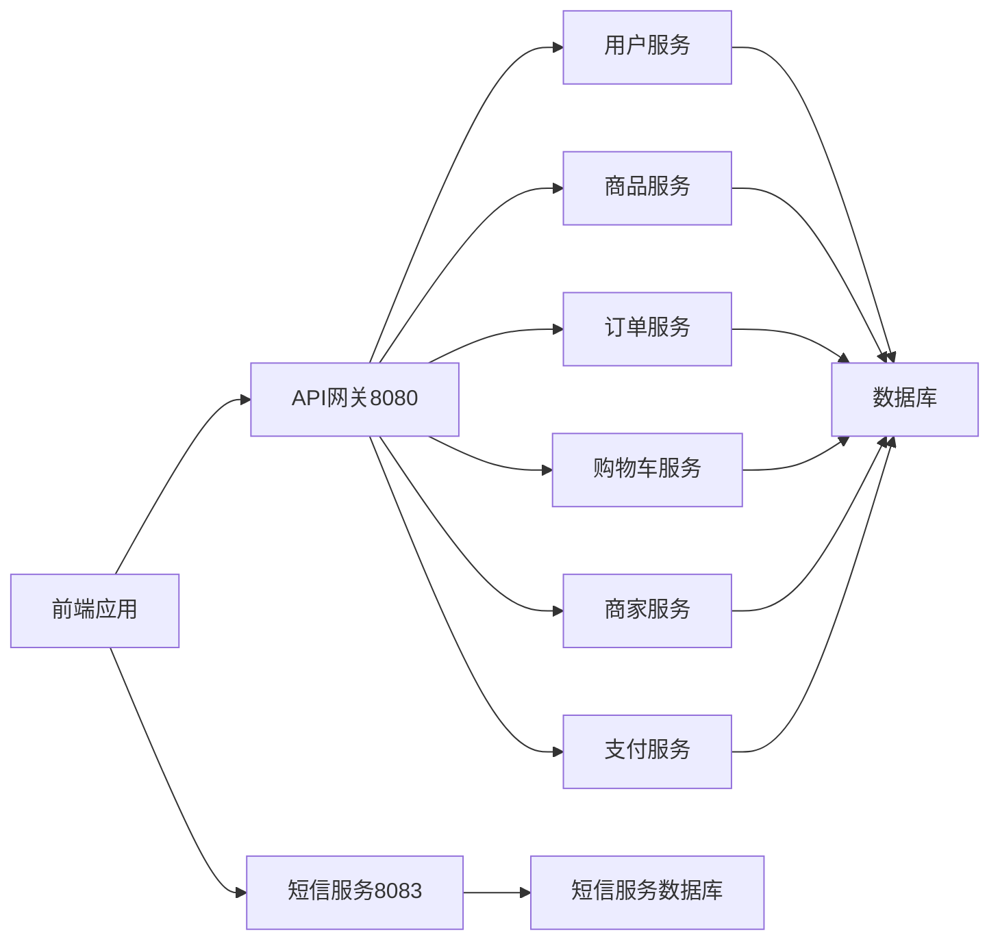

# 前端架构

<cite>
**本文档引用文件**  
- [vite.config.js](file://frontend/vite.config.js)
- [index.js](file://frontend/src/router/index.js)
- [user.js](file://frontend/src/stores/user.js)
- [cart.js](file://frontend/src/stores/cart.js)
- [request.js](file://frontend/src/utils/request.js)
- [index.vue](file://frontend/src/layout/index.vue)
- [admin/index.vue](file://frontend/src/layout/admin/index.vue)
- [merchant/index.vue](file://frontend/src/layout/merchant/index.vue)
- [api/auth.js](file://frontend/src/api/auth.js)
- [api/admin.js](file://frontend/src/api/admin.js)
- [api/merchant.js](file://frontend/src/api/merchant.js)
</cite>

## 目录
1. [项目结构](#项目结构)
2. [Vue组件体系](#vue组件体系)
3. [路由配置](#路由配置)
4. [状态管理](#状态管理)
5. [API调用封装](#api调用封装)
6. [构建工具](#构建工具)
7. [多布局实现](#多布局实现)
8. [权限控制机制](#权限控制机制)
9. [UI组件库集成](#ui组件库集成)
10. [核心模块调用关系](#核心模块调用关系)
11. [数据流示意图](#数据流示意图)

## 项目结构

前端项目采用基于Vue3的模块化结构，主要目录包括：
- `src/api`：API接口封装
- `src/components`：通用组件
- `src/layout`：页面布局组件
- `src/router`：路由配置
- `src/stores`：Pinia状态管理
- `src/styles`：全局样式
- `src/utils`：工具函数
- `src/views`：视图组件
- `src/main.js`：应用入口

项目通过Vite构建，采用模块化设计，各功能模块职责清晰，便于维护和扩展。

**Section sources**
- [vite.config.js](file://frontend/vite.config.js)
- [main.js](file://frontend/src/main.js)

## Vue组件体系

前端采用Vue3的组合式API和单文件组件（SFC）架构。组件体系分为：
- 布局组件（Layout）：提供页面基本结构
- 视图组件（Views）：具体页面实现
- 通用组件（Components）：可复用UI元素
- 功能组件（Stores）：状态管理

组件间通过props、emit、provide/inject和Pinia进行通信，形成清晰的组件树结构。

**Section sources**
- [App.vue](file://frontend/src/App.vue)
- [components](file://frontend/src/components)
- [views](file://frontend/src/views)

## 路由配置

基于Vue Router实现前端路由管理，采用动态导入和懒加载优化性能。



**Diagram sources**
- [index.js](file://frontend/src/router/index.js)
- [index.vue](file://frontend/src/layout/index.vue)
- [admin/index.vue](file://frontend/src/layout/admin/index.vue)
- [merchant/index.vue](file://frontend/src/layout/merchant/index.vue)

**Section sources**
- [index.js](file://frontend/src/router/index.js)

## 状态管理

使用Pinia作为状态管理方案，实现响应式数据流。



**Diagram sources**
- [user.js](file://frontend/src/stores/user.js)
- [cart.js](file://frontend/src/stores/cart.js)

**Section sources**
- [user.js](file://frontend/src/stores/user.js)
- [cart.js](file://frontend/src/stores/cart.js)

## API调用封装

基于axios封装统一的API请求层，实现请求拦截、响应处理和错误管理。



**Diagram sources**
- [request.js](file://frontend/src/utils/request.js)
- [auth.js](file://frontend/src/api/auth.js)
- [admin.js](file://frontend/src/api/admin.js)
- [merchant.js](file://frontend/src/api/merchant.js)

**Section sources**
- [request.js](file://frontend/src/utils/request.js)

## 构建工具

使用Vite作为构建工具，提供快速的开发服务器和高效的生产构建。

```mermaid
flowchart LR
A[Vite配置] --> B[插件系统]
A --> C[开发服务器]
A --> D[生产构建]
B --> B1[vue插件]
B --> B2[自动导入]
B --> B3[组件自动注册]
B --> B4[Element Plus解析器]
C --> C1[端口5173]
C --> C2[主机访问]
C --> C3[代理配置]
C3 --> C31[/api → 网关8080]
C3 --> C32[/api/sms → 短信服务8083]
D --> D1[代码分割]
D --> D2[Tree Shaking]
D --> D3[压缩优化]
```

**Diagram sources**
- [vite.config.js](file://frontend/vite.config.js)

**Section sources**
- [vite.config.js](file://frontend/vite.config.js)

## 多布局实现

系统实现三种不同的布局：用户端、管理员端和商家端，满足不同角色的使用需求。



**Diagram sources**
- [index.vue](file://frontend/src/layout/index.vue)
- [admin/index.vue](file://frontend/src/layout/admin/index.vue)
- [merchant/index.vue](file://frontend/src/layout/merchant/index.vue)

**Section sources**
- [index.vue](file://frontend/src/layout/index.vue)
- [admin/index.vue](file://frontend/src/layout/admin/index.vue)
- [merchant/index.vue](file://frontend/src/layout/merchant/index.vue)

## 权限控制机制

通过路由元信息和Pinia状态实现多层次权限控制。



**Diagram sources**
- [index.js](file://frontend/src/router/index.js)
- [user.js](file://frontend/src/stores/user.js)

**Section sources**
- [index.js](file://frontend/src/router/index.js)
- [user.js](file://frontend/src/stores/user.js)

## UI组件库集成

集成Element Plus作为UI组件库，通过unplugin-vue-components实现按需加载和自动导入。



**Diagram sources**
- [vite.config.js](file://frontend/vite.config.js)

**Section sources**
- [vite.config.js](file://frontend/vite.config.js)

## 核心模块调用关系

展示前端核心模块间的调用关系和依赖结构。



**Diagram sources**
- [user.js](file://frontend/src/stores/user.js)
- [cart.js](file://frontend/src/stores/cart.js)
- [request.js](file://frontend/src/utils/request.js)
- [index.js](file://frontend/src/router/index.js)

**Section sources**
- [user.js](file://frontend/src/stores/user.js)
- [cart.js](file://frontend/src/stores/cart.js)
- [request.js](file://frontend/src/utils/request.js)

## 数据流示意图

展示前端与后端微服务交互的数据流。



**Diagram sources**
- [vite.config.js](file://frontend/vite.config.js)

**Section sources**
- [vite.config.js](file://frontend/vite.config.js)