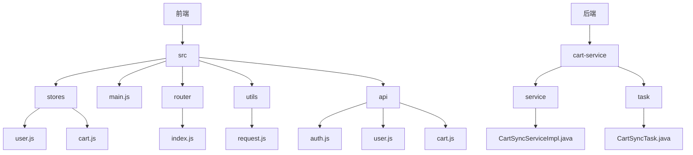
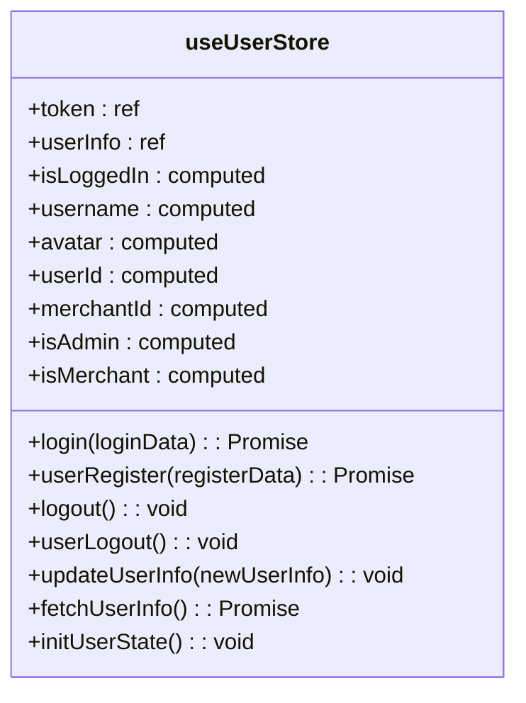
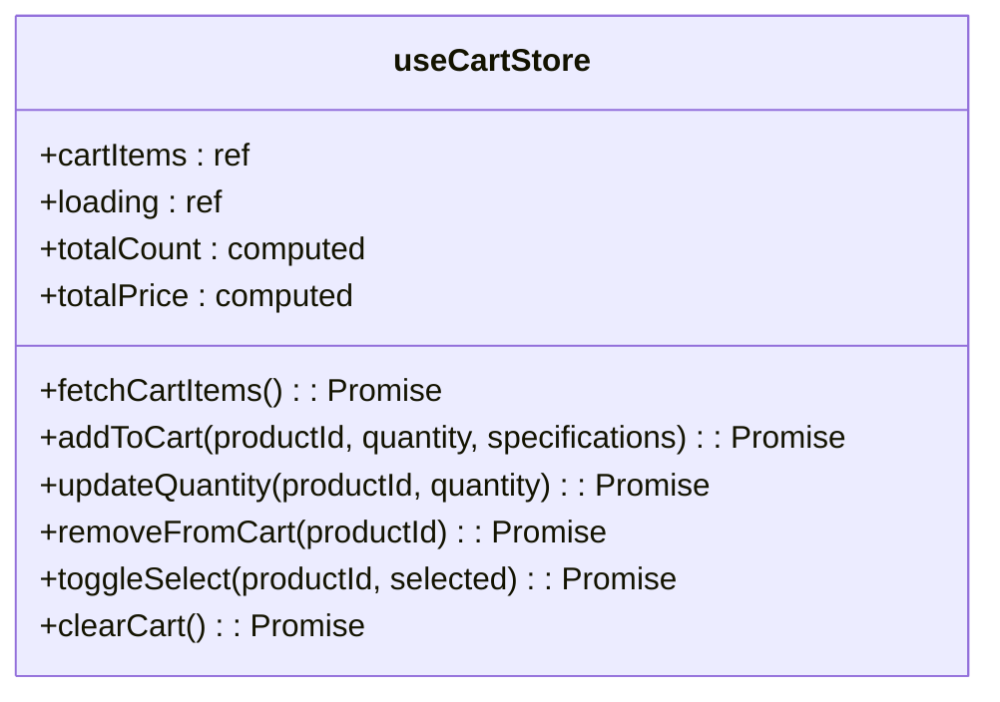
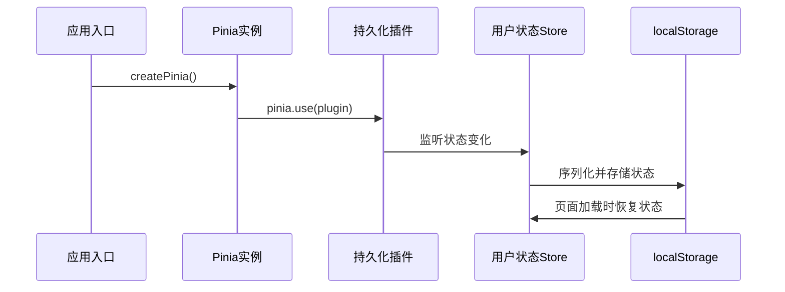
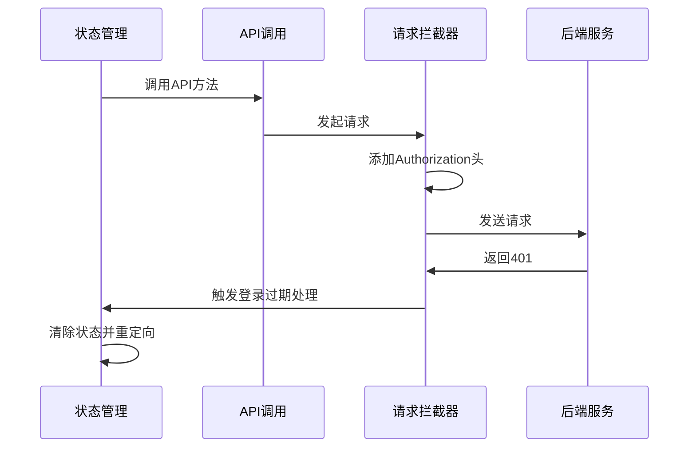
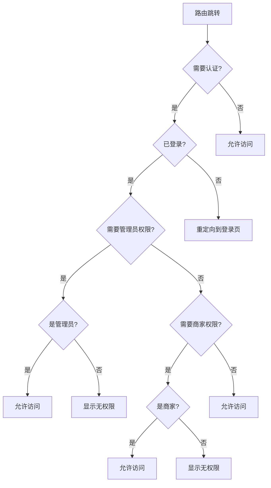
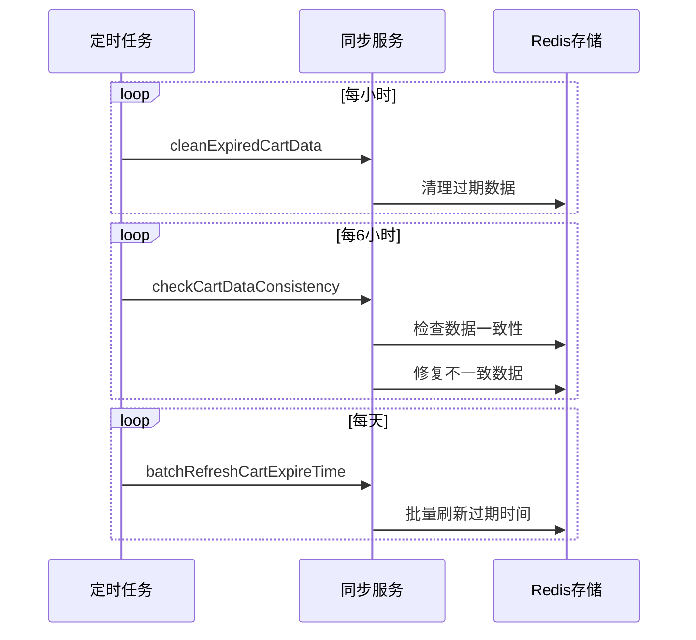

# 状态管理

<cite>
**本文档引用文件**   
- [user.js](file://frontend/src/stores/user.js)
- [cart.js](file://frontend/src/stores/cart.js)
- [main.js](file://frontend/src/main.js)
- [index.js](file://frontend/src/router/index.js)
- [request.js](file://frontend/src/utils/request.js)
- [auth.js](file://frontend/src/api/auth.js)
- [user.js](file://frontend/src/api/user.js)
- [cart.js](file://frontend/src/api/cart.js)
- [CartSyncServiceImpl.java](file://backend/cart-service/src/main/java/com/mall/cart/service/impl/CartSyncServiceImpl.java)
- [CartSyncTask.java](file://backend/cart-service/src/main/java/com/mall/cart/task/CartSyncTask.java)
</cite>

## 目录
1. [项目结构](#项目结构)
2. [核心组件](#核心组件)
3. [用户状态管理](#用户状态管理)
4. [购物车状态管理](#购物车状态管理)
5. [状态持久化配置](#状态持久化配置)
6. [状态管理与API调用协同](#状态管理与api调用协同)
7. [状态管理与路由守卫协同](#状态管理与路由守卫协同)
8. [最佳实践](#最佳实践)

## 项目结构

**Diagram sources**
- [user.js](file://frontend/src/stores/user.js)
- [cart.js](file://frontend/src/stores/cart.js)
- [main.js](file://frontend/src/main.js)
- [index.js](file://frontend/src/router/index.js)
- [CartSyncServiceImpl.java](file://backend/cart-service/src/main/java/com/mall/cart/service/impl/CartSyncServiceImpl.java)
- [CartSyncTask.java](file://backend/cart-service/src/main/java/com/mall/cart/task/CartSyncTask.java)

**Section sources**
- [user.js](file://frontend/src/stores/user.js)
- [cart.js](file://frontend/src/stores/cart.js)
- [main.js](file://frontend/src/main.js)
- [index.js](file://frontend/src/router/index.js)
- [CartSyncServiceImpl.java](file://backend/cart-service/src/main/java/com/mall/cart/service/impl/CartSyncServiceImpl.java)
- [CartSyncTask.java](file://backend/cart-service/src/main/java/com/mall/cart/task/CartSyncTask.java)

## 核心组件

前端状态管理基于Pinia实现，主要包含用户状态管理(userStore)和购物车状态管理(cartStore)两个核心模块。通过Pinia插件实现状态持久化，并与API调用、路由守卫等系统组件协同工作。

**Section sources**
- [user.js](file://frontend/src/stores/user.js)
- [cart.js](file://frontend/src/stores/cart.js)

## 用户状态管理

用户状态管理模块(useUserStore)负责管理用户登录状态和用户信息。包含以下核心要素：

- **状态**：token、userInfo
- **计算属性**：isLoggedIn、username、avatar、userId、merchantId、isAdmin、isMerchant
- **方法**：login、userRegister、logout、userLogout、updateUserInfo、fetchUserInfo、initUserState

其中，isAdmin和isMerchant计算属性通过多种条件判断用户角色，确保权限判断的准确性。

**Diagram sources**
- [user.js](file://frontend/src/stores/user.js#L15-L258)

**Section sources**
- [user.js](file://frontend/src/stores/user.js#L15-L258)

## 购物车状态管理

购物车状态管理模块(useCartStore)负责管理购物车相关状态和操作。包含以下核心要素：

- **状态**：cartItems、loading
- **计算属性**：totalCount、totalPrice
- **方法**：fetchCartItems、addToCart、updateQuantity、removeFromCart、toggleSelect、clearCart

该模块通过API调用与后端购物车服务进行数据同步，确保前后端数据一致性。

**Diagram sources**
- [cart.js](file://frontend/src/stores/cart.js#L5-L127)

**Section sources**
- [cart.js](file://frontend/src/stores/cart.js#L5-L127)

## 状态持久化配置

状态持久化通过pinia-plugin-persistedstate插件实现。在main.js中进行配置：

1. 引入pinia-plugin-persistedstate插件
2. 将插件添加到Pinia实例
3. 在store定义中配置持久化选项

userStore的持久化配置指定将token和userInfo状态持久化到localStorage中，确保页面刷新后用户状态不丢失。

**Diagram sources**
- [main.js](file://frontend/src/main.js#L28-L30)
- [user.js](file://frontend/src/stores/user.js#L253-L257)

**Section sources**
- [main.js](file://frontend/src/main.js#L28-L30)
- [user.js](file://frontend/src/stores/user.js#L253-L257)

## 状态管理与API调用协同

状态管理与API调用通过请求拦截器和响应处理机制协同工作：

1. 请求拦截器自动添加认证头
2. 响应拦截器统一处理认证过期
3. 状态管理模块调用API并更新状态

当token过期时，请求拦截器会触发重新登录流程，确保用户体验的连续性。

**Diagram sources**
- [user.js](file://frontend/src/stores/user.js)
- [request.js](file://frontend/src/utils/request.js)
- [auth.js](file://frontend/src/api/auth.js)

**Section sources**
- [user.js](file://frontend/src/stores/user.js)
- [request.js](file://frontend/src/utils/request.js)
- [auth.js](file://frontend/src/api/auth.js)

## 状态管理与路由守卫协同

状态管理与路由守卫通过全局前置守卫实现权限控制：

1. 检查路由是否需要认证
2. 验证用户登录状态
3. 检查管理员或商家权限
4. 处理已登录用户的登录页面访问

路由守卫根据用户角色和权限进行重定向，确保用户只能访问授权的页面。

**Diagram sources**
- [index.js](file://frontend/src/router/index.js#L571-L642)
- [user.js](file://frontend/src/stores/user.js)

**Section sources**
- [index.js](file://frontend/src/router/index.js#L571-L642)
- [user.js](file://frontend/src/stores/user.js)

## 最佳实践

### 模块划分
- 按功能划分store模块
- 用户相关状态放在userStore
- 购物车相关状态放在cartStore
- 避免单一store过于臃肿

### 错误处理
- API调用使用try-catch捕获异常
- 统一错误提示机制
- 记录关键操作日志
- 提供用户友好的错误信息

### 调试技巧
- 开发环境输出状态变化日志
- 使用Vue DevTools进行状态调试
- 关键操作添加console.log
- 实现initUserState用于状态初始化调试

### 后端同步机制
后端购物车服务通过定时任务实现数据同步：

1. 每小时清理过期数据
2. 每6小时检查数据一致性
3. 每天批量刷新过期时间

**Diagram sources**
- [CartSyncTask.java](file://backend/cart-service/src/main/java/com/mall/cart/task/CartSyncTask.java)
- [CartSyncServiceImpl.java](file://backend/cart-service/src/main/java/com/mall/cart/service/impl/CartSyncServiceImpl.java)

**Section sources**
- [CartSyncTask.java](file://backend/cart-service/src/main/java/com/mall/cart/task/CartSyncTask.java)
- [CartSyncServiceImpl.java](file://backend/cart-service/src/main/java/com/mall/cart/service/impl/CartSyncServiceImpl.java)