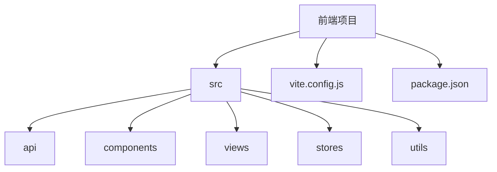
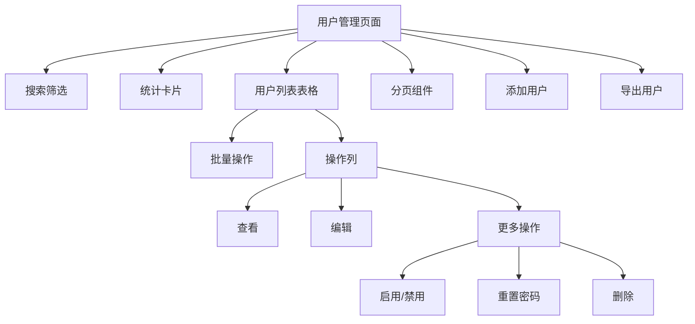
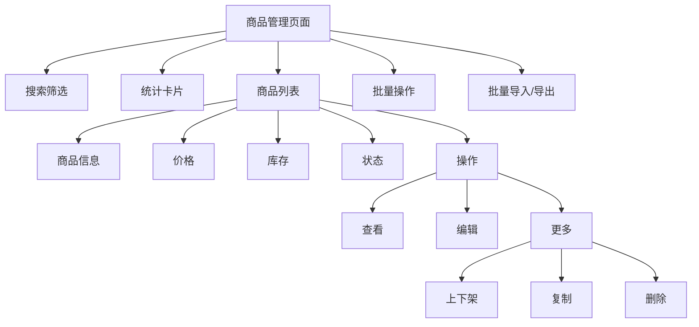

# 组件体系

<cite>
**本文档引用文件**   
- [LocalIcon.vue](file://frontend/src/components/LocalIcon.vue)
- [LoginModal.vue](file://frontend/src/components/LoginModal.vue)
- [RegisterModal.vue](file://frontend/src/components/RegisterModal.vue)
- [vite.config.js](file://frontend/vite.config.js)
- [package.json](file://frontend/package.json)
- [user.js](file://frontend/src/stores/user.js)
- [request.js](file://frontend/src/utils/request.js)
- [admin.js](file://frontend/src/api/admin.js)
- [product.js](file://frontend/src/api/merchant/product.js)
- [index.vue](file://frontend/src/views/admin/users/index.vue)
- [index.vue](file://frontend/src/views/merchant/products/index.vue)
- [audit.vue](file://frontend/src/views/admin/merchants/audit.vue)
</cite>

## 目录
1. [简介](#简介)
2. [项目结构](#项目结构)
3. [基础通用组件](#基础通用组件)
4. [业务组件](#业务组件)
5. [Element Plus集成与配置](#element-plus集成与配置)
6. [组件开发规范与最佳实践](#组件开发规范与最佳实践)
7. [结论](#结论)

## 简介
本文档旨在深入分析基于Vue 3的在线商城前端项目中的组件体系设计与实现。文档详细阐述了基础通用组件（如LocalIcon、LoginModal、RegisterModal）的封装方式与复用模式，解析了核心业务组件（如商家审核、用户管理、商品详情）的结构、数据传递与交互逻辑。同时，文档说明了Element Plus组件库的集成方法、主题定制及国际化配置，并提供了全面的组件开发规范与最佳实践，涵盖命名约定、样式隔离、性能优化和可访问性支持。

## 项目结构
项目采用典型的Vue 3单页应用结构，结合Vite构建工具。核心目录包括`src`下的`api`（API接口）、`components`（通用组件）、`views`（页面视图）、`stores`（状态管理）和`utils`（工具函数）。`package.json`文件显示项目依赖Element Plus作为UI框架，并使用Pinia进行状态管理。

**Diagram sources**
- [vite.config.js](file://frontend/vite.config.js)
- [package.json](file://frontend/package.json)

**Section sources**
- [vite.config.js](file://frontend/vite.config.js)
- [package.json](file://frontend/package.json)

## 基础通用组件

### LocalIcon 本地图标组件
`LocalIcon.vue`是一个用于显示本地矢量图标的通用组件。它通过`name`属性动态加载位于`/public/icons/`目录下的图标文件（优先尝试PNG，其次SVG）。组件支持通过`size`属性控制图标尺寸，并利用CSS滤镜（`filter`）实现颜色变换，支持预定义颜色（如primary, success）和十六进制颜色值。该组件通过`computed`属性计算`iconSrc`和`iconStyle`，确保了响应式和高效渲染。其设计体现了高内聚、低耦合的原则，可被任何需要图标的组件复用。

**Section sources**
- [LocalIcon.vue](file://frontend/src/components/LocalIcon.vue)

### LoginModal 登录弹窗组件
`LoginModal.vue`实现了京东风格的登录弹窗，支持密码登录和手机号验证码登录两种模式。组件通过`loginType`变量管理登录方式切换，并使用`el-form`和`el-form-item`进行表单验证。它通过`modelValue`和`update:modelValue`实现了`v-model`的双向绑定，便于父组件控制弹窗的显隐。登录逻辑通过`handleSubmit`方法处理，调用API并更新`userStore`中的状态。短信验证码功能通过`sendSmsCode`方法实现，包含倒计时和防重复发送机制。该组件封装了完整的登录流程，对外暴露`login-success`事件，便于集成。

**Section sources**
- [LoginModal.vue](file://frontend/src/components/LoginModal.vue)

### RegisterModal 注册弹窗组件
`RegisterModal.vue`提供了完整的用户注册功能。它同样使用`v-model`模式管理显隐状态，并包含用户名、手机号、验证码、密码等字段的表单验证规则。组件集成了用户协议和隐私政策的同意勾选框，确保合规性。注册成功后，通过`register-success`事件通知父组件。该组件通过`<LocalIcon>`组件展示了组件间的嵌套复用。

**Section sources**
- [RegisterModal.vue](file://frontend/src/components/RegisterModal.vue)

## 业务组件

### 用户管理组件
位于`admin/users/index.vue`的用户管理页面是一个典型的后台管理业务组件。它集成了搜索筛选、数据统计、表格展示、分页、批量操作和CRUD（增删改查）功能。组件通过`getUserList`和`getUserStats` API获取数据，并使用`el-table`展示用户列表。其结构清晰，将详情、编辑、添加等复杂操作封装在独立的子组件（`UserDetail`, `UserEdit`, `UserAdd`）中，并通过对话框（`el-dialog`）形式呈现，实现了关注点分离。该组件充分运用了Element Plus的布局、表单、表格和弹窗组件。

**Diagram sources**
- [index.vue](file://frontend/src/views/admin/users/index.vue)

**Section sources**
- [index.vue](file://frontend/src/views/admin/users/index.vue)
- [admin.js](file://frontend/src/api/admin.js)

### 商品管理组件
位于`merchant/products/index.vue`的商家商品管理页面是面向商家的核心业务组件。它提供了商品的增删改查、上下架、批量操作和统计功能。组件通过`getProductList` API获取商品数据，并根据后端返回的字段映射到前端展示字段。状态管理（如`on_sale`, `off_sale`）通过`getStatusType`等方法转换为Element Plus的标签类型。该组件同样采用了子组件封装（如`ProductForm`）和对话框模式，确保了代码的可维护性。其API调用（`product.js`）清晰地定义了商品管理的各项操作。

**Diagram sources**
- [index.vue](file://frontend/src/views/merchant/products/index.vue)
- [product.js](file://frontend/src/api/merchant/product.js)

**Section sources**
- [index.vue](file://frontend/src/views/merchant/products/index.vue)
- [product.js](file://frontend/src/api/merchant/product.js)

### 商家审核组件
`admin/merchants/audit.vue`是一个重定向组件，体现了业务流程的迁移。当用户访问旧的审核页面时，该组件会自动跳转到新的商家申请管理页面（`/admin/merchants/applications`）。它使用`el-result`组件提供友好的用户提示，并通过`onMounted`生命周期钩子在1.5秒后自动跳转，同时提供手动跳转按钮。这展示了如何优雅地处理功能迁移和用户体验。

**Section sources**
- [audit.vue](file://frontend/src/views/admin/merchants/audit.vue)

## Element Plus集成与配置

### 集成方式
项目通过`unplugin-auto-import`和`unplugin-vue-components`插件实现了Element Plus的自动导入，避免了在每个文件中手动引入组件和API。在`vite.config.js`中配置了`AutoImport`和`Components`插件，并指定`ElementPlusResolver`，使得开发者可以无需`import`直接使用Element Plus的组件和图标。

**Section sources**
- [vite.config.js](file://frontend/vite.config.js)

### 主题定制
项目通过CSS变量对Element Plus进行了主题定制。例如，在`LoginModal.vue`中，通过`:deep(.el-dialog)`修改了对话框的圆角，并在`.login-btn`中使用了自定义的渐变背景色（`#ff4142`和`#ff6b6c`），覆盖了Element Plus的默认主题色。这表明项目采用了CSS深度选择器（`:deep`）来覆盖组件库的样式。

**Section sources**
- [LoginModal.vue](file://frontend/src/components/LoginModal.vue)

### 国际化配置
当前代码库中未发现明确的Element Plus国际化配置。`vite.config.js`和`package.json`中没有引入`element-plus/dist/locale`相关文件，且组件中使用的文本（如“密码登录”、“手机号登录”）均为中文硬编码。这表明项目目前仅支持中文，国际化功能尚未实现。

## 组件开发规范与最佳实践

### 命名约定
项目遵循清晰的命名约定。组件文件采用PascalCase（大驼峰）命名，如`LocalIcon.vue`、`LoginModal.vue`。变量和函数采用camelCase（小驼峰）命名，如`loginForm`、`handleSearch`。API函数名采用动词+名词的组合，如`getProductList`、`createProduct`，语义清晰。

### 样式隔离
所有组件均使用`<style scoped>`，确保了样式的作用域仅限于当前组件，有效防止了全局样式污染。对于需要穿透的样式，使用`:deep()`选择器，如`.login-modal :deep(.el-dialog)`，这是一种安全且推荐的做法。

### 性能优化
组件通过`computed`属性（如`iconStyle`, `loginRules`）缓存计算结果，避免在每次渲染时重复计算。使用`v-if`和`v-show`根据条件渲染内容，减少不必要的DOM操作。API调用前进行参数校验，减少无效请求。`LoginModal.vue`中对`sendSmsCode`方法的参数校验是性能和用户体验优化的体现。

### 可访问性支持
组件在一定程度上考虑了可访问性。`el-input`组件提供了`placeholder`和`label`（通过`el-form-item`），有助于屏幕阅读器理解。`el-button`和`el-link`等交互元素具有明确的文本。但仍有改进空间，例如可以为图标添加`aria-label`属性，或为表单提供更详细的错误信息。

### 状态管理
项目使用Pinia进行全局状态管理。`user.js`中的`useUserStore`定义了`token`、`userInfo`等状态，并通过`login`、`logout`等方法进行管理。状态被持久化到`localStorage`，确保了页面刷新后用户状态不丢失。组件通过`useUserStore()`获取状态，实现了状态的集中管理和响应式更新。

**Section sources**
- [user.js](file://frontend/src/stores/user.js)

### 请求与错误处理
`request.js`文件封装了Axios实例，统一处理了请求和响应拦截。请求拦截器负责添加`Authorization`头（携带JWT token）和CSRF令牌，响应拦截器统一处理了401（未授权）等错误，并通过`ElMessage`和`ElMessageBox`提供用户友好的提示。这种集中式处理避免了在每个API调用中重复编写错误处理逻辑，提高了代码的健壮性和一致性。

**Section sources**
- [request.js](file://frontend/src/utils/request.js)

## 结论
本项目构建了一个结构清晰、可维护性强的Vue 3组件体系。通过精心设计的通用组件（LocalIcon, LoginModal, RegisterModal）实现了高复用性，通过模块化的业务组件（用户管理、商品管理）支撑了复杂的业务逻辑。Element Plus的集成提升了开发效率，而Pinia和统一的请求处理则保证了状态和数据流的清晰。遵循的开发规范确保了代码质量。未来可进一步完善国际化支持，并在可访问性方面进行更多优化。