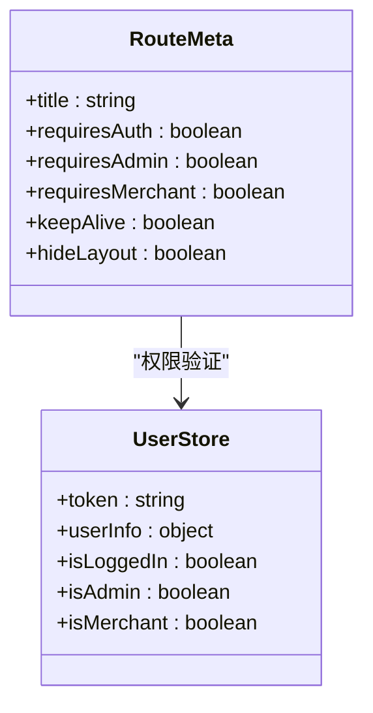
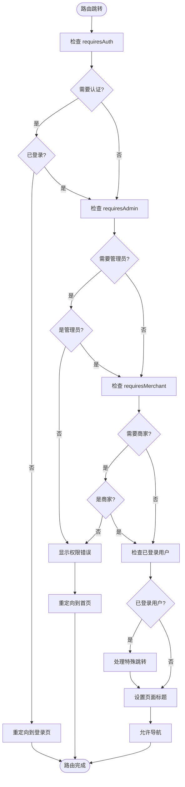
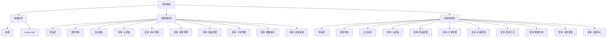

# 路由机制

<cite>
**Referenced Files in This Document**   
- [index.js](file://frontend/src/router/index.js)
- [user.js](file://frontend/src/stores/user.js)
- [index.vue](file://frontend/src/layout/index.vue)
- [index.vue](file://frontend/src/layout/admin/index.vue)
- [index.vue](file://frontend/src/layout/merchant/index.vue)
</cite>

## 目录
1. [路由表结构设计](#路由表结构设计)
2. [路由元信息与权限控制](#路由元信息与权限控制)
3. [全局前置守卫实现](#全局前置守卫实现)
4. [路由布局体系](#路由布局体系)
5. [动态与嵌套路由](#动态与嵌套路由)
6. [路由跳转与参数传递](#路由跳转与参数传递)
7. [最佳实践](#最佳实践)

## 路由表结构设计

前端路由机制采用Vue Router实现，通过模块化设计构建了用户端、管理端和商家端三大路由体系。路由表在`frontend/src/router/index.js`文件中定义，采用扁平化结构组织路由配置。

路由体系分为四个主要部分：基础路由、用户端路由、管理端路由和商家端路由。基础路由包含首页、商品分类、商品列表、商品详情等公共页面，这些路由通过嵌套路由方式组织在根布局下。用户端路由包括个人中心、订单管理、购物车等用户专属功能，通过`/user`路径前缀进行组织。

管理端路由以`/admin`为前缀，包含管理员仪表板、用户管理、商家管理、商品管理、订单管理、数据统计等核心功能模块。商家端路由以`/merchant`为前缀，涵盖商家仪表板、商品管理、订单管理、店铺管理、营销工具、数据分析、财务管理等商家专属功能。

路由配置采用懒加载方式，通过`import('@/views/xxx.vue')`语法实现组件的按需加载，有效优化了应用的初始加载性能。路由表中还包含兼容旧路径的重定向规则，确保系统升级过程中URL的向后兼容性。

```mermaid
graph TD
A[路由体系] --> B[基础路由]
A --> C[用户端路由]
A --> D[管理端路由]
A --> E[商家端路由]
B --> B1[/home]
B --> B2[/category]
B --> B3[/products]
B --> B4[/product/:id]
C --> C1[/user/profile]
C --> C2[/user/orders]
C --> C3[/user/addresses]
D --> D1[/admin/dashboard]
D --> D2[/admin/users]
D --> D3[/admin/merchants]
D --> D4[/admin/products]
D --> D5[/admin/orders]
E --> E1[/merchant/dashboard]
E --> E2[/merchant/products]
E --> E3[/merchant/orders]
E --> E4[/merchant/shop]
E --> E5[/merchant/analytics]
```

**Diagram sources**
- [index.js](file://frontend/src/router/index.js#L16-L550)

**Section sources**
- [index.js](file://frontend/src/router/index.js#L16-L550)

## 路由元信息与权限控制

路由元信息（meta）在权限控制中扮演关键角色，通过定义`requiresAuth`、`requiresAdmin`和`requiresMerchant`等元字段实现精细化的访问控制。这些元信息在路由配置中直接声明，为后续的权限验证提供依据。

`requiresAuth`字段标识该路由需要用户登录才能访问，适用于购物车、个人中心、结算页面等需要用户身份的功能。`requiresAdmin`字段标识该路由需要管理员权限，仅允许管理员用户访问，如用户管理、商家审核、商品审核等功能。`requiresMerchant`字段标识该路由需要商家权限，仅允许商家用户访问，如商品管理、订单处理、店铺管理等功能。

路由元信息还包含其他实用字段，如`title`用于设置页面标题，`keepAlive`用于启用页面缓存，`hideLayout`用于隐藏主布局等。这些元信息在全局前置守卫中被读取和处理，实现页面标题自动设置、布局切换等用户体验优化功能。

权限控制的实现依赖于用户状态管理，通过Pinia的`useUserStore`存储用户登录状态、角色信息等关键数据。路由元信息与用户状态的结合，构成了完整的权限验证体系，确保不同角色的用户只能访问其权限范围内的功能。



**Diagram sources**
- [index.js](file://frontend/src/router/index.js#L26-L548)
- [user.js](file://frontend/src/stores/user.js#L22-L35)

**Section sources**
- [index.js](file://frontend/src/router/index.js#L26-L548)
- [user.js](file://frontend/src/stores/user.js#L22-L35)

## 全局前置守卫实现

全局前置守卫是路由权限控制的核心，定义在`frontend/src/router/index.js`文件中，通过`router.beforeEach`方法注册。守卫函数接收目标路由、来源路由和`next`函数作为参数，实现路由跳转前的拦截和验证。

守卫逻辑首先检查目标路由是否需要登录（`requiresAuth`），如果需要且用户未登录，则根据路由类型重定向到对应的登录页面，并在查询参数中保存重定向目标。对于管理端和商家端的路由，会分别检查`requiresAdmin`和`requiresMerchant`权限，确保只有具备相应角色的用户才能访问。

守卫还处理已登录用户的特殊场景：当管理员访问管理员登录页面时，自动重定向到管理员仪表板；当商家访问商家登录页面时，自动重定向到商家仪表板；当普通用户访问登录或注册页面时，重定向到首页。这种智能重定向提升了用户体验，避免了重复登录的困扰。

页面标题的设置也在前置守卫中完成，通过读取路由元信息中的`title`字段，动态更新浏览器标签页的标题，格式为"页面标题 - 在线商城"。守卫最后调用`next()`方法允许路由跳转，完成整个验证流程。



**Diagram sources**
- [index.js](file://frontend/src/router/index.js#L571-L642)

**Section sources**
- [index.js](file://frontend/src/router/index.js#L571-L642)

## 路由布局体系

系统采用多布局设计模式，为不同用户角色提供定制化的界面体验。布局组件定义在`frontend/src/layout`目录下，包含基础布局、管理端布局和商家端布局三种类型。

基础布局（`index.vue`）是最简单的布局，仅包含一个容器和`router-view`插槽，适用于首页、商品详情等公共页面。管理端布局（`admin/index.vue`）提供完整的后台管理界面，包含侧边栏、顶部导航栏和主内容区域。侧边栏采用折叠式设计，包含仪表板、用户管理、商家管理、商品管理、订单管理、数据统计、系统设置等导航菜单。

商家端布局（`merchant/index.vue`）针对商家用户设计，包含仪表板、商品管理、订单管理、店铺管理、营销工具、数据分析、财务管理、设置中心等导航菜单。顶部导航栏提供全屏切换、消息通知和用户信息下拉菜单等功能，增强用户体验。

布局的切换通过路由元信息中的`hideLayout`字段控制。当路由需要独立页面（如登录页、注册页）时，设置`hideLayout: true`，此时不应用任何布局组件，直接渲染页面内容。这种灵活的布局机制使得系统能够根据不同场景提供最合适的界面结构。



**Diagram sources**
- [index.vue](file://frontend/src/layout/index.vue#L6-L9)
- [index.vue](file://frontend/src/layout/admin/index.vue#L2-L71)
- [index.vue](file://frontend/src/layout/merchant/index.vue#L2-L71)

**Section sources**
- [index.vue](file://frontend/src/layout/index.vue#L6-L9)
- [index.vue](file://frontend/src/layout/admin/index.vue#L2-L71)
- [index.vue](file://frontend/src/layout/merchant/index.vue#L2-L71)

## 动态与嵌套路由

系统充分利用Vue Router的动态路由和嵌套路由特性，实现灵活的路由组织和参数传递。动态路由通过路径参数（如`/product/:id`、`/users/:id`）实现，允许在URL中传递变量，用于加载特定ID的资源。

嵌套路由通过`children`属性实现，将相关功能组织在同一个父路由下。例如，用户中心路由以`/user`为父路由，其子路由包括`/user/profile`、`/user/orders`、`/user/addresses`等，形成清晰的功能层级结构。同样，管理端和商家端的各个功能模块也采用嵌套路由组织。

路由别名功能用于兼容旧的URL路径，如将`/login`重定向到`/auth/login`，`/register`重定向到`/auth/register`，确保系统升级过程中外部链接的可用性。通配符路由（`/:pathMatch(.*)*`）用于处理404页面，捕获所有未匹配的路由请求。

路由的滚动行为通过`scrollBehavior`选项配置，确保路由切换时页面滚动到顶部，提供一致的用户体验。对于需要保持滚动位置的场景，可以通过`savedPosition`参数恢复之前的滚动位置。

**Section sources**
- [index.js](file://frontend/src/router/index.js#L59-L155)
- [index.js](file://frontend/src/router/index.js#L216-L357)
- [index.js](file://frontend/src/router/index.js#L370-L511)

## 路由跳转与参数传递

路由跳转通过`router-link`组件或编程式导航实现。`router-link`用于模板中的声明式导航，提供`to`属性指定目标路由。编程式导航通过`router.push`、`router.replace`等方法实现，适用于需要在JavaScript代码中控制导航的场景。

参数传递支持查询参数和路径参数两种方式。查询参数通过`query`对象传递，如`router.push({ path: '/search', query: { keyword: '手机' } })`，生成URL为`/search?keyword=手机`。路径参数通过`params`对象传递，需要配合命名路由使用，如`router.push({ name: 'ProductDetail', params: { id: 123 } })`，生成URL为`/product/123`。

导航守卫提供了路由跳转过程中的钩子函数，包括全局前置守卫、全局解析守卫、全局后置钩子、路由独享守卫和组件内守卫。这些守卫可以用于权限验证、数据获取、页面离开确认等场景，增强应用的交互性和安全性。

**Section sources**
- [index.js](file://frontend/src/router/index.js#L554-L565)

## 最佳实践

在路由机制的实现中，遵循了多项最佳实践以确保系统的可维护性和性能。首先，采用模块化路由设计，将不同功能域的路由分组管理，提高代码的可读性和可维护性。其次，实施路由懒加载，将大型组件分割成小块，按需加载，显著提升应用的初始加载速度。

权限控制采用声明式设计，在路由配置中直接定义权限要求，与全局前置守卫配合实现集中化的权限管理。这种设计避免了在各个组件中重复编写权限验证逻辑，降低了代码冗余和出错风险。

路由命名采用语义化命名规范，如`AdminDashboard`、`MerchantProducts`等，使路由名称具有明确的业务含义，便于开发人员理解和维护。路由路径设计遵循RESTful风格，使用名词复数形式（如`/products`、`/orders`），保持API的一致性。

错误处理方面，实现了全局的404页面捕获和友好的错误提示，提升用户体验。同时，在开发环境中启用详细的路由调试信息，帮助开发人员快速定位路由相关的问题。

**Section sources**
- [index.js](file://frontend/src/router/index.js#L1-L653)