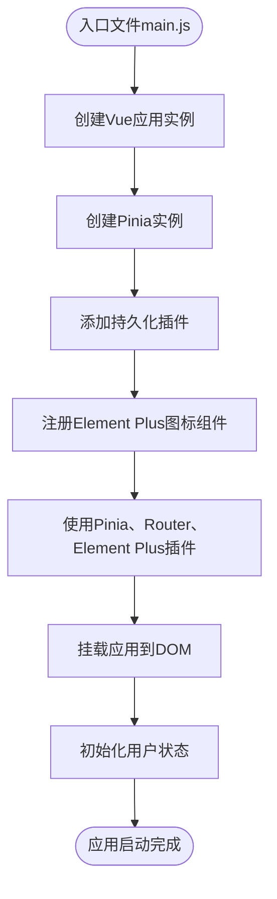
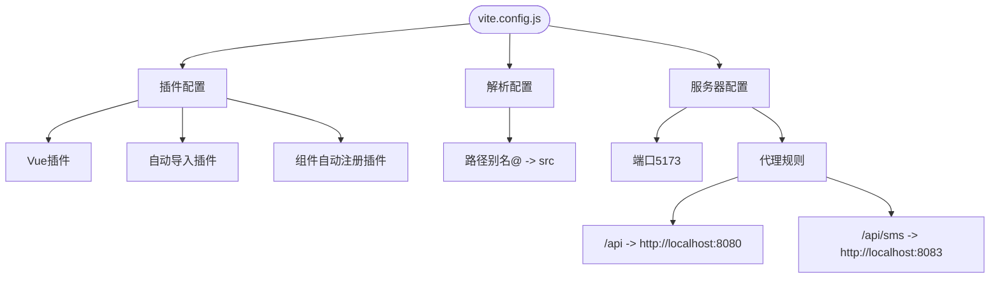
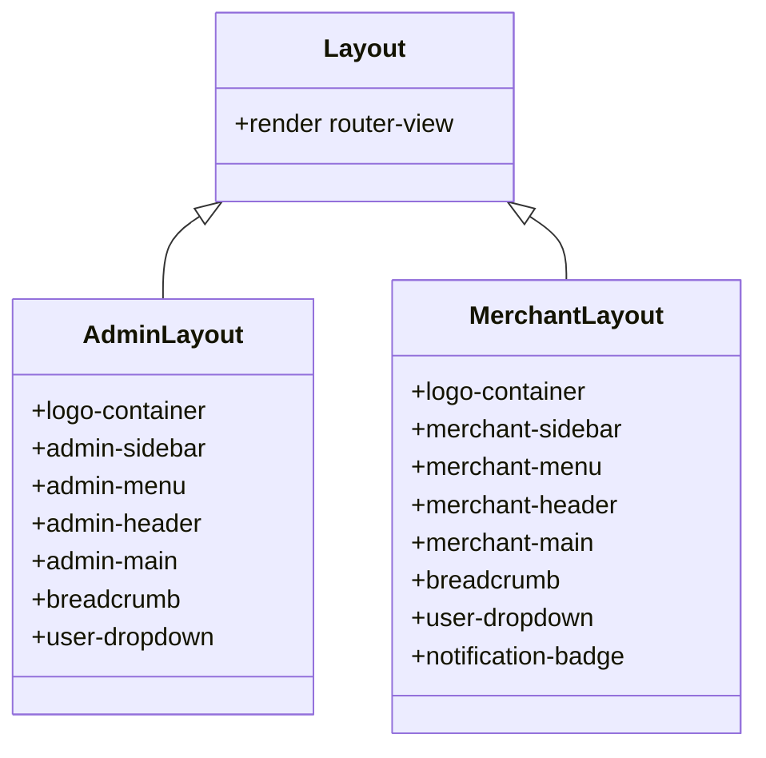
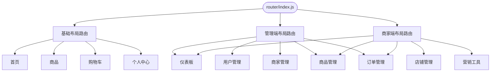
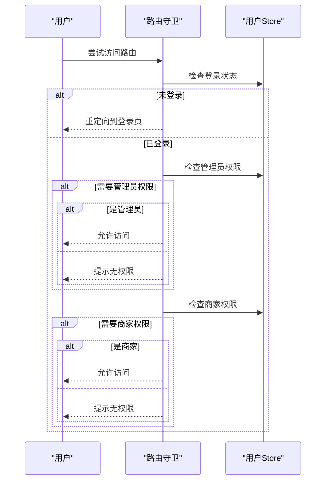

# 项目结构

<cite>
**本文档引用的文件**
- [main.js](file://frontend/src/main.js)
- [vite.config.js](file://frontend/vite.config.js)
- [router/index.js](file://frontend/src/router/index.js)
- [stores/user.js](file://frontend/src/stores/user.js)
- [layout/index.vue](file://frontend/src/layout/index.vue)
- [layout/admin/index.vue](file://frontend/src/layout/admin/index.vue)
- [layout/merchant/index.vue](file://frontend/src/layout/merchant/index.vue)
- [api/auth.js](file://frontend/src/api/auth.js)
- [api/admin.js](file://frontend/src/api/admin.js)
- [api/merchant.js](file://frontend/src/api/merchant.js)
- [api/cart.js](file://frontend/src/api/cart.js)
- [api/order.js](file://frontend/src/api/order.js)
- [api/product.js](file://frontend/src/api/product.js)
- [api/user.js](file://frontend/src/api/user.js)
- [api/merchant/product.js](file://frontend/src/api/merchant/product.js)
</cite>

## 目录
1. [项目结构](#项目结构)
2. [src目录组织](#src目录组织)
3. [main.js入口文件](#mainjs入口文件)
4. [vite.config.js构建配置](#viteconfigjs构建配置)
5. [多布局实现机制](#多布局实现机制)

## src目录组织

前端项目采用基于Vue3的模块化目录结构，src目录下包含api、components、layout、router、stores、views、utils等子目录，各目录职责明确，组织方式合理。

**src目录结构**
- api：存放所有API接口定义，按功能模块划分文件
- components：存放可复用的UI组件
- layout：存放不同布局的容器组件
- router：存放路由配置
- stores：存放Pinia状态管理模块
- views：存放页面级组件
- utils：存放工具函数
- styles：存放全局样式
- App.vue：根组件
- main.js：应用入口文件

**Section sources**
- [main.js](file://frontend/src/main.js#L1-L56)
- [vite.config.js](file://frontend/vite.config.js#L1-L73)

## main.js入口文件

main.js是Vue3应用的入口文件，负责初始化Vue应用、注册Pinia状态管理、Element Plus组件库和全局组件。

入口文件首先导入Vue、Pinia、Element Plus等核心依赖，然后创建Vue应用实例和Pinia实例，并注册持久化插件。接着注册Element Plus图标组件，最后使用插件并挂载应用到DOM。

**Diagram sources**
- [main.js](file://frontend/src/main.js#L1-L56)

**Section sources**
- [main.js](file://frontend/src/main.js#L1-L56)

## vite.config.js构建配置

vite.config.js是Vite构建工具的配置文件，包含插件配置、路径别名设置和开发服务器代理规则。

配置文件定义了Vue插件、自动导入和组件自动注册插件。在resolve部分设置了路径别名@指向src目录，便于模块导入。服务器代理配置将/api请求代理到本地网关服务，同时为短信服务提供了直连代理规则。

**Diagram sources**
- [vite.config.js](file://frontend/vite.config.js#L1-L73)

**Section sources**
- [vite.config.js](file://frontend/vite.config.js#L1-L73)

## 多布局实现机制

系统实现了用户端、管理端、商家端三种不同的布局，通过路由配置和布局组件实现差异化设计。

### 布局组件

系统包含三种布局组件：基础布局、管理端布局和商家端布局。基础布局最简单，仅包含路由视图。管理端和商家端布局都包含侧边栏菜单和顶部导航栏，但菜单项和主题颜色不同。

**Diagram sources**
- [layout/index.vue](file://frontend/src/layout/index.vue#L1-L23)
- [layout/admin/index.vue](file://frontend/src/layout/admin/index.vue#L1-L376)
- [layout/merchant/index.vue](file://frontend/src/layout/merchant/index.vue#L1-L395)

### 路由配置

路由配置文件定义了三种布局的路由结构。基础布局用于用户端，管理端和商家端布局分别用于管理员和商家功能模块。通过meta字段设置requiresAuth、requiresAdmin、requiresMerchant等权限标识。

**Diagram sources**
- [router/index.js](file://frontend/src/router/index.js#L1-L653)

### 权限控制

通过路由守卫实现权限控制，根据用户角色和权限决定是否允许访问特定路由。用户状态存储在Pinia store中，包含isAdmin和isMerchant等计算属性。

**Diagram sources**
- [router/index.js](file://frontend/src/router/index.js#L567-L652)
- [stores/user.js](file://frontend/src/stores/user.js#L1-L259)

**Section sources**
- [router/index.js](file://frontend/src/router/index.js#L1-L653)
- [stores/user.js](file://frontend/src/stores/user.js#L1-L259)
- [layout/index.vue](file://frontend/src/layout/index.vue#L1-L23)
- [layout/admin/index.vue](file://frontend/src/layout/admin/index.vue#L1-L376)
- [layout/merchant/index.vue](file://frontend/src/layout/merchant/index.vue#L1-L395)