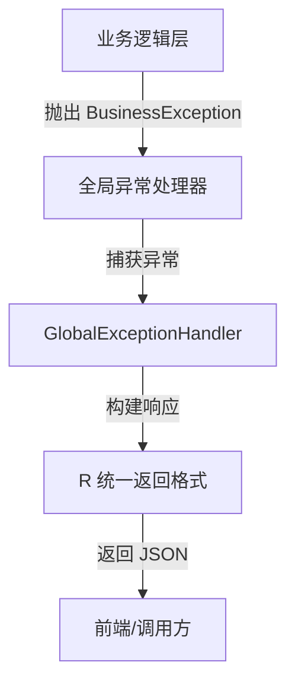
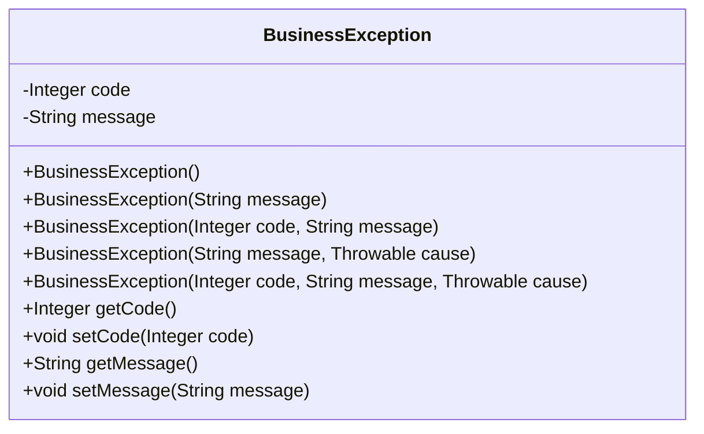
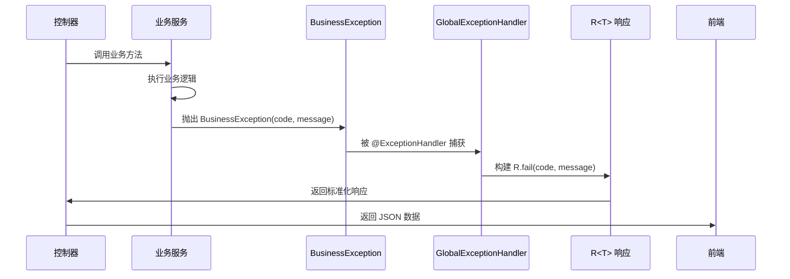
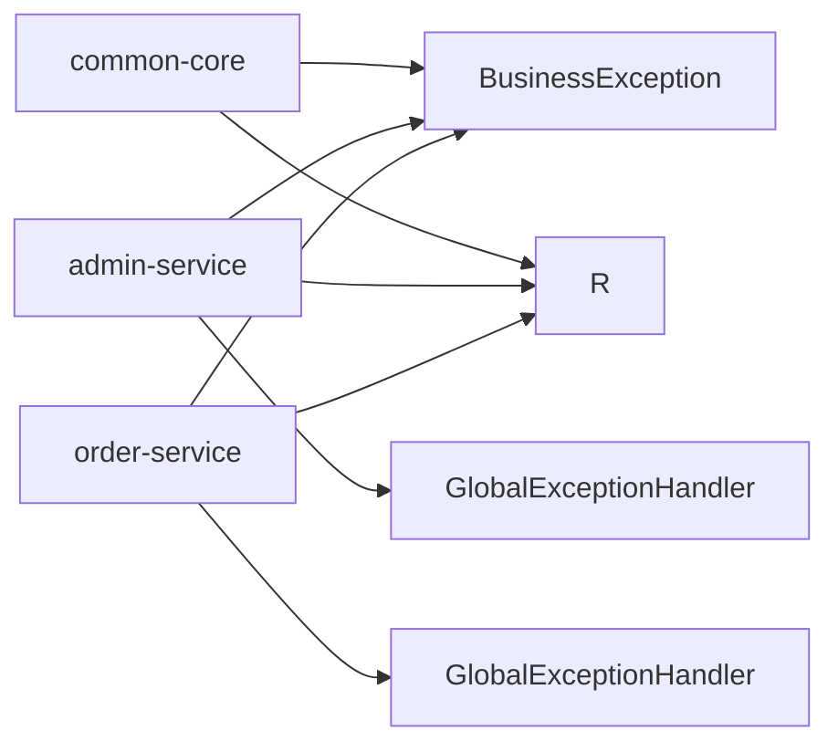

# 业务异常处理

<cite>
**本文档引用文件**  
- [BusinessException.java](file://backend/common-core/src/main/java/com/mall/common/core/exception/BusinessException.java)
- [GlobalExceptionHandler.java](file://backend/admin-service/src/main/java/com/mall/admin/handler/GlobalExceptionHandler.java)
- [GlobalExceptionHandler.java](file://backend/order-service/src/main/java/com/mall/order/exception/GlobalExceptionHandler.java)
- [R.java](file://backend/common-core/src/main/java/com/mall/common/core/domain/R.java)
- [BusinessException.java](file://backend/admin-service/src/main/java/com/mall/admin/exception/BusinessException.java)
</cite>

## 目录
1. [引言](#引言)
2. [项目结构](#项目结构)
3. [核心组件](#核心组件)
4. [架构概述](#架构概述)
5. [详细组件分析](#详细组件分析)
6. [依赖分析](#依赖分析)
7. [性能考虑](#性能考虑)
8. [故障排除指南](#故障排除指南)
9. [结论](#结论)

## 引言
本文档全面解析 `BusinessException` 业务异常的设计原理与运行机制。说明其作为全系统统一业务异常基类的角色定位，分析其构造函数参数（如 code、message）的设计逻辑。结合 admin-service、order-service 中的抛出与 GlobalExceptionHandler 捕获处理流程，展示其在统一错误码体系、友好提示信息返回中的关键作用。文档包含异常类结构、常用抛出场景（如权限不足、状态冲突）、全局处理器联动机制，并提供自定义业务异常编码规范建议。

## 项目结构
本项目采用微服务架构，核心业务异常类 `BusinessException` 定义于 `common-core` 模块中，供所有服务模块共享使用。各业务服务（如 admin-service、order-service）通过依赖 `common-core` 实现统一的异常处理机制。全局异常处理器 `GlobalExceptionHandler` 分布在各个服务模块中，负责捕获并标准化响应各类异常。

## 核心组件

`BusinessException` 是整个系统中用于表示业务层面异常的基类，继承自 `RuntimeException`，支持错误码（code）和错误消息（message）的定制化设置。该类在 `common-core` 模块中定义，确保跨服务的一致性。各服务可基于此基类扩展特定业务异常。

**文档引用文件**
- [BusinessException.java](file://backend/common-core/src/main/java/com/mall/common/core/exception/BusinessException.java)
- [GlobalExceptionHandler.java](file://backend/admin-service/src/main/java/com/mall/admin/handler/GlobalExceptionHandler.java)
- [GlobalExceptionHandler.java](file://backend/order-service/src/main/java/com/mall/order/exception/GlobalExceptionHandler.java)

## 架构概述

系统通过统一的异常处理架构实现错误信息的标准化输出。当业务逻辑中发生异常时，抛出 `BusinessException` 或其子类实例；Spring 的 `@RestControllerAdvice` 机制捕获这些异常，并由 `GlobalExceptionHandler` 将其转换为标准的 `R` 响应对象返回给客户端。

**图示来源**
- [BusinessException.java](file://backend/common-core/src/main/java/com/mall/common/core/exception/BusinessException.java)
- [GlobalExceptionHandler.java](file://backend/admin-service/src/main/java/com/mall/admin/handler/GlobalExceptionHandler.java)
- [R.java](file://backend/common-core/src/main/java/com/mall/common/core/domain/R.java)

## 详细组件分析

### BusinessException 类分析

`BusinessException` 作为全系统统一的业务异常基类，封装了错误码和错误消息两个核心属性，支持多种构造方式以适应不同场景。

#### 类结构图

**图示来源**
- [BusinessException.java](file://backend/common-core/src/main/java/com/mall/common/core/exception/BusinessException.java)

#### 构造函数设计逻辑
- **无参构造**：默认初始化。
- **仅消息构造**：自动设置默认错误码（500），适用于简单错误提示。
- **码+消息构造**：允许自定义错误码，用于精确标识业务错误类型。
- **带异常原因构造**：支持链式异常传递，便于日志追踪。

### GlobalExceptionHandler 联动机制

各服务模块中的 `GlobalExceptionHandler` 使用 `@ExceptionHandler(BusinessException.class)` 注解捕获业务异常，并将其转换为标准响应格式 `R.fail(e.getCode(), e.getMessage())`。

#### 异常处理流程序列图

**图示来源**
- [GlobalExceptionHandler.java](file://backend/admin-service/src/main/java/com/mall/admin/handler/GlobalExceptionHandler.java)
- [BusinessException.java](file://backend/common-core/src/main/java/com/mall/common/core/exception/BusinessException.java)
- [R.java](file://backend/common-core/src/main/java/com/mall/common/core/domain/R.java)

## 依赖分析

`BusinessException` 位于 `common-core` 模块，被所有业务服务（admin-service、order-service 等）所依赖。`GlobalExceptionHandler` 位于各服务模块中，依赖 `BusinessException` 和 `R` 类进行异常处理和响应构建。

**图示来源**
- [BusinessException.java](file://backend/common-core/src/main/java/com/mall/common/core/exception/BusinessException.java)
- [R.java](file://backend/common-core/src/main/java/com/mall/common/core/domain/R.java)
- [GlobalExceptionHandler.java](file://backend/admin-service/src/main/java/com/mall/admin/handler/GlobalExceptionHandler.java)
- [GlobalExceptionHandler.java](file://backend/order-service/src/main/java/com/mall/order/exception/GlobalExceptionHandler.java)

## 性能考虑
异常处理机制对性能影响较小，因 `BusinessException` 为轻量级对象，且异常仅在出错时创建。建议避免在正常流程中频繁抛出异常，防止堆栈追踪开销。

## 故障排除指南

### 常见业务异常场景
- **权限不足**：抛出 `BusinessException(403, "权限不足")`
- **状态冲突**：如订单状态不允许操作，抛出 `BusinessException(400, "当前状态不允许此操作")`
- **资源不存在**：抛出 `BusinessException(404, "指定资源未找到")`

### 自定义业务异常编码规范建议
1. **前缀标识服务**：如 `ADMIN_001`、`ORDER_002`
2. **分类编码**：按业务模块划分，如用户管理 `USER_*`，订单管理 `ORDER_*`
3. **错误级别**：可通过码值范围区分警告（1xx）、客户端错误（4xx）、服务端错误（5xx）
4. **文档化管理**：维护统一的错误码文档，确保团队一致性

**文档引用文件**
- [BusinessException.java](file://backend/common-core/src/main/java/com/mall/common/core/exception/BusinessException.java)
- [GlobalExceptionHandler.java](file://backend/admin-service/src/main/java/com/mall/admin/handler/GlobalExceptionHandler.java)

## 结论
`BusinessException` 作为系统统一的业务异常基类，配合 `GlobalExceptionHandler` 实现了异常处理的标准化与集中化。通过错误码与消息的组合，既保证了前后端交互的清晰性，又提升了系统的可维护性与用户体验。建议在开发中严格遵循异常编码规范，确保错误信息的一致性与可读性。