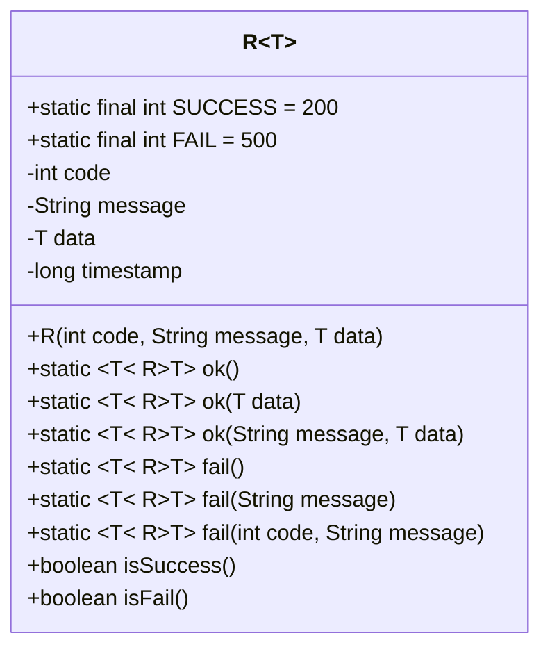
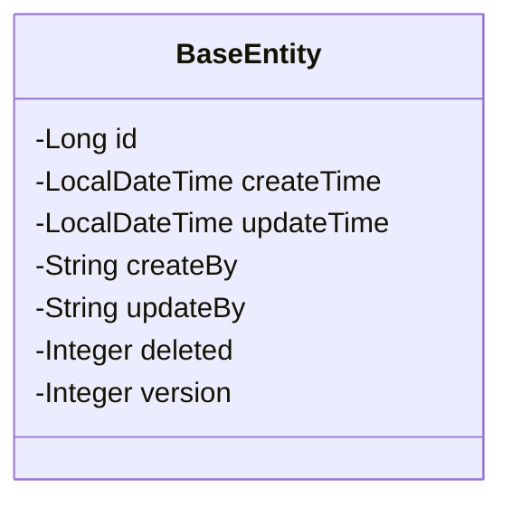
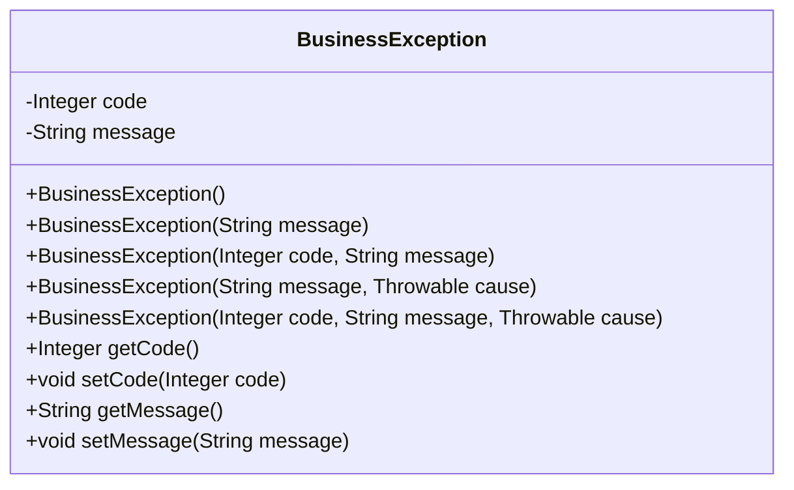

# 公共核心模块

<cite>
**本文档引用文件**   
- [R.java](file://backend/common-core/src/main/java/com/mall/common/core/domain/R.java)
- [BaseEntity.java](file://backend/common-core/src/main/java/com/mall/common/core/domain/BaseEntity.java)
- [BusinessException.java](file://backend/common-core/src/main/java/com/mall/common/core/exception/BusinessException.java)
- [common-bom/pom.xml](file://backend/common-bom/pom.xml)
- [数据字典.md](file://数据字典.md)
</cite>

## 目录
1. [引言](#引言)
2. [统一响应结构R的设计与实现](#统一响应结构r的设计与实现)
3. [基础实体类BaseEntity分析](#基础实体类baseentity分析)
4. [业务异常BusinessException机制](#业务异常businessexception机制)
5. [公共核心模块的集成与应用](#公共核心模块的集成与应用)
6. [总结](#总结)

## 引言
`common-core`公共模块是整个微服务架构的基础支撑组件，为所有微服务提供统一的数据传输格式、基础实体支持和异常处理规范。该模块通过`R`类实现标准化的API响应结构，通过`BaseEntity`类提供统一的审计字段，通过`BusinessException`类建立一致的业务异常处理机制。这种设计显著提升了代码的一致性和可维护性，确保了各微服务在数据交互、实体管理和错误处理方面遵循统一的标准。

## 统一响应结构R的设计与实现

### R类设计原理
`R`类是`common-core`模块中用于统一API响应格式的核心类，位于`com.mall.common.core.domain`包下。该类采用泛型设计，能够封装任意类型的数据，同时提供标准化的状态码、消息和时间戳字段。



**Diagram sources**
- [R.java](file://backend/common-core/src/main/java/com/mall/common/core/domain/R.java)

**Section sources**
- [R.java](file://backend/common-core/src/main/java/com/mall/common/core/domain/R.java)

### 状态码定义
`R`类定义了两个核心状态码：
- **SUCCESS (200)**：表示操作成功，这是所有成功响应的默认状态码。
- **FAIL (500)**：表示操作失败，这是所有失败响应的默认状态码。

这种设计简化了前端对响应状态的判断逻辑，前端只需检查`code`字段是否等于200即可确定操作是否成功。

### 泛型数据封装
`R<T>`采用泛型设计，能够封装任意类型的数据。这种设计提供了极大的灵活性，使得`R`类可以用于返回单个对象、对象列表、分页结果或简单值类型。

### 静态工厂方法使用模式
`R`类提供了丰富的静态工厂方法，简化了响应对象的创建：

- `ok()`：创建一个表示成功的空数据响应。
- `ok(T data)`：创建一个包含数据的成功响应。
- `ok(String message, T data)`：创建一个包含自定义消息和数据的成功响应。
- `fail()`：创建一个表示失败的默认响应。
- `fail(String message)`：创建一个包含自定义错误消息的失败响应。
- `fail(int code, String message)`：创建一个包含自定义状态码和消息的失败响应。

这些静态方法的使用模式在各微服务中得到了广泛应用。例如，在`product-service`的`CategoryController`中，删除分类的逻辑如下：

```java
@DeleteMapping("/{id}")
public R<String> deleteCategory(@PathVariable Long id) {
    logger.info("接收到删除分类的请求 - ID: {}", id);
    
    try {
        boolean success = categoryService.deleteCategory(id);
        if (success) {
            logger.info("分类删除成功 - ID: {}", id);
            return R.ok("分类删除成功");
        } else {
            logger.warn("分类删除失败 - ID: {}", id);
            return R.fail("分类删除失败，可能存在子分类");
        }
    } catch (Exception e) {
        logger.error("删除分类时发生异常 - ID: {}", id, e);
        return R.fail("分类删除失败");
    }
}
```

这种模式确保了所有API响应都遵循统一的格式，提高了代码的可读性和一致性。

## 基础实体类BaseEntity分析

### BaseEntity设计原理
`BaseEntity`类是所有JPA实体的基类，位于`com.mall.common.core.domain`包下。它通过`@MappedSuperclass`注解实现字段继承，为所有子实体提供统一的主键和审计字段。



**Diagram sources**
- [BaseEntity.java](file://backend/common-core/src/main/java/com/mall/common/core/domain/BaseEntity.java)

**Section sources**
- [BaseEntity.java](file://backend/common-core/src/main/java/com/mall/common/core/domain/BaseEntity.java)

### 审计字段
`BaseEntity`提供了以下公共属性：

| 字段名 | 数据类型 | 描述 |
|--------|---------|------|
| id | BIGINT | 主键ID，自增 |
| create_time | TIMESTAMP | 创建时间，默认当前时间 |
| update_time | TIMESTAMP | 更新时间，自动更新 |

这些字段通过JPA的`@CreatedDate`、`@LastModifiedDate`等注解实现自动填充，确保了数据的完整性和可追溯性。

### 公共属性
除了审计字段，`BaseEntity`还包含：
- `createBy`：创建者
- `updateBy`：更新者
- `deleted`：删除标志（0代表存在，1代表删除），用于实现逻辑删除
- `version`：版本号，用于实现乐观锁

这些公共属性为系统提供了基础的审计和并发控制能力。

## 业务异常BusinessException机制

### BusinessException设计原理
`BusinessException`类是`common-core`模块中用于处理业务异常的核心类，位于`com.mall.common.core.exception`包下。它继承自`RuntimeException`，并扩展了错误码和错误消息属性。



**Diagram sources**
- [BusinessException.java](file://backend/common-core/src/main/java/com/mall/common/core/exception/BusinessException.java)

**Section sources**
- [BusinessException.java](file://backend/common-core/src/main/java/com/mall/common/core/exception/BusinessException.java)

### 异常抛出与处理
`BusinessException`的使用模式在各微服务中保持一致。当业务逻辑出现异常时，直接抛出`BusinessException`，并在全局异常处理器中捕获并转换为统一的`R`响应。

例如，在`admin-service`的`GlobalExceptionHandler`中：

```java
@ExceptionHandler(AuthenticationException.class)
public R<?> handleAuthenticationException(AuthenticationException e) {
    log.error("认证异常: {}", e.getMessage());
    return R.fail(401, e.getMessage());
}
```

这种机制确保了所有业务异常都能被统一处理，避免了异常信息的泄露，并提供了友好的错误提示。

## 公共核心模块的集成与应用

### 模块依赖管理
`common-core`模块通过`common-bom`进行依赖管理，确保所有微服务使用相同版本的公共组件。

```xml
<dependencyManagement>
    <dependencies>
        <dependency>
            <groupId>com.mall</groupId>
            <artifactId>common-core</artifactId>
            <version>${project.version}</version>
        </dependency>
    </dependencies>
</dependencyManagement>
```

**Diagram sources**
- [common-bom/pom.xml](file://backend/common-bom/pom.xml)

**Section sources**
- [common-bom/pom.xml](file://backend/common-bom/pom.xml)

### 在各微服务中的应用
`common-core`模块被广泛应用于所有微服务中。例如：
- `payment-service`依赖`common-core`以使用统一的响应格式和异常处理。
- `admin-service`使用`BaseEntity`作为所有实体的基类。
- `merchant-service`通过`BusinessException`处理商家相关的业务异常。

这种统一的应用模式确保了整个系统的一致性和可维护性。

## 总结
`common-core`公共模块通过`R`类、`BaseEntity`类和`BusinessException`类，为整个微服务架构提供了统一的数据传输格式、基础实体支持和异常处理规范。这种设计不仅提升了代码的一致性和可维护性，还简化了各微服务的开发和集成。通过标准化的响应结构、统一的审计字段和一致的异常处理机制，`common-core`模块为系统的稳定运行和高效开发提供了坚实的基础。