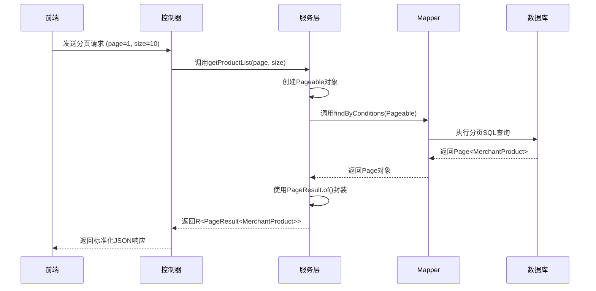

# 分页结果封装

<cite>
**Referenced Files in This Document**   
- [PageResult.java](file://backend/common-core/src/main/java/com/mall/common/core/domain/PageResult.java)
- [R.java](file://backend/common-core/src/main/java/com/mall/common/core/domain/R.java)
- [MerchantProductController.java](file://backend/merchant-service/src/main/java/com/mall/merchant/controller/MerchantProductController.java)
- [MerchantProductService.java](file://backend/merchant-service/src/main/java/com/mall/merchant/service/MerchantProductService.java)
- [ProductController.java](file://backend/product-service/src/main/java/com/mall/product/controller/ProductController.java)
- [ProductService.java](file://backend/product-service/src/main/java/com/mall/product/service/ProductService.java)
- [MyBatisPlusConfig.java](file://backend/admin-service/src/main/java/com/mall/admin/config/MyBatisPlusConfig.java)
</cite>

## 目录
1. [分页结果类设计](#分页结果类设计)
2. [核心字段解析](#核心字段解析)
3. [与MyBatis-Plus的协同工作](#与mybatis-plus的协同工作)
4. [实际使用示例](#实际使用示例)
5. [序列化与泛型结合](#序列化与泛型结合)
6. [前端解析逻辑](#前端解析逻辑)
7. [性能优化建议](#性能优化建议)

## 分页结果类设计

`PageResult`类是系统中用于封装分页查询结果的核心数据结构，位于`common-core`模块中，确保了整个微服务架构下分页数据传输的标准化。该类实现了`Serializable`接口，保证了在网络传输和序列化过程中的兼容性。通过泛型`<T>`的设计，`PageResult`能够灵活地承载任意类型的列表数据，如商品列表、订单列表等。

**Section sources**
- [PageResult.java](file://backend/common-core/src/main/java/com/mall/common/core/domain/PageResult.java#L8-L57)

## 核心字段解析

`PageResult`类包含以下核心字段，这些字段共同构成了完整的分页信息：

- **records**: `List<T>`类型，用于存储当前页的实际数据列表。
- **total**: `Long`类型，表示满足查询条件的总记录数，是进行分页计算的基础。
- **current**: `Long`类型，表示当前请求的页码，通常从1开始。
- **size**: `Long`类型，表示每页期望返回的数据条数。
- **pages**: `Long`类型，表示根据总记录数和每页大小计算出的总页数。

在构造函数中，`pages`字段通过`(total + size - 1) / size`的公式计算得出，这是一种经典的向上取整算法，确保了即使最后一页数据不满，也能正确计算出总页数。

**Section sources**
- [PageResult.java](file://backend/common-core/src/main/java/com/mall/common/core/domain/PageResult.java#L23-L35)

## 与MyBatis-Plus的协同工作

`PageResult`类与MyBatis-Plus框架的`Page`对象无缝集成，实现了从数据库分页查询到前端数据传输的标准化流程。在服务实现层，开发者首先使用MyBatis-Plus的`Pageable`对象（如`PageRequest.of()`）构建分页参数，然后调用Mapper层的分页查询方法，返回一个`Page<T>`对象。

随后，通过`PageResult.of()`静态工厂方法，将`Page<T>`对象中的`getContent()`（数据列表）、`getTotalElements()`（总记录数）、以及原始的页码和大小参数，组装成一个`PageResult<T>`实例。这种设计模式将MyBatis-Plus的内部分页逻辑与对外的API数据结构解耦，提高了代码的可维护性和一致性。



**Diagram sources **
- [MerchantProductService.java](file://backend/merchant-service/src/main/java/com/mall/merchant/service/MerchantProductService.java#L131-L133)
- [MerchantProductController.java](file://backend/merchant-service/src/main/java/com/mall/merchant/controller/MerchantProductController.java#L155-L171)
- [MyBatisPlusConfig.java](file://backend/admin-service/src/main/java/com/mall/admin/config/MyBatisPlusConfig.java#L20-L25)

## 实际使用示例

### merchant-service中的商品分页查询

在`merchant-service`中，`MerchantProductController`的`getProductList`方法是分页查询的典型应用。该方法接收页码、大小、关键词等参数，调用`MerchantProductService`的服务层方法。服务层方法（如`getProductList`）内部创建`Pageable`对象，调用Repository进行查询，并最终使用`PageResult.of()`将`Page`对象转换为`PageResult`对象，再通过`R.ok()`包装成统一的API响应格式返回。

```java
// 服务层代码片段
Page<MerchantOrder> orderPage = orderRepository.findByConditions(..., pageable);
PageResult<MerchantOrder> result = PageResult.of(
    orderPage.getContent(),
    Long.valueOf(orderPage.getTotalElements()),
    Long.valueOf(page),
    Long.valueOf(size)
);
return R.ok(result);
```

### product-service中的商品分页查询

在`product-service`中，`ProductController`的`getProducts`方法同样实现了分页功能。虽然其返回类型为`R<Object>`，但其内部逻辑与`merchant-service`类似，通过`productService.getProductsByCategoryId()`方法获取分页数据，并最终封装为包含分页信息的JSON对象返回给前端。

**Section sources**
- [MerchantProductController.java](file://backend/merchant-service/src/main/java/com/mall/merchant/controller/MerchantProductController.java#L155-L171)
- [MerchantProductService.java](file://backend/merchant-service/src/main/java/com/mall/merchant/service/MerchantProductService.java#L131-L133)
- [ProductController.java](file://backend/product-service/src/main/java/com/mall/product/controller/ProductController.java#L46-L60)
- [ProductService.java](file://backend/product-service/src/main/java/com/mall/product/service/ProductService.java#L33-L34)

## 序列化与泛型结合

`PageResult`类与`R`泛型类的结合使用，构成了系统API返回的黄金标准。`R<T>`类是统一的响应结果包装类，它包含`code`（状态码）、`message`（消息）和`data`（数据）三个核心字段。当需要返回分页数据时，`data`字段的类型即为`PageResult<T>`。

这种`R<PageResult<T>>`的嵌套泛型模式，不仅保证了所有API响应结构的一致性，还使得前端可以采用统一的拦截器或工具函数来处理所有响应。无论接口是返回单个对象、列表还是分页列表，前端都可以通过`response.data`来安全地访问业务数据，极大地简化了前端开发。

**Section sources**
- [R.java](file://backend/common-core/src/main/java/com/mall/common/core/domain/R.java#L13-L41)
- [PageResult.java](file://backend/common-core/src/main/java/com/mall/common/core/domain/PageResult.java#L8-L57)

## 前端解析逻辑

前端在接收到`R<PageResult<T>>`格式的响应后，解析逻辑非常清晰。首先检查`code`是否为200（成功），然后从`data`字段中提取分页信息，用于更新分页组件的状态。

例如，前端可以使用`data.total`来设置分页器的总条目数，使用`data.current`和`data.size`来确定当前页码和每页显示数量，最后将`data.records`数组绑定到列表组件进行渲染。这种标准化的数据结构使得前端分页组件的开发变得异常简单和通用。

## 性能优化建议

1.  **合理设置分页大小**: 避免将`size`设置得过大（如1000条），这会导致单次查询返回大量数据，增加数据库压力和网络传输开销。建议将`size`限制在一个合理范围内（如10-50条）。
2.  **避免深度分页**: 对于`current`值非常大的情况（如第10000页），数据库需要跳过大量数据，性能会急剧下降。应考虑使用游标分页（Cursor-based Pagination）或键集分页（Keyset Pagination）来替代传统的`OFFSET/LIMIT`分页。
3.  **按需查询**: 在列表查询接口中，如果前端只需要展示商品名称和价格，服务端应避免查询和返回完整的商品对象（包含描述、图片等大字段），可以通过DTO（Data Transfer Object）或查询投影（Projection）来只返回必要的字段，减少数据传输量。
4.  **利用缓存**: 对于不经常变动的分页数据（如热门商品列表），可以将其结果缓存到Redis中，设置合理的过期时间，以减轻数据库压力，提高响应速度。